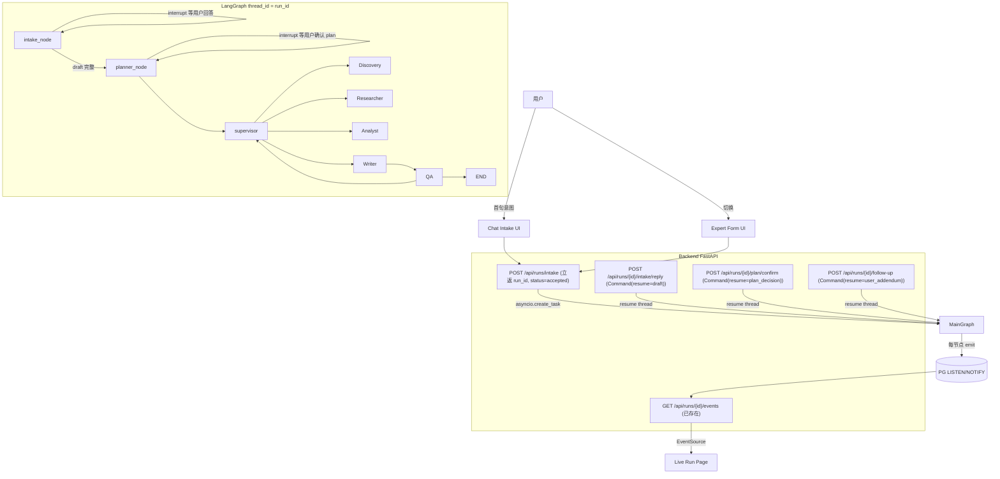

# Agent-native Intake + Live Run Page 设计

## 1. 问题与目标

### 致命断点（已诊断）

- **同步阻塞**：[`backend/app/router/run_rt.py:593`](backend/app/router/run_rt.py:593) `await graph.ainvoke(...)` 让 `POST /api/runs` 在 graph 全部跑完前不返回。前端 `useCreateRun` 干等 1–3 分钟，违反 `.cursor/rules/agent-runtime-contracts.mdc` 的 `accepted / running / completed` 状态契约。
- **SSE 基建闲置**：[`backend/app/service/event_bus/bus.py`](backend/app/service/event_bus/bus.py) + [`frontend/src/api/sse.ts`](frontend/src/api/sse.ts) 已能流式推送，但只在报告完成后的 `RunViewPage` 用上。
- **Form-driven UI**：[`frontend/src/pages/NewRunPage.tsx`](frontend/src/pages/NewRunPage.tsx) 强制三步表单一次性提交，违反 `docs/2-architecture-decision.md` 顶部三条不可妥协特性中的 Agent-driven。

### 目标

1. `POST /api/runs` 立返 `accepted`，graph 在后台异步执行；前端立刻能跳转到 Live 页订阅 SSE。
2. 新增 Agent-native chat intake：Agent 通过对话帮用户填同一份 `RunIntakeDraft`。保留专家模式三步表单作为 toggle。
3. Plan-then-execute：Agent 产出可见的 plan tree，用户可勾选取消、可补充自定义 task（Phase β）。
4. Live 页主视觉 = Plan Tree（左）+ Evidence Feed（右）+ 顶部 mini-DAG 折叠条 + 底部 follow-up 输入框。
5. 全部走 LangGraph 原生 `interrupt` + `Command(resume=...)`，复用现有 `AsyncPostgresSaver` checkpointer。

## 1.5 LangGraph HITL 关键约束（build 前必读，违反任意一条都会出错）

调研 2026 年生产环境 LangGraph + FastAPI + interrupt 范式（[LangChain Discussion #21524](https://github.com/langchain-ai/langgraph/discussions/21524) / [LangGraph HITL docs](https://langchain-ai.github.io/langgraph/concepts/human_in_the_loop/) / DEV 社区 12 框架对比）整理出 6 条不可违反的约束，全部纳入 Phase 0 spike 验证：

### Invariant A：`interrupt()` 之前的代码在 resume 时会重新执行一次（Phase 0a spike 实测确认）

**spike 实测**（[`backend/app/tests/test_hitl_spike.py`](backend/app/tests/test_hitl_spike.py)）：单节点内 `generate(); interrupt()` 模式 resume 后 generate 计数 = **2**（`test_invariant_a_naive_single_node_double_calls` 锁定此陷阱）。即每次用户回答都会重复一次 LLM 调用 + 重复 emit。

**关键修正（推翻原 Plan 的"单节点 cache"方案）**：单节点内"开头读 `pending_clarify` 缓存"**不可行**——节点在 `interrupt()` 前不会 return，state 不 commit 到 checkpoint，resume 时读不到上一次写入。

**唯一可行修复 = 两节点拆分**（`test_invariant_a_two_node_split_single_call` 实测 generate 计数 = 1）：
- `*_generate_node`：LLM + emit + 写 state，**完整 return 并 commit**；该节点已完成，resume 不重跑。
- `*_wait_node`：节点内**只有** `interrupt(pending)`，前面零副作用；resume 后才 merge + emit user_reply。

```python
# intake 子流程 = generate + wait 两节点 + 一条回边构成循环
def intake_generate_node(state):
    result = await llm_intake(state["intake_draft"])   # LLM + emit 都在会 return 的节点里
    if result["action"] == "complete":
        await emit_run_event(INTAKE_COMPLETE, ...)
        return {"phase": "planning", "pending_clarify": None}
    await emit_run_event(INTAKE_CLARIFY_REQUEST, ...)
    return {"pending_clarify": result["clarify_request"]}

def intake_wait_node(state):
    reply = interrupt(state["pending_clarify"])         # interrupt 之前零副作用
    await emit_run_event(INTAKE_USER_REPLY, payload=reply)   # 副作用全在 interrupt 之后
    return {"intake_draft": merge(state["intake_draft"], reply), "pending_clarify": None}

# 边：generate -> (complete ? planner : wait)；wait -> generate（回 generate 判断是否继续追问）
```
planner 子流程同构：`planner_generate_node`（产 PlanTree + emit `plan.published`）→ `planner_wait_node`（只 interrupt + 处理 `PlanConfirmRequest`）。

### Invariant B：动态入口路由用 `add_conditional_edges(START, ...)`（spike 实测通过）

LangGraph 的 `set_entry_point("supervisor")` 是静态的，不能按 `state.phase` 分流。改用（`test_invariant_b_conditional_entry_routes_by_phase` 实测通过）：
```python
from langgraph.graph import START
graph.add_conditional_edges(START, _route_entry, {
    "intake_generate_node": "intake_generate_node",
    "supervisor": "supervisor",
})
```
旧 run（state 无 `phase` 字段）默认走 `supervisor`，向后兼容。

### Invariant C：所有 resume 端点必须"立返 + create_task background 跑"

`interrupt()` 让上一轮 `ainvoke` 直接 return（不是真的"task 暂停"）。POST `/intake/reply` / `/plan/confirm` / `/follow-up` 都必须：
1. 立即 return `{accepted: true, status: "thinking"}`。
2. 用 `asyncio.create_task(_resume_graph_background(run_id, command))` 跑新一轮 `ainvoke(Command(resume=...))`。
3. 注册到 `app.state.background_tasks`。

完全对称于 `POST /api/runs` 的 accepted + background 模式。前端立刻插入"Agent 正在思考…"占位消息，等 SSE 推送 `intake.clarify_request` 替换。

### Invariant D：首次 intake 端点必须同步等到第一个 clarify_request 生成才返回

否则前端拿到 run_id 后 `useRunEvents` 订阅 SSE 时，graph 可能已经 emit 完毕，造成"用户发首句后页面静默"。

具体做法：`POST /api/runs/intake` 内部 `await graph.ainvoke(...)` 跑到第一次 `interrupt` 返回，把 interrupt payload 作为 `first_clarify_request` 字段塞进 response body。**只有 `POST /api/runs/intake` 是 sync-until-first-interrupt，其他 resume 端点都是纯 background**。

**关键修正（spike 实测的取值方式）**：langgraph 0.2.50 的 interrupt payload **不在** `ainvoke` 返回值的 `__interrupt__` 字段里（实测返回 `None`）。必须从 state 快照读取：
```python
snapshot = await graph.aget_state(config)
first_clarify = snapshot.tasks[0].interrupts[0].value if snapshot.tasks and snapshot.tasks[0].interrupts else None
# 同时可用 snapshot.next == ("intake_wait_node",) 判断是否确实停在等待点
```
spike 已封装 `_extract_first_interrupt_value(snapshot)` 工具函数，实现时直接复用同一形态。

### Invariant E：AsyncPostgresSaver 跨实例 resume（spike 实测已解除风险）

**spike 实测**（`test_invariant_c_e_postgres_resume_across_fresh_checkpointer`）：用 checkpointer 实例 #1 跑到 interrupt 后**关闭其连接**（模拟 worker 死亡 / idle 断连），再用**全新** checkpointer 实例 #2（新连接）对同一 `thread_id` 成功 resume，且 generate 节点全程只跑 1 次。

**结论**：只要"全新连接能从 PG resume"成立，stale idle 连接就永远不在关键路径上——**30 分钟空闲的连接超时风险被结构性解除**，Phase 0b 不强制改连接池。

**对生产代码的约束**：现有 [`app_main.py:42`](backend/app/app_main.py:42) 在 lifespan 持有单个 checkpointer 对 correctness 没问题（连接活着就用，断了由 fresh 实例兜底）。仅当后续真观测到长 idle 后 resume 报连接错，再引入 `psycopg_pool.AsyncConnectionPool`。本期 YAGNI。

### Invariant F：所有 resume 调用必须用同一个 thread_id = run_id

`config={"configurable": {"thread_id": run_id}}`。这是 checkpoint 关联的唯一键，全链路一致。任何 endpoint 接收 `run_id` 后立即按这个模板构造 config，不允许任何变体（如带前缀、加时间戳）。

## 2. 架构总览



核心思路：**所有人机交互点（intake 澄清 / plan 确认 / follow-up）都是同一个 LangGraph thread 上的 `interrupt`**，前端通过独立 REST 端点 `Command(resume=...)`，事件流统一走 SSE。

## 3. 数据模型

### 3.1 新增 Schema

新增 [`backend/app/schemas/intake.py`](backend/app/schemas/intake.py)：

- `UserRole = Literal["pm", "founder", "sales", "investor"]`
- `FocusDimension = str` （继续保持 `docs/2-` 决定的"运行时字符串契约"，不闭集）
- `RunIntakeDraft(BaseModel)`：
  - `user_query: str` 必填
  - `user_role: UserRole | None`
  - `analysis_intent: str | None` （Agent 归一化后的意图概述）
  - `competitors_explicit: list[str]`
  - `competitors_discovery_mode: bool`
  - `domain_hint: str | None`
  - `focus_dimensions: list[FocusDimension]` —— **不进入 `is_complete` 判定**：focus 由 Planner 根据 role+intent 自动派生，让用户在 intake 阶段填 dimensions 违背"Agent 主动澄清"的产品定位；用户在 PlanConfirm 阶段可勾掉不想要的 task。
  - `report_depth: Literal["quick", "deep"] = "quick"`
  - `reference_urls: list[str]`
  - `is_complete: bool` —— **`@computed_field` 只读**（不允许字段独立设置以防漂移），定义：`user_role + analysis_intent + (competitors_explicit 或 competitors_discovery_mode)` 齐全。
- `IntakeClarifyRequest(BaseModel)`：Agent 抛出的澄清提问
  - `question: str`
  - `field_targets: list[str]` —— 这个问题想填的字段名
  - `suggested_options: list[str] | None` —— 给用户的快速选项
- `IntakeUserReply(BaseModel)`：用户回复
  - `text: str = ""`
  - `selected_options: list[str]`
  - **`model_validator` 强制 `text` 或 `selected_options` 至少一个非空**——空回复会让 IntakeAgent 在同一字段上死循环重问。
- `IntakeExchange(BaseModel)`：一轮已完成的 clarify+reply，进 `AgentState.intake_history`。**取代 Plan 原文的 `list[tuple]`**——tuple 过 `AsyncPostgresSaver` checkpoint JSON 反序列化会降级为 list、类型全丢；项目里所有持久化结构（`SupervisorDecision` / `Evidence` / `Conclusion`）一律 Pydantic 模型，无 tuple。
  - `clarify: IntakeClarifyRequest`
  - `reply: IntakeUserReply` —— 必填，无 `None` default：in-flight clarify 住在 `pending_clarify`，不在 history 里。

新增 [`backend/app/schemas/plan.py`](backend/app/schemas/plan.py)：

- `PlanTaskStage = Literal["discover", "research", "analyze", "write"]`
- `PlanTaskSource = Literal["agent", "user"]`
- `PlanTask(BaseModel)`：
  - `task_id: str` （`make_id("ptask_")`）
  - `stage: PlanTaskStage`
  - `title: str`
  - `description: str`
  - `competitor_id: str | None`
  - `focus_dimensions: list[str]`
  - `source: PlanTaskSource = "agent"`
  - `enabled: bool = True`
  - `priority: Literal["normal", "user_pinned"] = "normal"` —— user-injected 强制 `user_pinned`
- `PlanTree(BaseModel)`：
  - `plan_id: str`
  - `tasks: list[PlanTask]`
  - `rationale: str` —— Planner Agent 给的整体计划说明
  - `version: int = 1` —— 用户每次修改 +1
- `PlanConfirmRequest(BaseModel)`：
  - `disabled_task_ids: list[str]` —— 用户取消勾选
  - `additional_tasks: list[PlanTask]` —— **Phase β 新增**，user-injected task
- `FollowUpRequest(BaseModel)`：
  - `text: str`
  - `applies_to_stage: PlanTaskStage | None`

### 3.2 AgentState 增字段

修改 [`backend/app/agents/state.py`](backend/app/agents/state.py) 的 `AgentState`：

```python
phase: RunPhase  # Literal["intake", "planning", "executing", "done"]
intake_draft: RunIntakeDraft
intake_history: list[IntakeExchange]   # 修正：原 Plan 的 list[tuple] 过 checkpoint 会丢类型
plan_tree: PlanTree | None
follow_up_queue: Annotated[list[FollowUpRequest], operator.add]

# 跨节点传递（Invariant A）：generate 节点写、wait 节点读+interrupt
pending_clarify: IntakeClarifyRequest | None
pending_plan_tree: PlanTree | None
```

`phase` 用于 entry-point 路由与节点判断；`intake_history` 落库到 step.payload 便于回放。`pending_clarify` / `pending_plan_tree` 是 **Invariant A** 的跨节点传递字段：由 `*_generate_node`（会 return、会 commit）写入，再被独立的 `*_wait_node` 读取并 `interrupt()`。**不是**单节点内的"读 cache 跳过 LLM"——spike 已证明单节点缓存读不到（节点 interrupt 前不 commit）。两节点拆分让 generate 只跑一次。

### 3.3 数据库 schema 变更

修改 [`backend/app/models/run.py`](backend/app/models/run.py) 的 `Run` 表：

- 新增 `accepted_at: datetime`
- 新增 `intake_draft: dict | None` （JSONB）—— intake 最终 commit 时落库
- 新增 `plan_tree: dict | None` （JSONB，含 version）
- `status` 枚举扩展为 `accepted | intake_pending | planning_pending | running | completed | degraded | cancelled | failed`

新增 alembic migration（具体文件名按现有命名规范），不修改既有数据。

## 4. 后端变更

### 4.1 LangGraph 拓扑改造

修改 [`backend/app/agents/graph.py`](backend/app/agents/graph.py)：

- 新增 **4 个节点**（**Invariant A 两节点拆分**，spike 实测）：`intake_generate_node` / `intake_wait_node` / `planner_generate_node` / `planner_wait_node`。
- **入口路由**：用 `graph.add_conditional_edges(START, _route_entry, {...})`（见 **Invariant B**），`_route_entry(state) -> "intake_generate_node" | "supervisor"`。`phase == "intake"` 进 intake_generate；其他（含旧 run 无 phase 字段）进 supervisor 保持向后兼容。
- `intake_generate_node`（会 return、会 commit，resume 不重跑）：
  - 调 LLM 评估 `intake_draft.is_complete`，返回 `{action: "ask"|"complete"}`。
  - complete → emit `intake.complete` + `phase="planning"`，边转 `planner_generate_node`。
  - ask → emit `intake.clarify_request`、把 `IntakeClarifyRequest` 写入 `pending_clarify`，边转 `intake_wait_node`。
- `intake_wait_node`（节点内只有 interrupt，前面零副作用）：
  - `user_reply = interrupt(state["pending_clarify"])` 暂停。
  - resume 后：emit `intake.user_reply`、merge 到 `intake_draft`、清空 `pending_clarify`，边**回到 `intake_generate_node`** 判断是否继续追问。
- `planner_generate_node` / `planner_wait_node` 同构（cache 字段 `pending_plan_tree`）：
  - generate：调 LLM 产 `PlanTree` + emit `plan.published`，写 `pending_plan_tree`，边转 `planner_wait_node`。
  - wait：`confirm = interrupt({"plan_tree": ..., "kind": "plan_confirm"})`；resume 后按 `disabled_task_ids` 过滤 + 合并 `additional_tasks`（**Phase β**）、emit `plan.confirmed`、落库 `Run.plan_tree`、清空 cache、`phase="executing"`，边转 `supervisor`。
- Supervisor 决策时增加：消费 `state.follow_up_queue` 与 user_pinned plan_task；user_pinned task 永远优先于 agent task。Supervisor 的 `reasoning_summary` 必须显式说明用户注入意图如何被处理（可观测信号）。

### 4.2 RunEvent 扩展

修改 [`backend/app/service/event_bus/bus.py:22`](backend/app/service/event_bus/bus.py:22) 的 `RunEventType` enum：

```text
INTAKE_CLARIFY_REQUEST = "intake.clarify_request"
INTAKE_USER_REPLY      = "intake.user_reply"
INTAKE_COMPLETE        = "intake.complete"
PLAN_PUBLISHED         = "plan.published"
PLAN_CONFIRMED         = "plan.confirmed"
PLAN_TASK_START        = "plan.task.start"
PLAN_TASK_FINISH       = "plan.task.finish"
TOOL_START             = "tool.start"
TOOL_FINISH            = "tool.finish"
EVIDENCE_COLLECTED     = "evidence.collected"
FOLLOWUP_RECEIVED      = "followup.received"
HEARTBEAT              = "heartbeat"
```

`evidence.collected` 在 evidence 落库时 emit；`tool.start/finish` 在 [`backend/app/agents/tools/*`](backend/app/agents/tools) 工具调用边界 emit；`heartbeat` 由 [`backend/app/router/run_rt.py:369`](backend/app/router/run_rt.py:369) 的 `_run_event_stream` 在 keepalive 时附带带 `{"phase", "current_task_id"}` 的轻量心跳（用现有 `keepalive_seconds`，无需新计时）。

### 4.3 异步执行改造

修改 [`backend/app/router/run_rt.py`](backend/app/router/run_rt.py)：

- **`POST /api/runs/intake`（chat 模式默认路径，遵守 Invariant D：sync-until-first-interrupt）**：
  1. 落库 `Run(status="accepted", accepted_at=now, phase="intake")`，初始化空 `intake_draft`。
  2. **同步等到第一次 interrupt**：`await graph.ainvoke({...}, config={"configurable": {"thread_id": run_id}})` 跑到 `interrupt()` 时 return。**注意（spike 实测）**：返回值的 `__interrupt__` 在 0.2.50 里为 `None`，必须改从 state 快照取：`snapshot = await graph.aget_state(config)`，`pending = snapshot.tasks[0].interrupts[0].value`（见 **Invariant D**）。
  3. Return `{run_id, status: "intake_pending", first_clarify_request: ...}`。前端立刻渲染 Agent 第一句提问。
- **`POST /api/runs/intake?mode=expert`（专家模式快速路径）**：
  1. body 直接是完整 `RunIntakeDraft`，后端校验 `is_complete=True` 后落库。
  2. 走与 chat 完全不同的路径：直接 `asyncio.create_task(_run_graph_background(...))` + return `{run_id, status: "accepted"}`，跳过 intake_node 的 LLM 循环（initial state 设 `phase="planning"`，由 entry route 直送 planner_node）。
- **`_run_graph_background(run_id, command_or_initial_state)`**：内部 `await graph.ainvoke(command_or_initial_state, config={"configurable": {"thread_id": run_id}})`。状态变化时更新 `Run.status`；完成后 emit `run.finish`。捕获 `asyncio.CancelledError` 优雅退出；其他异常落库 `Run.status="failed"` + emit `run.failed`。
- **所有 resume 端点遵守 Invariant C（"立返 + create_task background 跑"）**：
  - `POST /api/runs/{run_id}/intake/reply` body `IntakeUserReply` → `asyncio.create_task(_run_graph_background(run_id, Command(resume=reply)))` 注册到 `app.state.background_tasks` → 立即 return `{accepted: true, status: "thinking"}`。
  - `POST /api/runs/{run_id}/plan/confirm` body `PlanConfirmRequest` → 同上模式。
  - `POST /api/runs/{run_id}/follow-up` body `FollowUpRequest` → 同上模式（resume 值是包含 follow_up 的 Command，supervisor 内消费 `follow_up_queue`）。
  - **共同规范**：endpoint 不允许 `await` graph 执行，最多 50ms 内 return。
- `GET /api/runs/{run_id}` 响应增加 `phase`、`intake_draft`、`plan_tree` 字段。
- **thread_id 不变式（Invariant F）**：所有调用 graph 的代码都用 `config={"configurable": {"thread_id": run_id}}` 这一字面量模板，禁止任何变体。建议封装 `_graph_config(run_id) -> dict` 工具函数，全模块统一调用。

### 4.4 IntakeAgent prompt

新增 [`backend/app/service/llm/intake_prompts.py`](backend/app/service/llm/intake_prompts.py)：

- `INTAKE_SYSTEM_PROMPT` 强调：每轮最多问 1 个 clarifying question，必须给 2–4 个 suggested_options；问完即返回 JSON `{action: "ask" | "complete", clarify_request?, updated_draft}`。
- `PLANNER_SYSTEM_PROMPT` 强调：基于 `intake_draft` 产出 plan tree；每个 task 必须给 `competitor_id` 或明确说明是跨 competitor 任务；plan 内部按 stage 分层。

参考 [`backend/app/service/llm/__init__.py`](backend/app/service/llm/__init__.py) 现有 prompt 风格。

## 5. 前端变更

### 5.1 路由

修改 [`frontend/src/app/router.tsx`](frontend/src/app/router.tsx)：

- `runs/new` 默认 `NewRunChatPage`（新建文件）；旧的 `NewRunPage` 重命名为 `NewRunExpertPage`，挂 `runs/new/expert`。
- 新增 `runs/:runId/live` → `LiveRunPage`。
- `runs/:runId` 保留为"完成后视图"，`status === "completed" | "degraded"` 时呈现现有 `RunViewPage`；其他 status 自动 redirect 到 `live`。

### 5.2 新增页面

- **NewRunChatPage**：
  - 顶部 toggle："Agent 对话模式 ↔ 专家模式（三步表单）"。
  - 主区是消息流（user / agent_clarify / agent_summary）。
  - 右侧 sticky 侧栏：`Intake Checklist`（每个字段名 + 当前值，灰/绿状态），实时反映 `RunIntakeDraft` 完整度。
  - 用户首句 → `POST /api/runs/intake` 拿到 `run_id`；之后通过 `useRunEvents(runId)` 订阅 SSE，收到 `intake.clarify_request` 渲染 Agent 提问 + 选项；用户回复走 `POST /api/runs/{id}/intake/reply`。
  - 收到 `intake.complete` → 跳转 `runs/{run_id}/plan`（Plan 确认页）。
- **PlanConfirmPage** （`runs/:runId/plan`）：
  - Plan tree 渲染，每个 task 行有 checkbox（Phase α 即可勾选取消）。
  - **Phase β** 加 "+ 添加自定义 task" 按钮 → modal 填 title + description + competitor_id（可选）+ focus_dimensions；提交后塞进 `additional_tasks`。
  - 底部 "开始执行" → `POST /api/runs/{id}/plan/confirm` → 跳转 `runs/{id}/live`。
- **LiveRunPage**（`runs/:runId/live`）：
  - 顶部：状态条 + ETA + 折叠 mini-DAG（5 节点 Supervisor/Discovery/Researcher/Analyst/Writer 呼吸灯）。
  - 主区双栏：
    - 左：Plan Tree，task 状态实时更新（`plan.task.start/finish`）；已完成项打勾，进行中呼吸灯。
    - 右：Evidence Feed，订阅 `evidence.collected` 实时 append 卡片（favicon + source_type 徽章 + sanitized_text 预览）。
  - 底部：固定 follow-up 输入框 → `POST /api/runs/{id}/follow-up`。
  - 完成后（`run.finish`）保留页面状态，按钮"查看完整报告" → 跳 `runs/:runId`。

### 5.3 类型与 API

- 修改 [`frontend/src/api/types.ts`](frontend/src/api/types.ts)：新增 `RunIntakeDraft`、`IntakeClarifyRequest`、`IntakeUserReply`、`PlanTask`、`PlanTree`、`PlanConfirmRequest`、`FollowUpRequest`、扩展 `RunDetailResponse` 含 `phase / intake_draft / plan_tree`。
- 修改 [`frontend/src/api/hooks.ts`](frontend/src/api/hooks.ts)：新增 `useCreateIntake`、`useIntakeReply`、`usePlanConfirm`、`useFollowUp`。
- 修改 [`frontend/src/api/sse.ts`](frontend/src/api/sse.ts)：新增 11 个事件 listener；其中 `intake.*` 和 `plan.*` 只 invalidate 对应 query；`evidence.collected` 直接通过 `queryClient.setQueryData` patch evidence 列表（避免每条都重拉），`tool.*` 只 invalidate trace 不重拉报告。

## 6. 实施 Phase 拆分（5–6 天）

按可独立验收切分。每个 Phase 完成都应在 PR 自含、可演示。

### Phase 0a：LangGraph HITL Spike（**已完成 ✅**）

已落 [`backend/app/tests/test_hitl_spike.py`](backend/app/tests/test_hitl_spike.py)，容器内 `pytest tests/test_hitl_spike.py` **4 passed**。实测结论（已回写 §1.5）：

| 验证项 | 测试 | 结论 |
|---|---|---|
| Invariant A 陷阱 | `test_invariant_a_naive_single_node_double_calls` | 单节点 `generate; interrupt` resume 后 generate 跑 **2 次** → 单节点 cache 方案废弃 |
| Invariant A 修复 | `test_invariant_a_two_node_split_single_call` | **两节点拆分** generate 只跑 **1 次** → 采纳为唯一方案 |
| Invariant B | `test_invariant_b_conditional_entry_routes_by_phase` | `add_conditional_edges(START, ...)` 按 phase 正确分流 ✅ |
| Invariant C + E | `test_invariant_c_e_postgres_resume_across_fresh_checkpointer` | **全新 checkpointer 实例**对同一 thread_id 从 PG 成功 resume，generate 仅 1 次 → idle 连接超时风险结构性解除 |
| Invariant D | spike 工具函数 `_extract_first_interrupt_value` | `ainvoke` 返回的 `__interrupt__` 为 `None`，须从 `aget_state().tasks[0].interrupts[0].value` 取 |

**未单测但已论证**：Invariant E 的"30 分钟 idle"由"fresh 实例能 resume"覆盖（stale 连接不在关键路径），故本期**不改连接池**（YAGNI）；Invariant F（thread_id=run_id）是全程构造 config 的硬约束，无需单测。

**结论：5 个 Invariant 全部清账，准入 Phase 0b。**

### Phase 0b：异步化（**已完成 ✅**）
- 后端 [`backend/app/router/run_rt.py`](backend/app/router/run_rt.py)：`POST /api/runs` 改为新增 `Run(status="running")` 后立即 `asyncio.create_task(_execute_run_graph(...))` 并立返 `{status: "running"}`（Invariant C "立返 + create_task" 模板）。新增 `_execute_run_graph` 后台 runner：跑 `graph.ainvoke` → 落库终态 + emit `run.finish` → spawn skill_curator；按既有 skill_curator 边界范式捕获 `(APIException, SQLAlchemyError, RuntimeError)` 写 `status="failed"` + emit，未知异常上抛由 asyncio 暴露（不静默吞）。
- 前端 [`frontend/src/pages/NewRunPage.tsx`](frontend/src/pages/NewRunPage.tsx)：导航已指向 `/app/runs/{id}`（`RunViewPage` 占位 live 页，已自带 `useRunEvents` SSE 订阅 + running 占位 + `run.finish` 自动翻转），仅调 toast 文案为异步语义。
- 测试契约适配（异步化的必然结果）：新增 `_wait_for_run_terminal(run_id)` 轮询助手，在 [`test_smoke.py`](backend/app/tests/test_smoke.py) / [`test_run_metrics.py`](backend/app/tests/test_run_metrics.py) / [`golden/runner.py`](backend/app/tests/golden/runner.py) 的"POST 后读完成态产物"处插入等待；SSE 合约测试改用独立 channel 避免后台真事件污染；`test_get_run_detail_and_trace` 的 `skill_curator not in step_agents`（原本依赖 curator 步骤未写入的时序假象）改为断言 supervisor `decision_tools` 不含 curator（curator 节点缺失另由 `test_main_graph_no_skill_curator_node` 覆盖）。
- 验收（实测）：`POST /api/runs` 从 `create.start` 到 `create.accepted` ≈ **25ms**（远 < 1s）；容器内 `pytest` 全量 **131 passed**。
- 连接池：保持现有 lifespan 单 checkpointer（Phase 0a 已证 fresh 实例可兜底 resume，不改 pool）。

### Phase 1：IntakeAgent + Chat UI + 专家模式 toggle（1.5 天）

**Phase 1a — 契约骨架（已完成 ✅）**
- 后端 schema：[`schemas/intake.py`](backend/app/schemas/intake.py)（`RunIntakeDraft.is_complete` 用 `@computed_field` 防漂移；`IntakeUserReply` 加 `model_validator` 强制非空；`IntakeExchange` 替代 tuple）；[`schemas/plan.py`](backend/app/schemas/plan.py)；[`schemas/ids.py`](backend/app/schemas/ids.py) 加 `ptask_` / `plan_` 前缀。
- 状态：[`agents/state.py`](backend/app/agents/state.py) `AgentState` 增 `phase` / `intake_draft` / `intake_history` / `plan_tree` / `follow_up_queue`(operator.add) / `pending_clarify` / `pending_plan_tree`，导出 `RunPhase`。仅定义，节点 TBD。
- 事件：[`bus.py`](backend/app/service/event_bus/bus.py) `RunEventType` 加 12 个 Phase 1+ 枚举。
- 端点 stub：[`run_rt.py`](backend/app/router/run_rt.py) 加 `POST /api/runs/intake`(?mode=chat|expert) / `/intake/reply` / `/plan/confirm` 的 req/resp 模型 + `NotImplementedError`。
- 前端 types：[`frontend/src/api/types.ts`](frontend/src/api/types.ts) 同步全部契约 + `RunDetailResponse` 加可选 `phase/intake_draft/plan_tree`。
- 验收：容器内 `pytest` **131 passed**；`build_graph_uncompiled` + `compile_graph` 正常；3 个新路由注册可见；`is_complete` 逻辑实测正确。

**Phase 1b — 后端实现（已完成 ✅）**

- `intake_generate_node` + `intake_wait_node` 两节点拆分（[`agents/nodes/intake.py`](backend/app/agents/nodes/intake.py)）：generate 节点持有所有副作用（LLM、Step+LLMCall 落库、`intake.clarify_request` / `intake.complete` emit），wait 节点纯 `interrupt()` 后才 append history+emit `intake.user_reply`——Invariant A 在 RivalLens 真 graph + AsyncPostgresSaver 上实测通过（[`test_intake_flow.py::test_intake_flow_real_graph_postgres_resume`](backend/app/tests/test_intake_flow.py)）。
- Graph 入口改 `add_conditional_edges(START, _route_entry, ...)`：`phase=="intake"` → `intake_generate`，缺省 → `supervisor`。legacy `POST /api/runs`（无 phase）零侵入，专门测试覆盖（[`test_intake_skip_when_phase_not_intake_routes_to_supervisor`](backend/app/tests/test_intake_flow.py)）。
- `IntakeAgent` prompt：[`service/llm/prompts.py`](backend/app/service/llm/prompts.py) 新增 `INTAKE_SYSTEM_PROMPT` + `build_intake_user_prompt` + fallback；contract 包含 `action: ask|complete`、`draft_patch`（白名单 8 字段，generate 节点 `_sanitize_patch` 二次裁剪）、`clarify_request`（带 `field_targets` / `suggested_options`）、`reasoning_summary`。LLM 输出不可用时走 `_fallback_clarify` 兜底（按缺失必填字段顺序问），失败也能让 graph 继续推进。
- 端点（[`router/run_rt.py`](backend/app/router/run_rt.py)）：
  - `POST /api/runs/intake?mode=chat`：落 `Run(status="running", intake_draft=initial)`，`ainvoke` 到首 interrupt，按 Invariant D 从 `aget_state().tasks[0].interrupts[0].value` 取 `first_clarify_request`，同步返回。
  - `POST /api/runs/intake?mode=expert`：返回 **422 EXPERT_MODE_NOT_AVAILABLE**——planner 未实现，跳 intake 没有目标节点。延后到 Phase 2。
  - `POST /api/runs/{id}/intake/reply`：先 `aget_state` 校验 `next == ("intake_wait",)`（否则 409 INTAKE_NOT_AWAITING_REPLY，防止把 reply 灌进错误的 interrupt），然后立返 `accepted` + `asyncio.create_task(_resume_intake_graph_in_background)`。后台 runner 处理两种终态：再次 pause（仅持久化 draft）或 reach END（写 Run.status + emit run.finish + spawn skill_curator）。
- 持久化：alembic [`0012_add_intake_plan_columns.py`](backend/app/alembic/versions/0012_add_intake_plan_columns.py) 给 `runs` 加 `intake_draft` / `plan_tree` 两列 JSONB nullable（上下行实测可逆）；**未加 `phase` 列——它由 status + intake_draft + plan_tree 在 [`_derive_run_phase`](backend/app/router/run_rt.py) 派生，避免与 graph state 漂移（YAGNI）**。
- 测试：新增 7 个测试（5 API e2e + 2 graph 集成），全部通过；全量 `pytest` **138 passed**。Fake LLM 加 `_build_intake_response` 按当前 draft 自演 3 轮 clarify+complete，prompt user 部分从 indent=2 改单行 JSON（更少 token、parser 简单）。真 LLM (DeepSeek) 在容器里手工 curl 验证：首轮中文 user_query 返回合规英文 clarify question + field_targets=["user_role"] + suggested_options=["pm","founder","sales","investor"]；resume 16s 内合并 user_role 进 draft。
- 关键 YAGNI 决策：(1) 不加 `Run.phase` 列（派生即可）；(2) 不实现 expert 模式（planner 缺失，先 422）；(3) 不加事件 emit 之外的"心跳节流"（Phase 3 真做 live page 时再说）。

**Phase 1b — 前端实现（已完成 ✅）**

- 路由（[`frontend/src/app/router.tsx`](frontend/src/app/router.tsx)）：`/app/runs/new` 默认走新 `NewRunChatPage`；老 `NewRunPage` 改挂 `/app/runs/new/expert`（继续走 legacy `POST /api/runs`，绕开未实现的 `mode=expert` 422，向后兼容专家用户）。
- 新页 [`frontend/src/pages/NewRunChatPage.tsx`](frontend/src/pages/NewRunChatPage.tsx)：左侧聊天流（user / agent.clarify / agent.complete / agent.error）+ composer（textarea + suggested_options chip 多选 + 回车发送）+ 右侧 `Intake Checklist`（user_role / analysis_intent / competitors 三档进度，状态机来自 `RunIntakeDraft`）。状态机：`idle → creating → awaiting_user → replying → resuming → (awaiting_user | complete | error)`。`intake.complete` 后 `pushToast` + 1.5s 跳到 `/app/runs/{run_id}`（即既有 `RunViewPage`，自带 SSE 订阅）。
- SSE 走 `useRunEvents(runId, { onIntakeClarify, onIntakeComplete })`：[`frontend/src/api/sse.ts`](frontend/src/api/sse.ts) 新增 `IntakeClarifyEventPayload` / `IntakeCompletePayload` + 两个事件 listener，payload 走 `JSON.parse(event.data).payload` 解出（与后端 [`_to_sse_chunk`](backend/app/router/run_rt.py) 的 `event.model_dump()` envelope 对得上）。chat 页 hook 进 `useCallback` 锁稳引用，仅在 `runId` 由 null → string 时打开 EventSource。
- API hooks（[`frontend/src/api/hooks.ts`](frontend/src/api/hooks.ts)）：新增 `useCreateRunIntake` / `useReplyRunIntake`（暂不暴露 expert 模式 hook——后端 422 阻断它，前端切到 expert tab 直接复用 `useCreateRun` 走 legacy 路径）。
- 模式切换：[`frontend/src/components/intake/IntakeModeSwitcher.tsx`](frontend/src/components/intake/IntakeModeSwitcher.tsx) 双 tab pill，两个页都放在 header 右上方。
- 关键 YAGNI：(1) 不接 `useRunDetail` 复用 SSE：chat 页只 care intake 事件 + 完成跳转，draft 用首响应 + intake.clarify_request callback 内 `apiClient.get` best-effort 拉一次，避免双 EventSource 与 query 重叠；(2) 不实现 expert 模式 422 兜底：tab 路由直接通往 legacy 表单页（用户体感是"专家表单"，不暴露 `?mode=expert` 端点存在）；(3) 不加 chat 历史 localStorage：每个 run_id 走单独 thread，复读旧对话没有产品意义（重启即新 run）。
- 验收：`npm run type-check` 0 错（已实测）；首句后 chat 页接住 `first_clarify_request` 直接渲染（无需 SSE warmup）；后续轮次 clarify 走 SSE 100ms 内到达；`intake.complete` 触发跳转。

### Phase 2 (= Phase α)：Planner + 可勾选 Plan Tree（**已完成 ✅**）

**Phase 2 — 后端实现（已完成 ✅）**

- `planner_generate_node` + `planner_wait_node` 两节点拆分（[`agents/nodes/planner.py`](backend/app/agents/nodes/planner.py)）：generate 跑 PLANNER LLM、产出 `PlanTree`、`Step+LLMCall` 落库、**镜像到 `Run.plan_tree`**、emit `plan.published`；wait 纯 `interrupt({"kind":"plan_confirm","plan_tree":...})`，resume 时验证 `PlanConfirmRequest`、按 `disabled_task_ids` 过滤、bump `version`、写入 `confirmed_at=now_iso()` 再次镜像 Run.plan_tree、emit `plan.confirmed`。Invariant A 实测通过（[`test_plan_flow.py::test_plan_flow_real_graph_postgres_resume`](backend/app/tests/test_plan_flow.py)），resume 后 generate 节点不再次执行。
- Graph 接线：[`agents/graph.py`](backend/app/agents/graph.py) 加 `planner_generate` / `planner_wait` 节点；`_route_entry` 扩展 `phase=="planning"` → 直进 `planner_generate`（为后续 expert mode 直跳 planner 预留）；`_route_after_intake_generate` 扩展 `phase=="planning"` → `planner_generate`；`planner_generate` → `planner_wait`（conditional）；`planner_wait` → `supervisor`（直边）。`intake_generate_node` 完成态由 `phase="executing"` 改为 `phase="planning"`。legacy `POST /api/runs`（无 phase）仍走 supervisor 零侵入。
- `PlannerAgent` prompt：[`service/llm/prompts.py`](backend/app/service/llm/prompts.py) `PLANNER_SYSTEM_PROMPT` + `build_planner_user_prompt` + fallback。强约束"每个 explicit competitor → 1 个 stage=research 任务（带 competitor_id），加 1 个 analyze + 1 个 write"。LLM 输出不可用走 `_fallback_tasks` 兜底（按 intake_draft 派生），失败时也能给出可执行计划。
- Schema：[`schemas/plan.py`](backend/app/schemas/plan.py) `PlanTree` 加 `confirmed_at: str | None`，作为 planning→executing 的唯一信号；[`_derive_run_phase`](backend/app/router/run_rt.py) 改读 `plan_tree.confirmed_at`，无需 DB 列改动（YAGNI）。
- 端点（[`router/run_rt.py`](backend/app/router/run_rt.py)）：`POST /api/runs/{id}/plan/confirm` 落地——`aget_state` 校验 `next == ("planner_wait",)`（否则 **409 PLAN_NOT_AWAITING_CONFIRM**，防止把 `PlanConfirmRequest` 灌进错误的 interrupt），通过则立返 `RunAcceptedResponse` + `asyncio.create_task(_resume_plan_graph_in_background)`。后台 runner 跟 `_resume_intake_graph_in_background` 同形：catch (APIException, SQLAlchemyError, RuntimeError) 写 `Run.status="failed"` + emit `run.finish`，正常完成则写 status + spawn skill_curator。
- 测试：新增 `test_plan_flow.py`（graph + AsyncPostgresSaver 验证两节点幂等、interrupt payload 形状、disabled 过滤、`confirmed_at` 写入、镜像到 Run.plan_tree）+ `test_plan_api.py`（API e2e：完整 intake→planner→confirm→terminal 链路 + 409/404 守卫）；`test_intake_*` 同步适配（intake.complete 后断言指向 `planner_wait` / `planner_generate` 而非 `supervisor`，`phase="planning"`）。全量 `pytest tests/test_plan_*.py tests/test_intake_*.py tests/test_smoke.py tests/test_supervisor_batch.py tests/test_event_bus.py tests/test_skill_review.py tests/test_run_metrics.py tests/test_hitl_spike.py` **43 passed**。
- 关键 YAGNI 决策：
  1. **supervisor 零侵入**——plan_tree 仅作为可视化 + 用户确认 gate；disabled task 不在执行层强制（research 任务对应的 competitor 仍然被 supervisor 处理）。原因：`AgentState.competitors` 是 `operator.add` 累加器，shrink 不动；强制执行需要给 supervisor 加 `excluded_competitors` 字段或换累加器，风险/收益不划算。文档化为 Phase α 已知限制，由 Phase 3 LiveRunPage 真做任务级进度时再约束。
  2. **不加 `Run.plan_confirmed_at` 列**——`plan_tree.confirmed_at`（嵌在 JSONB 内）已经是唯一信号源。
  3. **不实现 `additional_tasks`**——planner_wait 在 Phase α 显式丢弃，Phase β 才启用。
  4. **不加事件级 plan.task.start/finish**——supervisor 内层指标到 Phase 3 才有用，现在 emit 没有 consumer。
- 验收：fake LLM 走完整 intake+confirm 链路；真 LLM 在容器内手工 `httpx` 验证：3 轮 intake → 自动出 4 个 task（Notion research + Cursor research + analyze + write）的 plan_tree、`confirmed_at=null` → `POST /plan/confirm disabled_task_ids=[<cursor_research>]` → run 转 completed、`confirmed_at` 落 ISO 时戳、`tasks` 只剩 3 个。

**Phase 2 — 前端实现（已完成 ✅）**

- 路由 [`frontend/src/app/router.tsx`](frontend/src/app/router.tsx) 加 `/app/runs/:runId/plan` lazy 挂 `PlanConfirmPage`。
- [`frontend/src/pages/NewRunChatPage.tsx`](frontend/src/pages/NewRunChatPage.tsx) `handleIntakeComplete` 跳转目标由 `/app/runs/{id}` 改为 `/app/runs/{id}/plan`，文案同步改为"Agent 正在为你拟定一份分析计划"。
- 新页 [`frontend/src/pages/PlanConfirmPage.tsx`](frontend/src/pages/PlanConfirmPage.tsx)：用 `useRunDetail(runId)` 拉 run 详情（SSE 订阅自动 invalidate）；plan_tree 为 null 时显示 `PlanLoadingCard`（Skeleton + "Agent 正在拟定…"），等 `plan.published` 触发 invalidation 后自动渲染；plan_tree 存在时按 4 个 stage（发现/调研/分析/撰写）分组卡片渲染，每行 checkbox + 竞品 badge + focus_dimensions badge + 描述；右侧侧栏 `IntakeSummaryCard` + `PlanMetadataCard`（plan_id / version / 任务数 / 状态）。
  - 状态机：`useRunDetail` 数据驱动——run.status 终态 → `navigate(/app/runs/{id}, replace)`；`plan_tree.confirmed_at !== null && phase==="executing"` → 同样 replace 跳走（避免用户回退到 plan 页看陈旧 plan）。
  - `useConfirmRunPlan` mutation：collect `disabledIds` Set → POST `/plan/confirm` → toast + 800ms 后跳 `/app/runs/{id}`；409 PLAN_NOT_AWAITING_CONFIRM 兜底（多 tab 竞争）直接 replace 到 run 详情页。
- SSE 扩展 [`frontend/src/api/sse.ts`](frontend/src/api/sse.ts)：加 `PlanPublishedPayload` / `PlanConfirmedPayload` + `coercePlanPublishedPayload` / `coercePlanConfirmedPayload` + `onPlanPublished` / `onPlanConfirmed` 可选回调。两个 listener 都额外 invalidate run-detail + run-trace（确保 PlanConfirmPage 内 useRunDetail 自动重拉到最新 plan_tree）。
- API 层 [`frontend/src/api/hooks.ts`](frontend/src/api/hooks.ts) 加 `useConfirmRunPlan(runId, payload)` mutation；[`frontend/src/api/types.ts`](frontend/src/api/types.ts) `PlanTree` 加 `confirmed_at: string | null`。
- 关键 YAGNI：
  1. **不在 PlanConfirmPage 内显式订阅 plan.* SSE 回调**——`useRunDetail` 已经在 SSE 监听器里对 plan.published / plan.confirmed 触发 cache invalidation，自动重拉；外露的 `onPlanPublished/onPlanConfirmed` 回调先保留接口（给 Phase 3 LiveRunPage 用）。
  2. **不复用 NewRunChatPage 的 checklist 组件**——plan 页只需要"已确认/未确认"二态摘要，单独写 `PlanMetadataCard` + `IntakeSummaryCard` 比抽象组件库收益高。
  3. **不在 PlanConfirmPage 上做 Phase β 的"+ 添加自定义 task"按钮**——backend `additional_tasks` 还没启用，UI 提前出会误导。
  4. **不缓存用户的 disabled 选择到 localStorage**——刷新即重置为全选，简单可预期；用户多次刷新场景在 Phase 2 不优化。
- 验收：`npm run type-check` 0 错（已实测）；从 intake 到完成可走通完整流：发起诉求 → 3 轮 clarify+reply → `/app/runs/{id}/plan` 看到计划（含 rationale + 分阶段任务 + 右侧需求摘要）→ 勾掉 1 个 task → 点"确认并启动分析" → 跳 `/app/runs/{id}` 看 run 执行完成。

### Phase 3：LiveRunPage 双栏 + 细粒度事件（**已完成 ✅**）

**Phase 3 — 后端实现（已完成 ✅）**

- 工具边界 emit：[`agents/subgraphs/researcher.py::tool_exec`](backend/app/agents/subgraphs/researcher.py) 和 [`agents/nodes/discovery.py`](backend/app/agents/nodes/discovery.py) 在 `registry.invoke` 前后分别 emit `tool.start` / `tool.finish`，payload 含 `tool` / `competitor_id` / `dimension` / `turn` / `args_summary`（白名单 query/url/max_results/skill_id/path，杜绝原文/HTML/敏感字段泄漏）+ `success` / `snippet_count` / `latency_ms` / `error`（截 300 字）。两节点都用 `time.monotonic()` 计 latency，避免 wall-clock 跳变。
- Evidence 落库 emit：[`agents/nodes/researcher.py`](backend/app/agents/nodes/researcher.py) 在 batched commit **之后** 按行 emit `evidence.collected`，payload 含真 `evidence_id` + dimension/competitor_id/source_type/source_title/source_url/desensitized——前端可直接 deep-link 到 EvidenceDrawer，无需 provisional → permanent id 对账。
- Supervisor 决策映射：[`agents/nodes/supervisor.py::_match_plan_task_ids`](backend/app/agents/nodes/supervisor.py) 把 SupervisorDecision 按 chosen_tool + competitor 映回 `plan_tree.tasks`（DiscoverCompetitors → 所有 discover；ConductResearch → 单 competitor 匹配；ConductResearchBatch → topics 内多 competitor；Analyze/Write → 单 task；Finalize → 空）。结果注入既有 `SUPERVISOR_DECISION` 事件 payload 的 `plan_task_ids` 字段（**纯 additive**，老订阅者忽略未知字段）。
- 测试：新增 [`test_phase3_events.py`](backend/app/tests/test_phase3_events.py) 8 个测试覆盖 helper 全分支 + `tool_exec` 在 happy/ChannelError 两条路径上的 start/finish 配对 emit。容器内全量 `pytest tests/ --ignore=tests/test_smoke.py` **131 passed**——所有 emit 改动均无副作用（`emit_run_event` 在 event_bus 未初始化时为 no-op，老测试零受影响）。
- 关键 YAGNI 决策：
  1. **不引入 `plan.task.start/finish` 事件**——直接把 `plan_task_ids: list[str]` 加进既有 `supervisor.decision` payload；前端"task → running"用 supervisor.decision，"task → completed"用 step.finish.agent_name+competitor_id 映射。事件平面零扩容、向后兼容。
  2. **不在 SSE 心跳里塞 `phase + current_task_id`**——`useRunDetail` 通过 SSE invalidation 已能拿到最新 phase，浏览器自带 EventSource keepalive 处理空闲连接；后端 keepalive 留 `: keepalive\n\n` 注释行即可，避免新加一个无 consumer 的 HEARTBEAT 事件枚举值。
  3. **不在 supervisor 上做 plan_task 强制约束**——支线扫的是 plan_tree，本期仅做"可视化对齐"，执行层语义不动（继承 Phase 2 的 supervisor 零侵入策略），保持 graph 稳定。
- 提交：拆 3 个原子 commit——`feat(events): emit tool.start/finish at researcher subgraph + discovery boundaries` / `feat(events): emit evidence.collected after researcher batch commit` / `feat(events): enrich supervisor.decision with plan_task_ids + tests`。

**Phase 3 — 前端实现（已完成 ✅）**

- SSE 扩展 [`frontend/src/api/sse.ts`](frontend/src/api/sse.ts)：新增 `ToolEventPayload` / `ToolFinishEventPayload` / `EvidenceCollectedPayload` / `SupervisorDecisionEventPayload` / `StepFinishEventPayload` + 对应 `coerce*` 函数（defensive parse，缺字段不崩）+ `onToolStart` / `onToolFinish` / `onEvidenceCollected` / `onSupervisorDecision` / `onStepFinish` 五个可选回调。`evidence.collected` 额外触发 `["run-evidence", runId]` invalidation，让 EvidenceDrawer 实时跟上；其他事件按需，避免无谓重拉。
- 路由 [`frontend/src/app/router.tsx`](frontend/src/app/router.tsx) 加 `/app/runs/:runId/live` lazy 挂 `LiveRunPage`；[`frontend/src/pages/PlanConfirmPage.tsx`](frontend/src/pages/PlanConfirmPage.tsx) 确认后跳转目标由 `/app/runs/{id}` 改为 `/app/runs/{id}/live`（含 409 PLAN_NOT_AWAITING_CONFIRM 兜底分支）。
- 新页 [`frontend/src/pages/LiveRunPage.tsx`](frontend/src/pages/LiveRunPage.tsx)：双栏布局——
  - **顶部状态条**：返回链接 + 截断用户问题 + `StatusBadge` + 进度徽章 `已完成 X/Y · 进行中 Z` + 终态时"查看完整报告"CTA。终态自动延迟 2.5s `navigate(/app/runs/{id}, replace)`，让用户先看到最后一帧。
  - **左栏 Plan Tree**：按 4 个 stage（发现/调研/分析/撰写）分组，每个 task 显示标题 + competitor + 维度，状态图标三态（queued: `CircleDot` 灰 / running: `Loader2` 转黄 / completed: `CheckCircle2` 绿）。状态转换：`onSupervisorDecision` 把 `plan_task_ids` 标 running（避免 completed→running 倒退）；`onStepFinish` 按 `AGENT_NAME_TO_STAGE` + competitor_id（research stage 特别按 competitor_id 精准匹配，避免误标其他 competitor 完成）标 completed。
  - **右上 工具调用面板**：按 `${tool}|${competitor_id}|${dimension}|${turn}` 配对 start/finish；显示 tool 图标 + 参数 + 延迟/snippet 数/错误；保留最近 12 条，幂等去重。tool.finish 找不到对应 start 时 synthesize 一条（防止页面 mid-run 挂载时丢失 finish）。
  - **右下 证据流**：`onEvidenceCollected` prepend，最近 30 条，click 卡片打开既有 `EvidenceDrawer`。
  - **底部 Follow-up 占位**：终态前显示 disabled `<input>` "想让 Agent 多关注哪些方向？（即将上线）"——为 Phase 4 留位且管理用户预期；终态时隐藏。
- 关键 YAGNI 决策：
  1. **不实现顶部 mini-DAG 呼吸灯**——StatusBadge + 进度徽章 + 左栏 Plan Tree running/queued 视觉已经覆盖"系统正在做什么"的信息密度；mini-DAG 5 节点呼吸灯需要单独的状态机推断（supervisor 没有"当前 active node"的官方事件），收益不及成本，Phase 5 演示视频再考虑。
  2. **不缓存 toolActivity / evidenceFeed 到 localStorage**——刷新即重新订阅 SSE，evidence 列表由 Drawer 走 server 拉，工具调用本身是瞬时态。
  3. **不接 `useLiveRunFeed` hook 抽象**——所有事件状态都在 `LiveRunPage` 内 useState，单文件容易读；要复用时再抽。
  4. **不让 supervisor "completed" 标记下游 task 自动级联**——researcher 完成只标当前 competitor 的 research task；analyzer 完成才级联所有 analyze；保留人脑可预期的语义。
- 提交：拆 2 个原子 commit——`feat(sse): expose tool / evidence / decision / step.finish callbacks` / `feat(ui): LiveRunPage at /app/runs/:runId/live + redirect from /plan`。
- 验收：`npm run type-check` 0 错；从 chat → /plan → /live 全链路渲染，supervisor.decision/step.finish/tool.start/tool.finish/evidence.collected 五类事件都能在 UI 上看到对应反映；run 终态后 2.5s 自动跳到 `/app/runs/{id}` 看完整报告。

### Phase 4：Follow-up Interrupt（**已完成 ✅**）

**Phase 4 — 后端实现（已完成 ✅）**

- DB inbox：[`backend/app/models/run.py`](backend/app/models/run.py) 加 `follow_ups: JSONB nullable` 列（迁移 [`0013_add_runs_follow_ups_column`](backend/app/alembic/versions/0013_add_runs_follow_ups_column.py)）。存储 `FollowUpEntry`（[`schemas/plan.py`](backend/app/schemas/plan.py)：`id` / `text` / `applies_to_stage` / `received_at` / `consumed_at` / `consumed_in_iteration`）。`FollowUpRequest` 同时收紧为 `1..1000` 字符——422 在 Pydantic 层就拦下。
- 端点：[`POST /api/runs/{run_id}/follow-up`](backend/app/router/run_rt.py) append-only 落库 + emit `followup.received` 事件。守卫四态——404 RUN_NOT_FOUND / 409 FOLLOWUP_RUN_NOT_RUNNING（终态）/ 409 FOLLOWUP_NOT_EXECUTING（`plan_tree.confirmed_at` 缺失）/ 409 FOLLOWUP_GRAPH_PAUSED（graph 在 intake_wait / planner_wait）。
- Supervisor 消费：[`agents/nodes/supervisor.py`](backend/app/agents/nodes/supervisor.py) 入口 `_load_pending_follow_ups`（拉 `consumed_at=NULL`）→ 注入 [`build_supervisor_user_prompt` / `build_supervisor_fallback_user_prompt`](backend/app/service/llm/prompts.py) 新增的 `pending_follow_ups` 段 → 决策落库后 `_mark_follow_ups_consumed` 写回 `consumed_at + consumed_in_iteration`。仅 LLM 分支消费；qa-driven / max-iter 分支不上 prompt 也不消费，下轮再处理。
- 事件 payload 扩 `consumed_follow_up_ids`（additive）到 `supervisor.decision`，前端用它精确擦除已被吃掉的 chip。
- 测试：新增 [`test_followup_api.py`](backend/app/tests/test_followup_api.py) 9 个测试：`_format_pending_follow_ups` 两条 / 全部 4 个 guard 分支 / happy persist + 二次 append 顺序 / e2e（intake → 直插 follow_up → /plan/confirm → 等终态 → 断言 `consumed_at` 已盖戳 + `consumed_in_iteration ≥ 1`）。容器内全量 `pytest tests/ --ignore=tests/test_smoke.py` **140 passed**。
- 关键 YAGNI / 设计决策：
  1. **不用 `graph.aupdate_state` 把 follow-up 推进 LangGraph state**——supervisor 不在 interrupt 上，对 running thread 调 `aupdate_state` 是 LangGraph 官方明确警示的 race 路径。DB inbox 与 `intake_draft` / `plan_tree` 一致，HTTP 写 graph 读，零并发风险。
  2. **不为 follow-up 单建独立表**——单 run 上 N≤几十，且只按 run_id 查；建表会拉一次 join、零收益。
  3. **不在 `AgentState.follow_up_queue` 上做 graph 内累加**——保留字段供未来 Phase β 扩展，但本期 supervisor 直接读 DB，避免"state 与 DB 两份真相"。
  4. **不让 QA-driven / max-iter 分支消费 follow-up**——这两条路径不召唤 LLM，强行 consume 会丢失用户意图；保留 pending，下一轮真实 supervisor turn 再吃。

**Phase 4 — 前端实现（已完成 ✅）**

- API 层：[`api/types.ts`](frontend/src/api/types.ts) 加 `FollowUpAcceptedResponse`；[`api/hooks.ts`](frontend/src/api/hooks.ts) 加 `submitRunFollowUp` + `useSubmitRunFollowUp` mutation；[`api/sse.ts`](frontend/src/api/sse.ts) 加 `FollowUpReceivedPayload` + `coerceFollowUpReceivedPayload`（defensive parse）+ `onFollowUpReceived` 回调 + `followup.received` 监听。`SupervisorDecisionEventPayload` 扩 `consumed_follow_up_ids?: string[]`。
- LiveRunPage：[`pages/LiveRunPage.tsx`](frontend/src/pages/LiveRunPage.tsx) 把 Phase 3 的 `FollowUpPlaceholder` 替换为真实 `FollowUpComposer`——textarea + 发送按钮 + 1..1000 字符本地校验，提交走 `useSubmitRunFollowUp`。本地提交成功后立刻把响应转成 `FollowUpReceivedPayload` 推入 `pendingFollowUps`；远端 `followup.received` 也走同一通道，按 `follow_up_id` 去重。`supervisor.decision.consumed_follow_up_ids` 到来时按 ID 集合擦除 chip。
- 错误处理：分 error_code 给不同 toast——`FOLLOWUP_GRAPH_PAUSED` / `FOLLOWUP_NOT_EXECUTING` / `FOLLOWUP_RUN_NOT_RUNNING` 都映射成中文具体说明，避免笼统"提交失败"。
- 关键 YAGNI 决策：
  1. **不做 `applies_to_stage` 选择器**——本期 textarea 单字段，让用户用自然语言表达；分阶段细分留给 Phase β。
  2. **不在 chip 上做"撤回"按钮**——后端 append-only，撤回需要 reverse migration + mark consumed 路径，YAGNI；用户错发可补一条更正即可。
  3. **不缓存 pendingFollowUps 到 localStorage**——刷新由 `followup.received`（如果 SSE 还没断）+ supervisor.decision 重新同步；终态分支隐藏 composer，不会丢失上下文。
  4. **不在 toast / chip 上展示 `received_at`**——chip 是"未处理"语义，时间没人看；接到 consumed_follow_up_ids 自然消失即是反馈。
- 提交：拆 5 个原子 commit——后端 3 个（data layer / supervisor 消费 / endpoint+tests）+ 前端 2 个（api 层 / LiveRunPage Composer）。
- 验收：`pytest` 140 passed；`npm run type-check` 0 错；执行中提交"再多关注 GitHub Copilot 的 pricing"→ 顶部出现等待 chip → 下一次 supervisor.decision 携带 `consumed_follow_up_ids` 后 chip 消失，DB `runs.follow_ups[0].consumed_at` 已盖戳。

### Phase β：User-injected Task（1 天，可选独立合入）
- 后端：`PlanConfirmRequest.additional_tasks` 启用；planner_node 接受 `source="user"` task；Supervisor 优先级把 `user_pinned` 列前。
- 前端：`PlanConfirmPage` "+ 添加 task" modal。
- 验收：用户在 plan 阶段加一个 Agent 没列的 task → 执行时该 task 优先调度、且 Supervisor reasoning 显式说明。
- **若此 Phase 实施时遇到优先级冲突复杂度爆炸，可停在 Phase α，演示效果不打折**。

## 7. 回滚策略

- **每个 Phase 独立 PR、独立 feature flag**：后端用 `settings.ENABLE_AGENT_INTAKE: bool` / `settings.ENABLE_PLAN_CONFIRM: bool` 控制；off 时 `POST /api/runs` 走旧同步路径 + 老 NewRunPage。
- **DB 迁移分两步**：Phase 0 加 `accepted_at`；Phase 1 加 `intake_draft + plan_tree`。每步可单独回滚而不破坏既有数据。
- **新增事件枚举值是加法**：旧前端遇到未知 event 自动忽略（EventSource 默认行为），无破坏性。
- **AsyncPostgresSaver checkpoint 表幂等**：若某次实验失败可直接 truncate `checkpoints` 表对应 thread_id，不影响 Run 主表。

## 8. 已知风险与对应

- **风险：background task 在 reload / restart 时丢失** → Phase 0 文档化此限制，restart 后未完成 run 自动标 `failed` + 提示用户重启分析（lifespan 收尾时遍历 `background_tasks` 把仍 running 的 run 状态置 `failed`）。生产化需 worker 队列，但本轮 YAGNI。
- **风险：LangGraph `interrupt` 在长时间空闲（用户晚一天才回答）时 checkpoint 占用** → 加 `intake_timeout_seconds = 1800`（30 min）由后台扫描任务清理：超时 run 置 `cancelled`。这条放进 [`docs/KNOWN_ISSUES_AND_BACKLOG.md`](docs/KNOWN_ISSUES_AND_BACKLOG.md) 而不是本期实现。
- **风险：Agent 反问回合无限** → IntakeAgent prompt 强制最多 3 轮；第 3 轮强制 `action="complete"` 并把缺失字段以默认值填入（user_role 缺失 → `pm`；focus_dimensions 缺失 → 现有 `_derive_focus_dimensions` 的产出）。
- **风险：plan tree 节点过多撑爆 UI** → 单 plan 最多 30 task；超过时 planner 必须合并同 competitor 同 stage 的 task。
- **风险：evidence.collected 高频 emit 拖慢 SSE** → batch: evidence 落库时只 emit 一条 `evidence.collected` 含 `evidence_id` + meta（不含 sanitized_text 全文），前端按需懒加载 text。
- **风险：违反 Invariant A 导致 LLM 调用与事件 emit 重复** → 严格要求 intake_node / planner_node 走"pending_clarify / pending_plan_tree 缓存"模式；code review checklist 加一条"interrupt 前 grep 不应出现 emit_run_event / await llm.* / session.commit"。
- **风险：违反 Invariant C 导致 reply 端点阻塞用户** → 所有 resume 端点都封装为统一 helper `_schedule_resume(run_id, command)`，禁止直接 `await graph.ainvoke` 在 HTTP handler 里；helper 内部 `create_task` + `register_background_task`。
- **风险：违反 Invariant D 导致首句静默** → `POST /api/runs/intake` 必须在 e2e 测试里断言 response body 含 `first_clarify_request` 字段；缺失视为破坏性变更。
- **风险：Invariant E 在生产 lifespan reload 时被打破** → `app_main.py` lifespan 收尾时遍历 `app.state.background_tasks` 把仍在 interrupt 等待的 run 标 `Run.status="failed"` 并 emit `run.failed`，前端 LiveRunPage 收到 `run.failed` 显示"服务重启，请重新发起分析"。
- **风险：Phase 0a spike 通过但 Phase 1 真实节点中又踩 Invariant A** → 在 [`backend/app/agents/nodes/`](backend/app/agents/nodes) 加一个轻量装饰器 `@idempotent_interrupt_node`，强制节点函数声明 cache 字段名，装饰器内自动检查 "interrupt 之前不能 await emit_run_event"（用 ast 静态扫描或运行时计数器）。这是最强的工程兜底。

## 9. 文档产出

落到 [`docs/2.7-agent-native-intake-and-live-run.md`](docs/2.7-agent-native-intake-and-live-run.md)：本 Plan 的完整版（含本文件全部章节 + UI 草图示意 + 事件 schema 完整表）。命名衔接 `2-` / `2.5-` / `2.6-` 系列。同步在 [`docs/1-product-vision.md`](docs/1-product-vision.md) 用户契约段补充 "intake 形态与 plan 确认环节"；在 [`docs/3-schema-and-protocol.md`](docs/3-schema-and-protocol.md) 补充 `RunIntakeDraft` / `PlanTree` / 11 类新事件的 schema 定义。