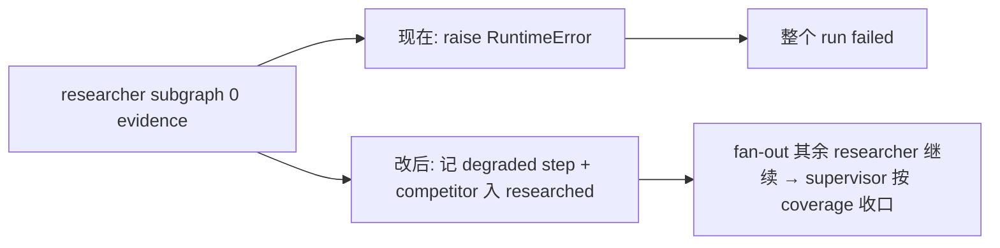

# Agent gap 修复:降级 / 诚实化 / 卫生(A+B+C)

依据 [docs/agent优化建议_核实与取舍.md](docs/agent优化建议_核实与取舍.md) 二次核实后确认的真实 gap。D(对比字段)、E(URL 去重)进 backlog 不在本轮。三切片互不冲突,一次 PIV build 可完成。

## 切片 A:researcher 单竞品空证据降级(健壮性)

当前 `_build_evidence_rows` 空证据时 raise `RuntimeError`,在落库前冒泡到 `graph.ainvoke` → `_execute_run_graph` 的 `except Exception` → 整个多竞品 run `status="failed"`。其余所有 agent 失败都走 degraded。

- [backend/app/agents/nodes/researcher.py](backend/app/agents/nodes/researcher.py) `_build_evidence_rows`(L292-293):空证据**不 raise**,正常返回空 `evidence_rows` + dropped 信息;`RuntimeError` 仅保留给编程错误(如 `run_id is None`)。
- `researcher_node`:空证据时 step 落库标记降级(`step.payload` 加 `uncovered: true` 或 `status` 区分),competitor 仍走现有 `researched_competitors` 增量(L450-456)避免 supervisor 重复派单;`STEP_FINISH` 事件带 `evidence_count=0`。
- run 终态诚实:确认 [backend/app/agents/nodes/supervisor.py](backend/app/agents/nodes/supervisor.py) finalize 的 status 来源,使"存在已研究但零证据竞品"时 run 收口为 `degraded` 而非 `completed`(coverage_rate 已由 metrics 反映,此处补终态标记)。
- 全竞品空证据时,下游 analyst/writer 已有 empty-evidence fallback,自然产出 degraded 报告,不再单点崩溃。
- 测试:[backend/app/tests/test_researcher_evidence.py](backend/app/tests/test_researcher_evidence.py) 加"子图零证据 → 不抛、step 降级、competitor 记入 researched"用例。

## 切片 B:curator 诚实化,只生成真生效的 qa_rule(自进化诚信)

核实确认:promote 后只有 qa_rule 被 QA 自动加载消费;prompt_template 的 `template_body`、source_routing 的 `priority_delta`/`target_agent` 全库无运行时消费方,catalog 只注入元数据。人工 approve 一个不起作用的候选是假功能。

- [backend/app/service/skill_curator/engine.py](backend/app/service/skill_curator/engine.py) `generate_skill_candidates`(L63-91):`asyncio.gather` 只保留 `generate_qa_rule_candidates`,移除 prompt_template / source_routing 两路调用与结果合并。
- 保留 generator 函数文件与 `skill_promotion` 对两类的 promote 能力(历史候选与未来重启不破坏),仅切断**生成入口**,YAGNI 不删代码。
- catalog 注入:[backend/app/service/llm/prompts.py](backend/app/service/llm/prompts.py) `_inject_catalog` 的 `applies_to_filter` 中 researcher/analyst/writer 含 `prompt_template`/`source_routing`,既不再产生此类 skill,收窄到实际生效集合(researcher 保留 `source_routing` 若仍靠 `load_skill` 读 instructions,需确认;analyst/writer 收窄到 `general`)。
- 测试:[backend/app/tests/test_skill_curator_engine.py](backend/app/tests/test_skill_curator_engine.py) 断言自动生成入口只返回 qa_rule;generator/promote 代码与其单测保留,用于兼容历史候选与未来重启。
- 文档:核实文档 B 标记为已诚实化收口。

## 切片 C:清理 AgentState.session_factory 死字段(卫生)

[backend/app/agents/state.py](backend/app/agents/state.py) L44 声明 `session_factory: async_sessionmaker`(不可序列化);生产 `initial_state` 从不注入,节点靠 `_require_session_factory`/`_resolve_session_factory` fallback 到 `get_session_factory()`。字段留存会在未来启用 checkpoint 持久化时炸,且误导。

- 删 [backend/app/agents/state.py](backend/app/agents/state.py) 的 `session_factory` 字段。
- 所有从 state 读取 `session_factory` 的节点 helper:去掉读 `state.get("session_factory")` 分支,直接 `get_session_factory()`(helper 可内联删除)。
- 测试注入点:[backend/app/tests/test_smoke.py](backend/app/tests/test_smoke.py) L719/735、[backend/app/tests/test_supervisor_batch.py](backend/app/tests/test_supervisor_batch.py) L92 去掉 `session_factory` 注入(测试已通过 patch 模块工厂或 init_engine 提供 session)。
- 注意:harness / qa engine 等以**函数参数**接收 session_factory 的内部调用不受影响,本切片只动 state 字段与节点取值。

## 切片 verify:验证 + 收口

- docker 定向 pytest:`test_researcher_evidence` / `test_skill_curator_*` / `test_skill_review` / `test_smoke` / `test_supervisor_batch` / `test_run_metrics` 全绿。
- 零证据路径:用 researcher_node 回归验证空证据不抛、step/event degraded、competitor 入 researched;用 supervisor finalize 回归验证 run 收口 degraded 而非 completed/failed;确认 curator 生成入口只产 qa_rule 候选。
- green 后更新核实文档 A/B/C 状态;按需提交。

## 不做(本轮)

- D 跨竞品对比字段、E fan-out URL 去重:进 backlog,前者需产品取舍、后者需真实 trace 重复率数据。
- 不实现 prompt_template/source_routing 写回生效(用户已选诚实化方向);不删两类 generator/promote 代码。
