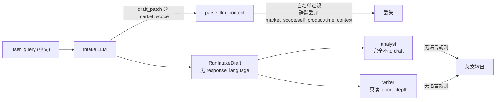

# DAQ-S1 字段贯通契约（Layer-2）

> 上游数据地域化总纲第 1 阶段。地基阶段：建立 `response_language` 一等字段、修白名单 bug、让产出端看到意图与语言。S2-S5 都依赖本阶段。审计依据 [docs/e2e-audit-2026-06-08-data-acquisition.md](docs/e2e-audit-2026-06-08-data-acquisition.md) 的 DATA-001 / LANG-001。

## 锁定决策（已与用户确认）

- **语言来源 = 确定性检测 + LLM 显式覆盖**：从 `user_query` 中文字符占比检测语言写入 `draft.response_language`（不耗 token、可测）；用户显式要求别的语言时由 LLM patch 覆盖。
- **贯通机制 = A（读 draft）**：analyst/writer 直接 `coerce_intake_draft_or_default(state)`，不动 `AgentState` schema、不动 supervisor `Send` payload。理由：draft 是唯一真相源，避免顶层重复字段漂移；`writer.py` 已证明 `intake_draft` 可达产出端。顶层 flatten 留给 S2（researcher 子图才是真正消费者）。
- **检测放共享模块**：新建 `backend/app/service/locale/`，S5 在此扩展 TLD/源地域判定，避免 S1 写一次性内联检测又被 S5 重写。

## 根因回顾（本阶段要消灭的）



三处缺口：(1) [agent_outputs_pipeline.py:55](backend/app/schemas/agent_outputs_pipeline.py) 白名单漏字段 → 静默丢弃；(2) 无 `response_language` 字段；(3) analyst/writer 既不读意图也无语言规则。

## 实施切片

### Slice 1 — 修 INTAKE_PATCHABLE_FIELDS bug（独立、最小）
- [backend/app/schemas/agent_outputs_pipeline.py](backend/app/schemas/agent_outputs_pipeline.py) L55-66：`INTAKE_PATCHABLE_FIELDS` 补 `self_product`、`market_scope`、`time_context`、`response_language`，与 prompt schema、`_apply_patch`、`RunIntakeDraft` 对齐。
- 这是纯 bug 修复：prompt 已让 LLM 输出这些字段、`_apply_patch` 已能接收，仅白名单漏了导致 `parse_llm_content`（L118-121）静默丢弃。

### Slice 2 — 新建 locale 检测模块
- 新建 `backend/app/service/locale/__init__.py`：`detect_language(text: str) -> Literal["zh", "en"]`，按中文字符占比判定（阈值如 >15% 判 zh）。类型注解齐全，fail-fast。
- 仅此一个纯函数；S5 再在此模块扩展 TLD/源地域判定（本阶段不做）。

### Slice 3 — response_language 进 schema 与 intake 链路
- [backend/app/schemas/intake.py](backend/app/schemas/intake.py) L33-36 区：`RunIntakeDraft` 新增 `response_language: Literal["zh", "en"] | None = None`（可选、不参与 `is_complete`）。
- [backend/app/agents/nodes/intake.py](backend/app/agents/nodes/intake.py)：
  - draft 初次构造/每轮 generate 时，若 `response_language` 为空则用 `detect_language(user_query)` 写入（确定性兜底）。
  - `_apply_patch`（L204-242）补 `response_language` 处理：仅接受 `{"zh","en"}`，供 LLM 显式覆盖。
- [backend/app/service/llm/prompts.py](backend/app/service/llm/prompts.py) `INTAKE_SYSTEM_PROMPT` 的 `draft_patch` schema（L88-99 区）补 `response_language`，加一句指引：默认随 user_query 语言，仅当用户显式要求特定输出语言时才设置。

### Slice 4 — analyst 注入意图/范围/语言
- [backend/app/agents/nodes/analyst.py](backend/app/agents/nodes/analyst.py) L86-135：用 `coerce_intake_draft_or_default(state)` 取 draft，向 `build_analyst_user_prompt` 传 `analysis_intent`、`market_scope`、`response_language`、`domain_hint`。
- [backend/app/service/llm/prompts.py](backend/app/service/llm/prompts.py)：
  - `build_analyst_user_prompt`（L982-1006）新增上述形参并注入 prompt 文本。
  - `ANALYST_SYSTEM_PROMPT` Rules 段（L438-452）加语言规则，复用 INTAKE/PLANNER 句式：`Write all analysis output in response_language (zh→Chinese, en→English); default to the language of user_query.`

### Slice 5 — writer 注入与报告语言
- [backend/app/agents/nodes/writer.py](backend/app/agents/nodes/writer.py) L530-548：取 draft，向 `build_writer_user_prompt` 传 `analysis_intent`、`market_scope`、`response_language`、`domain_hint`。
- [backend/app/service/llm/prompts.py](backend/app/service/llm/prompts.py)：
  - `build_writer_user_prompt`（L1083-1127）新增形参并注入。
  - `WRITER_SYSTEM_PROMPT` Rules 段（L509-521）加同款语言规则。
- [backend/app/agents/nodes/writer.py](backend/app/agents/nodes/writer.py) `_render_report_markdown`（L394-476）：硬编码英文章节标题（`## Executive Summary` / `## Risk Callouts` / `Evidence:` 等）按 `response_language` 选中/英文案，避免中文报告里漏英文骨架。

### Slice 6 — 验收（prompt 层为主，不依赖 DB/LLM）
- 新增/扩展测试（容器内 `pytest tests/... -q`，工作目录 `/app`）：
  - `detect_language`：中/英/混合输入断言。
  - `INTAKE_PATCHABLE_FIELDS` 含 4 个新字段。
  - `ANALYST_SYSTEM_PROMPT` / `WRITER_SYSTEM_PROMPT` 含语言规则文案。
  - `build_analyst_user_prompt` / `build_writer_user_prompt` 注入 market_scope/analysis_intent/response_language。
  - 复用 [backend/app/tests/test_intake_flow.py](backend/app/tests/test_intake_flow.py) 的 persisted_draft 断言扩展：reply→draft 贯通含 `response_language` / `market_scope`。

## Verify

```
docker compose -f backend/docker-compose.dev.yml exec -T rivallens_api \
  pytest tests/test_intake_prompt.py tests/test_intake_flow.py tests/test_writer_llm.py tests/test_agent_outputs.py -q
```

## Done-when

- LLM 抽取的 `market_scope/self_product/time_context/response_language` 不再被静默丢弃。
- 中文 `user_query` → `draft.response_language == "zh"`（无显式覆盖时）。
- analyst/writer prompt 同时包含 analysis_intent、market_scope、response_language 与输出语言规则。
- 上述 pytest 全绿。
- 旧行为不回归：英文 query 仍走英文；未设 market_scope 时 prompt 不报错（值为 None 安全降级）。

## 不做（本阶段）

- 顶层 flatten / researcher 子图 / Send payload（属 S2）。
- 检索 provider、地域参数、重排（S2/S3）。
- locale 模块的 TLD/源地域判定（S5）。
- 追问用户语言（语言走自动检测，不增澄清轮次）。
