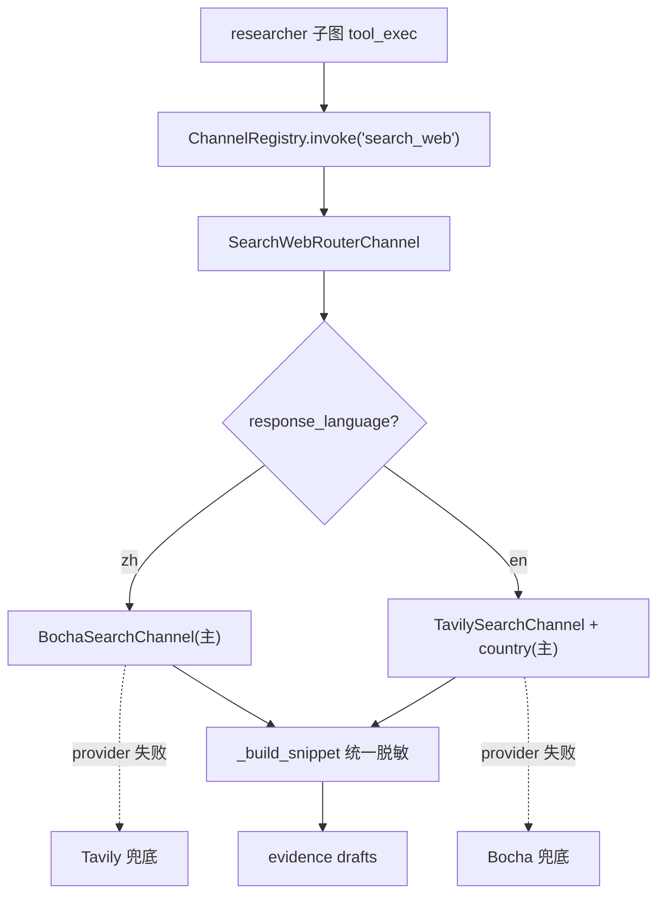

# DAQ-S2 检索地域化 + 多源（Layer-2）

> 上游数据地域化总纲第 2 阶段，广度核心。把「单点 Tavily、无地域、无分解」升级为「多 provider 地域路由 + 轻量查询分解 + 去重」。审计依据 [docs/e2e-audit-2026-06-08-data-acquisition.md](docs/e2e-audit-2026-06-08-data-acquisition.md) 的 DATA-002 广度侧。

## 前置依赖（弱耦合 S1）

仅依赖 S1 在 `RunIntakeDraft` 建立的 `response_language` 字段。本阶段假设 S1 已 build 完成。文件无重叠（S1 改 intake/analyst/writer/agent_outputs_pipeline；S2 改 researcher 子图/新建 search_bocha/registry/config）。

## 锁定决策（已与用户确认）

- **地域路由信号 = `response_language`**：语言与渠道天然对齐。`zh → 博查主 / Tavily 兜底`；`en → Tavily(country) 主 / 博查兜底`。
- **查询分解 = 轻量**：不动 ReAct 主循环与子图编排。只在 `_fallback_action`/空结果路径，用代码生成 2-3 条互补子查询（官网 site:、第三方评测、中文源角度）。第一性原理：审计痛点是地域而非 query 数量；完整 LLM 分解节点的边际广度收益不抵子图编排重构的风险。真正广度杠杆留给 S3 重排+反思。
- **多 provider 形态 = Router Channel 包装**：新建 `SearchWebRouterChannel`(`name="search_web"`)，内部持有 `[BochaSearchChannel, TavilySearchChannel]`，按 `response_language` 选主用 provider，provider 级失败(429/auth/配额/超时)才 fallback 到下一个。registry 的 `name→单实例` 契约不变。Bocha/Tavily 各自仍是纯 `BaseChannel`。
- **博查无 country/language 请求参数**（官方字段表确认）：provider 选择本身即地域路由；中文地域靠 query 措辞 + 可选 `include` 域名。Tavily 原生支持 `country`。

## 检索管线目标态



## 当前缺口（调研确认）

- 查询无分解：每维度一条线性 query，fallback 拼 `{domain_hint} {competitor_id} {dimension} {research_topic}`（[subgraphs/researcher.py:414](backend/app/agents/subgraphs/researcher.py)）。
- 零地域参数：channel 只收 `query`/`max_results`（[tools/search_web.py:71-82](backend/app/agents/tools/search_web.py)），Tavily 调用未传 `country`（[search_web.py:45-52](backend/app/agents/tools/search_web.py)）。
- registry 无 provider 路由：`name→单实例`（[service/collector/registry.py:40-61](backend/app/service/collector/registry.py)）。
- `response_language` 未进 `AgentState`/`ResearcherSubState`（仅在 draft；本阶段需透传）。

## 实施切片

### Slice 1 — config 增博查配置
- [backend/app/core/config.py](backend/app/core/config.py) L118 旁：新增 `BOCHA_API_KEY: str | None = None`、`BOCHA_BASE_URL: str = "https://api.bochaai.com/v1"`、`SEARCH_PROVIDER_DEFAULT: Literal["bocha","tavily"] = "tavily"`（en 默认）。复用 `COLLECTOR_FETCH_TIMEOUT_S`。
- `.env.example` / `backend/.env.dev.example` 已有 `BOCHA_API_KEY` 占位（前序已加）；补 `BOCHA_BASE_URL` 注释占位。

### Slice 2 — BochaSearchChannel（新通道）
- 新建 `backend/app/agents/tools/search_bocha.py`：实现 `BaseChannel`，`name = "bocha_search"`。
  - `invoke(**kwargs)`：校验 `query` 非空、`max_results∈[1,10]`；`settings.BOCHA_API_KEY` 缺失 fail-fast `ChannelError`。
  - 用 `httpx` POST `{BOCHA_BASE_URL}/web-search`，body `{query, count, summary:true, freshness:"noLimit"}`，Bearer 鉴权。
  - **双层状态校验**：先 `resp.raise_for_status()`，再判 body `code in (0,200)`，否则按错误分类（403 配额→`RateLimited`，401→`ChannelError`，超时→`FetchTimeout`）。
  - 解析 `data.webPages.value[]`：`name/url/snippet/summary/siteName/datePublished`，用 `summary or snippet` 作正文，调 `self._build_snippet(...)` 产出（metadata 标 `source:"bocha_search"`）。
  - 复用 per-host rate limiter（host `api.bochaai.com`）。
- 错误类型复用 [service/collector/errors.py](backend/app/service/collector/errors.py)。

### Slice 3 — Tavily 补 country 参数
- [backend/app/agents/tools/search_web.py](backend/app/agents/tools/search_web.py)：
  - `invoke` 接受可选 `country: str | None`；`_tavily_search` 增 `country` 入参，透传给 `client.search(country=...)`（保留 `TypeError` 降级路径，老 SDK 不支持时忽略）。
  - `country` 由 router 按 market_scope/response_language 映射（如 en+中国语境→保留全球；可选 `"china"`）。

### Slice 4 — SearchWebRouterChannel（路由 + 兜底）
- 新建 `backend/app/agents/tools/search_router.py`：`name = "search_web"`，持有 Bocha + Tavily 实例。
  - `invoke(**kwargs)`：读 `response_language`，定主备顺序；按序尝试，捕获 provider 级失败(`RateLimited`/`FetchTimeout`/auth `ChannelError`)则记录 fallback 原因并切下一个；非 provider 失败（如空 query）直接抛。
  - 全部 provider 失败才抛 `ChannelError`。每次 fallback 写结构化日志（provider、原因），满足可观测契约。
- [backend/app/service/collector/registry.py](backend/app/service/collector/registry.py) `_register_builtin_channels`：把 `TavilySearchChannel()` 替换为 `SearchWebRouterChannel()` 注册到 `search_web`；Bocha/Tavily 作为 router 内部实例，不单独注册（或额外注册 `bocha_search` 备调试）。

### Slice 5 — response_language 透传到子图
- [backend/app/agents/state.py](backend/app/agents/state.py) L21 旁：`AgentState` 增 `response_language: str | None`、`market_scope: str | None`（顶层，参照 `domain_hint`）。
- [backend/app/router/run_rt.py](backend/app/router/run_rt.py) initial_state 构造（L1325 区）：从 draft 取 `response_language`/`market_scope` 注入顶层。
- [backend/app/agents/subgraphs/researcher.py](backend/app/agents/subgraphs/researcher.py) `ResearcherSubState`(L122-145) 增两字段；[nodes/researcher.py](backend/app/agents/nodes/researcher.py) `_build_initial_substate`(L54-88) 读 state 注入子图。
- tool_exec 调 registry 时把 `response_language`/`country` 放进 `action_args`（[subgraphs/researcher.py:779-821](backend/app/agents/subgraphs/researcher.py)）；`_SAFE_TOOL_ARG_KEYS`(L71) 补新键。

### Slice 6 — 轻量查询分解 + 去重
- [backend/app/agents/subgraphs/researcher.py](backend/app/agents/subgraphs/researcher.py) `_fallback_action`(L412-421)：当首条 search 无结果/重试时，生成 2-3 条互补子查询（官网 `site:`、`{competitor} 评测/对比`、中文源角度按 response_language），串行执行并合并。
- 子图内 `_append_evidence_drafts`(L685-760) 前做轻量 URL 去重（同 query 批次内 canonical URL 去重）；父节点落库去重([nodes/researcher.py:108-147](backend/app/agents/nodes/researcher.py)) 保持不变。

### Slice 7 — 验收
- 单元（mock httpx，不调真实 API）：
  - `BochaSearchChannel`：mock 200 正常响应→断言 snippet 解析；mock body `code:403`→断言 `RateLimited`；缺 key→`ChannelError`。
  - `SearchWebRouterChannel`：zh→Bocha 优先；Bocha 抛 `RateLimited`→fallback Tavily；全失败→`ChannelError`。
- 真实探活（可选，1 次）：容器内跑一条 zh query 走 router，确认走博查、返回中文源。
- 同步 [docs/2.6-collector-channels.md](docs/2.6-collector-channels.md) 为「多 provider + 地域路由」真实形态。

## Verify

```
docker compose -f backend/docker-compose.dev.yml exec -T rivallens_api \
  pytest tests/ -q -k "search or bocha or router or researcher"
```

## Done-when

- `search_web` action 走 router：zh 请求优先博查并返回中文源，en 走 Tavily(country)。
- 任一 provider 配额/超时失败时自动 fallback，且日志记录原因。
- `response_language` 从 draft → AgentState → 子图 → search args 贯通。
- fallback 路径生成多角度子查询并去重。
- 上述 pytest 全绿；旧行为（无 key 时 fail-fast）不回归。

## 不做（本阶段）

- LLM 查询分解节点 / 子图并行 fan-out 重构（评估风险回报不成正比）。
- Semantic Reranker 重排、覆盖反思补采（S3）。
- fetch_url 的多 provider 化（记录在案，本阶段仅 search_web）。
- locale_match_rate 指标 / QA 地域护栏（S5）。
