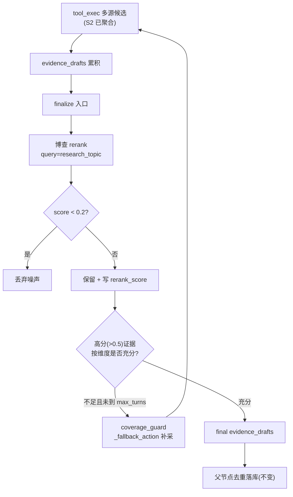

# DAQ-S3 证据重排 + 覆盖反思（Layer-2）

> 上游数据地域化总纲第 3 阶段，质量核心。把 S2 多源采集来的候选做段落级语义重排 + 覆盖反思补采。审计依据 [docs/e2e-audit-2026-06-08-data-acquisition.md](docs/e2e-audit-2026-06-08-data-acquisition.md) 的 DATA-002 质量侧。

## 前置依赖（弱耦合 S2）

S3 重排消费 S2 写入 `evidence_drafts` 的多源候选。插入点在 S2 改动的 **下游**（finalize 前），接缝清晰：S2 负责把多源候选塞进 `evidence_drafts`，S3 在子图终点统一重排。数据结构契约（`evidence_drafts` 每条 draft 的 `quote`/`sanitized_text`/`metadata`）S2 之前就稳定。本阶段假设 S2 已 build 完成。

## 锁定决策（已与用户确认）

- **重排插入点 = finalize 前对累积 `evidence_drafts` 整体重排**：能拿到全维度候选，一次 API 调用（成本可控），落在父节点去重之前，不碰任何现有去重/质量过滤/prompt 采样逻辑。
- **丢弃阈值 = 低于 0.2 才丢**：博查官方分档 <0.2 为「仅小部分相关」，保召回、只剖明显噪声。`rerank_score` 写入 `draft["metadata"]["rerank_score"]`，零 schema 改动，供下游排序。
- **覆盖反思 = 方案 C（子图内反思）**：重排后判断高分证据是否充分（如某 dimension 中 `score>0.5` 的条数不足），不足则复用现有 `coverage_guard`/`_fallback_action` 触发补采。第一性原理：`coverage_guard` 只看维度搜没搜过、看不到质量（审计痛点正是搜过但全是无关源），C 用 rerank_score 补上这个盲区，直击痛点；且不走 QA、不受 engine 熔断（证据≥3/≥12 强制停、`MAX_QA_REJECTIONS=3`），由 `max_turns` 兜底，可控不死循环。
- **触发线高于丢弃线一档**：丢弃用 <0.2，补采触发用「高分(>0.5)证据不足」，同信号不同档位，逻辑自洽。

## 重排 + 反思目标态



## 当前缺口（调研确认）

- 无任何相关性排序/过滤：`_append_evidence_drafts`([subgraphs/researcher.py:685-760](backend/app/agents/subgraphs/researcher.py)) 纯追加，父节点 `_build_evidence_rows`([nodes/researcher.py:108-147](backend/app/agents/nodes/researcher.py)) 只去重+质量底线，无 topN 无相关性。
- `select_layered_evidence_briefs`([prompts.py:567-606](backend/app/service/llm/prompts.py)) 只按 source_authority+最新做 prompt 采样，非相关性重排。
- `coverage_guard`([subgraphs/researcher.py:639-657](backend/app/agents/subgraphs/researcher.py)) 只看 `pending_dimensions` 非空，看不到证据质量。
- 博查 rerank 接口已查实：`POST /v1/rerank`，body `{model:"gte-rerank", query, documents[], top_n, return_documents}`，响应 `data.results[].relevance_score`(0-1)。

## 实施切片

### Slice 1 — config + 博查 rerank 客户端
- [backend/app/core/config.py](backend/app/core/config.py)：新增 `BOCHA_RERANK_MODEL: str = "gte-rerank"`、`RERANK_DROP_THRESHOLD: float = 0.2`、`RERANK_COVERAGE_THRESHOLD: float = 0.5`、`RERANK_MIN_HIGH_SCORE_PER_DIM: int = 2`（补采触发线）。复用 S2 的 `BOCHA_API_KEY`/`BOCHA_BASE_URL`/`COLLECTOR_FETCH_TIMEOUT_S`。
- 新建 `backend/app/agents/tools/rerank_bocha.py`：`async def rerank(query, documents, top_n) -> list[tuple[int, float]]`，httpx POST `{BOCHA_BASE_URL}/rerank`，双层状态校验（HTTP + body `code in (0,200)`），兼容 `relevance_score`/`score` 字段；失败按分类抛（403→`RateLimited`，超时→`FetchTimeout`），但**重排失败要 fail-soft**：捕获后返回原序（重排是增强非必需，不应让整条研究失败），记 warning 日志。

### Slice 2 — finalize 前重排 + 阈值丢弃
- [backend/app/agents/subgraphs/researcher.py](backend/app/agents/subgraphs/researcher.py) `finalize`(L1021-1046)：在产出 final_summary 前，对 `state["evidence_drafts"]` 调 rerank。
  - query 用 `state["research_topic"]`；documents 用每条 draft 的 `sanitized_text or quote`（截前 512 字符，对齐博查评分窗口）。
  - 按返回 score：`< RERANK_DROP_THRESHOLD` 的 draft 从 list 剔除；保留的写 `draft["metadata"]["rerank_score"] = score`。
  - 候选数 > 50 时分批调用（博查单次上限 50 documents）。
  - 抽成 helper `_rerank_evidence_drafts(drafts, query) -> list[draft]`，便于单测。

### Slice 3 — 重排后覆盖反思触发补采
- [backend/app/agents/subgraphs/researcher.py](backend/app/agents/subgraphs/researcher.py) `finalize` 重排后、写 final_summary 前：
  - 统计每个 `focus_dimension` 中 `rerank_score > RERANK_COVERAGE_THRESHOLD` 的 draft 条数。
  - 若某维度高分条数 < `RERANK_MIN_HIGH_SCORE_PER_DIM` 且 `turn_count < max_turns`：把该维度加回 `pending_dimensions`，复用 `_fallback_action` 走补采路径（与 `coverage_guard` 同款机制，返回 tool_exec），记 `researcher.rerank_reflect_reresearch` 日志。
  - 否则正常 finalize。
  - 注意防循环：每个维度最多因 rerank 反思补采一次（用 `state` 里一个计数/已反思维度集合标记），叠加 `max_turns` 双重兜底。

### Slice 4 — 验收
- 单元（mock rerank_bocha，不调真实 API）：
  - `_rerank_evidence_drafts`：给定分数 → 断言 <0.2 被剔除、保留项 metadata 有 rerank_score、降序。
  - rerank 客户端：mock 200 正常 → 解析；mock `code:403` → `RateLimited`；mock 异常 → fail-soft 返回原序。
  - 反思触发：构造某维度全低分 → 断言该维度回到 pending_dimensions 且 action 变 tool_exec；高分充足 → 断言正常 finalize；已反思过 → 不重复触发。
- 真实探活（可选，1 次）：一条中文 run，确认重排执行、低分被丢、日志有 rerank_score。

## Verify

```
docker compose -f backend/docker-compose.dev.yml exec -T rivallens_api \
  pytest tests/ -q -k "rerank or researcher or finalize"
```

## Done-when

- finalize 前对 evidence_drafts 执行博查重排，<0.2 噪声被丢弃，保留项带 rerank_score。
- 某维度高分证据不足时触发一次定向补采（复用 coverage_guard，不走 QA、不受熔断），max_turns 兜底。
- 重排 API 失败时 fail-soft（返回原序、记 warning），不中断研究。
- 上述 pytest 全绿；父节点去重/质量过滤/prompt 采样逻辑零改动。

## 不做（本阶段）

- 新增 QA coverage 规则 / 改 engine 熔断（评估受熔断限制、埋坑，改用子图内反思）。
- 顶层 flatten / Send payload（S2 已处理 response_language 透传）。
- locale_match_rate 指标 / QA 地域 warning / golden 中文源断言（S5）。
- LLM 查询分解节点（S2 已评估不做）。
