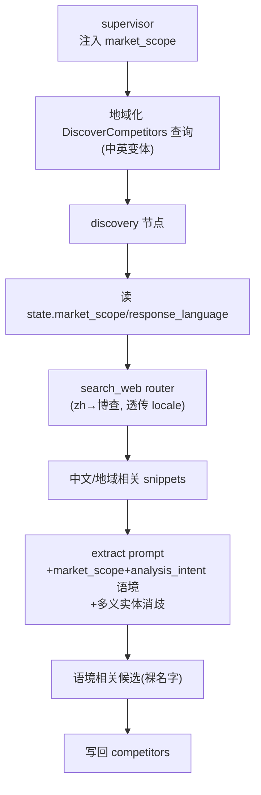

# DAQ-S4 发现消歧 + 地域候选（Layer-2）

> 上游数据地域化总纲第 4 阶段。让 discovery 具备地域 + 语境意识，消灭「模糊实体被锁死到无关领域、候选全海外」。审计依据 [docs/e2e-audit-2026-06-08-data-acquisition.md](docs/e2e-audit-2026-06-08-data-acquisition.md) 的 DATA-003。

## 前置依赖（弱耦合，S2 已铺好地基）

调研确认 S2 build 时已把 `SearchWebRouterChannel` 的地域路由做出来了，discovery 只是没传参去用。S4 主要是「让 discovery 用上已有能力」+ prompt。本阶段假设 S1/S2 已 build：`AgentState` 顶层已有 `market_scope`/`response_language`（S2 加），`search_web` 已是地域路由 router。无 state 改动、无新 channel、无新编排。

## 锁定决策（已与用户确认）

- **消歧 = 纯 prompt 层**：给 discovery extract prompt 注入 `market_scope` + `analysis_intent` 语境，加多义实体辨析指示（如 OPC 可能是工业协议/股票/外包，按语境选、排除无关领域）。第一性原理：审计痛点是 prompt 没给 LLM 语境去判别，不是缺字段或缺追问；加 schema 字段或回跳 intake 追问都绕远且与「不增澄清轮次」冲突。
- **裸名字写回不变**：discovery 仍写回 `list[str]` 竞品名，不改 schema、不改 state 流转。
- **复用 S2 router**：discovery 透传 `response_language`/`market_scope` 给 `search_web`，照抄 researcher 子图([subgraphs/researcher.py:866-872](backend/app/agents/subgraphs/researcher.py)) 范本，地域路由立即生效。

## 当前缺口（调研确认）

- discovery 调 `search_web` 只传 `query`/`max_results`，不传 locale（[nodes/discovery.py:172-178](backend/app/agents/nodes/discovery.py)），router 地域能力闲置。
- discovery extract prompt 全英文、只做「直接竞品 vs adjacent」二分，无消歧、无地域指示（[prompts.py:1258-1275](backend/app/service/llm/prompts.py)）。
- discovery 不读 `market_scope`/`analysis_intent`/`response_language`（只取 focus_dimensions，[discovery.py:307-310](backend/app/agents/nodes/discovery.py)）。
- supervisor 兜底硬模板英文 query `f"{user_query} competitors alternatives"`（[supervisor.py:358-362](backend/app/agents/nodes/supervisor.py)），无地域变体。
- supervisor 看不到 market_scope：`build_supervisor_user_prompt` 无该形参（[prompts.py](backend/app/service/llm/prompts.py) `build_supervisor_user_prompt`、[supervisor.py:1077](backend/app/agents/nodes/supervisor.py) 调用处）。

## 目标态



## 实施切片

### Slice 1 — discovery 读 state + 透传 locale 给 router
- [backend/app/agents/nodes/discovery.py](backend/app/agents/nodes/discovery.py) L127-132：从 `state` 读 `market_scope`/`response_language`（参照 [nodes/researcher.py:427-436](backend/app/agents/nodes/researcher.py) 规范化写法）。
- L172-178：`registry.invoke("search_web", args=...)` 补 `response_language`/`market_scope`（参照 [subgraphs/researcher.py:866-872](backend/app/agents/subgraphs/researcher.py)），地域路由生效。

### Slice 2 — discovery extract prompt 注入语境 + 消歧
- [backend/app/service/llm/prompts.py](backend/app/service/llm/prompts.py) `build_discovery_extract_user_prompt`(L1258-1275)：新增 `market_scope`/`analysis_intent` 形参并注入 prompt 文本。
- Rules 段加两条：
  - 多义实体辨析：若实体名有多重含义，按 market_scope + analysis_intent 语境选定领域，排除无关领域的候选（给 OPC 式例子）。
  - 地域优先：market_scope 指向特定地域时，优先该地域厂商/产品。
- 输出语言：候选 `relevance_reason` 用 response_language（复用 S1 句式）。
- [backend/app/agents/nodes/discovery.py](backend/app/agents/nodes/discovery.py) L224-248：调用处把 market_scope/analysis_intent 传进 builder（从 state.intake_draft 取）。

### Slice 3 — supervisor 注入 market_scope + 地域化兜底查询
- [backend/app/service/llm/prompts.py](backend/app/service/llm/prompts.py) `build_supervisor_user_prompt`：新增 `market_scope` 形参注入；`SUPERVISOR_SYSTEM_PROMPT` 加一句「构造 DiscoverCompetitors 查询时，按 market_scope 体现地域并生成对应语言变体」。
- [backend/app/agents/nodes/supervisor.py](backend/app/agents/nodes/supervisor.py) L1077 调用处传 market_scope；L357-362 兜底硬模板按 response_language/market_scope 生成中文/地域 query 变体（不再写死英文 `competitors alternatives`）。

### Slice 4 — 验收
- 单元（mock LLM，不调真实 API）：
  - `build_discovery_extract_user_prompt`：传 market_scope/analysis_intent → 断言 prompt 含语境与消歧指示。
  - `build_supervisor_user_prompt`：传 market_scope → 断言 prompt 含地域指示。
  - discovery 节点：mock registry，断言 invoke `search_web` 的 args 含 response_language/market_scope。
  - supervisor 兜底：中文 response_language → 断言生成的 search_queries 含中文/地域变体而非纯英文。
- 真实探活（可选，1 次）：复现审计的「OPC + 国内 + 变现」中文 run，确认 discovery 候选不再全是海外工业协议厂商、出现国内/语境相关候选。

## Verify

```
docker compose -f backend/docker-compose.dev.yml exec -T rivallens_api \
  pytest tests/ -q -k "discovery or supervisor or prompt"
```

## Done-when

- discovery 调 search_web 透传 locale，中文请求走博查、返回中文/地域相关源。
- discovery extract prompt 含 market_scope+analysis_intent 语境与多义实体消歧指示。
- supervisor 能看到 market_scope，兜底发现查询有地域/语言变体。
- 审计的 OPC 式模糊中文请求不再全锁海外工业协议厂商（探活验证）。
- 上述 pytest 全绿；schema/state/编排零改动。

## 不做（本阶段）

- 给候选加 region/locale/confidence schema 字段（评估为绕远，纯 prompt 已直击痛点）。
- discovery→intake 回跳追问消歧（与「不增澄清轮次」冲突）。
- 候选结构化排序写回（保持裸名字，YAGNI）。
- locale_match_rate 指标 / QA 地域 warning / golden（S5）。
