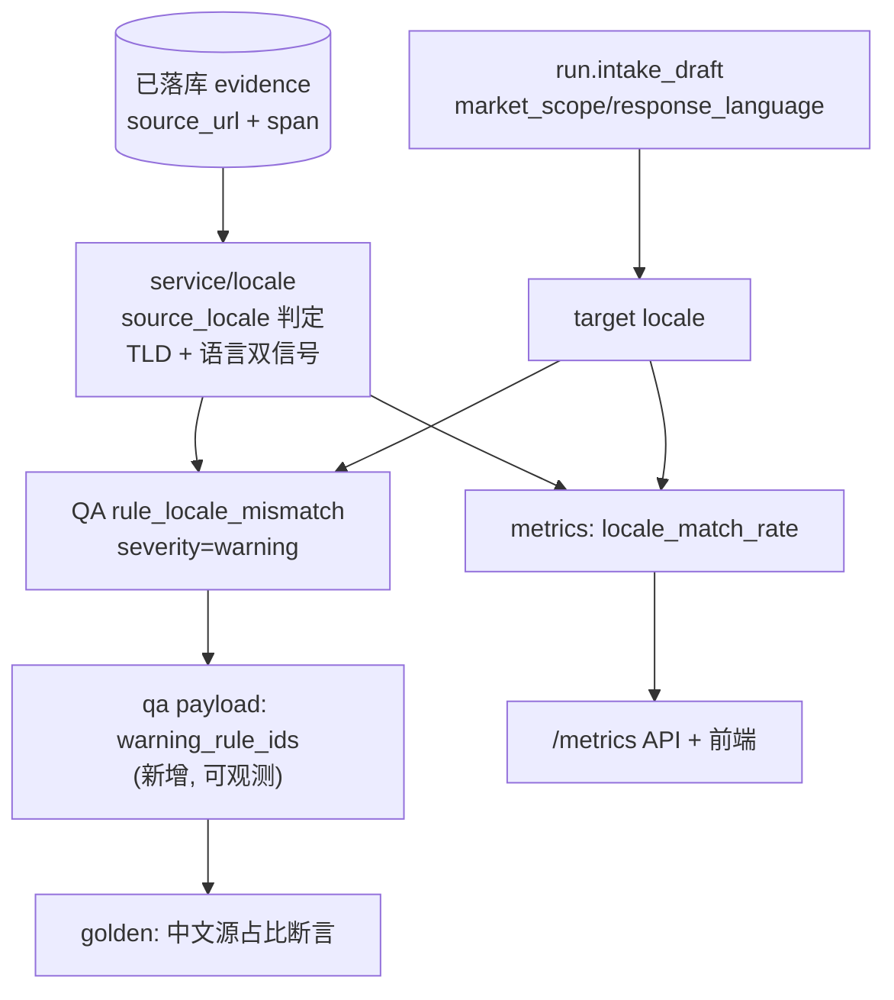

# DAQ-S5 地域质量护栏（Layer-2）

> 上游数据地域化总纲收尾阶段。给 S2-S4 的采集结果加「事后度量 + 护栏」，让「中文国内请求却全是海外英文源」这种错配在指标和 QA 层可见。审计依据 [docs/e2e-audit-2026-06-08-data-acquisition.md](docs/e2e-audit-2026-06-08-data-acquisition.md) 的 DATA-004。

## 前置依赖（弱耦合，度量层正交）

S5 读已落库 evidence 做度量，与 S2-S4 采集实现正交。`service/locale/` 已由 S1 建好（`detect_language` 已实现）。golden 中文源断言的**通过**依赖 S2-S4 真生效，但写断言、定口径不阻塞。本阶段假设 S1-S4 已 build。

## 修正（2026-06-08 跨语言广度纠偏，已落码）

护栏立意从「中文源占比越高越好」改为「显式地域的覆盖底线」,避免矫枉过正:

- 地域只由 `market_scope` 显式判定(`target_country_from_scope` 移除 response_language 触发);中文提问问全球话题不再被判 china。
- `rule_locale_mismatch` 仅当 market_scope **显式锁定**地域、且该地域一手源 < 覆盖底线(0.20)才 warning;非阻断,外文源对广度仍有效。
- `locale_match_rate` 语义退为「显式地域的覆盖度」;无显式地域则全匹配(=1.0),语言/地域分布仍由 `locale_distribution` 观测。
- 验收:407 backend tests passed。

## 锁定决策（已与用户确认，部分已被上方修正覆盖）

- **locale 判定 = source_url TLD/host 为主 + 语言为辅双信号**：不依赖上游必须写 `span.country`（博查路径可能没有），TLD 和语言是 evidence 自带客观属性，最鲁棒。审计痛点（海外 TLD + 英文）双信号都能照出。
- **QA 地域错配 = warning 非阻断**：不 reject、不重试，只告警（可触发 S3 补采但不强制）。复用现成 `severity="warning"` 机制。
- **必须补 warning 可观测**：调研发现 warning 失败当前不写进持久化 payload（`_build_approval`/qa.py 只记 passed/blocking），golden 和前端观测不到。S5 必须新增 `warning_rule_ids` 字段，否则护栏「静默通过」无法验收。
- **locale_match_rate 纯计算**：无 DB schema 改动，照搬 `source_authority_distribution` 的 Counter 模式。

## 当前缺口（调研确认）

- metrics 无地域/语言指标：[metrics/engine.py:282-285](backend/app/service/metrics/engine.py) 只有 source_type/authority distribution。
- QA warning 失败不可观测：[qa/engine.py](backend/app/service/qa/engine.py) `_build_approval` 只记 passed_rule_ids；[nodes/qa.py:75-84](backend/app/agents/nodes/qa.py) Approval payload `failed_rule_ids` 恒为 `[]`。
- `evaluate_fast_path_rules`([qa/rules.py:533](backend/app/service/qa/rules.py)) 不接收 market_scope/response_language（虽然 `evaluate_report` 已取出 run）。
- golden input 无 market_scope 入口、fake evidence 全英文 `example.com`（[tests/conftest.py](backend/app/tests/conftest.py) `_build_researcher_response`）。
- run 的 target locale 在 `run.intake_draft` JSONB 里，非独立列（参照 `_report_depth_from_run` 读法）。

## 目标态



## 实施切片

### Slice 1 — locale 模块扩展 source 地域判定
- [backend/app/service/locale/__init__.py](backend/app/service/locale/__init__.py)：在现有 `detect_language` 旁新增 `source_locale(source_url, span, sanitized_text) -> dict`（或 `is_domestic_source`/`source_language`）。
  - 地域信号：从 `source_url` 取 TLD（`.cn`/`.com.cn` 等判国内）+ 已知国内 host 关键词集合。
  - 语言信号：优先 `span.get("response_language")`，回退 `detect_language(sanitized_text)`。
  - 复用 `search_router._country_from_scope` 的 target 推断（market_scope/response_language → china）。
- 纯函数，类型注解齐全，无 IO。

### Slice 2 — metrics 新增 locale_match_rate
- [backend/app/service/metrics/engine.py](backend/app/service/metrics/engine.py)：
  - 新 helper `_locale_matches(*, source_url, span, target_country, target_language) -> bool`（类比 `_extract_source_authority` L76）。
  - `build_run_metrics_snapshot`（L262 起）：从 `run.intake_draft` 取 target（仿 `_report_depth_from_run` L166），算 `locale_match_rate = _safe_rate(matched, total)` + `locale_distribution: dict[str,int]`，加进 `RunMetricsSnapshot`（L29 dataclass）。
- [backend/app/router/run_rt.py](backend/app/router/run_rt.py) `RunMetricsResponse`（L358）同步加字段（`asdict` 解包需两边一致）。
- 前端：[frontend/src/api/types.ts](frontend/src/api/types.ts) `RunMetricsResponse` + [frontend/src/components/MetricsPanel.tsx](frontend/src/components/MetricsPanel.tsx) 加「地域匹配度」项（照搬「官方来源占比」范式）。

### Slice 3 — QA 地域错配 warning + 可观测
- [backend/app/service/qa/rules.py](backend/app/service/qa/rules.py)：新增 `rule_locale_mismatch(*, market_scope, response_language, evidence_items) -> RuleResult`，`severity="warning"`，`reject_to="researcher"`。用 Slice1 的 source_locale 算中文源占比，低于阈值则 `passed=False`，message 带占比诊断。照搬 `rule_buyer_critical_sections_need_official_source`（L343）模板。
- `evaluate_fast_path_rules`（L533）增 `market_scope`/`response_language` 形参并 append 新规则；[qa/engine.py](backend/app/service/qa/engine.py) `evaluate_report`（L505 调用处）从 `run.intake_draft` 取出透传。
- **可观测补丁**：`_build_approval`（[qa/engine.py](backend/app/service/qa/engine.py)）收集失败的 warning rule_ids；[nodes/qa.py:75-84](backend/app/agents/nodes/qa.py) Approval 分支 payload 新增 `warning_rule_ids`。前端可选展示。

### Slice 4 — golden 中文源占比断言
- [backend/app/tests/golden/runner.py](backend/app/tests/golden/runner.py) `GoldenCaseAssertions`（L20）：加 `warning_rule_ids_includes: list[str] | None`（断言地域 warning 触发，读 Slice3 的 payload 字段）。
- [backend/app/tests/conftest.py](backend/app/tests/conftest.py)：`_build_researcher_response` 按 user_query marker（如 `locale-zh-demo`）产出带 `.cn` 中文 source_url 的 evidence（仿现有 `semantic-reject-demo` marker 模式）。
- 新增 case `backend/app/tests/golden/cases/14_locale_zh_domestic.yaml`：中文 query + 国内 market_scope 语境，断言地域 warning 不触发（中文源充足）；可选反向 case 断言全英文源触发 warning。

### Slice 5 — 验收
- 单元：`source_locale`（.cn→国内、example.com+英文→海外）；`_locale_matches`；`rule_locale_mismatch`（中文源足→pass、全海外→warning fail）；metrics snapshot 含 locale_match_rate。
- golden：跑新 case，断言 warning_rule_ids 行为。
- 真实探活（可选）：复现审计 run，看 `/metrics` 的 locale_match_rate 能照出错配。
- 同步审计文档 DATA-004 状态为 fixed。

## Verify

```
docker compose -f backend/docker-compose.dev.yml exec -T rivallens_api \
  pytest tests/ -q -k "locale or metrics or qa or golden"
```

## Done-when

- `/metrics` 返回 locale_match_rate，中文国内请求却海外英文源时该值显著偏低。
- 地域错配触发 QA warning（非阻断、不 reject），且 warning_rule_ids 写进 payload 可观测。
- golden 中文 case 断言通过；warning 行为被测试守护。
- 纯计算无 DB migration；blocking/approve 逻辑零回归。

## 不做（本阶段）

- 给 evidence 加地域/语言列（纯计算，不动 schema）。
- 让 warning 升级为 blocking（保持非阻断，避免误杀）。
- 改 search_router 给博查补 span.country（属 S2 范畴，url+lang 双信号不依赖它）。
- 前端大改（仅加一个指标项 + 可选 warning 展示）。
