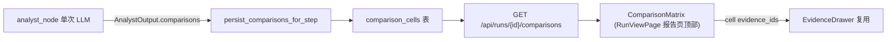

# DE 收尾:跨竞品结构化对比 + URL 去重证伪归档

## 背景与现状(已核实)

- **E 证伪**:`evidence` 表 682 run / 3803 distinct fetch,跨竞品重复仅 **55 次(1.4%)**,集中在行业基准/榜单页(firstpagesage、martal)。在 fan-out 并行子图间加共享去重层(跨节点 URL 缓存 + 并发协调)换 1.4% fetch 节省,属 YAGNI 该砍 → 归档不做。
- **D 缺口**:[analyst.py](backend/app/agents/nodes/analyst.py) 把所有竞品证据混喂 LLM,产 `AnalystInsight{dimension,finding,evidence_ids,confidence}`;[mapper.py](backend/app/service/conclusion/mapper.py) 用 `span.competitor_id` 聚合出 `conclusion.competitor_ids[]`,但**无 per-竞品结构化对比单元**,"A 比 B 强"只在 `finding` 自由文本里,无法稳定渲染"维度×竞品"对比表。
- 前端 `content_json` 已返回但只渲染 `content_markdown`;`ComparePage` 是跨 run 对比,非单 run 维度对比。

## Contract(已定)

- 形态:**定性象限**。每维度一组 cell,每 cell = `{competitor_id, stance: leader|competitive|laggard|unknown, summary, evidence_ids}`,不强求数值。
- 存储:**新 `comparison_cells` 表 + `/api/runs/{id}/comparisons` + 前端 `ComparisonMatrix`**,与 conclusions 对称。
- 产出方:**analyst**(有跨竞品全局视角),在现有 insights 之外**新增** comparisons;writer/QA 不动。
- 降级:analyst fallback 时 `comparisons=[]`;落库失败仅记 step.payload error,不阻断 run。

## 数据流

## Stage 1 — E 证伪归档(无代码)

- 在 [docs/agent优化建议_核实与取舍.md](docs/agent优化建议_核实与取舍.md) 把 E 状态从 Backlog 改为 **已决策/不做**,写入证伪数据:682 run、3803 distinct fetch、跨竞品重复 55 次(1.4%)、29 个共享 URL,主集中于行业基准页;结论:共享去重层投入产出比过低(YAGNI)。

## Stage 2 — D 后端 schema + prompt

- [schemas/agent_outputs.py](backend/app/schemas/agent_outputs.py):新增 `ComparisonCell{competitor_id:str, stance:Literal[...], summary:str(min_len1), evidence_ids:list[str]}` 与 `DimensionComparison{dimension:str, cells:list[ComparisonCell] min_len 2}`;`AnalystOutput` 加 `comparisons: list[DimensionComparison] = []`。
- 扩 `AnalystOutput.parse_llm_content`:过滤非法 `dimension`(走 `normalize_dimension_or_none`)、`competitor_id`(须 ∈ 传入 competitors)、`stance`(非法落 `unknown`)、`evidence_ids`(⊆ allowed);cell <2 的维度丢弃。`build_fallback` 设 `comparisons=[]`。
- [service/llm/prompts.py](backend/app/service/llm/prompts.py) `ANALYST_SYSTEM_PROMPT`(L342) 输出 schema 加 `comparisons` 块 + 规则(每 focus dimension 横向给每竞品 stance+summary,引用 evidence_ids,证据不足用 unknown);`build_analyst_user_prompt`(L878) 已传 competitors,补一行显式要求按维度产对比。

## Stage 3 — D 落库(表 + migration + service + 接线)

- 新模型 [models/comparison.py](backend/app/models/comparison.py):`ComparisonCellRecord(cell_id PK, run_id FK→runs, step_id FK→steps, dimension, competitor_id, stance, summary, evidence_ids JSONB, created_at)`,`run_id` 索引。evidence 用 JSONB 列(无 relevance_rank 需求,不另建链接表,YAGNI)。
- alembic `0018_add_comparison_cells.py`(承接现有 0017)。
- 新 service `service/comparison/`:`mapper.py`(LLM comparisons → cell dict,二次校验 competitor/stance/dimension/evidence) + `persistence.py`(`persist_comparisons_for_step` / `load_comparisons_for_run`),对齐 [persistence.py](backend/app/service/conclusion/persistence.py) 写法。
- [analyst.py](backend/app/agents/nodes/analyst.py):在落 conclusions 的 `session.begin_nested()` 同段内追加 `persist_comparisons_for_step`,失败仅记 `step.payload["comparisons_persist_error"]`,不阻断;step.payload 加 `comparison_count`。

## Stage 4 — D API

- [run_rt.py](backend/app/router/run_rt.py):仿 `get_run_conclusions`(L2575) 新增 `GET /api/runs/{id}/comparisons`,response `RunComparisonsResponse{run_id, items:[{dimension, cells:[{competitor_id,stance,summary,evidence_ids}]}]}`(按 dimension 分组)。

## Stage 5 — D 前端

- [types.ts](frontend/src/api/types.ts):加 `ComparisonCellResponse` / `DimensionComparisonResponse` / `RunComparisonsResponse`。
- [hooks.ts](frontend/src/api/hooks.ts):加 `fetchRunComparisons` + `useRunComparisons`。
- 新组件 `frontend/src/components/comparison/ComparisonMatrix.tsx`:表格 行=维度/列=竞品(或维度分组),cell 显示 stance 徽标 + summary,证据按钮复用 `openEvidenceDrawer`(参考 [BattlecardGrid.tsx](frontend/src/components/battlecard/BattlecardGrid.tsx))。
- [RunViewPage.tsx](frontend/src/pages/RunViewPage.tsx):报告 Tab `<article>` 之前插入 `ComparisonMatrix`;[sse.ts](frontend/src/api/sse.ts) `invalidateRunReport` 加 `run-comparisons`。

## Stage 6 — 验证

- 后端 docker 定向 pytest:analyst schema parse(comparisons 过滤)、comparison mapper、persistence、API 端点、`test_smoke`(/trace 不回归)。
- migration:容器内 `alembic upgrade head` 通过。
- 前端 `npm run type-check`。
- 真实 run 抽查:`/api/runs/{id}/comparisons` 有分组、stance 合法、evidence_ids ⊆ run evidence;analyst fallback 时返回空不报错。
- 真实 run 抽查结果:2026-06-06 发起 `run_64283fbe7081`,researcher 已正常产证据,但 analyst summarization 的 Doubao 调用连续 timeout,run 手动取消为 `cancelled`;未进入 comparison 落库。该问题属于 live LLM 稳定性/超时治理,不是本轮 comparisons contract/DB/API/UI 回归。comparison 链路已由容器 smoke 覆盖 create run → analyst → comparison_cells → `/comparisons`。
- 更新 [docs/agent优化建议_核实与取舍.md](docs/agent优化建议_核实与取舍.md) D 状态为已修复 + 落点。

## 范围边界(不做)

- 不动 writer / QA / report content_json。
- 不做数值抽取(定性象限)。
- 不做 E 共享去重层。
- 不做跨 run 对比改造(ComparePage 不动)。
