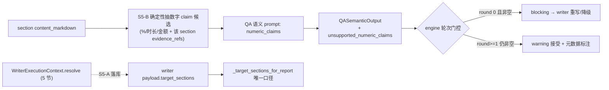

# E2E2-S5 QA factuality 成熟度

承接 E2E2 总纲 [.cursor/plans/E2E2_总纲_3f9c1a04.plan.md](.cursor/plans/E2E2_总纲_3f9c1a04.plan.md) 的 S5-1(E2E-003)/S5-2(E2E-010)。QA 反馈闭环已真实触发(blocking→writer redo→approve),本阶段补两处成熟度缺口:章节完整性口径不一致、数字结论无证据 entailment。

## 现状根因(代码确认,run_e279844fd270)

- **E2E-010 章节口径不一致**:[backend/app/service/qa/engine.py](backend/app/service/qa/engine.py):196 `_target_sections_for_report` 把 writer payload `sections`(=`request.sections`,常为空)+ plan_tree `focus_dimensions` + intake `focus_dimensions` **并集**成 9 个,喂给语义 prompt([engine.py](backend/app/service/qa/engine.py):470-477);但 writer 实际用 `WriterExecutionContext.resolve` 产出的 5 节(resolved target_sections **未落库**,[backend/app/agents/nodes/writer.py](backend/app/agents/nodes/writer.py):579-591 payload 只存 `request.model_dump()`)。LLM 据"9 mandatory"判 5/9 不达标打回;第 2 轮 loop-breaker([engine.py](backend/app/service/qa/engine.py):519-538)强制 accept → pass gate 不可解释。确定性 `rule_deep_report_covers_target_sections`([backend/app/service/qa/rules.py](backend/app/service/qa/rules.py):227)只在 deep 跑,quick run 不兜底。
- **E2E-003 数字无 entailment**:fast-path 规则([rules.py](backend/app/service/qa/rules.py):309)无任何数字-证据校验;语义 prompt 的 `faithfulness` 是定性维度([QA_SEMANTIC_SYSTEM_PROMPT](backend/app/service/llm/prompts.py):405),不查 28%/12%/1.5h 等数字是否被引用证据支持。`QASemanticOutput`([backend/app/schemas/agent_outputs_pipeline.py](backend/app/schemas/agent_outputs_pipeline.py):491)也无承载未支撑数字的字段。

## 方案(已与用户确认)

- E2E-003 entailment 机制:**混合**——确定性抽"带数字的 claim"候选,只把候选+其引用证据交 QA 语义 LLM 判 entailment,新增结构化字段 `unsupported_numeric_claims`。
- 严重度:**首轮 blocking 打回 writer、重试后仍不达标则降 warning 接受**(复用现有 loop-breaker 模式)。

## 切片 S5-A 章节口径单一化(E2E-010)

- Files:[backend/app/agents/nodes/writer.py](backend/app/agents/nodes/writer.py)(payload 增存 resolved `target_sections`)、[backend/app/service/qa/engine.py](backend/app/service/qa/engine.py)(`_target_sections_for_report` 优先读该键)、[backend/app/tests/test_qa_rules.py](backend/app/tests/test_qa_rules.py) 或新增 engine 测试
- Changes:
  - writer step payload 增 `target_sections` = `execution_context.target_sections`(实际写作契约,5 节),与 `request.sections` 区分。
  - `_target_sections_for_report` 改为:writer_step payload 有 `target_sections` 则**以它为唯一权威口径**,不再并入 plan_tree/intake focus(回落仅在缺失时保留)。确定性 deep 覆盖规则与语义 prompt 由此用同一集合。
  - 评估是否保留 loop-breaker:章节口径修正后首轮不应再因幻影章节误打回;loop-breaker 作为兜底保留但不应再被该问题触发。
- Verify:单测——writer payload 落 resolved target_sections;`_target_sections_for_report` 在有该键时返回 5 节而非 9;深报告覆盖率按 5 节计算。targeted QA 用例全绿。
- Done-when:QA 的"必需章节"= writer 实际产出契约,无幻影 mandatory。

## 切片 S5-B 数字 claim 混合 entailment(E2E-003)

- Files:新增 [backend/app/service/qa/](backend/app/service/qa) 数字抽取 helper、[backend/app/service/llm/prompts.py](backend/app/service/llm/prompts.py)(`QA_SEMANTIC_SYSTEM_PROMPT` 加 entailment 规则+schema 字段、`build_qa_semantic_user_prompt` 加 `numeric_claims`)、[backend/app/schemas/agent_outputs_pipeline.py](backend/app/schemas/agent_outputs_pipeline.py)(`QASemanticOutput` 加 `unsupported_numeric_claims` + `to_normalized_dict`)、[backend/app/service/qa/engine.py](backend/app/service/qa/engine.py)(抽取接线 + 轮次门控 + 元数据)、[backend/app/tests/test_qa_rules.py](backend/app/tests/test_qa_rules.py) / [backend/app/tests/test_agent_outputs.py](backend/app/tests/test_agent_outputs.py) + 新增 engine 测试
- Changes:
  - 确定性抽取:对每个 section 的 `content_markdown` 正则抽数字 claim(百分比 `\d+%`、时长 `\d+(\.\d+)?\s*(小时|h|hours|分钟|min)`、金额 `$/万/美元` 区间),与该 section 的 `evidence_refs`→证据 `sanitized_text` 配对;候选数设上限防 prompt 膨胀。无候选则跳过(LLM 不变)。
  - prompt:`build_qa_semantic_user_prompt` 增 `numeric_claims`(claim 文本 + section + 引用证据 quote_preview);`QA_SEMANTIC_SYSTEM_PROMPT` 增规则"对每条 numeric_claim 判断引用证据是否支持该数字(含可计算/换算),不支持的列入 unsupported_numeric_claims"。
  - schema:`QASemanticOutput` 加 `unsupported_numeric_claims: list[{claim, section_id, reason}]`(默认空),`parse_llm_content`/`to_normalized_dict` 同步。
  - engine 门控(轮次感知):语义结果含非空 `unsupported_numeric_claims` 时——`qa_rejection_count==0` → 语义判 blocking、`reject_to=writer`(重写为有据数字或降级区间/定性);`qa_rejection_count>=1` 仍非空 → 降 warning 接受(复用 [engine.py](backend/app/service/qa/engine.py):519-538 loop-breaker 思路),写入 `qa_semantic_*` 元数据供前端/报告标注"未经证据核实"。
  - (防御纵深,可选)writer prompt 提示数字须可由引用证据支撑,否则用区间/定性。
- Verify:单测——抽取器对 28%/1.5 小时/2.7万-3.2万美元正确产候选并配证据;`QASemanticOutput` 解析/normalize 含新字段;engine 在 round0 非空→blocking reject writer、round1 非空→warning accept。targeted QA/schema 用例全绿。
- Done-when:含无据数字的报告首轮被打回,重写后仍无据则降级标注,不再"伪通过"。

## 切片 S5-verify 纳入综合 E2E 检查点

- 不单跑端到端。纳入 S2→S6 综合真实 run 检查点:同一 report payload 重跑 QA 多次,required section 判断稳定一致(=writer resolved 5 节);含无据数字时首轮 blocking、重写后降级标注;无幻影"9 mandatory"。
- 每阶段单测全绿 + 原子提交,综合 E2E 失败可二分。回写 E2E2 总纲活文档(并把 S5 状态、与 loop-breaker 的关系记清)。

## 不做(YAGNI)

- 不做跨 section 的数字推导/计算校验引擎(只判"引用证据是否含/可换算该数字"),复杂统计推断超范围。
- 不移除现有 loop-breaker(作为兜底),只确保章节口径修正后不再被误触发。
- 不改 deep/quick 阈值与其它 fast-path 规则。
- 不为本阶段单独跑端到端 run。
