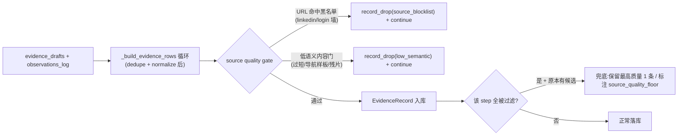

# E2E2-S6 来源质量门槛

承接 E2E2 总纲 [.cursor/plans/E2E2_总纲_3f9c1a04.plan.md](.cursor/plans/E2E2_总纲_3f9c1a04.plan.md) 的 S6-1(E2E-006)。这是 E2E2 最后一个阶段(P2)。证据数量已充足(243),本阶段提升证据有效性:挡掉登录墙/加载组件/低语义残片入库。

## 现状根因(代码确认 + 子代理调研 [Explore researcher snippet pipeline](aa8bd942-d8ab-46ec-a24c-efebd52bb0e1))

- **唯一入库点**:全库 `EvidenceRecord(...)` 仅在 [backend/app/agents/nodes/researcher.py](backend/app/agents/nodes/researcher.py):265 构造,`evidence_drafts` + `observations_log` 两源在 `_build_evidence_rows` 汇合 dedupe+normalize 后落库。是加统一 gate 的天然单点。
- **现有质量过滤只有一处且不全**:[backend/app/agents/tools/fetch_url.py](backend/app/agents/tools/fetch_url.py):99 `_validate_extracted_text`(最小 160 字 + 导航样板词 ≥3 且 <80 词)**仅对 fetch_url 生效**;`search_web`/`extract_structured` 无任何内容门。
- **无任何 URL/域名黑名单**:`infer_source_type`([backend/app/agents/tools/parse_page.py](backend/app/agents/tools/parse_page.py):13)只分类(`public_review`/`pricing_page`/...)不拒绝;无 linkedin/login 黑名单。故 LinkedIn 登录页(`Welcome back`/`Continue with Google`)、加载组件、`---` 表格残片、营销博客全部无过滤入库。
- **可观测机制现成**:`_build_evidence_rows` 内 `record_drop(reason)` + 返回 `dropped_reasons`([researcher.py](backend/app/agents/nodes/researcher.py):95-98,283-290),已落进 step payload `dropped_dimensions`;gate 拒绝可复用此机制写 `source_quality` 计数。
- **零证据兜底现状**:[researcher.py](backend/app/agents/nodes/researcher.py):376-382 `zero_evidence` → step `degraded` + `researcher_zero_evidence`。质量门若把某竞品全删会误触发 degraded,需兜底。

## 方案(已与用户确认)

- 范围:**URL/域名黑名单 + 统一低语义内容门**(把 fetch_url 的门抽出复用到所有 channel)。不对营销博客降权(YAGNI,blog 占比高、降权外溢多模块)。
- 命中动作:**硬过滤删除 + 零证据兜底**(过滤后归零的竞品保留兜底,不因质量门把整个竞品打成 degraded)。

## 切片 S6-A 统一低语义内容门(抽取复用)

- Files:新增 [backend/app/service/collector/](backend/app/service/collector) 下 source quality helper(如 `source_quality.py`)、[backend/app/agents/tools/fetch_url.py](backend/app/agents/tools/fetch_url.py)(改为复用)、[backend/app/agents/nodes/researcher.py](backend/app/agents/nodes/researcher.py)(入库点接线)、新增测试
- Changes:
  - 把 `_validate_extracted_text` 的判定逻辑(最小字数 `_MIN_EXTRACTED_TEXT_CHARS=160`、导航样板词集 `_NAVIGATION_WORDS`、`_WORD_PATTERN`)抽成可复用纯函数 `is_low_semantic_text(text) -> (bool, reason)`(返回判定 + 原因码,如 `too_short`/`navigation_boilerplate`),放 collector 公共模块。
  - 额外覆盖审计提到的残片:`---`/空表格/纯符号/加载组件文案(`Welcome back`/`Loading`/`Continue with`)。设计成可维护的样板短语集,判定基于 quote 文本。
  - fetch_url 改调共享函数(行为等价,raise ChannelError 保持);保证抽取不改变 fetch_url 现有语义(回归)。
- Verify(写码前定义):单测——共享函数对 160 字以下、导航样板、`---`、`Welcome back`/`Continue with Google` 判低语义,对正常 quote 判通过;fetch_url 现有测试不回归。
- Done-when:低语义判定单点化、对所有 channel 可用。

## 切片 S6-B 入库点 source quality gate + 零证据兜底

- Files:[backend/app/agents/nodes/researcher.py](backend/app/agents/nodes/researcher.py)(`_build_evidence_rows` gate + 兜底)、新增/扩展测试
- Changes:
  - URL 域名黑名单:在入库循环 normalize 后(`researcher.py`:257 之后)对 `source_url` 解析 host,命中黑名单(linkedin 登录页路径、已知 login/auth 墙)→ `record_drop("source_blocklist")` + `continue`。黑名单设为可维护常量集,基于 host/path 关键词(复用 `urlsplit` 模式)。
  - 低语义门:对 `quote_raw`/`sanitized_text` 调 S6-A 共享函数,命中 → `record_drop("low_semantic")` + `continue`。
  - 零证据兜底:gate 在循环内删候选;循环后若该 step `evidence_rows` 全空但 effective_drafts 原本非空(即"全被质量门删"而非"本就没采到"),保留兜底——按既定策略择优保留(如保留最长/最高 source_type 优先级的 1 条并在 span.metadata 标 `source_quality_floor=true`),避免错误触发 `researcher_zero_evidence` degraded。兜底逻辑要与现有 `zero_evidence` 判定([researcher.py](backend/app/agents/nodes/researcher.py):376)协调,区分"质量门归零"与"采集本就归零"。
  - drop 统计:`source_blocklist`/`low_semantic` 计数进返回的 `dropped_reasons` → step payload,可观测(答辩可展示过滤了多少噪声)。
- Verify(写码前定义):单测——给含 linkedin 登录 URL / `Welcome back` quote / `---` 残片 / 正常 evidence 的 drafts,断言噪声被 drop、正常保留、`dropped_reasons` 含 `source_blocklist`/`low_semantic` 计数;给"全噪声单竞品"断言兜底保留 1 条且不 degraded;给"本就零采集"断言仍正常 degraded。targeted researcher 用例全绿。
- Done-when:登录墙/加载组件/低语义残片不入库,过滤可观测,竞品不被质量门误打成零证据。

## 切片 S6-verify 纳入综合 E2E 检查点(全 6 阶段总验收)

- 不单跑端到端。S6 完成后,S2-S6 全部代码就绪,此处触发 **E2E2 唯一一次综合真实 Qwen E2E run**,一次性核对 E2E-001~010 全部:
  - S1:trace 模型分档、无 3 次长重试、grep 裸 `ep-`=0。
  - S2:conclusions ≥ 有证据 focus 维度数、Battlecard/ComparePage 非空。
  - S3:final markdown 裸 `ev_`=0(仅 `[ev_xxx]`)、无 `Insights: insight_`、RunView/Shared 引用可点。
  - S4:curator 不因 dimension_coverage=0 跳过、竞品集事件单口径。
  - S5:QA required section 稳定、无据数字首轮 blocking、重写后降级标注。
  - S6:抽样 evidence 无 LinkedIn 登录页/加载组件/`---` 残片,`dropped_reasons` 有 source_quality 计数,竞品不被误打零证据。
- 综合 run 前先把 S1-S6 拆原子提交(逐阶段 commit),综合 E2E 若失败可按 commit 二分。回写 E2E2 总纲活文档,标记全链路收口。

## 不做(YAGNI)

- 不做营销博客降权/可信度加权(blog 占比高,降权需下游 analyst/QA 配合,外溢多模块,超 E2E-006 范围)。
- 不做 channel 层早拒(统一放入库单点最干净;若后续要省 token 再加 channel 层早拒作为优化)。
- 不引入外部域名信誉库/第三方质量服务(无新依赖)。
- 不改 robots/限流/source_type 分类逻辑。
- 除最终综合 run 外,不为本阶段单独跑端到端。
