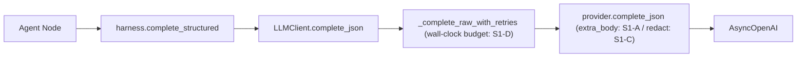

# E2E2-S1 LLM 可靠性与模型路由

承接 E2E2 总纲 [E2E2_总纲_3f9c1a04.plan.md](.cursor/plans/E2E2_总纲_3f9c1a04.plan.md) 的 S1-1(E2E-008 模型分档无差异)/S1-2(E2E-005 analyst 长重试)/S1-3(E2E-001 endpoint id 泄漏)。S5 已做的成熟重试(Retry-After + full jitter + 错误分类 + retryable 门控 + token-bucket)是本阶段的基线,不重做;本阶段在其上补 Qwen 真实分层、thinking 安全关闭、endpoint 脱敏、wall-clock 预算。

## 现状根因(代码确认)

- 模型分档空转(E2E-008):catalog `DOUBAO_MODEL_*` 全空,`routing.resolve_slot` 回落 `provider.default_model`(单 EP),全 slot 同一 lite。Qwen provider 此前未配置 key。
- thinking 阻断(本阶段新增约束):六 slot 全走 [providers.py](backend/app/service/llm/providers.py) `complete_json` → `_create_completion` 非流式 + `response_format=json_object`(L285-287);DashScope thinking-default 模型(qwen3.x-plus/max)强制 stream,非流式直接报错。
- endpoint 泄漏(E2E-001):[providers.py](backend/app/service/llm/providers.py) `_request_error_message(provider, model, exc)`(L149)把 `model={model}`(doubao 为 `ep-...`)嵌进消息,经 `_raise_request_error`(L227)进 `LLMRequestError`;`llm.provider.error` 结构化 `model=` 字段同样是 ep id(L344-351 等);消息再流到 [client.py](backend/app/service/llm/client.py) `fallback_reason`/`error`,持久化到 [llm_call.py](backend/app/models/llm_call.py) `error`/`fallback_reason`(Text,L39)。
- 重试无总预算(E2E-005):[client.py](backend/app/service/llm/client.py) `_complete_raw_with_retries`(L215-281)`range(max_retries+1)` 每次用满 slot read timeout(summarization 180s),无跨 attempt 累计预算 → 最坏 3×180s;且对耗满 read timeout 的 `timeout`/`connection` 失败原参数再长重试,低收益高耗时。backoff 已 full jitter、retryable 已门控(S5)。

## 调用链锚点

## 切片 S1-A 接通 Qwen + 解锁 thinking [已落地,待提交]

- Files:[backend/app/service/llm/providers.py](backend/app/service/llm/providers.py)、[backend/app/tests/test_llm_providers.py](backend/app/tests/test_llm_providers.py)
- Changes(已做):`_create_completion` 增 `extra_body` 形参并透传 `client.chat.completions.create`;`_OpenAICompatibleProvider._request_extra_body()` 默认 `None`;`QwenProvider._request_extra_body()` 返回 `{"enable_thinking": False}`(WHY:DashScope hybrid 模型 thinking-default 强制 stream,与非流式 JSON 互斥);主路径与 JSON-mode 回退路径均传 `extra_body`。
- Verify:`pytest tests/test_llm_providers.py -q` 断言 `captured["extra_body"] == {"enable_thinking": False}`。
- Done-when:任意 Qwen catalog 模型(含 qwen3.7-plus/max)在非流式 JSON 路径可用。**已满足**(smoke 实测 3.7-plus/max 正常出 JSON);测试 14 passed。

## 切片 S1-B 模型分档 catalog + A/B 验证 [已落地,待提交] — 解决 E2E-008

- Files:`backend/.env.dev`(本地未入仓)、[.env.example](.env.example)
- Changes(已做):`LLM_ACTIVE_PROVIDER=qwen`;`QWEN_API_KEY`(用户填)/`QWEN_BASE_URL`/`QWEN_DEFAULT_MODEL=qwen3.7-plus`;catalog strong=`qwen3.7-max`、balanced=`qwen3.7-plus`、fast=`qwen-flash`;`.env.example` 同步 `__REPLACE__QWEN_API_KEY__` 占位与档位名。
- Verify:容器重建后 `settings.LLM_ACTIVE_PROVIDER==qwen`、档位正确、`QWEN_API_KEY` 注入;smoke A/B 对比延迟/token/校准。
- Done-when:slot→tier→catalog 产生真实分层(analyst/writer=strong、research/qa=balanced、compression=fast)。**已满足**(smoke A/B 见总纲 §4.1)。

## 切片 S1-C endpoint id 脱敏 — 解决 E2E-001

- Files:[backend/app/service/llm/providers.py](backend/app/service/llm/providers.py)(`_request_error_message` L149、`llm.provider.error` 各 `model=`/`error_preview` 字段)、[backend/app/tests/test_llm_providers.py](backend/app/tests/test_llm_providers.py)
- Changes:新增 `_redact_model_id(model: str) -> str`,对部署式 id(`ep-` 前缀及同类不透明部署串)掩码为稳定可辨非敏形式(如 `ep-***` 或短 hash 尾)。单点应用于:(1)`_request_error_message` 构造的消息(根因,覆盖 `LLMRequestError` → client `error`/`fallback_reason` → DB `llm_calls.error`/`fallback_reason`);(2)`llm.provider.error` 结构化日志 `model=` 字段;(3)`error_preview`/`_status_error_body_snippet` 输出。Qwen 模型名(qwen3.7-x)非敏感,脱敏只命中部署式 id,不影响可读性。
- Verify(写码前定义):新增单测——给 `model="ep-sensitive-deployment-id"` 触发 provider 错误,断言 `LLMRequestError` 消息与 `llm.provider.error` 捕获字段均不含原始部署串;`pytest tests/test_llm_providers.py -q` 全绿。
- Done-when:原始部署 id 不出现在 provider 错误日志、`llm_calls.error`、`llm_calls.fallback_reason`;阶段 verify run 日志无原始部署 id。

实现结果:已新增 `_redact_model_id`/`_redact_deployment_model_ids`,覆盖 provider 异常消息、结构化 `llm.provider.error.model`、`error_preview` 和 status body snippet。Qwen/OpenAI 可读模型名不脱敏。目标测试已纳入总验收 `40 passed`。

## 切片 S1-D 重试 wall-clock 预算 + 条件重试 — 解决 E2E-005(断路器不做)

- Files:[backend/app/service/llm/client.py](backend/app/service/llm/client.py)(`_complete_raw_with_retries` L215-281)、[backend/app/core/config.py](backend/app/core/config.py)(新增预算配置 + validator)、[.env.example](.env.example)、`backend/.env.dev`、[backend/app/tests/test_llm_client.py](backend/app/tests/test_llm_client.py)
- Changes:
  - wall-clock 预算:跨 attempt 累计 `elapsed`;每次重试前若"已耗时 + 下次预期 timeout"超出该 slot 的重试总预算,则停止重试直接进 fallback(避免 3×180s)。预算来源用 slot timeout 派生(如 `slot_timeout * 预算因子`)或显式秒数,二选一在 implement 阶段定;配置加 validator(非负/正)。
  - 条件重试:对单次几乎耗满 read timeout(elapsed ≈ slot_timeout)且 `error_class ∈ {timeout, connection}` 的失败,不再以相同长 timeout 重试(直接 break 转 fallback)。429/5xx 等仍按 S5 成熟重试 + Retry-After/jitter。
  - 不引入断路器、不引入新依赖。
- Verify(写码前定义):新增单测——模拟连续 timeout 失败,断言总耗时受 wall-clock 预算约束(显著小于 `(max_retries+1)*timeout`)且更快到达 fallback;现有 429/Retry-After/non-retryable/jitter 用例保持绿。
- Done-when:analyst 类长 slot 单次业务调用最坏耗时被预算钉死;`pytest tests/test_llm_client.py tests/test_llm_providers.py -q` 全绿。

实现结果:新增 `LLM_RETRY_WALL_CLOCK_BUDGET_FACTOR=1.15` 与 validator;`_complete_raw_with_retries` 在每次重试前检查总预算,并对接近 read timeout 的 timeout/connection 失败直接停止同参数重试。结构化 `llm.call.retry` 增加 `will_retry`、`retry_stop_reason`、`retry_budget_seconds`。目标测试已覆盖 exhausted timeout 与 budget exceeded 两条路径。

## 切片 S1-verify 阶段验收 + 回写

- 绿基线:动手前跑目标域全绿快照作 parity 锚(`test_llm_client`/`test_llm_providers`/`test_llm_routing`);既有 `test_phase3_events.py::test_tool_exec_*`(`research_topic` KeyError)正交,单独评估不混入。
- 真实 Qwen E2E run:trace 中 analyst/writer=`qwen3.7-max`、research/qa=`qwen3.7-plus`、compression=`qwen-flash`(E2E-008 分层成立);analyst 不再 3 次长重试(E2E-005);run 日志与 `llm_calls.error/fallback_reason` 不含原始部署 id(E2E-001)。
- 回写:结果写入 E2E2 总纲活文档增补段;S1-A/B/C/D 一刀一原子提交(S1-A/B 当前未提交,作为 S1-C 前 baseline 提交);staged secret scan 通过。

当前状态:代码级 S1-A/B/C/D 已完成;目标域 pytest `tests/test_llm_client.py tests/test_llm_providers.py tests/test_llm_routing.py -q` = `40 passed`。剩余仅真实 Qwen E2E run 复验与提交策略。

## 不做(YAGNI)

- per-provider 断路器(Qwen 可靠,超出当前根因)。
- replay 基础设施(用真实 E2E run 验收替代)。
- analyst/QA 流式 thinking(独立 epic,需评测先证伪"推理深度不足")。
- 不改 S5 已稳定的 Retry-After/jitter/token-bucket 机制,仅在其上加 wall-clock 预算与条件重试。
