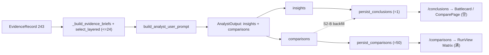

# E2E2-S2 Analyst 产出质量

承接 E2E2 总纲 [E2E2_总纲_3f9c1a04.plan.md](.cursor/plans/E2E2_总纲_3f9c1a04.plan.md) 的 S2-1(E2E-004)。目标:report 正文已能贴合场景,但结构化产品视图(Battlecard / 全局 ComparePage)因 conclusions 稀疏而空。本阶段把 analyst 的 conclusions 密度提到"每个有证据的 focus 维度至少 1 条",且全程 grounded、不臆造。

## 现状根因(代码确认,run_e279844fd270:conclusions=1 / comparison cells=50)

- **prompt 不对称**:[prompts.py](backend/app/service/llm/prompts.py):375 对 comparisons 明确"per focus dimension … create one group";但 insights 规则(:374)只要求"每条 insight 引 evidence",无 per-dimension 下限 → LLM 大量产 comparison cell、极少产 insight。
- **insight 受证据约束更紧 + 素材被截**:[agent_outputs.py](backend/app/schemas/agent_outputs.py):70 `AnalystInsight.evidence_ids` `min_length=1`(insight 必须有证据),而 [agent_outputs.py](backend/app/schemas/agent_outputs.py):101 ComparisonCell 允许 `stance=unknown` 且 `evidence_ids=[]`;同时 [prompts.py](backend/app/service/llm/prompts.py):467 `EVIDENCE_BRIEF_PROMPT_LIMIT=24` + `select_layered_evidence_briefs`(:477)把 243 条证据按 (competitor,dimension) 去重截到 24 → insight 可用 grounding 素材稀薄。
- **conclusions 仅来自 insights**:[analyst.py](backend/app/agents/nodes/analyst.py):255 `persist_conclusions_for_step` ← `analysis_insights`(insights);[conclusion/mapper.py](backend/app/service/conclusion/mapper.py):65 每条 insight → 1 conclusion。comparison cells(富)从不回流成 conclusions。故 conclusions == 存活 insight 数 == 1。
- **下游依赖**:Battlecard 与 `/app/compare` 消费 `/conclusions`(`load_conclusions_for_run`);RunView 的 ComparisonMatrix 用 `/comparisons`(`load_comparisons_for_run`,50 cells)不受影响。
- **out_of_focus=218(记录,本阶段不主修)**:focus_dimensions(5)< 证据原始维度(9),[analyst.py](backend/app/agents/nodes/analyst.py):50 `_build_evidence_briefs` 对越界维度 `normalize_dimension_or_none` 置 None,insight/comparison 解析丢弃越界维度。属维度 taxonomy 对齐,见 §问题条目 S2-2。

## 数据流锚点

## 问题条目

- E2E2-S2-1 [质量] conclusions 过薄(E2E-004):见上根因,S2-A + S2-B 解决。
- E2E2-S2-2 [数据一致性] out_of_focus 维度损耗(218):focus 维度集窄于研究采集维度。本阶段仅在 verify 记录数值;若密度问题已被 A/B 解决则将维度对齐归入 E2E2-S4 一并处理(避免与 discovery/维度覆盖重复改)。

## 切片 S2-A Analyst prompt 对称化 + 证据预算放宽

- Files:[backend/app/service/llm/prompts.py](backend/app/service/llm/prompts.py)(`ANALYST_SYSTEM_PROMPT` rules、`build_analyst_user_prompt` 收尾指令、analyst 证据预算常量)、analyst prompt 单测([backend/app/tests](backend/app/tests) 下对应文件,实现时确认命名)
- Changes:
  - insight 规则对称化:新增 "Produce at least one insight per focus dimension that has grounded evidence; each finding should be cross-competitor where evidence allows"(与 comparisons 的 per-dimension 指令对齐);`build_analyst_user_prompt` 收尾指令同步强调每维至少一条。
  - 证据预算:为 analyst(summarization slot,strong=qwen3.7-max 长上下文)使用比全局 24 更大的 brief 预算(参数化,不动其它 slot 的默认 24),保留 `select_layered_evidence_briefs` 的 (competitor,dimension) 分层选择以保证维度铺开。
  - 不改 schema 的 evidence 硬约束(insight 必须 grounded 是 No-fabrication 红线,保留)。
- Verify(写码前定义):prompt 单测断言 ANALYST_SYSTEM_PROMPT 含 per-dimension insight 规则、analyst 证据预算 > 24;`pytest` 相关 analyst/prompt 用例全绿。
- Done-when:prompt 与证据预算支持每个有证据维度产出 insight。

实现结果:已新增 `ANALYST_EVIDENCE_BRIEF_PROMPT_LIMIT=80`;`build_analyst_user_prompt` 使用 analyst 专用预算,QA/writer 等路径仍使用默认 24。`ANALYST_SYSTEM_PROMPT` 与 analyst user prompt 均明确"每个有 grounded evidence 的 focus dimension 至少一条 insight"。`test_prompt_evidence_selection.py` 覆盖规则与预算。

## 切片 S2-B conclusions 从 comparison 确定性 backfill

- Files:新增 [backend/app/service/conclusion/](backend/app/service/conclusion) 下 backfill helper(如 `comparisons_to_conclusions`)、[backend/app/agents/nodes/analyst.py](backend/app/agents/nodes/analyst.py)(persist 后接线)、[backend/app/tests](backend/app/tests) 新增用例
- Changes:
  - 新增确定性映射:对每个"有 comparison 覆盖但无 insight-conclusion"的 focus 维度,从该维 cells 合成 1 条 conclusion——claim 为模板化维度级综合(严格取自 cell 的 stance/summary,如"在 {dimension} 维度,{leader} 领先、{laggard} 落后",不引入新事实);`competitor_ids` = cells 竞品并集;`evidence_ids` = cells 证据并集(仅 grounded);`confidence` 由证据覆盖度推导。
  - No-fabrication:全部 cell 均 `stance=unknown` 或无 evidence 的维度跳过,不产 conclusion。
  - analyst.py 在 `persist_conclusions_for_step`(insights)之后调用 backfill,合并去重(insight 已覆盖的维度不重复 backfill),在 step payload 记录 `conclusions_backfilled_count`。
- Verify(写码前定义):单测——给跨 N 维 comparisons + 0 insights,断言持久化 conclusions ≥ N 且均 grounded;全 unknown 维度被跳过;insight 已覆盖维度不重复。targeted analyst/conclusion 用例全绿。
- Done-when:conclusions 数 ≥ 有证据/有 comparison 的 focus 维度数;Battlecard 与 ComparePage 非空。

实现结果:已在 `service.conclusion.mapper` 新增 `comparisons_to_conclusions`,复用 comparison mapper 的 stance/evidence 规范化;仅非 unknown 且有 evidence 的 cells 可回填。`persist_comparison_conclusions_for_step` 写入 `conclusions` 和 `conclusion_evidence`;`analyst.py` 在 insight conclusions 后按 uncovered sections 回填,并在 step payload 记录 `insight_conclusions_persisted_count`、`comparison_conclusions_backfilled_count`、总 `conclusions_persisted_count`。

## 切片 S2-verify 真实验收 + 回写

- 绿基线:动手前跑 analyst/conclusion/comparison 域 targeted 全绿快照作 parity 锚。
- 真实 Qwen E2E run:conclusions ≥ 有证据 focus 维度数;`/conclusions` 非空 → Battlecard、`/app/compare` 有内容;`/comparisons` RunView matrix 不回归;记录本 run `out_of_focus` 数值。
- 回写:结果写入 E2E2 总纲活文档;若 out_of_focus 仍偏高,在总纲把 E2E2-S2-2 归入 S4 维度对齐。一刀一原子提交,staged secret scan 通过。

当前代码级验证:

- `pytest tests/test_prompt_evidence_selection.py tests/test_agent_outputs.py tests/test_conclusion_mapper.py tests/test_conclusions_persistence.py tests/test_comparison_mapper.py tests/test_comparison_persistence.py tests/test_writer_llm.py -q` = `43 passed`。
- `pytest tests/test_smoke.py::test_reset_to_analyst_regenerates_conclusions -q` = `1 passed`。
- 剩余:真实 Qwen E2E run + 前端 Battlecard/ComparePage 复验。

## 不做(YAGNI)

- 不放松 insight 的 evidence 硬约束(No-fabrication 红线)。
- 不在本阶段重做维度 taxonomy 对齐(out_of_focus 归 S4,除非阻塞密度)。
- 不改 RunView ComparisonMatrix/`/comparisons` 路径(本就正常)。
- backfill 只做确定性结构化,不二次调用 LLM 生成结论(避免成本与臆造风险)。
