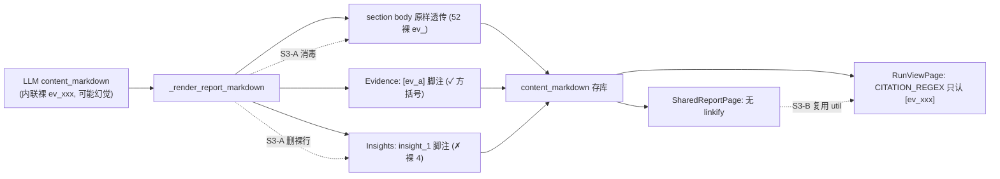

# E2E2-S3 报告渲染卫生

承接 E2E2 总纲 [E2E2_总纲_3f9c1a04.plan.md](.cursor/plans/E2E2_总纲_3f9c1a04.plan.md) 的 S3-1(E2E-009)。报告正文已能贴合场景(S2 在改结论密度),但渲染层把内部 ID 暴露进正文、且引用交互断裂。本阶段统一 citation 契约,使每个 `ev_` 只以前端可识别的 `[ev_xxx]` 出现、无裸 `insight_x`,引用可点。

## 现状根因(代码确认,run_e279844fd270:ev_ 52 / [ev_] 0 / insight_ 4)

三层 citation 契约不一致,任一层都漏:

- **L1 LLM 正文(主泄漏 52)**:[prompts.py](backend/app/service/llm/prompts.py) `WRITER_SYSTEM_PROMPT`(:436 "Every section must cite evidence_refs")与 `build_writer_user_prompt`(:1022 "Write a battlecard with grounded evidence refs")只要求"引用",未规定格式 → LLM 把裸 `ev_xxx` 内联进 `content_markdown` 散文。[writer.py](backend/app/agents/nodes/writer.py):387-398 `_render_report_markdown` 原样透传 `content_markdown`,不消毒。且这些内联 id **绕过 schema**:[agent_outputs.py](backend/app/schemas/agent_outputs.py):408-429 只过滤 `evidence_refs` 字段、不查正文 → 内联可能是幻觉 id。
- **L2 序列化器脚注(裸 insight 4)**:[writer.py](backend/app/agents/nodes/writer.py):414 `"Insights: " + ", ".join(insight_refs)` 直接吐 `insight_1, insight_2` 裸文本。证据脚注(:405-407 `Evidence: [ev_a], [ev_b]`)反而是对的方括号形式。
- **L3 前端契约**:[RunViewPage.tsx](frontend/src/pages/RunViewPage.tsx):31 `CITATION_REGEX = /\[(ev_[a-zA-Z0-9_]+)\]/g` 只认 `[ev_xxx]` → 裸 `ev_xxx`/`insight_x` 不被 linkify,显示为丑陋纯文本。且 [SharedReportPage.tsx](frontend/src/pages/marketing/SharedReportPage.tsx):32-34 直接 `ReactMarkdown` 渲染 `content_markdown`,**未调 `toCitationLinkMarkdown`** → 营销分享页连 `[ev_xxx]` 都显示成纯文本。

## 数据流锚点

## 问题条目

- E2E2-S3-1 [质量] Writer 把内部 ID 泄进报告正文(E2E-009):见三层根因。S3-A 后端确定性消毒(保证层)+ S3-B prompt 契约与前端共享 linkify(防御纵深 + 渲染一致)。

## 切片 S3-A 后端确定性 citation 消毒(保证层)

- Files:[backend/app/agents/nodes/writer.py](backend/app/agents/nodes/writer.py)(`_render_report_markdown` + 调用点传入 allowed evidence ids)、新增/就近放置 citation 归一化 helper、[backend/app/tests/test_writer_llm.py](backend/app/tests/test_writer_llm.py)(或新增渲染单测文件,实现时确认)
- Changes:
  - 正文归一化:渲染 `content_markdown` 前,对裸 `ev_[A-Za-z0-9_]+`(未被 `[]` 包裹)做处理——id ∈ allowed_evidence_ids 则包成 `[ev_xxx]`;已是 `[ev_xxx]` 的不二次包裹;**幻觉 id(不在 allowed 集)剔除**(避免死链/伪引用)。
  - 移除正文裸 insight 行:删 `Insights: insight_x` 脚注(insight_ref 仍保留在 `content_json` 供溯源/调试,不进 markdown 正文);保留 `Evidence: [ev_xxx]` 脚注(已合规)。
  - 把 `allowed_evidence_ids` 传入 `_render_report_markdown`(当前签名只收 report_content)。
  - fallback 报告路径:[writer.py](backend/app/agents/nodes/writer.py):301-318 正文不内联 ev_(用 finding/quote_preview),消毒对其为 no-op,确认不回归。
- Verify(写码前定义):单测——给含内联裸 `ev_`(合法+幻觉)与 `insight_` 的 report_content,断言渲染后正文裸 `ev_`=0、合法 id 变 `[ev_xxx]`、幻觉 id 被剔除、无 `Insights: insight_` 行、`Evidence: [ev_xxx]` 仍在。targeted writer 用例全绿。
- Done-when:无论 LLM 怎么写,落库 markdown 的 `ev_` 只以 `[ev_xxx]` 出现、无裸 insight。

## 切片 S3-B writer 引用契约 + 前端共享 linkify

- Files:[backend/app/service/llm/prompts.py](backend/app/service/llm/prompts.py)(`WRITER_SYSTEM_PROMPT`、`build_writer_user_prompt`)、新增 [frontend/src/lib](frontend/src/lib) 共享 linkify util、[frontend/src/pages/RunViewPage.tsx](frontend/src/pages/RunViewPage.tsx)、[frontend/src/pages/marketing/SharedReportPage.tsx](frontend/src/pages/marketing/SharedReportPage.tsx)
- Changes:
  - prompt 契约(防御纵深):明确 "cite evidence inline only as [ev_xxx] using ids from allowed_evidence_ids; never emit bare ev_xxx or insight_x in content_markdown"。降低对消毒层的依赖,但消毒层仍是唯一硬保证。
  - 前端:把 `CITATION_REGEX` + `toCitationLinkMarkdown` 抽到共享 util(单一正则来源),`RunViewPage` 改为引用 util,`SharedReportPage` 接上同一 linkify(分享页引用也可识别)。
- Verify:prompt 单测断言 writer prompt 含 `[ev_xxx]` citation 契约;`npm run type-check`(frontend 无测试 runner,广改时另跑 `npm run build`)。
- Done-when:两个报告渲染页共用一套 linkify,prompt 显式约束引用格式。

## 切片 S3-verify 纳入综合 E2E 检查点

- 不为本阶段单独跑端到端(分析一次约 20 分钟)。S2→S6 共享同一次分析 run 的产物,合并到一次综合 E2E 检查点统一验收。
- 检查点断言(届时):final markdown grep 裸 `ev_`(非 `[ev_`)=0、无 `Insights: insight_` 裸文本;RunView 与 Shared 报告引用均渲染为可点链接;report 章节/evidence 不回归。
- 每阶段单测全绿 + 原子提交,保证综合 E2E 若失败可按 commit 二分。
- 回写:结果写入 E2E2 总纲活文档。

## 不做(YAGNI)

- 不把脚注/参考文献的完整渲染搬进后端(脚注交互归前端渲染层,后端只保证 id 格式合规)。
- 不改 `evidence://` 协议或 EvidenceDrawer 跳转逻辑(本就工作)。
- 不为 insight 引入前端可点 linkify(insight_ 是内部 id,正文不暴露即可;如需展示走结构化 conclusions 视图,非本阶段)。
- 不单独为本阶段跑端到端 run。
