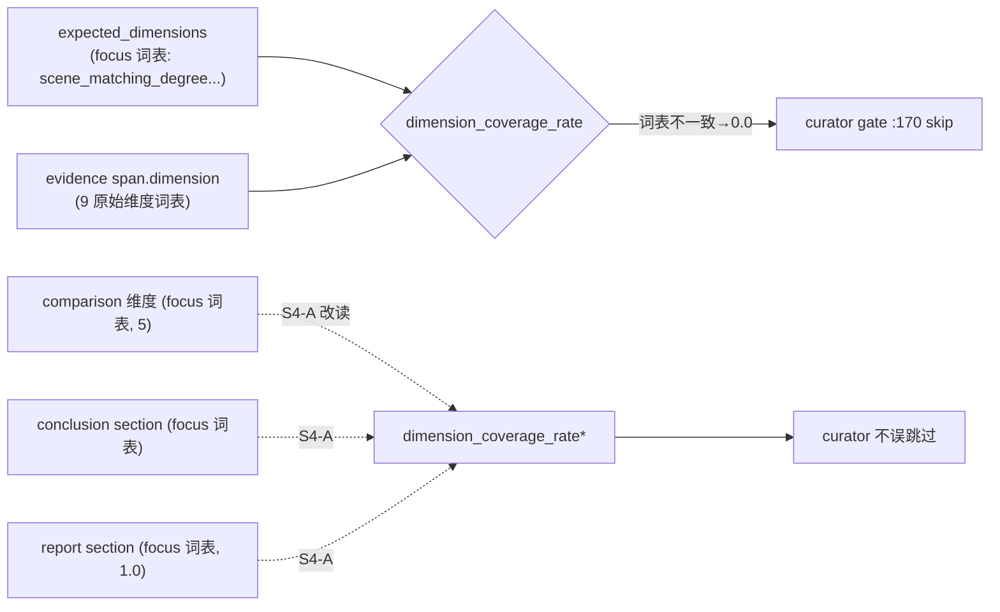

# E2E2-S4 可观测与指标对齐

承接 E2E2 总纲 [E2E2_总纲_3f9c1a04.plan.md](.cursor/plans/E2E2_总纲_3f9c1a04.plan.md) 的 S4-1(E2E-002)/S4-2(E2E-007)。系统可观测性整体是强项(step/decision/llm_calls/structured logs 能串 run_id),本阶段只修两处**口径错位**:一个让自进化闭环失效(curator 误跳过),一个让 trace 复盘自相矛盾(竞品 cap 日志 vs 实际研究数)。

## 现状根因(代码确认,run_e279844fd270)

- **E2E-002 dimension coverage 选错信号源**:[metrics/engine.py](backend/app/service/metrics/engine.py):184-219 `dimension_coverage_rate` 的分子是 `expected_dimensions`(来自 [engine.py](backend/app/service/metrics/engine.py):61 plan_tree tasks `focus_dimensions`,回落 supervisor decisions)与 evidence `span["dimension"]`(:54 `_extract_dimension`)的交集;但二者**词表不一致**——focus 是报告维度(`scene_matching_degree` 等),evidence span 是 9 个原始采集维度。交集≈空 → `covered_dimension_count=0` → `dimension_coverage_rate=0.0`。同源于 analyst `out_of_focus=218`(evidence 词表 ≠ focus 词表)。而同结构的 `report_section_coverage_rate`(:222-230 用 report sections vs writer target sections,**同词表**)=1.0。
- **E2E-002 闸门**:[skill_curator/tasks.py](backend/app/service/skill_curator/tasks.py):170 `dimension_coverage_rate < CURATOR_MIN_DIMENSION_COVERAGE_RATE` → skip reason `dimension_coverage_rate_below_threshold`,成功样本不进技能沉淀,S6 自进化闭环失效。
- **E2E-007 竞品 cap 口径并存**:[planner.py](backend/app/agents/nodes/planner.py):147-154 `discovery_capped` 日志的 `dropped_competitors` 来自 `discovered_competitors[MAX_RESEARCH_COMPETITORS:]`,但 cap 只作用于 reconcile **新增**的 research task([planner.py](backend/app/agents/nodes/planner.py):155-157 `existing_research` 跳过);本 run 实际研究覆盖 10 竞品、243 evidence。日志口径(cap=8 dropped X/Y)与实际研究口径(10)并存,答辩复盘自相矛盾。

## 数据流锚点

## 问题条目

- E2E2-S4-1 [可观测/成熟度] curator dimension coverage 口径误判(E2E-002):S4-A 改度量信号源。
- E2E2-S4-2 [可观测] discovery cap 口径不一致(E2E-007):S4-B 发竞品集统一事件。
- (关联)S2-2 out_of_focus=218 与 E2E-002 同源(evidence↔focus 词表错位)。本阶段以"度量改读下游 focus 同词表信号"绕开,不在此做 evidence 采集词表的 taxonomy 对齐(更大改动,YAGNI;若综合 E2E 显示仍阻塞再单列)。

## 切片 S4-A curator dimension coverage 口径修正

- Files:[backend/app/service/metrics/engine.py](backend/app/service/metrics/engine.py)(snapshot 计算 + 增载 comparison/conclusion 维度)、[backend/app/service/skill_curator/tasks.py](backend/app/service/skill_curator/tasks.py)(确认 gate 读新口径,阈值不动)、[backend/app/tests/test_run_metrics.py](backend/app/tests/test_run_metrics.py) 与 [backend/app/tests/test_skill_curator_tasks.py](backend/app/tests/test_skill_curator_tasks.py)
- Changes:
  - `dimension_coverage_rate` 重定义:分子 = expected_dimensions(focus)中被**下游 focus 同词表产物**覆盖的数量,信号源为 comparison cell 维度 ∪ conclusion section ∪ report section_id(均与 focus 同词表);分母仍为 expected_dimensions(无 expected 时回落实际产出维度集)。不再用 evidence `span["dimension"]` 充当 focus 覆盖证据。
  - snapshot 增载:`build_run_metrics_snapshot`/`load_run_metrics_snapshot` 读 ComparisonCellRecord 维度(已有 [comparison/persistence.py](backend/app/service/comparison/persistence.py) `load_comparisons_for_run`)与 ConclusionRecord section(`load_conclusions_for_run`),传入计算。保留 evidence-by-dimension 计数字段(诊断用),只改 coverage 口径。
  - curator gate 不改阈值,仅受益于修正后的 rate。
- Verify(写码前定义):metrics 单测——给 expected=focus、comparison/report 覆盖全部 focus、evidence span 用不同词表,断言 `dimension_coverage_rate>0`(达 1.0);curator skip 单测——同 snapshot 下不再返回 `dimension_coverage_rate_below_threshold`。targeted metrics/curator 用例全绿。
- Done-when:focus 维度被下游真实覆盖的成功 run,`dimension_coverage_rate` 反映真实覆盖,curator 不误跳过。

## 切片 S4-B 竞品集口径统一

- Files:[backend/app/agents/nodes/planner.py](backend/app/agents/nodes/planner.py)(reconcile 事件)、[backend/app/tests/test_plan_reconcile.py](backend/app/tests/test_plan_reconcile.py)
- Changes:
  - reconcile 后对"最终将进入研究的竞品集"发**单一权威事件/日志**(一处定义 kept / dropped / actual researched),让 trace 只有一个竞品集口径。
  - `discovery_capped` 与实际研究集对齐:或并入上面的统一事件,或修正其 `dropped_competitors` 语义使其反映真实未研究集(observability-only,不改 cap 行为本身)。
- Verify:`test_plan_reconcile` 断言统一事件的竞品集与 reconcile 后实际 research task 集一致,无第二口径。
- Done-when:trace 中竞品 cap/实际研究为单一口径。

## 切片 S4-verify 纳入综合 E2E 检查点

- 不单跑端到端。纳入 S2→S6 综合真实 run 检查点:
  - curator:真实成功 run 后不再因 `dimension_coverage_rate=0` 跳过,进入候选生成(或给出非 coverage 的合理 skip 理由)。
  - 竞品集:统一事件竞品数与 evidence/researcher steps 覆盖竞品数一致。
- 每阶段单测全绿 + 原子提交,综合 E2E 失败可二分。回写 E2E2 总纲活文档。

## 不做(YAGNI)

- 不做 evidence 采集层的 dimension taxonomy 对齐(把 span 词表统一到 focus);本阶段用度量改读下游信号绕开,taxonomy 重构超出 E2E-002 范围。
- 不改 discovery 实际 cap 行为(MAX_RESEARCH_COMPETITORS 语义),只统一观测口径。
- 不动 curator 阈值与其它 coverage 指标定义(coverage_rate / report_section_coverage_rate 正常)。
- 不为本阶段单独跑端到端 run。
