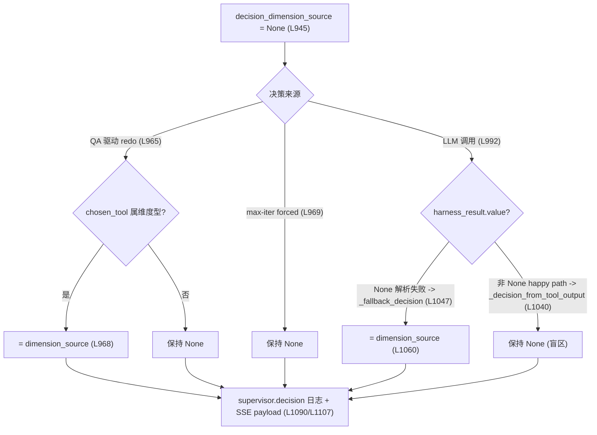

# E2E-S1 可观测卫生(enabler)

对应一级总纲 [`.cursor/plans/e2e_debug_closure_index_9b2a1f0c.plan.md`](.cursor/plans/e2e_debug_closure_index_9b2a1f0c.plan.md) 的 todo `E2E-S1`,覆盖问题 `E2E-S1-1`(日志噪声)与 `E2E-S1-2`(dimension_source 仪表盲区)。本 plan 只做两处代码改动 + 验证;build 通过且无错后,再由一级总纲把 `E2E-S1` 标记完成(Layer-1 动作,不在本 plan 内执行)。

## 背景根因(已确证)

### E2E-S1-1 第三方日志噪声

[`backend/app/utils/logger.py`](backend/app/utils/logger.py) 的压制清单只覆盖 LLM/HTTP 客户端:

```14:20:backend/app/utils/logger.py
_HTTP_CLIENT_LOGGER_NAMES = (
    "openai",
    "httpx",
    "httpcore",
    "httpcore.http11",
    "httpcore.connection",
)
```

漏了两个噪声源:
- `readability` —— [`backend/app/agents/tools/parse_page.py`](backend/app/agents/tools/parse_page.py) 第 6 行 `from readability import Document`,其 `readability.readability` logger 在 DEBUG 下输出 `Removing unlikely candidate` / `Branch ... link density` / `Top 5` 等数百行 DOM 解析 spam。
- `urllib3` —— Tavily/requests 底层连接日志 `Starting new HTTPS connection` / `"POST /search HTTP/1.1" 200`。

dev `LOG_LEVEL=DEBUG` → root logger DEBUG;两者 logger 级别 NOTSET,继承 root 全量直冲 stdout,淹没 structlog JSON。

### E2E-S1-2 dimension_source 仪表盲区

[`backend/app/agents/nodes/supervisor.py`](backend/app/agents/nodes/supervisor.py) `supervisor_node` 的赋值逻辑:



happy path(`_decision_from_tool_output`,656-657 行)直接用 LLM 的 `output.tool_args`,维度由 LLM 选定,不走 `_resolve_fallback_dimensions`,故 `dimension_source` 恒 None。`FocusDimensionSource` 当前仅 fallback 链取值:

```66:66:backend/app/agents/nodes/supervisor.py
FocusDimensionSource = Literal["upstream_task", "intake", "hints", "default"]
```

## 刀 E2E-S1-A:第三方日志降噪

文件:[`backend/app/utils/logger.py`](backend/app/utils/logger.py)、[`backend/app/tests/test_logger_utils.py`](backend/app/tests/test_logger_utils.py)

- `_HTTP_CLIENT_LOGGER_NAMES` 追加 `"urllib3"`(真 HTTP 客户端,语义一致)。
- 新增独立常量 `_NOISY_THIRD_PARTY_LOGGER_NAMES = ("readability",)`(DOM 解析库,非 HTTP,避免污染 HTTP 命名),在 `_configure_third_party_loggers()`(62-69 行)内统一 `setLevel(logging.WARNING)`。
  - 用固定 WARNING 而非复用 `HTTP_CLIENT_LOG_LEVEL`:readability 无 INFO 级有效信号,且不希望调 HTTP 日志档位时把 DOM spam 带回来。
- 设父 logger(`"readability"` / `"urllib3"`)即可借层级 effective-level 继承覆盖 `readability.readability` / `urllib3.connectionpool` 等子 logger,无需枚举子名。

Verify:
- 扩 `test_logger_utils.py`:调 `configure_logging()` 后断言 `logging.getLogger("readability").getEffectiveLevel() >= logging.WARNING` 与 `logging.getLogger("urllib3").getEffectiveLevel() >= logging.WARNING`。

Done-when:
- 一次 deep run 的 stdout 只剩 structlog JSON + 必要 access log,无 `Removing unlikely candidate` / `Starting new HTTPS connection` 行。

## 刀 E2E-S1-B:dimension_source happy-path 归因

文件:[`backend/app/agents/nodes/supervisor.py`](backend/app/agents/nodes/supervisor.py)、[`backend/app/tests/test_supervisor_batch.py`](backend/app/tests/test_supervisor_batch.py)

方向(成熟做法:让 `dimension_source` 在每条"维度型决策"上稳定可读,而非只在 fallback 路径):
- `FocusDimensionSource` 扩一个取值 `"llm_tool_output"`,语义升级为"本决策所用 focus dimensions 的来源"(LLM 直选 vs fallback 链某档)。
- happy-path 分支(1040-1046,`harness_result.value is not None`)在构建 `decision` 后,对维度型工具补赋:

```python
if decision.chosen_tool in {"ConductResearch", "ConductResearchBatch", "Analyze", "Write"}:
    decision_dimension_source = "llm_tool_output"
```

  与 QA 分支(967 行)同一工具集合,保持一致心智。
- 非维度型工具(`DiscoverCompetitors` / `Finalize` / max-iter forced finalize)保持 `None`,这是预期(它们不涉及维度),在 plan 与代码注释中说明,DoD 的"明确文档化哪些路径不产出维度"由此满足。
- 日志/事件埋点(1090、1107 行)无需改,字段名 `dimension_source` 不变 → 对前端/SSE 消费者纯 additive,不破坏合同。

Verify:
- 扩 `test_supervisor_batch.py`:构造 happy-path(harness 返回有效 `SupervisorToolCallOutput`,chosen_tool=ConductResearchBatch)的 supervisor_node 调用,断言记录的 `dimension_source == "llm_tool_output"`;并保留一条 DiscoverCompetitors/Finalize 断言 `dimension_source is None`。

Done-when:
- 真实 deep run 中维度型 `supervisor.decision` 的 `dimension_source` 非 null;非维度型为 null 且有文档解释。

## 阶段验证

- docker 定向:`docker compose -f backend/docker-compose.dev.yml exec -T rivallens_api pytest tests/test_logger_utils.py tests/test_supervisor_batch.py -q`。
- 一次 deep run(复跑同类请求)抽检 stdout:DOM/连接噪声消失、维度型决策 `dimension_source` 非空。
- 两刀均 green 后,更新一级总纲 `E2E-S1` todo 状态(Layer-1 动作)。

### 验证记录

- 2026-06-06:定向 pytest 已过:`14 passed in 1.11s`。
- 2026-06-06:真实 run 抽检曾发起,但撞上 uvicorn reload 等待旧连接关闭,命令 10 分钟超时;DB 未出现新 run 记录。已重启 `rivallens_api`,服务恢复 `healthy`。`s1-verify` 与一级 `E2E-S1` 暂不标 completed,待下一轮补真实 run 抽检。

## 不做

- 不重命名 `dimension_source` 字段(避免破坏 SSE/前端合同;改为扩值)。
- 不新增 HTTP 日志档位配置项;readability 固定 WARNING(YAGNI)。
- 不验证 LLM tool_args 维度是否等于 plan_task 维度(超出 P3 仪表范围,如需归属后续 S3 证据链)。
- 不动 S2-S6 任何代码。
