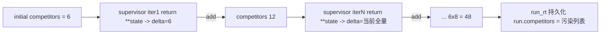

# E2E-S2 状态/API 合同

对应一级总纲 [`.cursor/plans/e2e_debug_closure_index_9b2a1f0c.plan.md`](.cursor/plans/e2e_debug_closure_index_9b2a1f0c.plan.md) 的 todo `E2E-S2`,覆盖 `E2E-S2-1`(competitors 重复膨胀,P1)与 `E2E-S2-2`(API JSON UTF-8,P3)。build 通过且无错后,由一级总纲把 `E2E-S2` 标完成(Layer-1 动作)。

## 根因(已确证)

### E2E-S2-1 competitors 膨胀 = `**state` 回吐 operator.add 字段

[`backend/app/agents/state.py`](backend/app/agents/state.py) 把 4 个列表字段标了累加 reducer:

```25:53:backend/app/agents/state.py
    competitors: Annotated[list[str], operator.add]
    discovered_competitors: Annotated[list[str], operator.add]
    ...
    researched_competitors: Annotated[list[str], operator.add]
    ...
    follow_up_queue: Annotated[list[FollowUpRequest], operator.add]
```

LangGraph 对 reducer 字段的语义是:节点返回值即 delta,`reducer(existing, delta)`。节点用 `return {**state, ...}` 会把当前完整列表当 delta 回吐,被 `operator.add` 累加。



- 主因:[`backend/app/agents/nodes/supervisor.py`](backend/app/agents/nodes/supervisor.py) `supervisor_node` 末尾 `return {**state, ...}`(1142-1156),supervisor 迭代最多(本轮 8 次)→ 6×8=48。supervisor 从不发现竞品,根本不该返回 competitors delta。
- 隐患:[`backend/app/agents/nodes/intake.py`](backend/app/agents/nodes/intake.py) 两处 `return {**state, ...}`(533、560);intake 阶段 `initial_state` 已注入 competitors(run_rt.py:1718),多轮 clarify 会累加。
- 榜样:[`backend/app/agents/nodes/planner.py`](backend/app/agents/nodes/planner.py) 已踩坑并规避(479-491),用 `state_without_competitors` 剔除后再 spread,注释明确解释。
- 持久化放大:[`backend/app/router/run_rt.py`](backend/app/router/run_rt.py) 4 处 `run.competitors = final_competitors`(1071/1396/1458/1535)把 reducer 后的污染列表原样写回 DB。
- 已排除:`discovery`(显式构造 result,返回真 delta)、`researcher` wrapper(返回 researched_competitors delta)、researcher subgraph(独立 `ResearcherSubState`,researcher.py:112,不含这些字段)。

### E2E-S2-2 缺 charset

[`backend/app/app_main.py`](backend/app/app_main.py) `FastAPI(...)`(117)未设 `default_response_class`,默认 starlette `JSONResponse` 的 Content-Type 为裸 `application/json`,无 `charset=utf-8`;PowerShell `Invoke-RestMethod` 旧行为按系统编码解码 → 中文 mojibake。

## 刀 E2E-S2-A:根治 reducer 字段回吐(P1)

文件:[`backend/app/agents/state.py`](backend/app/agents/state.py)、[`backend/app/agents/nodes/supervisor.py`](backend/app/agents/nodes/supervisor.py)、[`backend/app/agents/nodes/intake.py`](backend/app/agents/nodes/intake.py)、[`backend/app/agents/nodes/planner.py`](backend/app/agents/nodes/planner.py)

- 在 `state.py` 抽单一事实源:

```python
ACCUMULATING_STATE_FIELDS: tuple[str, ...] = (
    "competitors",
    "discovered_competitors",
    "researched_competitors",
    "follow_up_queue",
)

def spread_without_accumulators(state: AgentState) -> dict[str, object]:
    """Shallow-copy state for re-spreading, dropping operator.add fields so a
    node that doesn't intend to append a delta won't duplicate the whole list."""
    return {k: v for k, v in state.items() if k not in ACCUMULATING_STATE_FIELDS}
```

- `supervisor_node` 的 `return {**state, ...}`(1142-1143)改为 `return {**spread_without_accumulators(state), ...}`。supervisor 不返回任何累加 delta,这些字段保持不变(不累加)。
- `intake` 两处 `return {**state, ...}`(533、560)同改。
- `planner` 已有的 `state_without_competitors`(372-376、480-491)统一替换为 `spread_without_accumulators`,顺带覆盖 `discovered_competitors`,消除重复模式与遗漏风险;保留原注释意图。

Verify:
- 扩 [`backend/app/tests/test_supervisor_batch.py`](backend/app/tests/test_supervisor_batch.py):调 `supervisor_node`,断言返回 dict 不含 `competitors` 等累加字段 key(即不回吐 delta);并 happy-path 连续两次迭代后 competitors 不增长。
- 新增 `test` 覆盖 `spread_without_accumulators` 剔除全部 4 字段、保留其它字段。

Done-when:
- 同一 run 结束 `len(run.competitors)==len(unique(run.competitors))`,等于用户输入数量。
- reset(`aupdate_state as_node="supervisor"` + ainvoke,run_rt.py:2161)/resume(`Command(resume)`)/follow-up 后均不重复。

## 刀 E2E-S2-B:JSON 响应显式 UTF-8(P3)

文件:[`backend/app/app_main.py`](backend/app/app_main.py)

- 定义并设为全局默认:

```python
class UTF8JSONResponse(JSONResponse):
    media_type = "application/json; charset=utf-8"

app = FastAPI(..., default_response_class=UTF8JSONResponse)
```

- 全局 default_response_class 覆盖 `/trace`、`/report`、`/evidence` 等所有 JSON 端点;`StreamingResponse`(SSE,run_rt.py:2205)不受影响。

Verify:
- 在现有端点测试(如 [`backend/app/tests/test_smoke.py`](backend/app/tests/test_smoke.py) 的 trace/report 调用处)加断言 `"charset=utf-8" in resp.headers["content-type"]`。

Done-when:
- `/report`、`/trace`、`/evidence` 响应头含 `application/json; charset=utf-8`;PowerShell 与 Python 两路径中文一致。

## 阶段验证

- docker 定向:`docker compose -f backend/docker-compose.dev.yml exec -T rivallens_api pytest tests/test_supervisor_batch.py tests/test_plan_flow.py tests/test_smoke.py -q`(plan_flow 覆盖 intake/planner 改动路径)。
- 真实抽检:复跑一次多竞品 run,查 `/trace` 的 `run.competitors` 去重 == 输入数,且响应头带 charset。
- 两刀 green 后更新一级总纲 `E2E-S2` 状态(Layer-1 动作)。

### 验证记录

- 2026-06-06:定向 pytest 已过:`30 passed in 17.61s`。
- 2026-06-06:真实抽检 run `run_3af895f2ad79` 终态 `completed`;`/trace` 响应头 `application/json; charset=utf-8`;`run.competitors` 长度=2,去重长度=2,值为 `Cursor,Windsurf`。
- 2026-06-06:调研时发现 `intake_wait_node` 还有第三处 `**state` 回吐,同属 reducer delta 根因,已一并改为 `spread_without_accumulators(state)`。

## 不做

- 不改 `state.py` 的 reducer 定义本身(operator.add 对 discovery/researcher 的真 delta 仍正确)。
- 不改 `run_rt.py` 的持久化逻辑(上游不再污染后,持久化自然正确;无需再加去重兜底,避免双重保险掩盖回归)。
- 不动 S3-S6 代码。
