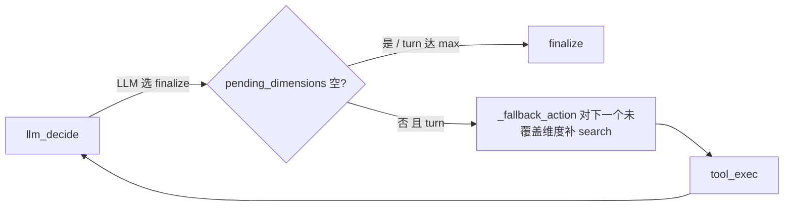

# E2E-S3-4 维度覆盖确定性护栏

收口真实 deep run `run_7e6cfe43a741` 暴露的问题:topic 给每竞品下发 4 个 focus 维度,evidence 却全部塌缩到第 1 个 `core_coding_features`。S3 前三刀(抽取/继承/去重)都已验证生效,本刀只解决"维度覆盖广度"。

## 根因

researcher 子图是 ReAct loop,`finalize` 由 LLM 自由判断("evidence is sufficient")。LLM 一次 `search_web` 拿到 5 条丰富 snippet 就 finalize,`pending_dimensions` 还剩 3 个从未取证。现有逐维度 round-robin 逻辑 `_fallback_action`([backend/app/agents/subgraphs/researcher.py](backend/app/agents/subgraphs/researcher.py) L388-424)只挂在 LLM 解析失败的兜底路径,主路径用不到。

成熟做法 = LLM 只负责"给定维度怎么取证",代码负责"未覆盖完不许收尾"。这比加 prompt 软约束稳,且不动轮次预算/限流。

## 三刀

### 1. 维度覆盖确定性护栏(核心)

[backend/app/agents/subgraphs/researcher.py](backend/app/agents/subgraphs/researcher.py) `llm_decide`,在 LLM 解析出 action 决定 `next_action` 处(L588-592):当 LLM 选 finalize(`action not in TOOL_ACTIONS`)时,若 `pending_dimensions` 非空且 `turn_count < max_turns`,调用现成 `_fallback_action(state)` 取对下一个未覆盖维度的 `search_web`/`fetch_url`,override `action`/`action_args`/`next_action="tool_exec"`;`_fallback_action` 在 pending 耗尽时自身返回 finalize,天然放行。turn 预算内广度优先(每维度先 search 一次),深度挖掘是余量 bonus。

- finalize 放行条件收敛为:`pending_dimensions` 空 或 `turn_count >= max_turns`(后者 L485 已处理)。
- 加 `researcher.coverage_guard` 结构化日志(触发维度、剩余 pending),供可观测。
- `_fallback_action` 内 `_has_attempt` 已避免对同一 tool+dimension 重复,无需额外去重。

### 2. focus 名受控生成(次要)

`FocusDimension=str` 自由串,prompt 只要求 snake_case 不限长,LLM 生成 `enterprise_management_capabilities`(>32)被 `_validate_contract_token`([backend/app/schemas/contracts.py](backend/app/schemas/contracts.py) L18 `normalized[:32]`)静默截断。

在 [backend/app/service/llm/prompts.py](backend/app/service/llm/prompts.py) supervisor/planner(L185/L260/L662)与 researcher(L323/L768)的 focus_dimensions 指引补:`each focus_dimension MUST be concise snake_case <= 32 chars (a-z0-9_), 1-3 words`。不改 `contracts.py` 通用截断(通用约束,改动面大且有风险),只从生成端收敛。

### 3. metrics 维度覆盖(可观测闭环)

[backend/app/service/metrics/engine.py](backend/app/service/metrics/engine.py):仿 `_extract_competitor_id` 加 `_extract_dimension(span)` 读 `span["dimension"]`;`RunMetricsSnapshot` 加 `evidence_count_by_dimension: dict[str,int]` 与 `dimension_coverage_rate: float`(覆盖维度数 / 期望维度数,期望维度来自 `run.plan_tree` 各 task `focus_dimensions` 并集;plan_tree 缺则以 evidence distinct dimensions 为分母)。同步 [backend/app/router/run_rt.py](backend/app/router/run_rt.py) `RunMetricsResponse`。

## 验证

- docker 定向 pytest:`test_researcher_evidence`(护栏:LLM finalize+pending 非空→override 取证;pending 空→放行;turn 达 max→放行)、`test_run_metrics`(维度覆盖字段)、`test_prompt_safety`(focus 名约束)、`test_contracts`。
- 真实 deep run 复跑同 3 竞品配置,验:每 target competitor evidence 覆盖 >=3 distinct dimensions;`/metrics` 暴露 `evidence_count_by_dimension` 且 `dimension_coverage_rate > 0.5`;supervisor focus 名无 32 截断;analyst dimension drop 仍 <0.2(护栏不引入新 drop)。
- green 后更新一级总纲 [.cursor/plans/e2e_debug_closure_index_9b2a1f0c.plan.md](.cursor/plans/e2e_debug_closure_index_9b2a1f0c.plan.md):E2E-S3-4 标 fixed、E2E-S3-2 三条 DoD 全绿、E2E-S3 收口。

## Build 记录

- 2026-06-06:首次真实验收 `run_65db17487163` 失败:supervisor 给 `max_iterations=2`,4 个 focus 维度只覆盖 `core_coding_features`。根因是 coverage guard 受低 turn 预算截断。
- 2026-06-06:补动态预算下限:`max_turns=max(request.max_iterations, len(focus_dimensions))`;不改全局 `MAX_REACT_TURNS`。
- 2026-06-06:docker S3 总定向回归通过:`78 passed in 32.73s`。
- 2026-06-06:真实复验 `run_4c34a4133121` 通过核心阈值:每个竞品均覆盖 3 个维度;`dimension_coverage_rate=0.75`;focus 名长度 7/8/12/20,无 32 截断;researcher dimension drops 全 0;报告引用 21 个唯一 evidence id。
- 2026-06-06:残留观察:`integrations` 维度 evidence 为 0,metrics 已显式暴露;URL 仍有同源多条,但按不同维度/正文 hash 保留,不是 draft+observation 双路径翻倍。

## 落地方式

作为第四刀追加到现有二级 plan [.cursor/plans/e2e_s3_evidence_quality_29d03999.plan.md](.cursor/plans/e2e_s3_evidence_quality_29d03999.plan.md) 的 todos(`s3d-*` + 复验),不新建二级 plan 文件,保持 E2E-S3 单一二级 plan。

## 不做(守 S3 边界)

- 不调 `MAX_REACT_TURNS`、不碰 429/TPM/retry/并发(属 E2E-S5)。
- 不改 `contracts.py` 通用 token 截断。
- 不退回固定枚举维度,保留 LLM-first 细分能力。
