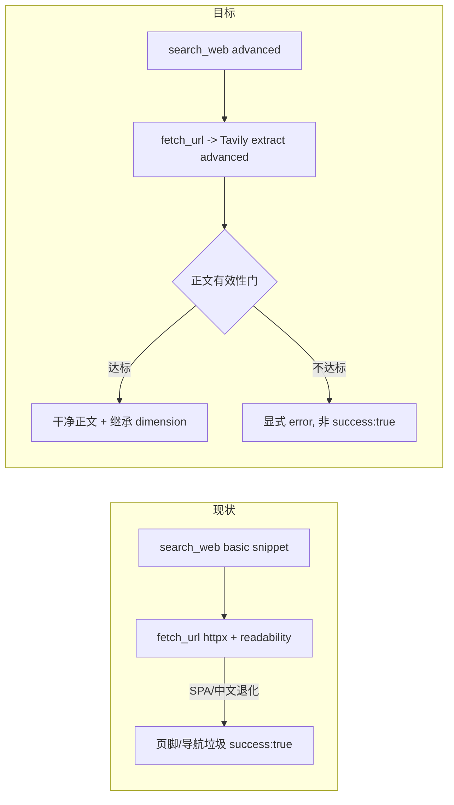

# E2E-S3 证据采集与质量

对应一级总纲 [`.cursor/plans/e2e_debug_closure_index_9b2a1f0c.plan.md`](.cursor/plans/e2e_debug_closure_index_9b2a1f0c.plan.md) 的 todo `E2E-S3`(不拆批,一个整体 plan),覆盖 `E2E-S3-1`(抽取垃圾)、`E2E-S3-2`(维度全丢)、`E2E-S3-3`(去重/利用率)。三块在 researcher 证据链路耦合,按依赖序组织成三刀:抽取(上游根)→ 维度 → 去重选证。build 全绿后由一级总纲标完成。

## 第一性原理与方案

证据采集 = 找对页(search)+ 拿净正文(extract)+ 留溯源。病根在原料不在 LLM:`search_web` 只取浅 snippet,正文靠手搓 readability,SPA/中文站退化成页脚。GPT5.5 high 判断力不缺,缺干净原料。方案:**Tavily 全家桶**(已集成、零新依赖、中文实测有效)一步拿净正文 + 硬质量门;强模型在好原料上工作。

## 刀 E2E-S3-A:抽取工业化(S3-1)

文件:[`backend/app/agents/tools/search_web.py`](backend/app/agents/tools/search_web.py)、[`backend/app/agents/tools/fetch_url.py`](backend/app/agents/tools/fetch_url.py)、[`backend/app/agents/tools/parse_page.py`](backend/app/agents/tools/parse_page.py)、[`backend/app/service/collector/registry.py`](backend/app/service/collector/registry.py)、[`backend/app/agents/subgraphs/researcher.py`](backend/app/agents/subgraphs/researcher.py)、[`backend/app/service/llm/prompts.py`](backend/app/service/llm/prompts.py)

- `search_web`:`search_depth="basic"` → `"advanced"`(search_web.py:48),只为搜得更准;正文仍交给独立 extract(two-step 精度高于 inline raw_content)。
- `fetch_url`:内部从 `httpx GET + extract_main_text(readability)`(fetch_url.py:13、L29-81)改为 Tavily `client.extract(urls=[url], extract_depth="advanced", query=研究主题)`;复用 `TAVILY_API_KEY` 与 `api.tavily.com` 的 `PerHostLimiter`。保留工具名 `fetch_url`(对 LLM 友好,prompt/schema 改动最小)。
- 正文有效性门(新增,质量硬保证):extract 返回后校验 min chars / 正文占比 / 非纯导航 boilerplate;不达标 `raise ChannelError`(researcher 侧 `success:false`,researcher.py:160-175),不塞垃圾、不 silent fallback。
- 删手搓抽取:移除 `parse_page.py` 的 `extract_main_text` 与 `ParsePageChannel`(registry.py:40-55),同步 `ResearcherActionName` / `ACTION_TO_CHANNEL`(researcher.py:48-55)与 researcher prompt 工具清单(prompts.py:732 推荐顺序)。`extract_structured` channel 保留(LLM 结构化抽取,与正文抽取无关)。

Verify:扩 [`backend/app/tests/test_collector_channels.py`](backend/app/tests/test_collector_channels.py),mock Tavily extract 返回干净正文/空正文,断言达标入库、不达标 `success:false`;断言移除 parse_page 后 registry/action 名一致。

Done-when:同 run target competitor 的 evidence 正文不再以页脚/导航为主;extract 不达标显式标记而非 `success:true`。

## 刀 E2E-S3-B:维度继承 + 枚举约束(S3-2)

文件:[`backend/app/agents/subgraphs/researcher.py`](backend/app/agents/subgraphs/researcher.py)、[`backend/app/schemas/agent_outputs_pipeline.py`](backend/app/schemas/agent_outputs_pipeline.py)、[`backend/app/service/llm/prompts.py`](backend/app/service/llm/prompts.py)

根因回顾:`missing` 主因——fetch_url 跳常省略 dimension,且 channel `observation.args` 不回传 dimension(observations_log 重扫恒 None);`out_of_focus` 次因——LLM 自由生成复合词被 `validate_dimension` slugify+32 截断成陌生 token。

- 维度继承:`tool_exec`(researcher.py:638-777)在 `action_args` 无 dimension 时,从 `pending_dimensions[0]` 或最近一次同 competitor 的 search_web dimension 继承(对齐 `_fallback_action` L373-382 既有注入逻辑)。
- observation 保留维度:把生效 `dimension` 合并进 `observation_row.args`(researcher.py 约 L688),让 `observations_log` 重扫(nodes/researcher.py:107-185)能拿到,不再恒 None。
- 枚举约束(从源头杜绝复合词):`to_action_tuple`(agent_outputs_pipeline.py:351-407)对工具 dimension 用 `normalize_dimension_or_none(..., allowed=focus_dimensions)`,越界 fallback pending 而非静默丢;researcher prompt(prompts.py:270-282、721-736)把 `dimension` 从自由 `str|null` 改为**显式枚举 focus_dimensions 值**,明确禁止复合维度。

Verify:扩 [`backend/app/tests/test_researcher_evidence.py`](backend/app/tests/test_researcher_evidence.py):search→fetch 两跳后 evidence 继承 dimension;LLM 给复合词时被映射/fallback 到 focus 而非 drop。

Done-when:每 target competitor 至少覆盖 3 个 focus dimensions;`analyst.dimension_drops.count / evidence_count_total < 0.2`。

## 刀 E2E-S3-C:去重单路径 + 分层选证(S3-3)

文件:[`backend/app/agents/nodes/researcher.py`](backend/app/agents/nodes/researcher.py)、[`backend/app/service/llm/prompts.py`](backend/app/service/llm/prompts.py)

根因回顾:双路径重复(`evidence_drafts` 全保留 + `observations_log` 再扫,`seen_keys` 未预填 drafts → ≥2×);dedupe key 含 `quote[:80]` → 同 URL 多条;消费端 prompt 硬编码 `evidence_briefs[-24:]` 尾部截断但 `allowed_evidence_ids` 全量 → 引用脱节、利用率低。

- 单路径去重:`_build_evidence_rows`(researcher.py:107-185)统一为单路径——`seen_keys` 先预填 `evidence_drafts` 再处理 `observations_log`,消除系统性翻倍。
- dedupe key:`(competitor_id, dimension, quote[:80], source_url)` 改为 `(competitor_id, dimension, source_url)` + 正文内容 hash;同 URL 同 dimension 合并,保留同 URL 不同 dimension 的合法多条。
- 分层选证(替代尾部截断):`build_analyst_user_prompt`(prompts.py:825-840)与 `build_writer_user_prompt`(prompts.py:907-937)的 `evidence_briefs[-24:]` 改为按 `(competitor_id × dimension)` 分层采样,保证每竞品每维度有覆盖,而非线性取最后 N 条;预算上限仍受控(可配)。

Verify:新增 dedupe 单测(同 snippet 不再双份;同 URL 不同 dimension 保留);分层采样单测(每竞品每维度至少 1 条进 prompt)。

Done-when:report unique evidence refs / evidence_count_total 达阈值或 metrics 标记低利用;writer/analyst prompt 证据按 section/dimension/competitor 覆盖,不再简单取最后 N 条。

## 阶段验证

- docker 定向:`docker compose -f backend/docker-compose.dev.yml exec -T rivallens_api pytest tests/test_collector_channels.py tests/test_researcher_evidence.py tests/test_contracts.py tests/test_smoke.py -q`。
- 真实 deep run 抽检:evidence 正文非页脚导航;`dropped_dimensions.missing` 占比 <0.2;`/trace` 中 URL 去重;报告引用覆盖多竞品多维度。
- 三刀 green 后更新一级总纲 `E2E-S3` 状态(Layer-1 动作)。

## Build 记录

- 2026-06-06:已完成 S3-A/S3-B/S3-C 代码与单测收口。
- 2026-06-06:docker 定向验证通过: `66 passed in 26.14s`。
- 2026-06-06:真实 deep run `run_7e6cfe43a741` 暴露 S3-4:missing 已修但维度多样性塌缩,证据全归 `core_coding_features`。
- 2026-06-06:S3-4 首次修复后真实验收 `run_65db17487163` 仍失败:supervisor 给 `max_iterations=2`,4 个 focus 维度只覆盖第 1 维;补动态预算下限 `max_turns=max(request.max_iterations,len(focus_dimensions))`。
- 2026-06-06:S3 总定向回归通过:`78 passed in 32.73s`。
- 2026-06-06:真实 deep 复验 `run_4c34a4133121` 通过:S3 抽取正文有效;每竞品 distinct dimensions 均为 3;`dimension_coverage_rate=0.75`;researcher dimension drops 全 0;报告引用 21 个唯一 evidence id;focus 名无 32 截断。
- 2026-06-06:残留观察:`integrations` 维度未取到 evidence,已由 metrics 暴露为 `integrations:0`;同 URL 多条主要来自跨维度/不同正文 hash 保留,后续如需更强 URL 级合并另立优化。

## 不做

- 不引 Firecrawl / 火山方舟(本期定 Tavily 全家桶;若后续要 benchmark 上限再单独评估)。
- 不加 DB 级唯一约束(应用层去重已足够,避免迁移;真实需要再说)。
- 不改 reducer / 状态合同(S2 已治理)。
- 不动 S4-S6 代码。
