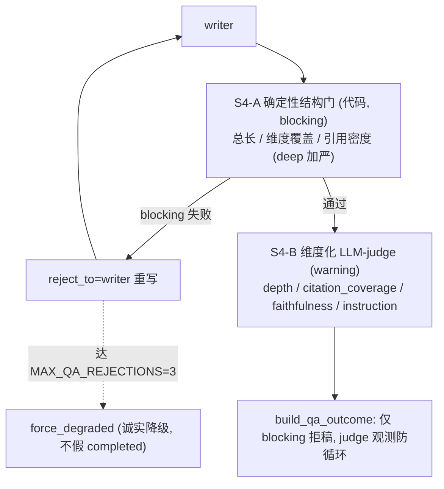

# E2E-S4 报告与 QA 质量门

收口真实 run 暴露的两个质量缺口,落地业界成熟的**混合评估栈**(确定性归代码、主观归 LLM-judge、golden 做回归),与本仓 [`llm-observability-and-evals`](.agents/skills/llm-observability-and-evals/SKILL.md) 一致。

## 根因(已由调研锁定)

- **E2E-S4-1**:`report_depth=deep` 全链路只存在于 `intake_draft`,writer/QA/metrics 都不读它,deep 与 quick 生成层零差异。QA 硬门槛仅"每段≥60字、段数1-12、≥1 evidence_ref"([rules.py](backend/app/service/qa/rules.py) L57-88/125-135);semantic 只看 `report_markdown[:600]`+`evidence_briefs[-20:]`([prompts.py](backend/app/service/llm/prompts.py) L929-930),rubric 只审 coherence;且有"证据≥12 强制 override 通过"后门([engine.py](backend/app/service/qa/engine.py) L464-483)。2086字/5段因此 approved。
- **E2E-S4-2**:`section_has_evidence_refs` 不在 parser schema([promoted_rules.py](backend/app/service/qa/promoted_rules.py) L60-73)→ parse_error 被静默吞成 `passed=True`(L301-312);`section_title_contains:["Pricing"]` 英文 substring 命中不了中文标题;两条内置 rule 都 `severity:warning`,`build_qa_outcome` 只对 blocking 拒稿。三重失效。

## 设计:确定性门 vs LLM-judge 分工

客观结构缺陷走确定性 blocking(override 救不了,因 `build_qa_outcome` 只看 blocking);主观深度/grounding 走 judge warning(防主观判断导致死循环)。这是业界"确定性归确定性、judge 归 judge"的精确落地。

## 四刀

### S4-A deep 确定性结构门(E2E-S4-1 核心)

[backend/app/service/qa/rules.py](backend/app/service/qa/rules.py) `evaluate_fast_path_rules` 读 `run.intake_draft["report_depth"]`,deep 档增 blocking 规则:报告总正文最小长度、sections 必须覆盖 `target_sections`/`focus_dimensions`(缺维度 blocking)、deep 每段最小字数(>60)、每段 evidence_ref 密度下限。阈值入 [core/defaults.py](backend/app/core/defaults.py) 可配置,初值由"竞品数×维度数"期望推导,并以本次 failing baseline(2086字/5段)为下界校准,不拍脑袋。`evaluate_fast_path_rules` 需新增 `report_depth` 入参,调用点 [engine.py](backend/app/service/qa/engine.py) L391 透传。

### S4-B 生成端 + 维度化 LLM-judge(E2E-S4-1 闭环)

- 生成端:[prompts.py](backend/app/service/llm/prompts.py) `build_writer_user_prompt`/`WRITER_SYSTEM_PROMPT` 注入 `report_depth` 与 deep 深度/覆盖目标(让重写能产出达标报告,避免拒稿死循环);writer 调用点 [writer.py](backend/app/agents/nodes/writer.py) L482 传入。
- 评审端:`QA_SEMANTIC_SYSTEM_PROMPT` 改维度化 rubric(deep research 标准维度 depth/citation_coverage/faithfulness/instruction_following),每维度 behavioral anchor + 二元 pass/fail,JSON;`build_qa_semantic_user_prompt` 去掉 `[:600]`(content_json 已含全文,补 markdown 全文或扩窗),`evidence_briefs` 用分层采样替代 `[-20:]`;`QASemanticOutput`([agent_outputs_pipeline.py](backend/app/schemas/agent_outputs_pipeline.py) L489-514)扩维度化结果;judge temperature=0。semantic 仍作 warning,override 后门保留防循环(blocking 结构门已不受其影响)。

### S4-C promoted QA rule DSL 修复(E2E-S4-2)

[backend/app/service/qa/promoted_rules.py](backend/app/service/qa/promoted_rules.py):① `when` 增 `section_id_in`(中文友好,section_id 是稳定 snake_case 如 `pricing_model_breakdown`),并把两条内置 SKILL 改用 parser 支持的等价算子(`evidence_refs_count_gte:1` 代 `section_has_evidence_refs`;pricing 用 `section_id_in` + `section_content_min_chars`);② parse_error 不再静默 `passed=True`,改为 observable 失败(blocking 或显式标记),避免坏规则被当通过;③ 关键内置 rule 提到 `severity:blocking`。改两条 SKILL:[evidence-must-cite-source](backend/skills/qa_rule/evidence-must-cite-source/SKILL.md)、[pricing-must-have-tier](backend/skills/qa_rule/pricing-must-have-tier/SKILL.md)。

### S4-D metrics 报告质量字段 + golden 回归

- [metrics/engine.py](backend/app/service/metrics/engine.py) `build_run_metrics_snapshot` 查 `reports` 表加 `report_char_count`/`report_section_count`/`report_depth`/`report_section_coverage_rate`(相对 target_sections);同步 `RunMetricsResponse`([run_rt.py](backend/app/router/run_rt.py) L341-359)。
- golden 加回归:deep 短报告 failing case(本次 2086字/5段作 failing baseline)+ promoted rule 命中中文 section 的 passing/blocking case;沿用 [golden/runner.py](backend/app/tests/golden/runner.py) 现有断言扩展。

## 验证

- docker 定向 pytest:`test_qa_rules`、`test_qa_*`/promoted、`test_run_metrics`、`golden`、`test_writer_llm`、`test_prompt_safety`。
- 真实 deep run 复跑:验短报告被 blocking 拒→writer 重写出更深报告(或诚实 degraded);中文 pricing section 无 tier 被 promoted rule 命中;`/metrics` 暴露 report 质量字段;parse_error=0。
- green 后更新一级总纲 [.cursor/plans/e2e_debug_closure_index_9b2a1f0c.plan.md](.cursor/plans/e2e_debug_closure_index_9b2a1f0c.plan.md) E2E-S4-1/-2 收口。

## 不做(守边界)

- 不碰 E2E-S5(429/provider/retry/并发)与 E2E-S6(curator)。
- judge 不上 multi-judge jury / 跨模型族(YAGNI,单 judge + temp0 + 维度化 rubric 足够);不搞 30-50 条人工标注 golden,只加关键 failing/passing 回归。
- 不改 `contracts.py` 通用 token 截断。

## 落地方式

新建二级 plan `e2e_s4_report_qa_gates_*.plan.md`(总纲阶段表已占位该文件名),四刀 + verify 作为其 todos。
