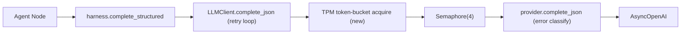

# S5 LLM 稳定性成熟化(E2E-S5)

承接 E2E Debug 总纲 [e2e_debug_closure_index_9b2a1f0c.plan.md](.cursor/plans/e2e_debug_closure_index_9b2a1f0c.plan.md) 的 E2E-S5-1 / E2E-S5-2。所有切片对齐业界 2026 成熟范式(tianpan / Inference.net / Respan / Requesty 一致):优先 `Retry-After`、无则 full jitter 指数退避、只重试 429/5xx/timeout、客户端主动 token-bucket 限流防患于未然。

## 现状根因(代码确认)

- 盲重试:[client.py](backend/app/service/llm/client.py) L246-271 只 `except LLMRequestError` 不分类全部重试 3 次;backoff `0.2*(2**attempt_index)` 亚秒级无 jitter(L269);无 `Retry-After`。
- 标志失联:[providers.py](backend/app/service/llm/providers.py) L260/274/287 硬编码 `retryable=False` 仅入日志,retry 循环从不消费;429 `RateLimitError` 被错标 `error_class="connection"`(L280)。
- 无主动限流:仅全局 `asyncio.Semaphore(4)`([client.py](backend/app/service/llm/client.py) L158/249),无 token/TPM 预算;5 slot 全落同一 Doubao endpoint,`ConductResearchBatch` 并行 fan-out 多 researcher 同时撞 TPM。
- 不可观测:[metrics/engine.py](backend/app/service/metrics/engine.py) L34-35 只暴露 `llm_token_total/llm_call_count/llm_latency_p50_ms`,无 provider_error / retry。

## 调用链锚点

## E2E-S5-1 成熟重试 + 错误分类 + 主动 TPM 限流

### 切片 S5-1a 错误分类与异常元数据(基础,先行)
- [exceptions.py](backend/app/service/llm/exceptions.py):`LLMRequestError.__init__` 增 `retryable: bool`、`http_status: int | None`、`retry_after_seconds: float | None`(默认值保证向后兼容)。
- [providers.py](backend/app/service/llm/providers.py) `complete_json` 按异常正确分类并抛带元数据的 `LLMRequestError`:
  - `RateLimitError`(429):`error_class="rate_limit"`、`retryable=True`,从 `exc.response.headers` 解析 `retry-after` / `retry-after-ms`。
  - `APITimeoutError` / `APIConnectionError`:`retryable=True`(瞬时)。
  - `APIStatusError`:`status_code >= 500` → `error_class="http_5xx"`、`retryable=True`;其余 4xx(400/401/403/422)→ `retryable=False`。
  - 修正 L249/279 两个 `except` 分支的 `error_class` 与 `retryable` 日志字段,使其与抛出元数据一致。

### 切片 S5-1b retry 循环成熟化
- [client.py](backend/app/service/llm/client.py) L246-271 主路径 + L361 fallback 路径:
  - 仅 `exc.retryable` 为真才重试;`retryable=False` 立即 `break`(不再盲重试 401/400)。
  - backoff:`exc.retry_after_seconds` 存在则用它(权威信号),否则 full jitter:`random.uniform(0, min(cap, base * 2**attempt_index))`。
  - `base=settings.LLM_RETRY_BASE_SECONDS`、`cap=settings.LLM_RETRY_CAP_SECONDS`。
  - `llm.call.retry` 事件补 `retryable` / `http_status` / `sleep_seconds` 字段。

### 切片 S5-1c 客户端主动 TPM token-bucket 限流
- 新建 `backend/app/service/llm/rate_limiter.py`:`AsyncTokenBucket(tpm_budget)`,按经过时间连续补充,`await acquire(estimated_tokens)` 不足则 sleep 到补足;`tpm_budget <= 0` 时短路禁用。
- token 估算:Doubao 无官方 tokenizer,用字符近似(保守上界)`estimate_tokens(prompt_text) + max_completion 上限`,作为 `acquire` 输入。
- [client.py](backend/app/service/llm/client.py) `LLMClient` 持有 per-provider bucket(`dict[provider_name, AsyncTokenBucket]`,当前仅 doubao);`complete_json` 在 `Semaphore` 之前 `await bucket.acquire(...)`。Semaphore 限并发不变,bucket 限每分钟 token,二者正交(dual-layer)。

## E2E-S5-2 配置成熟度 + 可观测

### 切片 S5-2a 可观测(metrics 暴露)
- [metrics/engine.py](backend/app/service/metrics/engine.py):`RunMetricsSnapshot` 增 `llm_provider_error_count`(复用 `llm_calls.error IS NOT NULL` 聚合,无 migration)、`llm_retry_total`。
- retry 计数持久化:`LLMResponse` 增 `retry_count`,经 `build_llm_call_record` 写入 [llm_call.py](backend/app/models/llm_call.py) 新增 `retry_count` 列(Integer default 0) + 一支 alembic migration;engine 聚合 SUM。
- [run_rt.py](backend/app/router/run_rt.py) `RunMetricsResponse` 同步新字段。

### 切片 S5-2b 配置补齐 + 阈值
- [config.py](backend/app/core/config.py):新增 `LLM_RETRY_BASE_SECONDS`(默认 1.0)、`LLM_RETRY_CAP_SECONDS`(默认 30.0)、`LLM_TPM_BUDGET`(保守默认,按 Doubao 实际额度可调;0 禁用) + 校验。
- [.env.example](.env.example):补齐缺失项 `LLM_MAX_RETRIES` / `LLM_PROVIDER_*` / `DOUBAO_BASE_URL` / 新参数,带说明注释(占位符,无真实密钥)。
- 总纲 E2E-S5-2 参数表定阈说明(并发/超时/retry/TPM 取值依据)。

## 切片 S5-verify 验证 + 收口
- docker 定向 pytest:`test_llm_client` / `test_llm_providers` / `test_llm_routing` / `test_llm_harness` / `run_metrics`,新增用例:429 `RateLimitError` 触发重试且读 `Retry-After`、401/400 `retryable=False` 不重试、full jitter backoff 上界、token-bucket 超预算 sleep、retry_count 持久化与 metrics 暴露。
- 真实 deep run 复跑:确认 429 走 Retry-After/jitter 退避、non-retryable 不重试、TPM 限流平滑 fan-out、`/metrics` 暴露 provider_error_count/retry_total。
- green 后更新总纲 E2E-S5 收口;最后新建二级 plan `.cursor/plans/e2e_s5_*.plan.md` 承载本切片清单与 reference run。

## Build 结果(2026-06-06)

- S5-1a: `LLMRequestError` 已携带 `retryable/http_status/retry_after_seconds/error_class`;provider 按 429、5xx、timeout、connection、4xx 分类并写一致日志。
- S5-1b: 主路径和 fallback 共用成熟 retry loop;仅 retryable 才重试,优先 `Retry-After`,否则 full jitter;`llm.call.retry` 输出 `retryable/http_status/sleep_seconds`。
- S5-1c: 新增 `AsyncTokenBucket` 和字符近似 token 估算;`LLMClient` per-provider bucket 在 semaphore 前 acquire,`LLM_TPM_BUDGET=0` 时禁用。
- S5-2a: `LLMResponse/LLMCall/trace/metrics` 接入 `retry_count`;新增 migration `0017_add_llm_retry_count`;metrics 暴露 `llm_provider_error_count`、`llm_retry_total`。
- S5-2b: `config.py` 与 `.env.example` 补齐 retry/backoff/TPM/provider/base-url 参数,仅保留占位符和安全默认。

## 验证记录

- 编译: `python -m compileall -q backend/app/service/llm backend/app/service/metrics backend/app/models backend/app/router/run_rt.py ...` 通过。
- 空白检查: `git diff --check -- ...` 通过(仅 Git CRLF 提示)。
- migration: `docker compose -f backend/docker-compose.dev.yml exec -T rivallens_api alembic upgrade head` 成功从 `0016_add_llm_trace_fields` 升到 `0017_add_llm_retry_count`。
- 定向测试: `docker compose -f backend/docker-compose.dev.yml exec -T rivallens_api pytest tests/test_llm_client.py tests/test_llm_providers.py tests/test_llm_routing.py tests/test_llm_harness.py tests/test_llm_rate_limiter.py tests/test_llm_trace_persistence.py tests/test_run_metrics.py -q` → 42 passed。
- 真实 deep run: `run_287bcb0d6f80` completed,332s,17 LLM calls at metrics query time,44465 tokens,p50 12052ms,`llm_provider_error_count=0`,`llm_retry_total=0`,deep report 5804 chars/4 sections,QA rejected 1 次后 approved。

## 残余观察

- 本次真实 run 未触发 429,所以 Retry-After 行为由 focused tests 验证,真实链路验证的是无 retry 时的持久化/API/trace 合同。
- `dimension_coverage_rate=0.5`,analyst 仍有 `out_of_focus` drops;这是 S3 质量残余/维度命名一致性问题,不属于 S5 retry/TPM 范围。
- run completed 后 skill_curator 仍可能继续写入 LLM trace,导致立即查询 metrics 的 llm_call_count 与稍后 trace 数量存在 17/18 的时间差;后续 S6 可决定是否把 curator 纳入 run terminal 前置或将其指标独立化。

## 不做(YAGNI)
- 不引入 tenacity 等新依赖(现有 retry 循环改造即可,full jitter 自实现 ~3 行)。
- 不引入 Redis/分布式限流(单进程单 endpoint,asyncio bucket 足够)。
- 不做多 endpoint 负载分流(默认单 Doubao endpoint;`routing.py` 已有 per-slot provider 扩展点,留待真实多 endpoint 资源时再启用)。
- 不做 circuit breaker(超出当前根因范围)。
