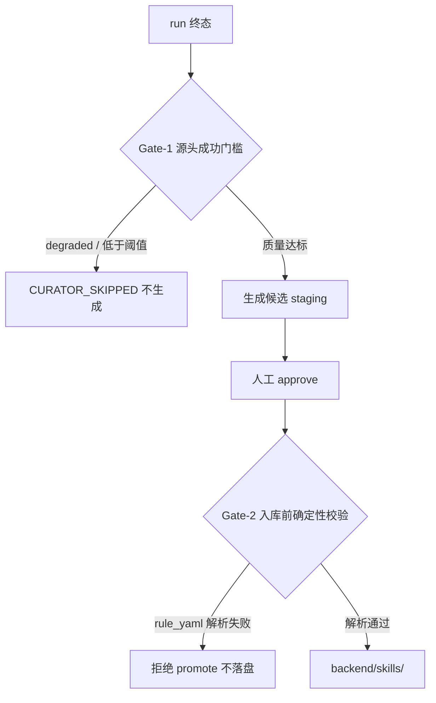

# S6 curator 样本质量门槛(E2E-S6)

承接 E2E Debug 总纲 [e2e_debug_closure_index_9b2a1f0c.plan.md](.cursor/plans/e2e_debug_closure_index_9b2a1f0c.plan.md) 的 E2E-S6-1。这是收尾阶段,依赖 S1-S5 全部质量修复已落地(质量信号 `RunMetricsSnapshot`、QA gates、promoted rule parser 均已就绪)。

## 方案依据:成功案例公约数(非自创)

所有成功的 self-improving skill library 系统遵循同两条不变量:

- 只从成功样本学:Voyager `if success: skill_manager.add_skill() else: add_failed_task`(self-verification critic 确认成功才入库);MUSE-Autoskill "no successful run → no skill";SkillCraft "only skills that pass verification are stored"。
- 入库前确定性验证:SkillCraft Coding Verifier 三阶段;Anthropic 官方 skill 指南 "prefer deterministic scripts for critical validation",把 skill 当 production dependency。

RivalLens 恰好两条都缺,本计划只补这两条,不引入重型 net-effect A/B 或额外 LLM judge。

## 现状缺口(代码确认)

- 无条件触发:run 终态后 [run_rt.py](backend/app/router/run_rt.py) L1091-1097 等 6 处无脑 `asyncio.create_task(run_skill_curator_for_run)`,连 `degraded`(QA force_degraded)低质量 run 也照学。
- 信号未接线:`build_run_metrics_snapshot`([engine.py](backend/app/service/metrics/engine.py) L169)已能算 coverage/dimension_coverage/report 质量,但 curator 入口 [tasks.py](backend/app/service/skill_curator/tasks.py) L145 完全不读。
- 入库无确定性校验:`promote_approved_candidate`([skill_promotion/__init__.py](backend/app/service/skill_promotion/__init__.py) L167)对 qa_rule 仅 `QARuleCandidatePayload` schema 校验,`rule_yaml` 是否可被 parser 解析从不检查,坏 rule 可落盘后在 QA 运行时 parse error。

## 治理链路

## 切片 S6-1 Gate-1 源头成功门槛

- 抽取共享装配函数:把 [run_rt.py](backend/app/router/run_rt.py) L1100-1167 内联的"查 run/evidence/step/llm/decision/candidate/report rows + `build_run_metrics_snapshot`"提为 metrics 模块的 `load_run_metrics_snapshot(session, run_id) -> RunMetricsSnapshot`,run summary 与 curator 共用(避免重复查询逻辑)。
- curator 入口判定:在 [tasks.py](backend/app/service/skill_curator/tasks.py) `run_skill_curator_for_run`(L145)加载 context 前先取 `run.status` + snapshot;命中任一即 skip(不调 `generate_skill_candidates`):
  - `run.status == "degraded"`(QA 未通过的终态,等价 Voyager task failed);
  - `dimension_coverage_rate` / `report_section_coverage_rate` / `coverage_rate` 低于阈值,或 `qa_rejection_rate` 高于阈值。
- 可观测:新增 `RunEventType.CURATOR_SKIPPED` 事件,带 `reason` 与触发该判定的指标值;`skill_curator.task.skipped` 结构化日志。
- 阈值配置化:新增 curator 专用阈值(随 [config.py](backend/app/core/config.py) 或 qa defaults 模式),给保守默认可调。

## 切片 S6-2 Gate-2 入库前确定性校验

- 在 [skill_promotion/__init__.py](backend/app/service/skill_promotion/__init__.py) `_build_qa_rule_markdown`(L69)/`promote_approved_candidate`(L167)落盘前,对 `payload.rule_yaml` 调 `parse_promoted_rule`([promoted_rules.py](backend/app/service/qa/promoted_rules.py) L121);返回 `ParseError` 即抛领域异常,拒绝 promote、不写 SKILL.md(沿用 L172-178 的 DB rollback,状态保持 staging)。
- API 层 [skill_rt.py](backend/app/router/skill_rt.py) approve 把该异常映射为可读 4xx(如 `SKILL_CANDIDATE_RULE_INVALID`),区别于写盘失败的 500。
- 复用 S4 已收紧的 parser(parse_error 不再静默),不新增解析逻辑。

## 切片 S6-verify 验证 + 收口

- docker 定向 pytest:`test_skill_curator_*` / `test_skill_review` / `test_skill_promotion_*` / `test_run_metrics`,新增用例:
  - `degraded` run 触发 curator → `CURATOR_SKIPPED`、零候选;
  - 低 coverage/低 dimension_coverage run → skip;
  - 质量达标 run → 正常生成候选(保持现有 smoke 行为);
  - approve 一个 `rule_yaml` 解析失败的候选 → 拒绝 promote、不落盘、状态仍 staging。
- 真实 run 复跑:跑一个正常 deep run 确认 curator 仍生成候选;构造/复用一个 degraded run 确认被 skip。
- green 后更新总纲 E2E-S6 收口;新建二级 plan `.cursor/plans/e2e_s6_curator_*.plan.md` 承载本切片与 reference run。

## Build 结果(2026-06-06)

- S6-1 Gate-1 已落地:
  - `service.metrics.load_run_metrics_snapshot(session, run_id)` 抽成共享 loader,`run_rt` metrics endpoint 与 curator 共用。
  - `run_skill_curator_for_run` 在生成前读取 run status + metrics snapshot;`degraded` 或低于阈值时直接 skip,不调用 LLM、不写候选。
  - 新增 `RunEventType.CURATOR_SKIPPED`;skip 时发 `curator.skipped` 与 `curator.finish(status=skipped)`,日志 `skill_curator.task.skipped` 带 reason/thresholds/实际指标。
  - 阈值配置: `CURATOR_MIN_COVERAGE_RATE=1.0`,`CURATOR_MIN_DIMENSION_COVERAGE_RATE=0.5`,`CURATOR_MIN_REPORT_SECTION_COVERAGE_RATE=1.0`,`CURATOR_MAX_QA_REJECTION_RATE=0.5`,`.env.example` 已补。
- S6-2 Gate-2 已落地:
  - `promote_approved_candidate` 对 `qa_rule` 候选写盘前调用 `parse_promoted_rule`。
  - 解析失败抛 `PromotionRuleValidationError`,router 映射为 422 `SKILL_CANDIDATE_RULE_INVALID`;DB rollback 后候选保持 `staging`,不落 SKILL.md。
  - 测试与 fake curator 输出已同步为当前 promoted rule DSL。

## 验证记录

- 编译: `python -m compileall -q backend/app/service/metrics backend/app/service/skill_curator backend/app/service/skill_promotion backend/app/router/run_rt.py backend/app/router/skill_rt.py ...` 通过。
- 空白检查: `git diff --check -- ...` 通过(仅 Git CRLF 提示)。
- Docker 定向 pytest: `docker compose -f backend/docker-compose.dev.yml exec -T rivallens_api pytest tests/test_skill_curator_engine.py tests/test_skill_curator_generators.py tests/test_skill_curator_tasks.py tests/test_skill_promotion_router.py tests/test_skill_review.py tests/test_skill_store.py tests/test_run_metrics.py tests/test_smoke.py::test_schema_models_instantiation -q` → 25 passed。
- 真实路径验证:复用 completed run `run_287bcb0d6f80` 手动触发 curator,候选数 `before=3, after=6, delta=3`,说明达标样本仍正常生成。

## 残余观察

- 真实 degraded skip 未另跑完整 degraded run;skip 分支由 focused test 覆盖,避免为单一状态再消耗一次完整端到端 run。
- 手动 Python 验证脚本在业务完成后出现 asyncpg event-loop dispose warning,不影响候选写入;这是 standalone 脚本清理方式问题,不是服务内路径问题。

## 不做(YAGNI,对齐成功案例边界)

- 不引入 SkillGen 式 net-effect A/B(有/无技能性能对比)——重型,本规模过度。
- 不新增 LLM-as-judge 评候选——S4 已有 run 级语义 judge,Gate-1 复用已有确定性 metrics 即可,避免重复造轮子与额外成本。
- 不做候选语义去重 / UCB 排序——Voyager 自身 monotonic 不去重,本系统人工 approve 已挡重复扩散。
- 不动主图与遗留 `skill_curator_node`(curator 已是异步后台任务,graph 无该节点)。
