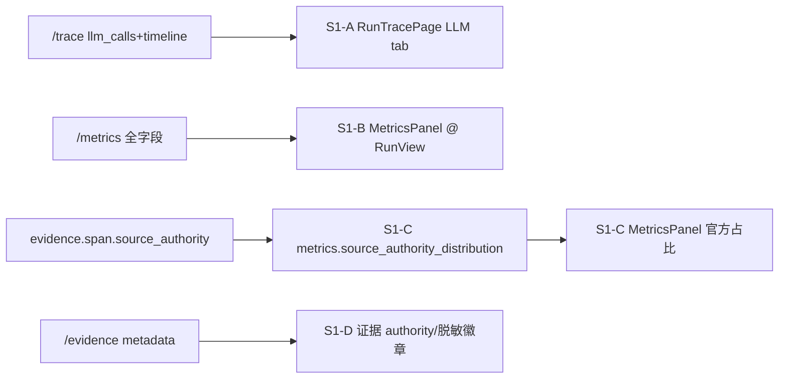

# FE-S1 可观测与指标接线(Layer-2 执行计划)

FE 计划族总纲 [.cursor/plans/FE_前端冲刺总纲_f3b8d1a4.plan.md](.cursor/plans/FE_前端冲刺总纲_f3b8d1a4.plan.md) 的第一阶段二级 plan。审计来源 [docs/frontend-audit-2026-06-07.md](docs/frontend-audit-2026-06-07.md) 的 FE-001 / FE-002 / FE-005。

## 执行结果(2026-06-07)

- FE-S1-A completed: 前端 `RunTraceResponse` 已声明 `llm_calls` / `timeline`;`RunTracePage` LLM tab 改为渲染真实调用表(provider/model/slot/tokens/latency/retry/fallback/error/prompt_preview)。
- FE-S1-B completed: `RunViewPage` 已挂载 `MetricsPanel`,保留顶部 4 KPI;`MetricsPanel` 已补维度覆盖、证据维度覆盖、LLM 重试、Provider 错误等指标。
- FE-S1-C completed: 后端 `/metrics` 已新增 `source_authority_distribution`;前端类型与指标面板已展示官方来源占比和 authority 分布。
- FE-S1-D completed: `/evidence` 已显式返回 `desensitized`;`EvidenceDrawer` / `RunEvidencePage` 已展示来源权威与脱敏徽章,证据库支持按 `source_authority` 筛选。
- Verify: `npm run type-check` passed;`npm run build` passed;容器内 `pytest tests/test_run_metrics.py tests/test_skill_curator_tasks.py -q` passed(10 passed)。

## 已验证前提(只读核实,带 file:line)

- `/trace` 后端**已返回** `llm_calls` + `timeline`:[backend/app/router/run_rt.py](backend/app/router/run_rt.py):271-303,`LLMCallTraceResponse` 含 provider/model_name/model_slot/prompt_preview/prompt_tokens/completion_tokens/latency_ms/retry_count/fallback_used/error。前端 `RunTraceResponse` 缺这两字段([frontend/src/api/types.ts](frontend/src/api/types.ts):183-187)。
- `/metrics` **已返回** `dimension_coverage_rate`/`evidence_dimension_coverage_rate`/`llm_retry_total`/`llm_provider_error_count`([frontend/src/api/types.ts](frontend/src/api/types.ts):215-231),`MetricsPanel` 未渲染这几项([frontend/src/components/MetricsPanel.tsx](frontend/src/components/MetricsPanel.tsx):50-124),且组件全仓库无 import。
- `/evidence` **已把** `evidence.span` 映射成 `metadata`([backend/app/router/run_rt.py](backend/app/router/run_rt.py):2593),`source_authority` 由 researcher 写入 span([backend/app/agents/nodes/researcher.py](backend/app/agents/nodes/researcher.py):332)。
- 唯一缺口:metrics 无 authority 聚合,只有 `source_type_distribution`(source_type≠authority)。按决策 A 补后端 `source_authority_distribution`。

## 数据流

## 刀(原子提交,fresh context 逐个做)

### FE-S1-A Trace 类型补全 + LLM tab 渲染真实 llm_calls
- Files: [frontend/src/api/types.ts](frontend/src/api/types.ts)、[frontend/src/pages/RunTracePage.tsx](frontend/src/pages/RunTracePage.tsx)
- Changes: types 新增 `LLMCallTraceResponse`/`TraceTimelineItemResponse` 并加入 `RunTraceResponse`;LLM tab 弃用 step.payload 5-key 抽取,改渲染 `trace.llm_calls` 表(时间/agent via step/slot/provider/model/tokens/latency/retry/fallback/error/prompt_preview)。
- Verify: `npm run type-check` + `npm run build`;一个 completed run 的 `/trace` LLM tab 显示真实 30+ 调用。
- Done-when: LLM tab 不再"暂无可解析摘要",字段来自 llm_calls。

### FE-S1-B 挂载 MetricsPanel + 补 R9/R10 字段
- Files: [frontend/src/pages/RunViewPage.tsx](frontend/src/pages/RunViewPage.tsx)、[frontend/src/components/MetricsPanel.tsx](frontend/src/components/MetricsPanel.tsx)
- Changes: RunView 报告就绪态渲染 `<MetricsPanel runId isRunActive>`(保留顶部 4 KPI 作概览条);MetricsPanel 增 `dimension_coverage_rate`、`evidence_dimension_coverage_rate`、`llm_retry_total`、`llm_provider_error_count` 四项(纯前端,字段已在 response)。
- Verify: `npm run type-check`;RunView completed 态可见上述指标。
- Done-when: 完整指标面板在 RunView 可见,METRIC-001 实接上。

### FE-S1-C 后端 source_authority_distribution + 官方占比展示
- Files: [backend/app/service/metrics/engine.py](backend/app/service/metrics/engine.py)、[backend/app/router/run_rt.py](backend/app/router/run_rt.py)(RunMetricsResponse)、[frontend/src/api/types.ts](frontend/src/api/types.ts)、[frontend/src/components/MetricsPanel.tsx](frontend/src/components/MetricsPanel.tsx)、[backend/app/tests/test_run_metrics.py](backend/app/tests/test_run_metrics.py)
- Changes: 镜像 `source_type_distribution`,按 `evidence.span.source_authority` 聚合 `source_authority_distribution: dict[str,int]`,加入 snapshot + RunMetricsResponse + 前端类型;MetricsPanel 展示官方占比(official / 总数)与分布。
- Verify: 容器内 `pytest tests/test_run_metrics.py -q` 全绿(新增 authority 分布断言);`npm run type-check`。
- Done-when: completed run 指标区显示官方来源占比。

### FE-S1-D 证据 authority / 脱敏徽章
- Files: [frontend/src/components/EvidenceDrawer.tsx](frontend/src/components/EvidenceDrawer.tsx)、[frontend/src/pages/RunEvidencePage.tsx](frontend/src/pages/RunEvidencePage.tsx)
- Changes: 读 `item.metadata.source_authority`(official/third_party)与 `desensitized`,每条证据加权威性徽章 + 脱敏标;EvidenceDrawer 当前 `metadata` 未用([EvidenceDrawer.tsx](frontend/src/components/EvidenceDrawer.tsx):76-89)。
- Verify: `npm run type-check`;证据条目可见 official/第三方 + 脱敏徽章。
- Done-when: 溯源 UI 体现来源可信度层级。

## 收尾:同步总纲

- 改 [.cursor/plans/FE_前端冲刺总纲_f3b8d1a4.plan.md](.cursor/plans/FE_前端冲刺总纲_f3b8d1a4.plan.md):§4 FE-S1 由"无后端改动"修为"含一小后端聚合刀(source_authority_distribution)";§7 活文档增补回写 S1-A..D 落地与验证结果。
- 落盘本二级 plan 为 `.cursor/plans/fe_s1_observability_metrics_<hash>.plan.md`。

## 验收基线(前端无 test runner)

每刀:`npm run type-check` 通过;宽改动加 `npm run build`;对一个固定 completed run 目检数据来自真实 API。后端 C 刀加 `pytest tests/test_run_metrics.py`。一刀一原子提交,可独立回滚;连失败 3 次 revert 重拆。动手前先跑一次 type-check 确认绿基线。

## 不做(YAGNI)

- 不暴露 prompt 全文/rejection_reason(那是 FE-S2 GATE-1)。
- 不动 trace timeline 的高级可视化(归 FE-S2 验收台)。
- 不重排 RunView 信息架构(归 FE-S4)。
