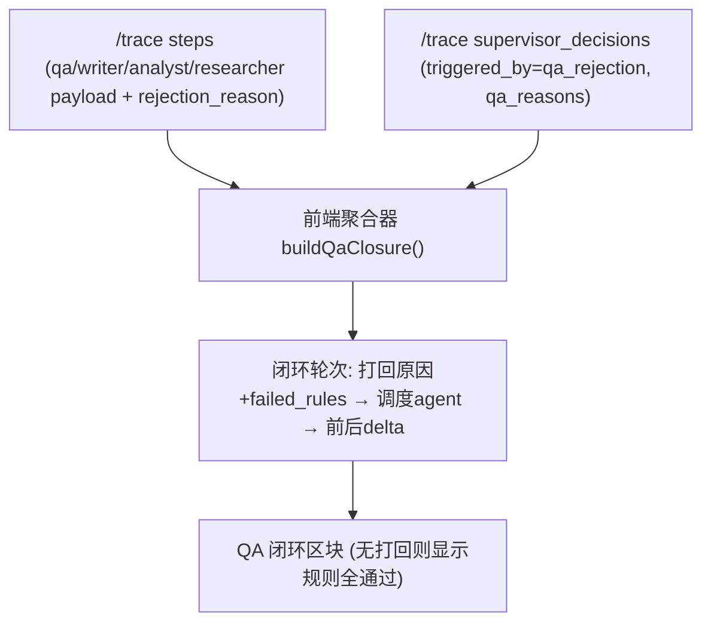

# FE-S2 可观测诊断台 + QA 闭环(Layer-2 执行计划)

> 命名纠偏(2026-06-07,两次收敛):本阶段早期叫"答辩验收台"。最终定位是 **debug/admin 可观测诊断视图**——不是评委验收台,也不是给用户的产品特性;深度可观测给开发调试/比赛验证用,生产默认隐藏(FE-021)。代码不返工,仅定位/文案纠正,见总纲 §7 纠偏条目。

FE 总纲 [.cursor/plans/FE_前端冲刺总纲_f3b8d1a4.plan.md](.cursor/plans/FE_前端冲刺总纲_f3b8d1a4.plan.md) 第二阶段。审计来源 [docs/frontend-audit-2026-06-07.md](docs/frontend-audit-2026-06-07.md) FE-003 / FE-004。**硬依赖 FE-S1 已完成**(llm_calls 类型、metrics、source_authority 已接通)。

## 执行结果(2026-06-07)

- FE-S2-A completed: 后端 `StepTraceResponse` 已暴露 `rejection_reason`;前端 `StepTraceResponse` 类型已同步。新增 trace mapper 契约测试覆盖 rejected 非空、approved 为 null。
- FE-S2-B completed: 新增共享组件 `LlmCallsTable`;`RunTracePage` LLM tab 已改为复用该组件,为验收台复用提供单一实现。
- FE-S2-C completed: 新增 `buildQaClosure(trace)` 聚合器与 `QaClosureSection`,可展示 QA 打回原因、Supervisor 调度、重做 step 与 writer/analyst/researcher 的关键 delta;无打回时显示规则通过。
- FE-S2-D completed: 新增 `/app/runs/:runId/audit` 可观测诊断台,聚合 Run 概览、Metrics、DAG、LLM 调用、QA 闭环、证据/合规、Battlecard/Comparison;RunView toolbar 已加入口。(UI 文案"答辩验收台/验收视图"已在纠偏中改中性诊断术语;入口隐藏开关见 FE-021/FE-S3。)
- Verify: `npm run type-check` passed;`npm run build` passed;容器内 `pytest tests/test_smoke.py::test_step_trace_response_exposes_rejection_reason -q` passed。

## GATE-1 决议(已拍板)

暴露 `rejection_reason`。prompt 保持 `prompt_preview`(FE-S1 已渲染),全文 prompt_text YAGNI 不做。

## 已验证前提(只读核实,带 file:line)

- QA 闭环调度链可纯前端聚合:`qa step.payload` 有 `qa_outcome`/`reject_to`/`failed_rule_ids`/`target_step_id`/`qa_unsupported_numeric_claims`([backend/app/agents/nodes/qa.py](backend/app/agents/nodes/qa.py):69-90,184-186),经 `/trace` 原样返回。
- `supervisor_decisions` 是"打回→调度重做"主锚点:`triggered_by="qa_rejection"` + `tool_args.qa_reasons` + `reasoning_summary`([backend/app/agents/nodes/supervisor.py](backend/app/agents/nodes/supervisor.py):493-701),`/trace` 全量返回。
- 前后差指标在 step payload:writer `section_count`/`evidence_ref_count`、researcher `evidence_ids`、analyst `insight_count`/`conclusions_persisted_count`。
- **唯一缺口**:`rejection_reason`(含 `semantic_findings`/`required_fields`/`retry_policy.current_retry`)只写 DB 列([backend/app/agents/nodes/qa.py](backend/app/agents/nodes/qa.py):187-191),`StepTraceResponse` 不返回([backend/app/router/run_rt.py](backend/app/router/run_rt.py):246-256)→ FE-S2-A 暴露。
- 同一 agent 原始 vs 重做:每次新 `step_id`,无 iteration/retry,靠 `agent_name` + `created_at` 序 + 夹在两次 qa step 间区分。
- 组件可直接复用(props 已确认):`MetricsPanel`(自拉 metrics)、`RunTraceDag`(需完整 `RunTraceResponse`)、`ComparisonMatrix`(需页面级 `onEvidenceClick`+`EvidenceDrawer`)、`BattlecardGrid`(自带 Drawer)。
- 路由:`WORKSPACE_CHILDREN` 平级 lazy 加 `runs/:runId/audit`([frontend/src/app/router.tsx](frontend/src/app/router.tsx):50-63);入口按钮加在 RunView toolbar([frontend/src/pages/RunViewPage.tsx](frontend/src/pages/RunViewPage.tsx):197-213)。

## QA 闭环聚合数据流

## 刀(原子提交,fresh context 逐个)

### FE-S2-A 后端暴露 rejection_reason(GATE-1 enabler,先行)
- Files: [backend/app/router/run_rt.py](backend/app/router/run_rt.py)(StepTraceResponse + `_to_step_trace_response`)、[frontend/src/api/types.ts](frontend/src/api/types.ts)、[backend/app/tests/](backend/app/tests/)(trace 响应测试)
- Changes: `StepTraceResponse` 增 `rejection_reason: dict | None`,映射 `step.rejection_reason` DB 列;前端 `StepTraceResponse` 同步加该字段。
- Verify: 容器内 `pytest` 覆盖 /trace 返回 rejection_reason(rejected qa step 非空、approved 为 null);`npm run type-check`。
- Done-when: `/trace` 的 qa rejected step 带 semantic_findings/required_fields/retry_policy。

### FE-S2-B 抽 LLM calls 表为共享组件
- Files: 新增 `frontend/src/components/trace/LlmCallsTable.tsx`、[frontend/src/pages/RunTracePage.tsx](frontend/src/pages/RunTracePage.tsx)
- Changes: 把 FE-S1-A 在 RunTracePage 内联的 9 列 llm_calls 表抽成 `<LlmCallsTable calls steps>`,RunTracePage 改用它(parity:视觉不变)。为 FE-S2-D 验收台复用做准备,避免复制。
- Verify: `npm run type-check` + `npm run build`;RunTracePage LLM tab 视觉与 FE-S1 一致。
- Done-when: LLM 表单一实现,两处复用。

### FE-S2-C QA 闭环聚合器 + 闭环区块组件
- Files: 新增 `frontend/src/lib/qaClosure.ts`(纯函数聚合)、新增 `frontend/src/components/audit/QaClosureSection.tsx`
- Changes: `buildQaClosure(trace)` 按 created_at 串 qa step → `triggered_by=qa_rejection` decision → 重做 step,产出每轮 {round, reject_to, failed_rule_ids, semantic_findings(来自 A), qa_reasons, before/after delta(section/evidence/insight count)};组件渲染轮次卡片,无打回显示"规则全部通过"。
- Verify: `npm run type-check`;真实有打回的 run 上展示完整闭环;无打回 run 显示全通过。
- Done-when: 一屏可见至少一次 QA 闭环及重做前后差异(FE-004 DoD)。这是本阶段最高风险刀(启发式时序匹配),fresh context 单独做。

### FE-S2-D RunAuditPage 可观测诊断台 + 路由 + 入口
- Files: 新增 `frontend/src/pages/RunAuditPage.tsx`、[frontend/src/app/router.tsx](frontend/src/app/router.tsx)、[frontend/src/pages/RunViewPage.tsx](frontend/src/pages/RunViewPage.tsx)
- Changes: 新页单页滚动 6 区块——① Run 概览(KpiCard+metrics)② 多 Agent DAG(`RunTraceDag`)③ LLM 调用(`LlmCallsTable`,来自 B)④ QA 闭环(`QaClosureSection`,来自 C)⑤ 溯源证据(metrics source/authority 分布 + 链 `/evidence`)⑥ 业务产物(`BattlecardGrid`+`ComparisonMatrix`+页面级 `EvidenceDrawer`);router 加 lazy `runs/:runId/audit`(+ 可选 legacy redirect);RunView toolbar 加入口按钮(`isReportReady` 时显示)跳 `/audit`。UI 文案用中性诊断术语(分析详情/诊断),不用"验收/答辩"。入口隐藏开关归 FE-021(FE-S3)。
- Verify: `npm run type-check` + `npm run build`;真实 completed run `/audit` 一屏覆盖 6 区块,可从报告页按钮进入。
- Done-when: 开发/admin 一屏看清一次 run 的完整内部执行(含至少一次 QA 闭环及重做前后差异;无打回时显式"规则全部通过")。

## 收尾:同步总纲

- 改 [.cursor/plans/FE_前端冲刺总纲_f3b8d1a4.plan.md](.cursor/plans/FE_前端冲刺总纲_f3b8d1a4.plan.md):FE-S2 status、GATE-1 标记已决(暴露 rejection_reason);§7 活文档回写 S2-A..D 落地与验证。
- 落盘本二级 plan 为 `.cursor/plans/fe_s2_audit_cockpit_qa_loop_<hash>.plan.md`。

## 验收基线(前端无 test runner)

每刀 `npm run type-check`,宽改动加 `npm run build`,对固定 completed run(优选有 QA 打回的 run)目检。后端 A 刀加 `pytest` trace 测试。一刀一原子提交;C 刀(闭环聚合)连失败 3 次 revert 重拆。动手前先 type-check 确认绿基线。

## 不做(YAGNI)

- 不暴露 prompt 全文/历史 report diff(超 35% 验收所需)。
- 不做 SSE `onQaOutcome` live 回调(audit 是回放视图,trace refetch 已够;若 S3 live 需要再补)。
- 不重排 RunView 信息架构(归 FE-S4)。
- audit 不挂主导航(仅报告页按钮进入)。
