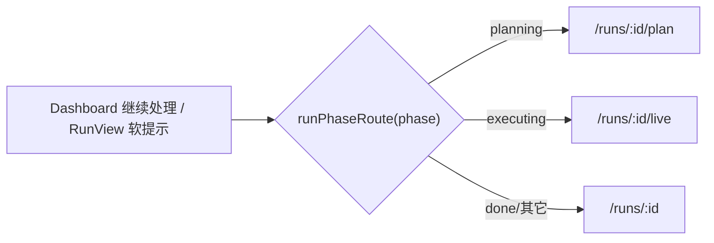

# FE-S3 产品正确性打磨(Layer-2 执行计划)

FE 总纲 [.cursor/plans/FE_前端冲刺总纲_f3b8d1a4.plan.md](.cursor/plans/FE_前端冲刺总纲_f3b8d1a4.plan.md) 第三阶段。审计来源 [docs/frontend-audit-2026-06-07.md](docs/frontend-audit-2026-06-07.md) FE-007/011/013/017/021。与 S1/S2 无硬依赖。驱动力=成熟可上线产品,赛题维度是自检副产物。

## 已验证前提(只读核实,带 file:line)

- `phase?: RunPhase` 已在前端类型([frontend/src/api/types.ts](frontend/src/api/types.ts):132);后端 `_derive_run_phase`([backend/app/router/run_rt.py](backend/app/router/run_rt.py):717-744)产出 `intake|planning|executing|done`。
- 跳转习惯固定:`/plan`(NewRunChatPage:447/531)、`/live`(PlanConfirmPage:190/205)、`/runs/:id`(done)。
- `Dialog`(Radix)已存在([frontend/src/components/ui/dialog.tsx](frontend/src/components/ui/dialog.tsx)),FE-017 直接复用,无新依赖。
- 导出仅 Markdown(`RunViewPage.tsx:95 handleExportMarkdown`),**无 PDF**;`LandingPage.tsx:108` 承诺"导出 PDF"是未兑现。
- `import.meta.env` 开关模式已在用([frontend/src/api/client.ts](frontend/src/api/client.ts):5-7)。

## 刀(原子提交,fresh context 逐个做)

### FE-S3-A FE-007 running 按 phase 导航
- Files: 新增 `frontend/src/lib/runRoute.ts`(纯函数)、[frontend/src/pages/app/DashboardPage.tsx](frontend/src/pages/app/DashboardPage.tsx)、[frontend/src/pages/RunViewPage.tsx](frontend/src/pages/RunViewPage.tsx)
- Changes:
  - `runPhaseRoute(run): string` —— `planning→/plan`、`executing→/live`、`done|其它→/runs/:id`;`intake` 暂回退 `/runs/:id`(无独立 resume-intake 页,记为已知降级)。
  - DashboardPage "继续处理"(`:248-250`)running 分支改用 `runPhaseRoute`(需要 `phase`,该列表项已含或回退 RunView)。
  - RunViewPage running 态加**软提示**(非强制跳,遵守 FE-011):phase=planning/executing 时顶部显示一条 "分析进行中,前往实时进度 →" 链接到 `/live` 或 `/plan`。
- Verify: `npm run type-check`;一个 running run 从 Dashboard 进入对的页;RunView 上 running run 出现软提示而非空报告。
- Done-when: 用户继续处理 running run 不再落到空报告页。

### FE-S3-B FE-011 Live 终态不强制跳走
- Files: [frontend/src/pages/LiveRunPage.tsx](frontend/src/pages/LiveRunPage.tsx)
- Changes: 删除终态自动跳转 effect(`:324-334` 的 `setTimeout navigate(replace)` + `TERMINAL_REDIRECT_MS`);保留已有终态"查看完整报告"按钮(`:429-435`),让用户自己点。
- Verify: `npm run type-check` + `npm run build`;一个 run 跑到终态后停在 Live 页,不被自动带走,点按钮才进报告。
- Done-when: 终态由用户决定离开,不替用户做决定。

### FE-S3-C FE-013 营销文案诚实化 + 预览用真实数据
- Files: [frontend/src/pages/marketing/LandingPage.tsx](frontend/src/pages/marketing/LandingPage.tsx)、[frontend/src/pages/marketing/PricingPage.tsx](frontend/src/pages/marketing/PricingPage.tsx)
- Changes:
  - 删未兑现/夸大:Hero `:30` "3 分钟"→"数分钟";产品预览区 `:51-80` 的 "42 条结论"+Competitor A/B/C 假卡片;价值卡 `:108` "导出 PDF / Markdown"→"导出 Markdown / 公开链接"。
  - 预览区改用真实数据:复用已有 `completedRunsQuery`(`:13`)渲染最新 completed run 的真实信息(标题/竞品数/证据数/完成时间);**空库时**退化为中性"示例预览"标注,不放假具体数字。
  - PricingPage:Pro/Team 已是"即将上线"可保留;Starter 的 "Markdown 导出/公开分享链接" 与实现一致,保留;不新增未实现承诺。
- Verify: `npm run type-check` + `npm run build`;Landing 无 PDF/虚构数字;有 completed run 时预览是真实数据,空库为中性占位。
- Done-when: 营销页不承诺产品没有的能力。

### FE-S3-D FE-017 清空全部历史防误删
- Files: [frontend/src/pages/app/DashboardPage.tsx](frontend/src/pages/app/DashboardPage.tsx)(+ 可能抽一个本地确认弹窗组件)
- Changes:
  - 把"清空全部历史"从历史区主工具栏(`:322-329`)降级:移出常驻按钮,放进危险操作区(如折叠/次级位置),与"清空当前筛选"区分。
  - `handleClearAllHistory`(`:190-215`)由单次 `window.confirm` 升级为基于 `Dialog` 的 **type-to-confirm**(输入确认词才可执行)。
- Verify: `npm run type-check`;清空全部需显式输入确认词;清空当前筛选保持原交互。
- Done-when: 误触不会一键清空全部历史。

### FE-S3-E FE-021 /audit 诊断台入口受开关控制(可隐藏)
- Files: 新增 `frontend/src/lib/debugFlags.ts`、[frontend/src/pages/RunViewPage.tsx](frontend/src/pages/RunViewPage.tsx)、[frontend/src/app/router.tsx](frontend/src/app/router.tsx)、`frontend/.env.example`(若存在则加注释)
- Changes:
  - `debugFlags.ts`:`export const SHOW_DEBUG_PANELS = import.meta.env.VITE_SHOW_DEBUG_PANELS === "true" || import.meta.env.DEV;`(开发默认开;生产需显式设 flag 才开)。
  - RunViewPage 入口按钮(`:215` "运行诊断")用 `SHOW_DEBUG_PANELS` 包裹,关时不渲染。
  - router `/audit` 路由(`:57-63`)在 flag 关时降级 NotFound(防直链),deep-link 仅在开时可达。
- Verify: `npm run type-check` + `npm run build`;flag 关闭(模拟生产)时产品内无 `/audit` 入口、直链 404;flag 开启时正常进入。
- Done-when: 翻一个开关即可对终端用户隐藏内部诊断台。

## 收尾:同步总纲
- 改总纲:FE-S3 todo status=completed;§7 活文档增补回写 S3-A..E 落地与验证。
- 本二级 plan 落盘为 `.cursor/plans/fe-s3_*.plan.md`(本计划文件即是)。

## 验收基线(前端无 test runner)
每刀 `npm run type-check`,宽改动加 `npm run build`,对一个真实 completed run + 一个 running run 目检。一刀一原子提交,可独立回滚;连失败 3 次 revert 重拆。

## 不做(YAGNI)
- 不做 demo fallback / 假数据兜底(FE-012 已删)。
- 不做独立 resume-intake 页(intake phase 暂回退 RunView,记为已知降级)。
- FE-017 不跨页搬迁到 Settings(就地强确认更内聚);如后续要"危险区"集中管理再议。
- 不引入新依赖(Dialog/env 模式均复用现有)。
