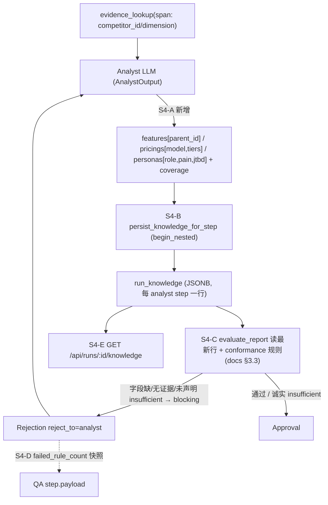

# FE-S4 Schema 三件套后端产出 + QA 一致性闭环(Layer-2 执行计划)

FE 总纲 [.cursor/plans/FE_前端冲刺总纲_f3b8d1a4.plan.md](.cursor/plans/FE_前端冲刺总纲_f3b8d1a4.plan.md) 第四阶段。问题地图 S4-1/S4-2/S4-3。**短期评分轴**:字节 35% 同一条点名"输出严格符合预定义竞品知识 Schema(功能树/定价/用户画像),字段完整、格式一致"+"反馈闭环真实可触发,重做后有改善(非伪闭环)"。本阶段把这两点一起做实,**纯后端**;前端三件套视图在 FE-S5。

## 已验证前提(只读核实,带 file:line)

- 预定义 Schema 契约已就位:`Feature(parent_id/maturity)`、`Pricing(model/tiers/free_plan/enterprise_plan)`、`Persona(role/pain_points/jobs_to_be_done)` 在 [backend/app/schemas/business.py](backend/app/schemas/business.py):20-61;`Feature`/`Pricing`/`UserFeedback` 的 `evidence_ids` 有"非空"`field_validator`,`Persona.evidence_ids` 可空。**全仓 `app/` 无 producer**(零产出,GATE-2 实测)。
- 合格基准:docs §3.3 最小合格标准 [docs/3-schema-and-protocol.md](docs/3-schema-and-protocol.md):300-307(每竞品 ≥3 feature 或 coverage 标 insufficient_data;每竞品 ≥1 pricing 或 model=unknown;每条绑 ≥1 evidence)。
- Analyst 产出链:`AnalystOutput`([backend/app/schemas/agent_outputs.py](backend/app/schemas/agent_outputs.py):116-130)字段 summary/insights/comparisons/risk_flags/recommended_sections;`parse_llm_content`(132-248)按 `allowed_evidence_ids`/`allowed_dimensions`/`competitors` 过滤;`build_fallback`(265+)产降级输出;`to_persisted_dict`(262-263)= `model_dump`(新增字段自动进 persisted dict)。
- Analyst 节点:`complete_structured(output_model=AnalystOutput, parser=...)`([analyst.py](backend/app/agents/nodes/analyst.py):140-160);`analysis_result = analysis_output.to_persisted_dict()`(177);持久化用 `async with session.begin_nested()` + `SQLAlchemyError` 隔离 + `step.payload` 计数(260-352);`evidence_lookup = {row.id: row}`(193)。
- 持久化模式:`persist_conclusions_for_step` / `load_conclusions_for_run`([backend/app/service/conclusion/persistence.py](backend/app/service/conclusion/persistence.py));表 `ConclusionRecord`([backend/app/models/conclusion.py](backend/app/models/conclusion.py):12-37,`run_id`/`step_id` FK CASCADE + JSONB + `server_default=func.now()`);模型注册 [backend/app/models/__init__.py](backend/app/models/__init__.py):3-30。
- 迁移:head `0018_add_comparison_cells`([backend/app/alembic/versions/0018_add_comparison_cells.py](backend/app/alembic/versions/0018_add_comparison_cells.py))为建表模板(JSONB `server_default '[]'::jsonb`、FK CASCADE、索引)。
- QA:`evaluate_report`([backend/app/service/qa/engine.py](backend/app/service/qa/engine.py):439-639)在一个 session 内读 `run/report/writer_step/evidence`(451-459),`evaluate_fast_path_rules` 产 `RuleResult[]`(496-503),`build_qa_outcome`(126-149)只要有 blocking 失败即 `_build_rejection`(reject_to 来自首条失败规则,severity=blocking)。`RuleResult`([backend/app/service/qa/rules.py](backend/app/service/qa/rules.py):19-25)= dataclass(rule_id/passed/severity/reject_to/message)。`MAX_QA_REJECTIONS`(engine.py:33)→ 超限走 `force_degraded`([qa.py](backend/app/agents/nodes/qa.py):152-175)。打回写 `steps.rejection_reason`(qa.py:187-191),`_make_qa_payload`(69-90)rejection 带 `failed_rule_ids`、approval 带 `passed_rule_ids`。
- 端点模板:`GET /api/runs/{id}/conclusions`([run_rt.py](backend/app/router/run_rt.py):2608-2624)→ 404 缺 run + `load_conclusions_for_run`;response model `RunConclusionsResponse`/`ConclusionItemResponse`(379-416)。

## 数据流(本阶段闭环)

## 刀(后端原子提交,fresh context 逐个做)

### FE-S4-A 产出三件套(AnalystOutput schema + prompt)
- Files: [backend/app/schemas/agent_outputs.py](backend/app/schemas/agent_outputs.py)、[backend/app/service/llm/prompts.py](backend/app/service/llm/prompts.py)
- Changes:
  - `AnalystOutput` 增三字段:`features: list[Feature]`、`pricings: list[Pricing]`、`personas: list[Persona]`(import 自 `schemas.business`),`coverage: dict[str, dict[str, str]] = Field(default_factory=dict)`(competitor_id → {feature/pricing/feedback: complete|partial|insufficient_data|missing});全部 `default_factory`,不破坏 `insights min_length=1` 等既有约束与现存 fallback。
  - `parse_llm_content` 增三件套过滤(对齐既有 insights/comparisons 风格):`competitor_id` 必须 ∈ `competitors`;`evidence_ids` 只保留 ∈ `allowed_evidence_ids`;**服务端铸 id**(`make_id("feat_"/"price_"/"persona_")`,忽略 LLM 给的 id 防碰撞);Feature/Pricing 过滤掉无合法 evidence 的项(满足 business.py 非空校验);`feature.parent_id` 仅在指向同竞品已保留 feature 时保留,否则置 None;非法项丢弃不报错。
  - `build_fallback` 增 `features=[]`/`pricings=[]`/`personas=[]` + `coverage` 对每个 focus competitor 标 `insufficient_data`(降级=诚实声明不足,后续 QA 不误打回)。
  - `to_persisted_dict` 无需改(model_dump 自动含新字段)。
  - prompt:`ANALYST_SYSTEM_PROMPT`(prompts.py:345-385)output schema 增 `features/pricings/personas/coverage` 块 + 规则:从 evidence 合成功能树(parent_id 表层级)、定价(model/tiers/free_plan/enterprise_plan,**不确定写 model=unknown**)、画像(role/pain_points/jobs_to_be_done,以 user_feedback 证据为锚);每个 feature/pricing 必绑 evidence_ids;**禁编造**;凑不齐就在 coverage 诚实标 insufficient_data。`build_analyst_user_prompt`(prompts.py:914-936)追加一句"同时产出结构化 features/pricings/personas + coverage"。
- Verify(写码前定义): 容器内 `pytest tests/test_analyst_output.py -q`(新建或并入既有 analyst 输出测试):① 合法三件套解析保留且铸了 `feat_/price_/persona_` id;② 引用越界 evidence / 越界 competitor 的项被丢弃;③ 无 evidence 的 Feature/Pricing 被丢弃;④ `build_fallback` 产空三件套 + coverage 全 insufficient_data;⑤ 既有 insights/comparisons 解析不回归。
- Done-when: Analyst 能产出/降级出符合 business.py 契约的三件套,且 `analysis_result` 自带 features/pricings/personas/coverage。

### FE-S4-B 持久化 + migration
- Files: 新增 [backend/app/models/knowledge.py](backend/app/models/knowledge.py)、新增 [backend/app/service/knowledge/__init__.py](backend/app/service/knowledge/__init__.py)、新增 [backend/app/service/knowledge/persistence.py](backend/app/service/knowledge/persistence.py)、新增 `backend/app/alembic/versions/0019_add_run_knowledge.py`、[backend/app/models/__init__.py](backend/app/models/__init__.py)、[backend/app/agents/nodes/analyst.py](backend/app/agents/nodes/analyst.py)
- Changes:
  - `RunKnowledgeRecord` 表 `run_knowledge`:`knowledge_id String(64) PK`、`run_id`/`step_id` FK→runs/steps CASCADE + index、`schema_version String(16)`、`features`/`pricings`/`personas` JSONB(default list)、`coverage` JSONB(default dict)、`created_at` server_default now()。在 `models/__init__.py` import + `__all__` 注册(env.py 经 `models` 聚合 metadata)。
  - `persist_knowledge_for_step(session, run_id, step_id, schema_version, features, pricings, personas, coverage)` 写一行;`load_knowledge_for_run(session, run_id)` 返回**最新 analyst step**那一行的 `{features,pricings,personas,coverage}`(按 `created_at desc` 取首行;无行返回空结构)——三件套是当前分析快照,不跨 step 累加。
  - analyst.py:在 comparisons 持久化块后(~344-352)新增一段 `try/async with session.begin_nested()` 调 `persist_knowledge_for_step`(三件套从 `analysis_result` 取),`SQLAlchemyError` 隔离写 `step.payload["run_knowledge_persist_error"]`;成功写 `step.payload["feature_count"/"pricing_count"/"persona_count"]`。沿用现有错误隔离风格,**失败不阻断主链**。
  - 迁移 `0019_add_run_knowledge`:`revision="0019_add_run_knowledge"`、`down_revision="0018_add_comparison_cells"`;建表 + run_id/step_id 索引(照 0018 模板,JSONB `server_default text("'[]'::jsonb")`/coverage `text("'{}'::jsonb")`)。
- Verify: 容器内 `alembic upgrade head` 成功(再 `alembic downgrade -1` 演练回滚);`pytest tests/test_knowledge_persistence.py -q`(新建):persist→load 往返结构一致、最新行覆盖旧行、空 run 返回空结构。
- Done-when: 一次 run 的三件套快照落库且可读回。

### FE-S4-C QA 一致性校验(不合格打回重做)
- Files: [backend/app/service/qa/engine.py](backend/app/service/qa/engine.py)、[backend/app/service/qa/rules.py](backend/app/service/qa/rules.py)
- Changes:
  - engine.py `evaluate_report` 的 session 块(451-459)加载 `load_knowledge_for_run(session, run_id)`(最新行);在 `rule_results.extend(promoted_rule_results)`(509)附近 append 一条 conformance `RuleResult`。
  - rules.py 新增 `rule_knowledge_schema_conformance(knowledge) -> RuleResult`(reject_to="analyst", severity="blocking"):对 knowledge 出现的每个 competitor_id 校验 docs §3.3——`features≥3 或 coverage[competitor].feature ∈ {partial,insufficient_data,missing}`;`pricings≥1 或 coverage pricing 非 complete 或 任一 pricing.model=unknown`;所有**已列出的** Feature/Pricing 必须有 evidence_ids 且必填字段非空;`schema_version` 存在。**诚实 insufficient_data 即放行**(避免误打回真实"查不到"的竞品);仅"既没达标也没诚实声明 / 字段残缺 / 无证据"才 fail。Persona 宽松:有 personas 时每条需 role + (pain_points 或 jtbd) 非空。
  - 失败即由既有 `build_qa_outcome`(126-149)生成 `Rejection(reject_to="analyst")`,走既有 supervisor→Analyze 重做链;`MAX_QA_REJECTIONS` 超限 force_degraded(已有,无需改)。
- Verify: 容器内 `pytest tests/test_qa_knowledge_conformance.py -q`(新建):① 缺字段/无证据/未声明 insufficient 的三件套 → `Rejection` 且 `reject_to=="analyst"`;② 达标 或 诚实标 insufficient_data 的三件套 → 不因本规则 blocking;③ 连续打回超 `MAX_QA_REJECTIONS` → force_degraded(不死循环)。
- Done-when: 不符合预定义 Schema 的三件套会被 QA 打回 analyst 重做,诚实声明不足的不被误伤。

### FE-S4-D QA 轮次改善快照(供非伪闭环证据)
- Files: [backend/app/agents/nodes/qa.py](backend/app/agents/nodes/qa.py)
- Changes:`_make_qa_payload`(69-90)approval 与 rejection 两支都写 `failed_rule_count`(rejection=`len(failed_rule_ids)`,approval=0)与 `failed_rule_ids`(approval=`[]`);保留既有 `qa_outcome`/`reject_to`。让前端能按 QA step 时序算"失败规则数轮次下降"。纯 additive,不改判定逻辑。
- Verify: 容器内 `pytest tests/test_qa_payload_snapshot.py -q`(新建或并入既有 qa 测试):打回 step payload 含 `failed_rule_count>=1`,通过 step payload 含 `failed_rule_count==0` 且 `failed_rule_ids==[]`。
- Done-when: 每个 QA step 都带可跨轮对比的 failed_rule_count。

### FE-S4-E /knowledge API
- Files: [backend/app/router/run_rt.py](backend/app/router/run_rt.py)
- Changes:新增 `KnowledgeFeatureResponse`/`KnowledgePricingResponse`/`KnowledgePersonaResponse`(镜像 business.py 字段)+ `RunKnowledgeResponse(run_id, schema_version, features, pricings, personas, coverage)`;新增 `@router.get("/api/runs/{run_id}/knowledge", response_model=RunKnowledgeResponse)`,仿 `get_run_conclusions`(2608-2624):404 缺 run,`load_knowledge_for_run` 取数,空数据返回空列表/空 dict。
- Verify: 容器内 `pytest tests/test_knowledge_api.py -q`(新建):有三件套的 run 返回完整结构;无三件套返回空;缺 run 返回 404。
- Done-when: 前端(S5)可经 `/knowledge` 拉到结构化三件套。

## 收尾:同步总纲
- 改总纲:FE-S4 todo status=completed;§7 活文档增补回写 S4-A..E 落地与验证 + 给 S5 的 carryover(`/knowledge` 响应形状、QA step `failed_rule_count` 字段名)。
- 本二级 plan 即 `.cursor/plans/fe-s4_schema三件套后端_b9c4e1a7.plan.md`。

## 验收基线(后端,容器内 pytest)
- 命令族:`docker compose -f backend/docker-compose.dev.yml exec -T rivallens_api pytest <paths> -q`;迁移 `... exec -T rivallens_api alembic upgrade head`。
- **绿色基线先行**:动手前先跑既有 analyst/qa/api/smoke 目标测试存一份全绿快照作 parity 锚。
- 一刀一原子提交,可独立回滚;连失败 3 次 → revert 重拆刀。
- 旧路径兜底:conclusions/comparison 产出与持久化全程保留(三件套是新增并行产物,不替换它们)。

## 不做(YAGNI)
- 不做规范化多表/功能树闭包表;MVP 单表 JSONB,parent_id 层级交前端(S5)渲染。
- 不改 researcher `extract_structured`(仍抽 quote);三件套在 Analyst 从 evidence 合成。
- 不在本阶段写前端类型/视图(归 FE-S5,硬依赖本阶段 `/knowledge` 与 QA 快照)。
- 不暴露 prompt 全文(GATE-1 不变);不引入新依赖。
- conformance 规则不做 docs §7 通用 `selector` DSL 求值器(YAGNI);只加一条针对三件套的确定性规则函数。
