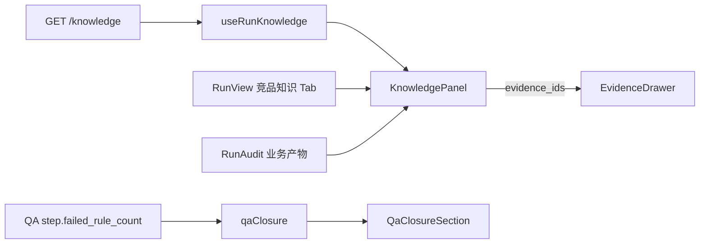

# FE-S5 三件套前端视图 + QA 闭环改善证据 + 收尾

二级 plan,计划族 FE 第 5 阶段。范围 = 总纲 S5-1/S5-2/S5-3/S5-4。纯前端 + 一处前端 lib 逻辑修正,**不改后端**(FE-S4 已提供全部数据源)。一刀一原子提交,连失败 3 次 revert 重拆。

## 数据源(FE-S4 已落地,直接消费)

- `GET /api/runs/{run_id}/knowledge` → `{ run_id, schema_version, features[], pricings[], personas[], coverage }`
  - feature: `id, competitor_id, name, parent_id, description, maturity, evidence_ids`
  - pricing: `id, competitor_id, model, tiers[], free_plan, enterprise_plan, evidence_ids`
  - persona: `id, name, role, pain_points[], jobs_to_be_done[], evidence_ids`
  - 无知识返回空结构,缺 run 返回 404(见 [backend/app/router/run_rt.py](backend/app/router/run_rt.py):2666-2685)
- QA 闭环改善:trace 中 QA step `payload.failed_rule_count` / `payload.failed_rule_ids`(FE-S4-D 落地,approval/rejection 两支都有)

## 切刀(原子,按依赖序)

### FE-S5-A 前端类型 + hook(enabler)
- [frontend/src/api/types.ts](frontend/src/api/types.ts):新增 `KnowledgeFeature` / `KnowledgePricing` / `KnowledgePersona` / `RunKnowledgeResponse`,字段严格对齐上方响应模型(`maturity` 用字面量联合 `"unknown"|"basic"|"advanced"|"leading"|null`)。
- [frontend/src/api/hooks.ts](frontend/src/api/hooks.ts):仿 `fetchRunConclusions`(:99-100)+ `useRunConclusions`(:346-356)新增 `fetchRunKnowledge` + `useRunKnowledge(runId, options)`,queryKey `["run-knowledge", runId]`。
- Verify:`npm run type-check`。

### FE-S5-B 三件套视图组件 + 挂载(S5-1)
- 新增 `frontend/src/components/knowledge/KnowledgePanel.tsx`:三块结构化视图——功能树(按 `competitor_id` 分组,`parent_id` 缩进两级 + `maturity` 徽章)、定价(按 competitor 卡片,`model` + `tiers` + free/enterprise 标记)、用户画像(`role` + `pain_points` / `jobs_to_be_done` 列表)。每个 item 的 `evidence_ids` 提供「溯源」按钮,回调 `onEvidenceClick(ids)`;空集合显示中性占位 + `coverage` 诚实状态(insufficient_data/partial)。
- [frontend/src/pages/RunViewPage.tsx](frontend/src/pages/RunViewPage.tsx):`Tabs`(:209-215)新增 `竞品知识` Tab,`useRunKnowledge(runId, { enabled: isReportReady })`,`onEvidenceClick` 直接复用既有 `openEvidenceDrawer`(:84-88)/`EvidenceDrawer`(:345-350)。
- [frontend/src/pages/RunAuditPage.tsx](frontend/src/pages/RunAuditPage.tsx):「业务产物」Card(:226-237)内追加 `KnowledgePanel`,复用该页 `openEvidenceDrawer`(:78-84)。
- Verify:`npm run type-check` + `npm run build`;真实 completed run 三件套来自 API、溯源点开抽屉。

### FE-S5-C QA 闭环改善证据加强(S5-2)
- 修基线错位 [frontend/src/lib/qaClosure.ts](frontend/src/lib/qaClosure.ts):`findPriorStep` 的 `targetStepId`(:259-260)只在重做 agent 为 `writer` 时传入(qa.py 的 `target_step_id` 恒为 writer step);analyst/researcher 传 `null`,回退到 agent_name + 时间戳搜索,得到正确重做前基线。
- 新增「失败规则数下降」证据:`QaClosureRound` 增 `failedRuleCountDelta`(before = 本轮 `payload.failed_rule_count`,after = 下一个 QA step 的 `failed_rule_count`,无后续/已通过取 0),在 [frontend/src/components/audit/QaClosureSection.tsx](frontend/src/components/audit/QaClosureSection.tsx)「重做后变化」区(:124-151)与既有 deltas 一并渲染。
- Verify:`npm run type-check` + `npm run build`;有 QA 打回的 run 上 analyst/researcher 重做 delta 取对基线、失败规则数前后可见。

### FE-S5-D 分享页溯源就地化(S5-3)
- [frontend/src/pages/marketing/SharedReportPage.tsx](frontend/src/pages/marketing/SharedReportPage.tsx):证据引用当前跳 `/app/runs/:id/evidence`(:41-49),公开访客被踹出工作区。改为就地复用 `EvidenceDrawer`(本地 `open`/`activeEvidenceIds` state,`evidence://` 链接点击开抽屉),与 RunView 一致。
- Verify:`npm run type-check` + `npm run build`;`/share/:id` 访客点引用就地展开,不跳 `/app`。
- 假设/风险:`EvidenceDrawer` 经 `useRunEvidence` 调 `/api/runs/:id/evidence`,需确认公开访客可达(与 `/report` 同放行);若被网关拦截,回退为指向公开证据路由而非 `/app`。进入该刀先验证端点可达性。

### FE-S5-E 治理收尾(S5-4)
- 删死代码:`frontend/src/pages/HomePage.tsx` 未挂路由(审计 FE-015),确认无引用后删除;修 backlog METRIC-001 文档漂移。进入该刀用 grep 复核引用再删。
- Verify:`npm run type-check` + `npm run build`。

### 收尾 sync
- 回写总纲 [.cursor/plans/FE_前端冲刺总纲_f3b8d1a4.plan.md](.cursor/plans/FE_前端冲刺总纲_f3b8d1a4.plan.md):FE-S5 todo status=completed + §7 增补 S5-A..E 落地与验证;本二级 plan todo 同步 completed。

## 不做(YAGNI)
- 不改后端 / 不新增 API(FE-S4 已够);不动 `NewRunPage` 双 intake(GATE-3)。
- 三件套视图不做编辑/导出/筛选等增强(赛后 backlog);不引入新图表依赖,用现有 token/组件。
- 不重构 qaClosure 整体,只做基线修正 + 失败规则数 delta 两处定点改动。
- 不碰 FE-009/014/016/018/019/020(面向未来 backlog)。

## 验收基线
前端无 test runner:每刀 `npm run type-check`,宽改动加 `npm run build`,并对真实 completed run 目检(数据来自真实 API 而非占位)。锚点用真实历史 run,不专设 demo。
