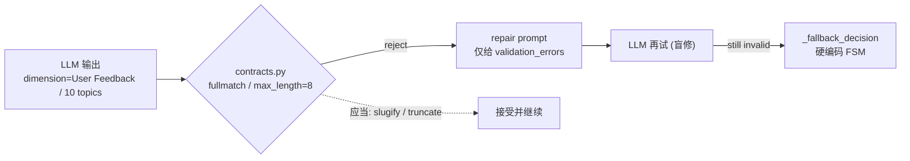

# RivalLens 问题大纲：Harness 后的系统性纠偏

> 本文是**问题清单 + 分阶段路线**，不含代码修改。证据来自最新一轮 `run_4820c8cc8911` 容器日志与对 [backend/app](backend/app) 的只读审计。引用均带 file:line，便于逐项排期。

## 0. 一句话结论

Harness 已接入主链路，但**校验层是"硬拒绝"而非"归一化"**，导致 LLM 可机器修复的输出（非 snake_case token、超 8 条 batch）被反复打回 → 浪费重试 → 降级到硬编码编排；叠加 **discovery 跑题** 与 **上限不一致静默丢弃**，使一次分析既慢（执行段约 12min）又可能跑偏。可观测性"够看流程、不够看内容与成本"。

## 1. 主链路实证（run_4820c8cc8911）

- supervisor harness 5 迭代失败 3 次，全为确定性约束被 LLM 违反、repair 无效后降级：
  - iter2 `topics: List should have at most 8 items, not 10`
  - iter3 `topics.0.focus_dimensions: dimension must match ^[a-z][a-z0-9_]{1,31}$`
  - iter5 `sections: section_id must match ^[a-z][a-z0-9_]{1,31}$`
  - 每次失败 = 3×LLM 调用(约30–50s) + 降级，合计浪费约 2.5–3min。
- discovery 出 10 个主题离散竞品（Thunderbit/Instantly.ai/Manus/Prezi/Delve AI/Salesforce/Cognism/Lark），与查询"工业自动化设备 B2B 销售提效"跑题。
- discovery 出 10、batch 上限 8 → 静默丢 2，无可观测字段。

## 2. Part A — Bug / 正确性（最高优先）

- A1 P0 契约"拒绝而非归一"：[backend/app/schemas/contracts.py](backend/app/schemas/contracts.py) 第 10-16 行 `_validate_contract_token` 对非 `^[a-z][a-z0-9_]{1,31}$` 直接 `raise`；应 slugify（空格→`_`、转小写、截断）。`validate_dimension/section_id` 的所有调用点都受影响。
- A2 P0 batch 上限被当作校验错误：[backend/app/schemas/supervisor.py](backend/app/schemas/supervisor.py) 第 44 行 `ConductResearchBatch.topics max_length=8`，LLM 出 10 即整包失败；应在解析层 truncate 到 8 并记 dropped。
- A3 P0 latent crash：[backend/app/agents/nodes/supervisor.py](backend/app/agents/nodes/supervisor.py) 第 406-431 行 `_decision_from_qa_feedback` 的 QA→researcher 分支 `for competitor_id in competitors` 无 `[:8]`，>8 竞品时 `ConductResearchBatch(...)` 构造即抛 `ValidationError` → supervisor 节点崩溃（本轮 8 个未触发，10 个会触发）。
- A4 P1 harness repair 盲修：[backend/app/service/llm/harness.py](backend/app/service/llm/harness.py) 第 152-196 行 repair 仅把 `validation_errors` 喂回，不带"上一版非法输出"，LLM 重复同错（实测 supervisor 3 次全失败）；成熟做法是回灌 bad output + 精确约束。
- A5 P1 researcher 合成证据：[backend/app/agents/subgraphs/researcher.py](backend/app/agents/subgraphs/researcher.py) 第 293-357 行 `_fallback_action` 在 LLM 失败时合成无 URL 的 `extract_structured` 文本，污染 evidence 溯源链。

## 3. Part B — 可观测性（盲区 + 噪声）

盲区：
- B1 P1 全文 prompt/response 不可见：[backend/app/models/llm_call.py](backend/app/models/llm_call.py) 只存 `prompt_hash`+tokens+latency；日志只 `prompt_preview_len`（[backend/app/service/llm/client.py](backend/app/service/llm/client.py) 第 228-236 行）。排障无法还原模型输入输出。
- B2 P1 无 run 级成本/时延汇总日志：仅 `/metrics` API 有聚合（[backend/app/service/metrics/engine.py](backend/app/service/metrics/engine.py)）；run 结束无一条 total_tokens/total_latency 日志，违背"Token 消耗可查"目标。
- B3 P1 discovery 不可审计：[backend/app/agents/nodes/discovery.py](backend/app/agents/nodes/discovery.py) 第 155-161 行只打 `discovered_count`，无竞品名单、无 snippet 采样 → 无法解释"为何选出这些竞品"。
- B4 P1 QA 失败细节缺失：[backend/app/service/qa/engine.py](backend/app/service/qa/engine.py) `qa.fast_path` 无 `failed_rule_ids` 列表；semantic `finding` 文本只入 DB 不入日志。
- B5 P1 researcher 子图无 `bind_step`/`node.*`：[backend/app/agents/subgraphs/researcher.py](backend/app/agents/subgraphs/researcher.py) 内 `llm_decide/tool_exec/compress` 日志无法关联 step_id；工具 args/observation 全文不落库，覆盖率（per-dimension/per-source）无聚合。
- B6 P2 无单条交错时间线：Step 与 SupervisorDecisionRecord 两张表分离，"run X 先后发生了什么"需客户端合并。

噪声：
- B7 P2 `run.progress` 每 60s（[backend/app/router/run_rt.py](backend/app/router/run_rt.py) 第 47 行 `_RUN_PROGRESS_INTERVAL_SECONDS`）；长 run 刷屏。
- B8 P2 `llm.call.start`+`finish` 成对 + harness repair 链 → 一次业务调用可达 6+ 条 `llm.call.*`；可将 start 降级为 DEBUG 或合并为单 span。
- B9 P2 provider/client 双层 `llm.call.error`（[backend/app/service/llm/providers.py](backend/app/service/llm/providers.py) 第 250-280 行 + client 第 78-86 行）字段不一致，告警去重难。

## 4. Part C — Naive / 硬编码 / 散乱配置

- C1 P1 默认维度三元组 `("feature","pricing","user_feedback")` DRY 散落 6+ 处：supervisor 99/103、[backend/app/agents/nodes/planner.py](backend/app/agents/nodes/planner.py) 40/137、[backend/app/agents/nodes/researcher.py](backend/app/agents/nodes/researcher.py) 35、[backend/app/schemas/agent_outputs.py](backend/app/schemas/agent_outputs.py) 10、[backend/app/schemas/agent_outputs_pipeline.py](backend/app/schemas/agent_outputs_pipeline.py) 158、run_rt 569/577。需单一事实源。
- C2 P1 竞品上限不一致 + 静默丢弃：discovery extract `[:10]`（agent_outputs_pipeline 68-69/277）、plan reconcile `[:8]`（planner 148）、batch `max_length=8`（supervisor schema 44）、supervisor fallback `pending[:8]`（supervisor 190）。需统一 cap + 记录被丢竞品。
- C3 P1 discovery 质量：[backend/app/agents/nodes/discovery.py](backend/app/agents/nodes/discovery.py) 无相关性/grounding（仅传 `domain_context` 字符串）、无"是否竞品"过滤、无与 `competitors_explicit`/别名归一；harness fallback 出占位假名（[backend/app/service/llm/prompts.py](backend/app/service/llm/prompts.py) 约 1069 行 `Name1/Name2/Name3`）。
- C4 P1 writer 章节-维度对齐靠别名表 + 轮询填充：[backend/app/agents/nodes/writer.py](backend/app/agents/nodes/writer.py) 第 46-52 行 `_SECTION_DIMENSION_ALIASES`、第 66-82 行 `_select_insights_for_section` 用 `section_index*2` 轮询。
- C5 P1 contract 行为分层混乱：supervisor/analyst **拒绝**、researcher evidence **静默改写为 feature**（researcher 136-138/191）、researcher tool **丢弃 dimension**、writer/section **跳过**——同一约束四种处置，需统一策略。
- C6 P1 intake 关键词表确定性解析：[backend/app/agents/nodes/intake.py](backend/app/agents/nodes/intake.py) `_ROLE_KEYWORDS`/`_DISCOVERY_*`/`_DEPTH_KEYWORDS`(45-71)、`_merge_reply_into_draft`(276-359) 与 harness 双轨。
- C7 P1 supervisor 维度推导启发式：supervisor 40-47 `DIMENSION_HINTS` 子串匹配、91-109 `_derive_focus_dimensions/_derive_write_sections` 与 intake/analyst 产出脱节。
- C8 P2 散乱魔法数未进 config：researcher 34-38（MAX_REACT_TURNS/COMPRESS_*）、planner 38-43（8/12/5，与 pipeline 56-57 重复）、`MAX_SUPERVISOR_ITERATIONS=10`、各类 `[-24:]/[:4000]/[:1200]` 切片。
- C9 P2 prompt 域偏置：prompts.py 与 intake 258 行硬编码"AI 编程/TRAE/Copilot"示例，非该域用户被带偏。
- C10 P2 skeleton 残留：supervisor 774 `user_query 默认 "skeleton"`、278 finalize 文案；run_rt 106。

## 5. Gap vs 赛题目标（[docs/0-problem-background.md](docs/0-problem-background.md)）

- 多 Agent 可信度(35%)：反馈闭环存在但 QA 路由是规则表非推理（C7/A3）；结构化 Schema 一致性被"拒绝式校验"反噬（A1/A2）。
- 技术深度/可观测(25%)：Token/决策/输入输出"可查"未达标——全文 prompt/response、run 级成本、discovery/QA 细节均缺日志（B1-B5）。
- 溯源：researcher fallback 合成无 URL 证据破坏 traceability（A5）。
- 业务价值：discovery 跑题 + 竞品静默丢弃直接影响覆盖度与准确率（C2/C3）。

## 6. 分阶段路线（Layer-1，仅阶段；细节下沉各阶段 Layer-2）

> 顶层只列阶段与范围，**不写文件级改法 / Verify / build 单元**——那些在进入该阶段、详细调研代码后产出的 Layer-2 plan 里写。阶段按依赖顺序推进，前一阶段 parity 稳定再开下一阶段。

- 阶段0 止损（正确性，最高 ROI）：A1/A2/A3/A4。把"拒绝式校验"改为"归一化优先"，repair 回灌 bad output，QA→researcher 补 cap。预期消除 supervisor 3/5 空转与 latent crash，执行段提速。
- 阶段1 数据质量：C1/C2/C3。竞品 cap 与默认维度收敛单一事实源、被丢竞品可观测；discovery 加 grounding/相关性/去重。
- 阶段2 可观测合同：B1-B9。run 级成本/时延汇总、discovery 名单采样、QA finding、researcher 子图 bind_step 入日志；心跳/start/error 降噪。
- 阶段3 naive→成熟：A5/C4-C10。去 fallback 合成证据、contract 处置统一、writer 对齐、魔法数进 config、去启发式双轨、prompt 去域偏置与清 skeleton。

进入某阶段的动作（Layer-2）：新 session → 详细调研该段代码 → 产出该阶段可操作 plan（build 单元 / 文件 / 改法 / Verify，按"单一关注点·同风险·共享验证"分组，约数刀）→ 逐刀 PIV，一刀一组原子提交；动手前先跑全绿快照作 parity 锚，同一刀连失败 3 次则 revert 重拆。

## 7. 明确不做（YAGNI）

- 不重写 LLMClient/provider 底层重试与 timeout。
- 不引入新依赖（instructor/outlines 等）。
- 本轮不动 FE/SSE 协议。
- 不把 QA 硬规则、forced_complete 塞进 harness 内部（保持 validation 与 business policy 分离）。

## 8. 活文档增补（执行中发现，新→旧）

### 8.1 阶段0 收尾（已完成）

A1-A4 已落地：
- A1 契约归一化：[backend/app/schemas/contracts.py](backend/app/schemas/contracts.py) `_validate_contract_token` 改 slugify（非法字符→`_`、转小写、去前导非字母、截断 32）；`validate_token_list` 跳过不可归一项而非整列失败。
- A2 batch 截断：[backend/app/schemas/supervisor.py](backend/app/schemas/supervisor.py) `ConductResearchBatch.topics` 去 `max_length`，加 `field_validator` 截断至 8。
- A3 latent crash：[backend/app/agents/nodes/supervisor.py](backend/app/agents/nodes/supervisor.py) `_decision_from_qa_feedback` QA→researcher 分支补 `competitors[:8]`。
- A4 harness repair 回灌：[backend/app/service/llm/harness.py](backend/app/service/llm/harness.py) repair 把上一版非法输出（json 截断 2000 字符）拼到 repair prompt 前，不改 builder 签名。
- 附带清理：harness 推广遗留的 stale 测试债——test_researcher_subgraph / test_researcher_dispatcher 仍 monkeypatch 已移除的 `agents.subgraphs.researcher.get_llm_client`，改为 harness 实际取 client 处 `service.llm.harness.get_llm_client`（与已修的 test_supervisor_batch 同源）。
- 验证：docker（设计运行环境）全量 `pytest tests` = 221 passed / 1 failed（唯一失败见 §8.2）。本地 Windows 另有 9 个 e2e 因 `ProactorEventLoop` 与 psycopg async 不兼容而红——非代码 bug，docker 下全绿，本地非这些 async-postgres e2e 的支持环境。

### 8.2 D1 P1 QA promoted-rule enforcement 在后台 run 失效（新发现）

现象：[backend/app/tests/test_smoke.py](backend/app/tests/test_smoke.py) `test_promoted_qa_rule_blocks_then_writer_redo_passes` 在 docker 全量里失败（首轮 `qa_outcome` 实为 `approved`，期望 `rejected`）；同类 `test_promoted_qa_rule_blocks_report_with_enforced_yaml` / `_visible_in_next_run` 通过 → enforcement 主链路本身可用。

根因（待 Layer-2 精确定位，两层叠加）：
- 加载链路：run 跑在后台 asyncio task，QA 调 [backend/app/service/qa/engine.py](backend/app/service/qa/engine.py) 第 180-196 行 `_load_promoted_qa_rules_from_skill_store()` 时 `qa.promoted_rules count=0`——测试 monkeypatch 单例 `store.skills_dir`（test_smoke `_prepare_temp_skills_root` 1121-1132）后，后台 task 的 scan 时序/可见性使 tmp 写入的规则未进 enforcement。
- mock 覆盖：conftest `_FakeLLMClient`（[backend/app/tests/conftest.py](backend/app/tests/conftest.py) 37-789）无 analyst / extract_structured / qa-semantic（非 demo query）分支 → 这些 harness 调用返回空 content → `outcome=failed` 降级 → 整链 `degraded_rule_only`，QA 无证据可判。

性质：测试基建（后台 task skill store 可见性）+ agent 实现成熟度（fake mock 覆盖、降级态 QA 行为）gap，与阶段0 正交。对照 [docs/2.5-agent-architecture.md](docs/2.5-agent-architecture.md) §3.7：架构定义 QA = 规则 DSL + LLM 语义混合 + promoted enforcement，实现层在"后台 run + 降级链路"下未达成。

去向：单开 plan（QA / agent 成熟度专项；可与阶段3 naive→成熟合并排期），不在阶段0 硬修。