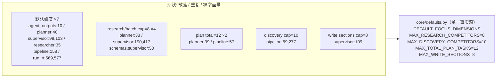

# S1：默认维度与上限的单一事实源（二级 plan）

完成记录：S1-A 提交 `4f60ee8`，S1-B 提交 `d038cca`。Docker 全量 parity 为 `221 passed / 2 failed`；两个失败仍为 S5-1 promoted QA enforcement，非 S1 回归。

## 背景

一级总纲（`系统纠偏总纲`）S0 已完成（契约归一化 + harness repair，提交 `60714f3`/`de375ab`，docker 全量 221/222）。本 plan 是总纲 **S1** 阶段的二级可执行 plan，由 codex 直接 build。

S1 解决两类"无单一事实源"的结构性散乱（对应原审计的 C1/C2）：

- S1-1（原 C1）：默认焦点维度 `("feature","pricing","user_feedback")` 在 7 处生产代码各写一遍，其中两处已命名（`DEFAULT_WRITER_SECTIONS`、`_DEFAULT_FOCUS_DIMENSIONS`）但内容重复、其余是裸字面量。改维度需要改 7 处，极易漏改 → 各 Agent 默认维度悄悄不一致。
- S1-2（原 C2）：竞品/任务上限散落且语义混乱——discovery 上限 `10`、research/batch 上限 `8`、plan 总任务 `12`，且 `planner.py` 的 `_MAX_RESEARCH_TASKS/_MAX_TOTAL_TASKS` 与 `agent_outputs_pipeline.py` 的 `PLANNER_MAX_*` **重复定义同一含义**。discovery 出 10、research 砍到 8 时**静默丢 2**，无任何可观测字段（总纲 §1 实证：run_4820c8cc8911 丢弃 2 个竞品无日志）。

## 目标与边界



边界（YAGNI，明确不做）：

- 不改任何常量的取值（纯收敛，行为不变，parity 必须保持 221/222）。
- 不动 `supervisor.py:161` 的 `max_results=8`：它是 fallback discovery 的"请求发现数"，语义既非 research cap（8）也非 discovery 截断（10），改任一常量都会错配或改值。留待 S4 魔法数归并。
- 不动 `analyst.py:136` 的 `["general","feature","pricing"]`：那是"空证据兜底维度"，语义与默认焦点维度不同，显式保留并加注释。
- 不重写 `supervisor._derive_focus_dimensions` 的 `DIMENSION_HINTS` 启发式（=总纲 S4-4）。
- 丢弃可观测只加结构化日志（`dropped_competitors`/`kept_count`/`cap`），不动 `AgentState`/schema/DB。
- `run_rt.py:569/577` 暂用 `[*DEFAULT_FOCUS_DIMENSIONS, "differentiation"|"positioning"]` 常量组合，复用 `_derive_*` 函数留待 S4-4。

## 新建文件：core/defaults.py

`backend/app/` 是 pytest rootdir，导入路径为 `from core.defaults import ...`。`core/__init__.py` 已存在，与 env 驱动的 `core/config.py` 分离。core/defaults.py 是纯常量、不 import 任何 app 模块，被 schemas/agents/router 引用无循环风险。

S1-A 创建时只放维度常量；S1-B 追加 cap 常量。最终内容：

```python
"""Single source of truth for default analysis dimensions and entity caps.

Pure business constants only: no env reads, no imports of app modules, so any
layer (schemas / agents / router) can import this without import cycles.
Env-driven runtime config lives in core/config.py instead.
"""
from __future__ import annotations

# Default focus dimensions used when intake / LLM does not specify any.
DEFAULT_FOCUS_DIMENSIONS: tuple[str, ...] = ("feature", "pricing", "user_feedback")

# Entity caps. Values are kept identical to the pre-S1 scattered literals so
# this consolidation is behavior-preserving (parity must hold).
MAX_RESEARCH_COMPETITORS: int = 8   # per-run research tasks / batch topics / competitor cap
MAX_DISCOVERY_COMPETITORS: int = 10  # discovery extraction upper bound
MAX_TOTAL_PLAN_TASKS: int = 12       # total plan tasks (discover + research + analyze + write)
MAX_WRITE_SECTIONS: int = 8          # writer section cap
```

---

## 刀 S1-A：默认焦点维度单一事实源（S1-1）

一个原子提交。新建 core/defaults.py（仅 `DEFAULT_FOCUS_DIMENSIONS`），把 7 处默认维度全部改为引用。

逐文件改法（行号基于当前 HEAD，codex 执行时以符号定位为准）：

1. 新建 `[backend/app/core/defaults.py](backend/app/core/defaults.py)`，内容见上（本刀只含 `DEFAULT_FOCUS_DIMENSIONS` 部分 + 模块 docstring）。

2. `[backend/app/schemas/agent_outputs.py](backend/app/schemas/agent_outputs.py)`
   - 第 7 行下方加 `from core.defaults import DEFAULT_FOCUS_DIMENSIONS`。
   - 第 10 行 `DEFAULT_WRITER_SECTIONS: tuple[str, ...] = ("feature", "pricing", "user_feedback")` → `DEFAULT_WRITER_SECTIONS: tuple[str, ...] = DEFAULT_FOCUS_DIMENSIONS`。
   - 保留 `DEFAULT_WRITER_SECTIONS` 名称与第 361 行 `__all__` 导出（它是公开 API，是 writer section 默认；当前等于焦点维度，做别名引用）。

3. `[backend/app/agents/nodes/planner.py](backend/app/agents/nodes/planner.py)`
   - import 区加 `from core.defaults import DEFAULT_FOCUS_DIMENSIONS`。
   - 删第 40 行 `_DEFAULT_FOCUS_DIMENSIONS: tuple[str, ...] = (...)`。
   - 第 67 行 `or list(_DEFAULT_FOCUS_DIMENSIONS)` → `or list(DEFAULT_FOCUS_DIMENSIONS)`。
   - 第 137 行 `focus = list(_DEFAULT_FOCUS_DIMENSIONS)` → `list(DEFAULT_FOCUS_DIMENSIONS)`。

4. `[backend/app/agents/nodes/supervisor.py](backend/app/agents/nodes/supervisor.py)`
   - import 区加 `from core.defaults import DEFAULT_FOCUS_DIMENSIONS`。
   - 第 99、103 行 `derived.extend(["feature", "pricing", "user_feedback"])` → `derived.extend(DEFAULT_FOCUS_DIMENSIONS)`。

5. `[backend/app/agents/nodes/researcher.py](backend/app/agents/nodes/researcher.py)`
   - import 区加 `from core.defaults import DEFAULT_FOCUS_DIMENSIONS`。
   - 第 35 行 `focus_dimensions = ["feature", "pricing", "user_feedback"]` → `list(DEFAULT_FOCUS_DIMENSIONS)`。

6. `[backend/app/schemas/agent_outputs_pipeline.py](backend/app/schemas/agent_outputs_pipeline.py)`
   - import 区加 `from core.defaults import DEFAULT_FOCUS_DIMENSIONS`。
   - 第 158 行 `... or ["feature", "pricing", "user_feedback"]` → `... or list(DEFAULT_FOCUS_DIMENSIONS)`。

7. `[backend/app/router/run_rt.py](backend/app/router/run_rt.py)`
   - import 区加 `from core.defaults import DEFAULT_FOCUS_DIMENSIONS`。
   - 第 569 行 `"sections": ["feature", "pricing", "user_feedback", "differentiation"]` → `"sections": [*DEFAULT_FOCUS_DIMENSIONS, "differentiation"]`。
   - 第 577 行 `"focus_dimensions": ["feature", "pricing", "user_feedback", "positioning"]` → `"focus_dimensions": [*DEFAULT_FOCUS_DIMENSIONS, "positioning"]`。

8. `[backend/app/agents/nodes/analyst.py](backend/app/agents/nodes/analyst.py)`
   - 第 136 行 `["general", "feature", "pricing"]` **不改值**，加一行 WHY 注释说明它是"空证据兜底维度"，与 `DEFAULT_FOCUS_DIMENSIONS` 语义不同，故不收敛。

S1-A Verify（动手前先跑 parity 锚）：
- parity 锚：`docker compose -f backend/docker-compose.dev.yml exec -T rivallens_api pytest tests -q` 预期 `221 passed / 1 failed`（唯一失败 = 总纲 S5-1，正交）。
- 收敛核对：`rg '"feature", "pricing", "user_feedback"' backend/app --glob '!tests/**'` 应只剩 `analyst.py:136` 的兜底（含注释）。
- 本地单测：`pytest tests/test_agent_outputs.py tests/test_plan_reconcile.py tests/test_writer_llm.py tests/test_supervisor_batch.py`（Windows 本地，DB 相关 e2e 红属环境噪声）。
- 全量 parity：docker 全量仍 `221 passed / 1 failed`。

S1-A Done-when：默认焦点维度只在 core/defaults.py 定义一次；其余全部引用；analyst 兜底显式保留并注明；docker parity 不变。原子提交（建议 `refactor(config): centralize default focus dimensions in core/defaults`）。

---

## 刀 S1-B：竞品/任务上限单一事实源 + 丢弃可观测（S1-2）

一个原子提交。core/defaults.py 追加 4 个 cap 常量，收敛所有上限引用并消除 planner-vs-pipeline 重复定义，在主收窄点补丢弃日志。

逐文件改法：

1. `[backend/app/core/defaults.py](backend/app/core/defaults.py)`：追加 `MAX_RESEARCH_COMPETITORS=8`、`MAX_DISCOVERY_COMPETITORS=10`、`MAX_TOTAL_PLAN_TASKS=12`、`MAX_WRITE_SECTIONS=8`（见上方完整内容）。

2. `[backend/app/agents/nodes/planner.py](backend/app/agents/nodes/planner.py)`
   - import 扩为 `from core.defaults import DEFAULT_FOCUS_DIMENSIONS, MAX_RESEARCH_COMPETITORS, MAX_TOTAL_PLAN_TASKS`。
   - 删第 38 行 `_MAX_RESEARCH_TASKS = 8`、第 39 行 `_MAX_TOTAL_TASKS = 12`。
   - 第 80 行 `competitors[:_MAX_RESEARCH_TASKS]` → `competitors[:MAX_RESEARCH_COMPETITORS]`。
   - 第 108 行 `tasks[:_MAX_TOTAL_TASKS]` → `tasks[:MAX_TOTAL_PLAN_TASKS]`。
   - 第 148 行 `discovered_competitors[:_MAX_RESEARCH_TASKS]` → `discovered_competitors[:MAX_RESEARCH_COMPETITORS]`，并在此处补丢弃日志（见下"丢弃可观测"）。

3. `[backend/app/schemas/agent_outputs_pipeline.py](backend/app/schemas/agent_outputs_pipeline.py)`
   - import 区加 `from core.defaults import MAX_DISCOVERY_COMPETITORS, MAX_RESEARCH_COMPETITORS, MAX_TOTAL_PLAN_TASKS`（已在 S1-A 加了 DEFAULT_FOCUS_DIMENSIONS，可合并一行）。
   - 删第 56 行 `PLANNER_MAX_RESEARCH_TASKS = 8`、第 57 行 `PLANNER_MAX_TOTAL_TASKS = 12`、第 69 行 `DISCOVERY_MAX_COMPETITORS = 10`（这三个仅本模块内用，无外部 import，已核实）。保留第 68 行 `DISCOVERY_MIN_COMPETITORS = 1`（min 非 cap，不在本刀范围）。
   - 第 181 行 `research_count >= PLANNER_MAX_RESEARCH_TASKS` → `>= MAX_RESEARCH_COMPETITORS`。
   - 第 200 行 `len(parsed_tasks) >= PLANNER_MAX_TOTAL_TASKS` → `>= MAX_TOTAL_PLAN_TASKS`。
   - 第 277 行 `normalized[:DISCOVERY_MAX_COMPETITORS]` → `normalized[:MAX_DISCOVERY_COMPETITORS]`。

4. `[backend/app/agents/nodes/supervisor.py](backend/app/agents/nodes/supervisor.py)`
   - import 扩为 `from core.defaults import DEFAULT_FOCUS_DIMENSIONS, MAX_RESEARCH_COMPETITORS, MAX_WRITE_SECTIONS`。
   - 第 109 行 `return sections[:8]` → `return sections[:MAX_WRITE_SECTIONS]`。
   - 第 190 行 `pending_competitors[:8]` → `[:MAX_RESEARCH_COMPETITORS]`。
   - 第 417 行 `competitors[:8]` → `[:MAX_RESEARCH_COMPETITORS]`。
   - 第 161 行 `max_results=8`：**不动**（见边界）。

5. `[backend/app/schemas/supervisor.py](backend/app/schemas/supervisor.py)`
   - import 区加 `from core.defaults import MAX_RESEARCH_COMPETITORS`。
   - 第 50 行 `return value[:8]` → `return value[:MAX_RESEARCH_COMPETITORS]`（`ConductResearchBatch.topics` 的 field_validator，S0-2 加的）。

### 丢弃可观测（仅日志）

主收窄点 = `planner.reconcile_plan_tree_after_discovery`（discovery 出 ≤10 → research 截到 8）。在第 148 行截断处加结构化日志（planner 已有 `log = get_logger("agents.planner")`）：

```python
if len(discovered_competitors) > MAX_RESEARCH_COMPETITORS:
    log.info(
        "planner.reconcile.discovery_capped",
        cap=MAX_RESEARCH_COMPETITORS,
        kept_count=MAX_RESEARCH_COMPETITORS,
        discovered_count=len(discovered_competitors),
        dropped_competitors=list(discovered_competitors[MAX_RESEARCH_COMPETITORS:]),
    )
for competitor in discovered_competitors[:MAX_RESEARCH_COMPETITORS]:
    ...
```

只在主收窄点加（其余截断如 batch validator 无 logger、supervisor fallback 是次要路径，本刀不加，避免散乱）。

S1-B Verify：
- parity 锚：docker 全量先确认 `221 passed / 1 failed`。
- 收敛核对：`rg '\[:8\]|\[:10\]|\[:12\]|= 8|= 10|= 12' backend/app --glob '!tests/**'` 中 cap 相关只剩 core/defaults.py 定义与 `supervisor.py:161`（已知保留）。
- 本地单测：`pytest tests/test_plan_reconcile.py tests/test_supervisor_batch.py tests/test_contracts.py tests/test_agent_outputs.py`。
- 全量 parity：docker 全量仍 `221 passed / 1 failed`。
- 丢弃日志：docker 跑一次 >8 竞品的 discovery（或构造 `reconcile_plan_tree_after_discovery` 输入 >8），确认日志出现 `planner.reconcile.discovery_capped` 且 `dropped_competitors` 非空。

S1-B Done-when：research/discovery/total-task/write-section 四类上限各只在 core/defaults.py 定义一次；planner 与 pipeline 的重复定义消除；discovery→research 丢弃不再静默（有结构化日志）；docker parity 不变。原子提交（建议 `refactor(config): centralize entity caps and log discovery drops`）。

---

## 执行纪律（PIV）

- 每刀动手前先跑 docker 全量作 parity 锚（预期 `221 passed / 1 failed`，唯一失败为正交的 S5-1）。
- 一刀一组原子提交（S1-A 一个、S1-B 一个），conventional commits 风格。
- 同一刀连续失败 3 次则 `git revert` 重拆。
- 不用 `git add .`；只 stage 本刀涉及文件；保留无关 dirty 文件。

## 收尾回写总纲

S1-A/S1-B 完成且 docker parity 通过后，更新一级总纲 `系统纠偏总纲`：S1 的 `status` 由 `in_progress` 改 `completed`，并在 §4 活文档增补记一笔（core/defaults.py 落地、消除的重复定义、新增 discovery_capped 日志、提交号）。若执行中发现新结构性问题，按方法论迭代回写总纲新增条目。
