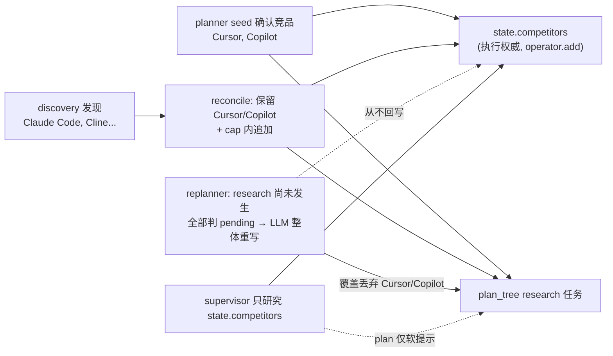

# 根治 plan/执行分叉、无交付物 finalize、前端进度易失

## 根因（实测 run_546e98248e0e，已坐实，非推测）

- **RC1 双真相源分叉**：`state.competitors` 是 supervisor 真正研究的执行权威；`plan_tree` 的 research 竞品只是计划/UI。[reconcile_plan_tree_after_discovery](backend/app/agents/nodes/planner.py) 本会保留确认竞品并在 cap 内追加，但其后的 [replanner_node](backend/app/agents/nodes/replanner.py) 在 `researched_competitors=[]` 时把所有 research 任务判 pending、让 LLM 整体重写（`merged_tasks = [] + capped_pending`），覆盖丢弃了 Cursor/Copilot；且 replanner 从不回写 `state.competitors`。结果：plan 说研究 Claude Code/Cline，执行研究 Cursor/Copilot，永久分叉。
- **RC2 Finalize 无交付物不变量**：[supervisor_node](backend/app/agents/nodes/supervisor.py) 末段在 `report_draft_done=False` 时仍可判 `status="completed"`，实测产出 `report_char_count=0` 的"成功" run。上一轮的 max-iteration grace write 只是窄补丁，覆盖不了 LLM 提前 Finalize。
- **RC3 前端进度易失**：[LiveRunPage](frontend/src/pages/LiveRunPage.tsx) 的 `planTaskStatus/toolActivity/evidenceFeed` 是 `useState`，仅由实时 SSE 填充；进证据页会卸载重挂、SSE 无回放 → 归零。

## 架构决策（RC1 由我定夺）

选**执行权威 + 硬不变量**，不选 plan 权威。理由：`state.competitors` 已是文档化的执行硬约束载体，supervisor 的 fallback/clamp/QA 重研全部 key 在它上面；翻成 plan 权威要改动这些全部路径，blast radius 大，而我们刚因 plan 层大改吃了回归。执行权威改动局部、可加 fail-fast 不变量让分叉崩溃在边界而非静默造假。

## Fix 1 — 单一真相源 + 不变量（RC1）

在 [replanner_node](backend/app/agents/nodes/replanner.py)：
- **保护已确认/已研究竞品**：partition 后，把 stage=research 且 competitor 已在 `state.competitors`（确认+发现 reconcile 注入）或已 researched 的任务视为受保护，强制并入 `merged_tasks`，LLM 只能在剩余 budget 内**追加**新发现竞品，不能删除/替换。
- **回写 state.competitors**：节点返回时计算 revised plan 的 research 竞品集，对 `state.competitors` 做 delta append（新增未在 state 的），让 supervisor 后续能真正研究到它们。
- 在 [REPLANNER_SYSTEM_PROMPT](backend/app/service/llm/prompts.py) 增约束：never remove/replace existing research competitors; only add discovered ones within budget。

不变量守卫（fail fast，不静默）：
- 在 replanner 与 reconcile 产出 plan 后，断言 `plan 研究竞品 ⊆ state.competitors`（回写后应恒成立）；违反则 `log.error` + 抛错，让问题崩在边界。

## Fix 2 — Finalize 交付物不变量，替换 grace write（RC2）

在 [supervisor_node](backend/app/agents/nodes/supervisor.py)：
- 删除上一轮新增的 `iteration > supervisor_max_iterations` 专用 grace-write 分支。
- 新增统一守卫 `_enforce_deliverable_before_finalize`，作用于**任何**来源（LLM/fallback/qa/max-iter）的 Finalize 决策：
  - 若 `report_draft_done=False` 且 plan 存在 enabled write 任务且 `decisions` 中无历史 Write → 覆盖为 Write（路由 writer 一次）。
  - 否则（writer 已尝试过 / 无 write 任务）→ 保留 Finalize，但强制 `status="degraded"`、`completion_reason="fallback_path"`，绝不 `completed`。
- 收紧 `status` 判定：`completed` 必须满足"报告已生成"，否则降级。

## Fix 3 — 进度状态提升到按 runId 持久 store（RC3，轻量）

- 新建 `frontend/src/stores/liveRunProgress.ts`：模块级 `Map<runId, ProgressState>` + `useSyncExternalStore`，存 `planTaskStatus/toolActivity/evidenceFeed/pendingFollowUps`，提供 subscribe/getSnapshot/setter。
- [LiveRunPage](frontend/src/pages/LiveRunPage.tsx) 改为从 store 读写，SSE 回调更新 store；组件重挂时从 store 读回，路由切换不归零。
- SSE 订阅按 runId 提升为 ref-count 持有（[sse.ts](frontend/src/api/sse.ts) 同 runId 复用单连接、延迟 teardown），离开证据页期间事件不中断。
- 明确局限（用户已知悉）：硬刷新仍会丢、不解决跨设备/历史；研究任务进度块能变绿的前提是 Fix 1 让 plan 竞品与实际研究竞品一致。

## 验证

- 后端 targeted pytest：[test_replanner_node.py](backend/app/tests/test_replanner_node.py)（新增：discovery 触发不丢确认竞品 + 回写 state.competitors + 不变量）、[test_supervisor_batch.py](backend/app/tests/test_supervisor_batch.py)（新增：report_draft_done=False 的 Finalize 被改路由 writer；writer 已跑过则降级；删除 grace-write 旧测试改写为不变量测试）；回归 reconcile/intake/golden。
- 复现实测场景的端到端单测：确认竞品 + discovery 后，最终 plan 研究竞品 = 实际研究竞品，且终态有报告。
- 前端 `npm run type-check`；手测：进证据页返回后进度不归零。
- 不提交，跑完汇报。