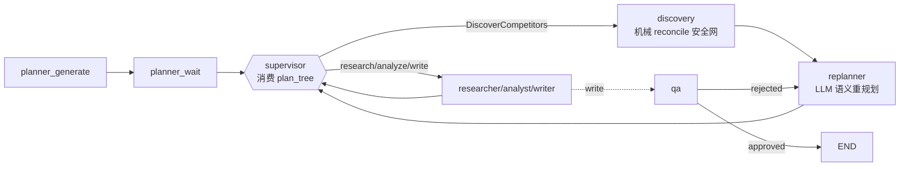

# Plan Tree 成熟化:replanner + supervisor 消费 + archetype 编排

## 目标形态

把 `plan_tree` 从「给人看/给人改的预览件」升级为「活的执行契约」:planner 按 archetype 生成它,replanner 在执行期维护它,supervisor 受它约束推进。

新增两条边:`discovery -> replanner -> supervisor`、`qa(rejected) -> replanner -> supervisor`;其余拓扑不变。

## 已定决策(替用户拍板的部分)

- **replanner 触发**:仅 discovery 完成后 + QA 打回时(用户选 key_nodes)。
- **replanner vs 机械 reconcile**:[reconcile_plan_tree_after_discovery](e:\0找工作\0大模型全栈知识库\RivalLens\backend\app\agents\nodes\planner.py) 保留为 deterministic 安全网;replanner 在其之上做语义重规划;LLM 失败时 replanner no-op 原样返回当前 plan_tree。
- **replanner 职责边界**:只重写 plan_tree 中「未完成」任务(增删改 title/description/focus_dimensions/重排),bump version,emit `plan.revised`。**不**决定下一步执行动作(那仍是 supervisor 职责)。
- **supervisor 约束强度**:强 hint(把 plan_tree 喂进 prompt + 加一条 system 规则),保留现有 fallback / `_decision_from_qa_feedback` / guardrail 安全网,不改成硬约束逐 task 执行。
- **landscape 编排形态**:`discover×1(必做) -> research×N(赛道样本) -> analyze×2(whitespace 机会地图 + 趋势/格局) -> write×1(机会导向 framing)`;comparison 保持现状。第一版不引入 `competitor_id=null` 的主题级 research(避免波及 schema/supervisor/reconcile),留作后续迭代。
- **防循环**:`AgentState` 加 `replan_count`,以 `TierProfile` 上限(debug/quick/deep 不同)限制 replanner 触发总次数;超限则跳过 replanner 直接回 supervisor。

## 改造 1:LLM replanner 节点

- prompts:[service/llm/prompts.py](e:\0找工作\0大模型全栈知识库\RivalLens\backend\app\service\llm\prompts.py) 新增 `REPLANNER_SYSTEM_PROMPT` + `build_replanner_user_prompt` / `build_replanner_fallback_user_prompt` / `build_replanner_repair_user_prompt`;在 [__init__.py](e:\0找工作\0大模型全栈知识库\RivalLens\backend\app\service\llm\__init__.py) 导出。
- schema:[schemas/agent_outputs_pipeline.py](e:\0找工作\0大模型全栈知识库\RivalLens\backend\app\schemas\agent_outputs_pipeline.py) 新增 `ReplannerOutput`(`rationale` + `tasks: list[PlannerTaskDraft]`,复用 `PlannerTaskDraft`),`parse_llm_content(content, *, draft)`;[agent_outputs.py](e:\0找工作\0大模型全栈知识库\RivalLens\backend\app\schemas\agent_outputs.py) 再导出。
- 节点:新建 `backend/app/agents/nodes/replanner.py`,`replanner_node`:
  - 输入上下文(控成本,第一版不喂全量 evidence):`plan_tree` + `intake_draft` + 执行状态(`researched_competitors` / `discovered_competitors` / `analysis_done` / `report_draft_done`)+ 触发来源(`discovery` / `qa_rejection` + `qa_reasons`)。
  - 拆分当前 tasks:已完成(discover + researched 竞品的 research)保留;LLM 仅重写未完成部分;合并后经 `_cap_plan_tasks_for_profile` 收口,`version+1`。
  - 复用 `complete_structured(model_slot="research", ...)`;`harness_result.value is None` → no-op 返回原 plan。
  - persist `Run.plan_tree` + emit `RunEventType.PLAN_REVISED`(payload 带完整 `plan_tree`,仿 `plan.reconciled`)。
  - `replan_count+1`;触发前查上限。
- 触发来源识别:用 `AgentState` 现有信号(进入 replanner 前 `qa_outcome in {rejected}` 判 qa;否则判 discovery)。
- graph:[agents/graph.py](e:\0找工作\0大模型全栈知识库\RivalLens\backend\app\agents\graph.py) 注册 `replanner` 节点;`add_edge("discovery","replanner")`、`add_edge("replanner","supervisor")`;改 `_route_after_qa`:rejected -> `replanner`(approved -> END 不变)。
- 事件:[service/event_bus/bus.py](e:\0找工作\0大模型全栈知识库\RivalLens\backend\app\service\event_bus\bus.py) `RunEventType` 加 `PLAN_REVISED = "plan.revised"`。
- state:[agents/state.py](e:\0找工作\0大模型全栈知识库\RivalLens\backend\app\agents\state.py) 加 `replan_count: int`(非 accumulator,整值覆盖)。

## 改造 2:supervisor 消费 plan_tree

- [service/llm/prompts.py](e:\0找工作\0大模型全栈知识库\RivalLens\backend\app\service\llm\prompts.py):`build_supervisor_user_prompt` / `build_supervisor_fallback_user_prompt` / `build_supervisor_repair_user_prompt` 增加 `plan_tree: dict | None` 参数;新增 `_format_plan_tree_for_supervisor(plan_tree, researched_competitors)`,列出 enabled 且未完成的任务(stage/title/competitor_id/focus_dimensions)。
- `SUPERVISOR_SYSTEM_PROMPT` 增加一条规则:优先推进 plan_tree 中 enabled 且未完成的任务;偏离需在 `reasoning_summary` 说明理由。
- [agents/nodes/supervisor.py](e:\0找工作\0大模型全栈知识库\RivalLens\backend\app\agents\nodes\supervisor.py):三处 prompt builder 调用传入 `state.get("plan_tree")`;保留 `_extract_user_pinned_research` / 现有 guardrail 不动。

## 改造 3:planner 按 archetype 编排

- [service/llm/prompts.py](e:\0找工作\0大模型全栈知识库\RivalLens\backend\app\service\llm\prompts.py):`PLANNER_SYSTEM_PROMPT` 的 Composition rules 按 `analysis_archetype` 分叉(comparison 维持;landscape = discover 必做 + research 样本 framing + analyze×2 机会地图/趋势 + write 机会导向);`build_planner_user_prompt` 已传整包 intake_draft(含 archetype),无需改签名。
- [agents/nodes/planner.py](e:\0找工作\0大模型全栈知识库\RivalLens\backend\app\agents\nodes\planner.py):`_fallback_tasks` 按 archetype 分叉(landscape 产出 2 个 analyze 任务:`whitespace 机会地图` + `趋势/格局`)。
- [schemas/agent_outputs_pipeline.py](e:\0找工作\0大模型全栈知识库\RivalLens\backend\app\schemas\agent_outputs_pipeline.py):`PlannerOutput.parse_llm_content` 放宽 analyze 数量(允许 landscape 下 >1),research 仍要求 `competitor_id`。

## 前端

- [frontend/src/api/sse.ts](e:\0找工作\0大模型全栈知识库\RivalLens\frontend\src\api\sse.ts):加 `plan.revised` listener(复用 `invalidateRunDetail` + `invalidateRunTrace`,与 `plan.reconciled` 一致);可选加 `onPlanRevised` 回调类型。
- [frontend/src/api/types.ts](e:\0找工作\0大模型全栈知识库\RivalLens\frontend\src\api\types.ts):`PlanTree` 补 `competitor_sources`(对齐后端,可选)。LiveRunPage 的 `v{version}` badge + plan 重拉已能反映 replanner 更新,无需额外改动。

## 验证

- 后端 targeted pytest(dev 容器):replanner 节点(discovery 触发 / qa 触发 / LLM 失败 no-op / 超限跳过)、supervisor 消费 plan_tree、planner archetype 分叉(comparison vs landscape 拓扑);回归 `test_plan_reconcile` / `test_intake_flow` / supervisor 相关 / golden runner。
- 前端 `npm run type-check`。
- 不做提交,完成后汇报改动与验证结果。