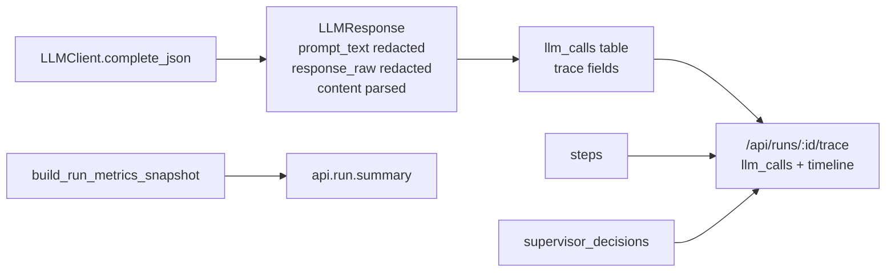

# S2：内容可观测合同（二级 plan）

## 背景

一级总纲 S0/S1 已完成。S2 解决的是“可观测性合同”而不是业务行为：当前系统能看见节点大致流转，但不能稳定回答这些问题：

- 这次 LLM 到底收到了什么 prompt、输出了什么结构化内容、为什么 schema repair/fallback？
- 一次 run 总共花了多少 token、多久、哪些 agent 最慢/最贵？
- Discovery 为什么选出这些竞品？QA 具体是哪条规则/语义 finding 拦住？Researcher 子图工具调用能否和外层 step 对齐？
- `/trace` 里 Step 与 SupervisorDecision 分离，排障时要人工拼时间线。
- 高频 heartbeat / llm.call.start / provider+client 双层 error 让有效日志被噪声淹没。

本 plan 覆盖总纲 S2-1..S2-9，目标是“行为可回放、成本可聚合、失败可定位、日志不过载”。

## 当前实证

- `[backend/app/models/llm_call.py](backend/app/models/llm_call.py)` 只存 `prompt_hash`、tokens、latency、error，不存 prompt/response 内容。
- `[backend/app/service/llm/client.py](backend/app/service/llm/client.py)` 只记录 `prompt_preview_len`，`LLMResponse` 只有 256 chars `prompt_preview` 和 parsed `content`。
- `[backend/app/router/run_rt.py](backend/app/router/run_rt.py)` 终态只 `log.info("api.run.execute.finish", status=...)`，没有 run 级 token/latency/cost summary。
- `/api/runs/{run_id}/trace` 只返回 `steps` + `supervisor_decisions`，没有 LLM calls，也没有按时间排序的 interleaved timeline。
- `[backend/app/agents/nodes/discovery.py](backend/app/agents/nodes/discovery.py)` `discovery.complete` 只打 count/query，不打发现名单和 snippet sample。
- `[backend/app/service/qa/engine.py](backend/app/service/qa/engine.py)` `qa.fast_path`/`qa.slow_path` 有计数但缺 failed rule ids / semantic finding preview / promoted blocked ids。
- `[backend/app/agents/nodes/researcher.py](backend/app/agents/nodes/researcher.py)` outer `step_id` 在 subgraph 结束后才生成，subgraph 内 tool logs/events 无法绑定 step。
- `[backend/app/service/llm/providers.py](backend/app/service/llm/providers.py)` 与 `[backend/app/service/llm/client.py](backend/app/service/llm/client.py)` 都发 `llm.call.error`，字段不同，告警去重困难。

## 安全边界

- **不把 full prompt/response 打进普通日志**。日志只允许 hash、长度、计数、preview、error_class、rule ids 等安全字段。
- LLM 内容回放落 DB 的 `llm_calls` 扩展字段，必须先做 redaction + truncation。敏感词/token/API key/Bearer/password 等必须在持久化前脱敏。
- 失败路径全量记录；成功路径本阶段也记录（demo/本地工程需要可回放），后续如需采样再单开成本优化。
- 不新建外部依赖；不做 dashboard/alert 系统；不改前端 UI（API 响应可向后兼容增加字段）。

---

## 刀 S2-A：LLM trace 持久化合同（S2-1）

目标：让每条 LLM call 可回放（redacted/capped），不再只靠 hash。一个原子提交。

### 文件与改法

1. 新建 `[backend/app/service/llm/trace.py](backend/app/service/llm/trace.py)`
   - 提供 `redact_trace_text(value: str) -> str`：脱敏 `sk-*`、`Bearer ...`、`api_key/password/token/secret` 等常见模式。
   - 提供 `truncate_trace_text(value: str, limit: int = 20000) -> str`。
   - 提供 `serialize_response_content(content: dict[str, object], limit: int = 20000) -> str` 或返回 JSON-safe dict/preview。
   - 只做函数，不做 wrapper class。

2. `[backend/app/service/llm/response.py](backend/app/service/llm/response.py)`
   - `LLMResponse` 增加可选字段：
     - `prompt_text: str | None = None`（redacted + capped 的 system/user 合并文本）
     - `response_raw: str | None = None`（redacted + capped 的 provider raw content；fake client 可为 None）
   - `to_dict()` 同步输出这两个字段，保证 researcher subgraph 的 `llm_calls` list 能带上新 trace 字段。

3. `[backend/app/service/llm/client.py](backend/app/service/llm/client.py)`
   - 构建 response 时填充 `prompt_text` 与 `response_raw`。
   - legacy_stub、primary success、format error、request fallback success/error 路径都要覆盖。
   - 保持日志不输出 `prompt_text`/`response_raw`，继续只打 hash/len。

4. `[backend/app/models/llm_call.py](backend/app/models/llm_call.py)` + Alembic migration `0016_add_llm_trace_fields.py`
   - 增加字段：
     - `prompt_text: Text | None`
     - `response_content: JSONB | None`（parsed content）
     - `response_raw: Text | None`
     - `prompt_preview: Text | None`（当前 Step payload 里分散存了 preview，统一进 LLMCall）
     - `fallback_used: Boolean | None`
     - `fallback_reason: Text | None`
   - migration down_revision = `0015_add_run_create_requests`。

5. 新建 `[backend/app/service/llm/records.py](backend/app/service/llm/records.py)`
   - 提供 `build_llm_call_record(*, step_id: str, response: LLMResponse, error: str | None = None) -> LLMCall`。
   - 集中填充所有 LLMCall 字段，避免 9 个构造点漏字段。

6. 更新所有 `LLMCall(...)` 构造点改用 `build_llm_call_record`：
   - `[backend/app/agents/nodes/supervisor.py](backend/app/agents/nodes/supervisor.py)`
   - `[backend/app/agents/nodes/intake.py](backend/app/agents/nodes/intake.py)`
   - `[backend/app/agents/nodes/planner.py](backend/app/agents/nodes/planner.py)`
   - `[backend/app/agents/nodes/researcher.py](backend/app/agents/nodes/researcher.py)` (`_build_llm_call_rows` 用 `LLMResponse` 或 dict helper 转换)
   - `[backend/app/agents/nodes/analyst.py](backend/app/agents/nodes/analyst.py)`
   - `[backend/app/agents/nodes/writer.py](backend/app/agents/nodes/writer.py)`
   - `[backend/app/agents/nodes/qa.py](backend/app/agents/nodes/qa.py)`
   - `[backend/app/agents/nodes/skill_curator.py](backend/app/agents/nodes/skill_curator.py)`
   - `[backend/app/service/skill_curator/tasks.py](backend/app/service/skill_curator/tasks.py)`

### Tests / Verify

- `tests/test_logger_redaction.py`：新增断言 prompt/raw response 不进入 stdout 日志；DB trace helper 会脱敏 fake key。
- 新增或扩展 `tests/test_llm_harness.py` / `tests/test_llm_client.py`：`LLMResponse.prompt_text/response_raw` 被填充且不泄露 fake secret。
- 新增 `tests/test_llm_trace_persistence.py`：构造 `build_llm_call_record`，断言 `prompt_text/response_content/response_raw/fallback_used` 填充正确。
- Docker：`alembic upgrade head` + `pytest tests/test_llm_client.py tests/test_llm_harness.py tests/test_logger_redaction.py tests/test_smoke.py -q`。
- Done-when：`llm_calls` 能回放 redacted prompt + parsed response；普通日志仍不含 prompt/secret。

---

## 刀 S2-B：run 级 summary + interleaved trace timeline（S2-2/S2-6）

目标：一次 run 结束时有单条成本/时延摘要；`/trace` 返回可直接排障的合并时间线。一个原子提交。

### 文件与改法

1. `[backend/app/service/metrics/engine.py](backend/app/service/metrics/engine.py)`
   - 保留现有 `RunMetricsSnapshot`，可补充：`llm_prompt_tokens_total`、`llm_completion_tokens_total`、`llm_latency_max_ms`（如果不想改响应过大，至少内部 summary log 计算这三项）。

2. `[backend/app/router/run_rt.py](backend/app/router/run_rt.py)`
   - 在 `_execute_run_graph` 终态 `RUN_FINISH` 后调用 `_log_run_summary(run_id, status)`。
   - `_log_run_summary` 查询 Run/Evidence/Step/LLMCall/SupervisorDecision/SkillCandidate，复用 `build_run_metrics_snapshot`，发一条：
     - event: `api.run.summary`
     - fields: `status`, `run_wall_clock_seconds`, `llm_call_count`, `llm_token_total`, `llm_latency_p50_ms`, `coverage_rate`, `evidence_count_total`, `qa_rejection_rate`, `supervisor_iterations`
   - 失败状态也尽量打 summary；查询失败只记录 `api.run.summary.failed`，不能影响 run finish。

3. `[backend/app/router/run_rt.py](backend/app/router/run_rt.py)` `/api/runs/{run_id}/trace`
   - 增加响应模型：
     - `LLMCallTraceResponse`：`id/step_id/model_slot/provider/model_name/prompt_hash/prompt_preview/prompt_tokens/completion_tokens/latency_ms/error/fallback_used/fallback_reason/created_at`（默认不返回 `prompt_text/response_raw`，避免前端默认暴露全文；如需要全文，后续单开 authenticated detail endpoint）。
     - `TraceTimelineItemResponse`：`kind` (`step`/`decision`/`llm_call`), `timestamp`, `step_id`, `agent_name`, `summary`, `payload`。
   - 查询 `LLMCall` rows，按 `created_at` 排序。
   - 生成 `timeline`：merge Step.created_at/finished_at、SupervisorDecision.created_at、LLMCall.created_at。
   - 保持原字段 `steps`/`supervisor_decisions` 不变，向后兼容。

### Tests / Verify

- `tests/test_run_metrics.py`：新增 run 完成后 capsys 或 mock log 验证 `api.run.summary` 字段存在（如果 capsys 不稳定，可单测 `_build_run_summary_fields`）。
- 新增/扩展 `tests/test_smoke.py` 或 `tests/test_run_trace.py`：`GET /api/runs/{id}/trace` 包含 `llm_calls` 和 `timeline`，timeline timestamps 单调，且不包含 `prompt_text`/`response_raw`。
- Docker：`pytest tests/test_run_metrics.py tests/test_smoke.py -q` + full suite。
- Done-when：排障无需手工 join Step/Decision/LLMCall；run 结束日志有一条汇总。

---

## 刀 S2-C：Discovery / QA / Researcher 内容字段补齐（S2-3/S2-4/S2-5）

目标：关键节点的“为什么”可见，但不泄露全文。一个原子提交。

### 文件与改法

1. `[backend/app/agents/nodes/discovery.py](backend/app/agents/nodes/discovery.py)`
   - 搜索循环中收集 `snippet_samples`（最多 3 条）：`source_title/source_url/source_type/quote_preview/query`，quote_preview 截断 220。
   - `discovery.complete` 日志增加：`discovered_competitors=discovered`, `snippet_samples=snippet_samples`, `extract_outcome=harness_result.outcome`（若可得）。
   - Step payload 增加 `snippet_samples`（当前已存 `discovered_competitors`、`snippet_count`、`extract_error`）。

2. `[backend/app/service/qa/engine.py](backend/app/service/qa/engine.py)`
   - `qa.fast_path` 日志增加：`failed_rule_ids`, `blocking_failed_rule_ids`, `promoted_qa_rule_ids`, `promoted_qa_blocked_rule_ids`, `promoted_qa_enforced_count`, `promoted_qa_parse_error_count`。
   - `qa.slow_path` 日志增加：`failed_rule_ids`, `semantic_finding_preview`（来自 semantic_output finding，截断 300）, `semantic_reject_to`, `semantic_severity`, `schema_error`（harness_result.schema_error）。
   - 保持 QA payload 已有字段不删。

3. `[backend/app/agents/nodes/researcher.py](backend/app/agents/nodes/researcher.py)` + `[backend/app/agents/subgraphs/researcher.py](backend/app/agents/subgraphs/researcher.py)`
   - 在 `researcher_node` 中提前生成 `step_id`，在 subgraph 调用前 emit STEP_START 并（可选）先创建 running Step；把 `step_id` 注入 `ResearcherSubState`。
   - 扩展 `ResearcherSubState` TypedDict 增加 `step_id: str | None`。
   - subgraph 内 `tool_exec/compress/finalize` 使用 `bind_step(step_id)` 包裹 structlog；`TOOL_START/TOOL_FINISH` emit 时带 `step_id`。
   - `researcher.tool_call` 增加 `snippet_count`, `latency_ms`, `source_type_distribution`（如果从 observation 可得）。
   - 注意保持现有 evidence persistence 行为不变。

### Tests / Verify

- `tests/test_phase3_events.py`：更新 researcher tool events 断言 step_id 存在。
- `tests/test_researcher_subgraph.py`：若 substate 新增可选 step_id，旧测试不应强制改；新增一个用例验证 `bind_step`/event step_id。
- `tests/test_smoke.py` 或新增 `tests/test_discovery_observability.py`：discovery step payload 包含 `snippet_samples`。
- QA 单测：针对 `evaluate_report` 日志字段可用 caplog/capsys 验证 failed_rule_ids/promoted counts。
- Done-when：Discovery/QA/Researcher 三个排障入口能从日志或 trace 看到内容摘要与失败原因。

---

## 刀 S2-D：日志降噪与错误去重（S2-7/S2-8/S2-9）

目标：减少高频低价值日志，统一 LLM 错误事件语义。一个原子提交。

### 文件与改法

1. `[backend/app/router/run_rt.py](backend/app/router/run_rt.py)`
   - `_RUN_PROGRESS_INTERVAL_SECONDS = 60` 调整为更低噪声策略：
     - 方案：保持 heartbeat event 给 SSE，但 structlog `run.progress` 只在 phase/next_node 变化或每 N 次输出；若当前代码只打 heartbeat 日志，则改为 `log.debug` 或增加 `elapsed_seconds`/`phase` 后每 180s。
   - 不影响 SSE 客户端心跳。

2. `[backend/app/service/llm/client.py](backend/app/service/llm/client.py)`
   - `llm.call.start` 从 `info` 降为 `debug`（finish 已有完整结果，start 信息低价值）。
   - 保留 `llm.call.retry`, `llm.call.fallback`, `llm.call.finish` 为 info/warning 级别。
   - 更新 `tests/test_logger_redaction.py` 不再要求 start 一定出现在 INFO 日志，改断言 finish 不泄露 prompt。

3. `[backend/app/service/llm/providers.py](backend/app/service/llm/providers.py)` + `[backend/app/service/llm/client.py](backend/app/service/llm/client.py)`
   - provider 层事件从 `llm.call.error` 改名为 `llm.provider.error`（或降为 debug），client 层保留唯一业务级 `llm.call.error`。
   - 字段统一：`model_slot`（provider 层没有则省略）、`provider`, `error_class`, `http_status`, `retryable`, `attempt`, `error_preview`。
   - 目的：告警只订阅 `llm.call.error`，provider 细节可查但不重复告警。

### Tests / Verify

- `tests/test_logger_redaction.py` 更新/新增：INFO 中没有 `llm.call.start`，但有 `llm.call.finish`；provider error 不重复成两个 `llm.call.error`。
- LLM failure path 单测：终端失败只出现一个 client-level `llm.call.error`。
- Docker full suite。
- Done-when：一次 LLM 失败不会产生两个同名 error 事件；成功路径不再每次 start+finish 成对刷屏。

---

## 执行纪律（PIV）

- 每刀先跑 docker full baseline（当前 S1 后基线：`223 passed`，但 S5-1 是已知 flaky；若单独失败，记录为 S5，不在 S2 中硬修）。
- 一刀一组原子提交：
  - S2-A `feat(observability): persist redacted llm trace fields`
  - S2-B `feat(trace): add run summary and interleaved timeline`
  - S2-C `feat(observability): surface discovery qa and researcher detail fields`
  - S2-D `fix(logging): reduce llm and heartbeat noise`
- 不使用 `git add .`；只 stage 本刀相关文件。
- 任何 prompt/response 相关变更提交前跑 `python scripts/scan_secrets.py --staged`。
- 同一刀连续失败 3 次则 revert 该刀并重拆。

## 收尾回写总纲

S2-A..S2-D 完成后，更新一级总纲：S2 `status=completed`，§4 增补 S2 收尾证据（提交号、docker full、trace 字段、run summary 日志、S5 flaky 是否仍存在）。若执行中发现新的结构性问题，按总纲方法论新增阶段或条目，不塞进 S2。
