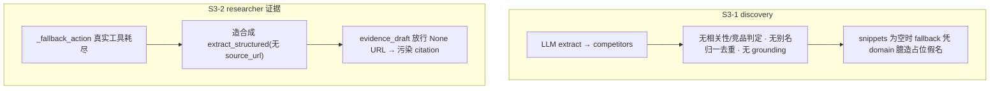

# S3 数据质量(LLM-first · 绝不伪造)

## 贯穿心智(本阶段确立,并回写总纲统一心智)

ToB 竞品分析是高代价、高延迟过程,报告质量决定"能不能用"。据此本阶段及后续遵循三条硬原则:

1. **质量优先于延迟/成本** —— 不为省 token/延迟而把语义任务降级成脆弱硬规则。
2. **LLM-first** —— 相关性判定、竞品识别、别名归一这类语义任务优先用模型;确定性代码只做模型输出的后处理护栏(去重/grounding 校验)。
3. **绝不伪造(No fabrication)** —— 证据必须源自真实工具观测且可溯源;拿不到就诚实留白并标记"未覆盖",绝不合成假证据/假竞品。这条 [prompts.py](backend/app/service/llm/prompts.py):324-325 已对 researcher 声明,但代码层未兑现。

## 现状问题(已审计)

- S3-1: [discovery.py](backend/app/agents/nodes/discovery.py):167 `discovered = list(harness_result.value.competitors)` 直接采用 LLM 名单,无任何过滤;无 snippet 时 `build_discovery_extract_fallback_user_prompt` 凭 `domain_context` 臆造。
- S3-2: [researcher.py](backend/app/agents/subgraphs/researcher.py):384-397 fallback 构造合成 `extract_structured`(无 `source_url`),[researcher.py](backend/app/agents/subgraphs/researcher.py):602-603/632 `_append_evidence_drafts` 明确放行 `source_url=None`,合成证据带空 URL 进入最终 citation。

## 刀 S3-A [数据质量] discovery 相关性/grounding/去重(LLM-first)

- **Files**: [agent_outputs.py](backend/app/schemas/agent_outputs.py)(`DiscoveryExtractOutput`)、[prompts.py](backend/app/service/llm/prompts.py)(`DISCOVERY_EXTRACT_*`)、[discovery.py](backend/app/agents/nodes/discovery.py)。
- **Changes**:
  - 扩展 `DiscoveryExtractOutput`:候选项从纯 name 升级为结构化 `{name, is_competitor, relevance_reason, evidence_quote}`(LLM 显式判定是否真竞品 + 给出来自 search_results 的 grounding 引文)。
  - 强化 `DISCOVERY_EXTRACT_SYSTEM_PROMPT`:只能从 `search_results` 提取;对每个候选判定 `is_competitor` 与相关性并给 `evidence_quote`;明确禁止臆造不在结果中的名字。
  - `discovery_node` 后处理护栏(确定性):过滤 `is_competitor=false`/低相关项、别名归一(lowercase + 去标点)后 `stable_unique` 去重、grounding 校验(`evidence_quote` 必须能在 `all_snippets` 中定位,定位不到则丢弃并记日志)。
  - 去占位假名:`build_discovery_extract_fallback_user_prompt` 不再凭 domain 产出假名;无搜索结果时 discovery 诚实标记"无可用搜索结果,未发现竞品",不臆造。
  - 可观测:复用 S2 的 `discovery.complete`,增 `filtered_out_competitors`/`relevance` 字段。
- **Verify**: 新增 discovery 相关性过滤/别名去重/grounding-miss 丢弃单测;docker targeted(discovery/phase3) + 关注 `discovery.complete` 字段。
- **Done-when**: 跑题/重复/无 grounding 候选被过滤;无 snippet 时不产假名;真竞品保留且去重。

## 刀 S3-B [数据质量] 根除 researcher 合成证据 + 空证据成熟降级

- **Files**: [researcher.py](backend/app/agents/subgraphs/researcher.py)(`_fallback_action`)、必要时 analyst/writer 降级与 risk_flag。
- **Changes**:
  - 移除 [researcher.py](backend/app/agents/subgraphs/researcher.py):384-397 合成 `extract_structured` 分支:真实工具(search_web/fetch_url)耗尽后直接 `finalize`,兑现 prompt 已声明的"Evidence can only come from tool observations"。
  - 空证据维度成熟降级:复用 [agent_outputs.py](backend/app/schemas/agent_outputs.py):277-309 `WriterReportOutput` 已有的"丢弃无证据 section"机制,补 risk_flag/日志诚实标注"该维度未覆盖",报告留白而非伪造;仅当全维度零证据时才走整体降级(合理失败)。
  - 不做全局"无 URL 一律不入库"一刀切(避免误伤 fetch_url 正文抽取等合法无 URL 场景);根除伪造源更精准。
- **Verify**: researcher fallback 不再产合成证据的单测;部分维度有真实证据/部分空时报告仍可产出且空维度被标注;docker full(S5-1 两例仍正交红,见总纲 §4.2)。
- **Done-when**: 任何 evidence_draft 的 source 都来自真实工具观测;无证据维度诚实留白并可观测。

## 刀 S3-C 统一心智回写总纲(活文档)

- 在 [系统纠偏总纲](.cursor/plans/系统纠偏总纲_7d21aa68.plan.md) 新增"质量优先 / LLM-first / 绝不伪造"原则段,作为 S3 及后续阶段的统一心智锚;S3 收尾回写完成证据。

## 验证基线

- 进入前快照:S2 后 docker `pytest tests` = 228 passed / 2 failed(2 例为 S5-1,正交)。
- S3 后:非 S5-1 用例保持全绿 + 新增 S3 用例通过;每刀 staged secret scan 通过;一刀一原子提交。

## 明确不做(YAGNI)

- 不引入外部竞品库/检索新依赖;不改 FE/SSE;不在本阶段动 S5-1(QA 后台 enforcement)。
