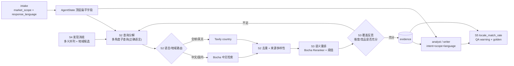

# 上游数据地域化总纲（DAQ 计划族 · Layer-1）

> 问题地图 + 阶段划分，不含文件级改法 / Verify。每阶段进入时单独调研代码再产出 Layer-2 plan（带 Files/Changes/Verify/Done-when 的 5-9 个 slice）。审计依据：[docs/e2e-audit-2026-06-08-data-acquisition.md](docs/e2e-audit-2026-06-08-data-acquisition.md)。

## 参考架构（不自研，采用公开成熟范式）

上游采集按业界研究型检索管线落地，参考来源：

- GPT Researcher（assafelovic/gpt-researcher）：planner/executor + 查询分解为多角度子查询 + 并行多源采集 + 结果聚合/筛选。
- Perplexity 深度研究管线拆解：混合检索 + 多层重排（强调「重排是质量头号杠杆，宁可丢弱源重查」）+ 去重/来源多样性 + 引用绑定 + 证据不足显式弃答。
- Self-RAG / Deep Research loop：覆盖度反思（充分性/矛盾/多样性不足则补采）。

采用其**管线形态**，按赛题工期裁剪：不做自建索引/自建爬虫/本地 BM25+向量混排/无头浏览器（属 6-18 月护城河，明确不在范围）。重排与中文检索用现成 API（博查）。

## 锁定决策（写码前已定）

- 中文渠道 = 博查 Bocha（`api.bochaai.com/v1/web-search`，国内 Agent 搜索事实标准、合规不出境、DeepSeek/扣子/钉钉官方推荐）；全球/英文 = Tavily 原生 `country` 参数。二者经 provider 抽象做地域路由 + 失败兜底。
- 重排 = 博查 Semantic Reranker API（段落级、当前限时免费）。
- 依赖与密钥：博查走纯 REST（复用现有 `httpx`，无新 PyPI 依赖）；新增 `BOCHA_API_KEY` 仅入 `.env`，`.env.example` 占位，不入库。
- 成熟方案优先，不打补丁：`response_language` 作为一等契约字段全链路贯通，禁止产出端临时塞语言指令；`INTAKE_PATCHABLE_FIELDS` 缺字段按契约修复。
- 旧路径（Tavily-only、无地域、无重排）保留兜底到 parity 稳定再撤旧（branch-by-abstraction 灰度替换）。
- 降级预案：若博查 key 无法及时到位，S2/S3 退化为「火山 web_search（赛事额度）+ Tavily country + 轻量启发式重排」，管线骨架不变，仅替换 provider/reranker 实例。

## 修正决策（2026-06-08，跨语言广度纠偏）

初版 DAQ 把「中文用户」等同「中国市场」,导致地域护栏矫枉过正:中文提问问全球话题也被按「中文源占比不足」告警,且检索单 provider 二选一收窄广度。对照成熟方案(CrossRAG / Deep Research「home turf」/ Felo 跨语言检索)纠偏,落地原则:

- **语言≠市场**:地域只由 `market_scope` 显式判定;`response_language` 只决定**输出语言**,不再触发 china。修 `target_country_from_scope`(只看 market_scope)。
- **检索跨语言广度**:S2 router 由「单 provider + 失败兜底」改为**双路并行召回 + 跨 provider 合并去重**;`provider_order` 仅作侧重(home 语言 provider 排前),不排除另一路。best info wins,与承载语言无关。
- **合成翻译**:analyst/writer 增 CrossRAG 规则——外文证据**翻译进 response_language**,溯源 URL/ids 留原文。
- **护栏改覆盖底线**:S5 `rule_locale_mismatch` 仅当 market_scope **显式锁定**地域、且该地域一手源**低于覆盖底线(0.2)**才 warning;无显式地域则跳过。`locale_match_rate` 退为「显式地域的覆盖度」观测,不再是「中文源越多越好」。
- **多语言扩展(亮点,已实现+测试)**:检索由「双 provider」泛化为「**语言腿(language legs)**」模型——`plan_search_languages`(home 语言→en→market 隐含语言→显式 hint)规划目标语言集,每语言映射最佳引擎+`country`(zh→博查;ja/ko/de/fr/es/…→Tavily country 定位;en→全球)。market_scope 自动加语言(`日本市场`→ja、英文用户问`中国市场`→自动加 zh 博查),小语种可经 `search_languages` 显式扩展。加新语言只需补 `country_for_language` 映射,零改动路由逻辑。

验收:414 backend tests passed(+7 多语言用例),零回归。

## 根因一句话

意图→检索→证据→产出全链路语言/地域漂移，且检索是「单次搜一条 + 英文兜底模板」的线性薄管道：`market_scope` 只活在 `RunIntakeDraft`，`response_language` 不存在；检索单点 Tavily 无地域参数、无分解、无重排、无反思；analyst/writer 看不到 intent 也无语言规则。结构化与溯源在跑，但上游喂的是错地域、错语言、窄广度、未重排的料。

## 数据流目标态

## 问题地图（issue := 审计 DATA-xxx / LANG-xxx，归属到阶段）

- DAQ-S1 收口：DATA-001（market_scope 未下达检索层）、LANG-001（analyst/writer 无语言约束、看不到 intent）、隐藏 bug（`INTAKE_PATCHABLE_FIELDS` 不含 market_scope，[agent_outputs_pipeline.py](backend/app/schemas/agent_outputs_pipeline.py) L55 起，LLM 自动抽取路径断裂）。
- DAQ-S2 收口：DATA-002 广度侧（检索单点、无地域、无分解、无中文原生渠道）。
- DAQ-S3 收口：DATA-002 质量侧（无重排、无覆盖反思——上游「高质量」的核心）。
- DAQ-S4 收口：DATA-003（模糊实体无消歧、discovery 无地域候选、fallback 英文模板）。
- DAQ-S5 收口：DATA-004（无 locale 匹配度指标、QA 不拦地域错配、无中文源 golden 断言）。

## 阶段划分（todo = 阶段 = 一个 Layer-2 plan）

### DAQ-S1 字段贯通契约（地基，先做）
- 范围：`RunIntakeDraft` 新增 `response_language`；修 `INTAKE_PATCHABLE_FIELDS` 使 LLM 可 patch market_scope/self_product/time_context/response_language；intake 完成时把 market_scope/response_language/domain_hint 提升到 AgentState 顶层扁平字段；analyst/writer 调用注入 analysis_intent/market_scope/response_language，且 system prompt 增「输出语言=response_language」规则。
- 关键接线点（Layer-2 展开）：[agents/state.py](backend/app/agents/state.py)、[schemas/intake.py](backend/app/schemas/intake.py)、[schemas/agent_outputs_pipeline.py](backend/app/schemas/agent_outputs_pipeline.py)、[agents/nodes/intake.py](backend/app/agents/nodes/intake.py)、[agents/nodes/analyst.py](backend/app/agents/nodes/analyst.py)、[agents/nodes/writer.py](backend/app/agents/nodes/writer.py)、[service/llm/prompts.py](backend/app/service/llm/prompts.py)。
- 收口：DATA-001 字段侧 + LANG-001 + patchable-fields bug。
- 依赖：无。S2-S5 都依赖本阶段建立的字段。

### DAQ-S2 检索管线：查询分解 + 多源地域路由 + 去重多样性（广度核心）
- 范围：在 researcher 子图前/内引入查询分解（按 focus_dimension/多角度生成子查询，语言随 response_language）；新增 provider 抽象 + 博查 channel；按 market_scope/语言做地域路由（中文/国内→Bocha，全球/英文→Tavily `country`，必要时 `include_domains`/`time_range`）+ 并行 fan-out + 失败兜底；对聚合结果做 canonical URL 去重与单域名上限的来源多样性约束；同步 [docs/2.6-collector-channels.md](docs/2.6-collector-channels.md) 为真实「多 provider + 地域路由」形态。
- 关键接线点（Layer-2 展开）：新增 `agents/tools/search_bocha.py`、[agents/tools/search_web.py](backend/app/agents/tools/search_web.py)、[service/collector/registry.py](backend/app/service/collector/registry.py)、[agents/subgraphs/researcher.py](backend/app/agents/subgraphs/researcher.py)、[core/config.py](backend/app/core/config.py)、`.env.example`。
- 收口：DATA-002 广度侧。
- 依赖：DAQ-S1。

### DAQ-S3 证据重排 + 覆盖反思（质量核心，本轮成熟度升级）
- 范围：对 S2 聚合候选做段落级语义重排（博查 Semantic Reranker，按 research_topic/dimension 打分，低于阈值丢弃，宁可重查不喂弱源）；引入覆盖度反思：检测哪些 focus_dimension/competitor 证据不足或矛盾，触发定向补采（复用既有 QA reject-to-researcher 与子图循环，不新建编排）；补采有硬上限防成本爆炸。
- 关键接线点（Layer-2 展开）：新增 `agents/tools/rerank_bocha.py` 或 `service/collector/rerank.py`、[agents/subgraphs/researcher.py](backend/app/agents/subgraphs/researcher.py)、[agents/nodes/researcher.py](backend/app/agents/nodes/researcher.py)、[service/qa/engine.py](backend/app/service/qa/engine.py)、[core/config.py](backend/app/core/config.py)。
- 收口：DATA-002 质量侧。
- 依赖：DAQ-S2。

### DAQ-S4 发现消歧 + 地域候选
- 范围：`build_supervisor_user_prompt` 注入 intake_draft（market_scope/domain_hint/analysis_intent）；DiscoverCompetitors 查询语言/地域化、fallback 去英文硬模板（复用 S2 地域路由）；discovery extract prompt 增消歧（多义实体并列候选+reason）与地域过滤；候选地域优先排序。
- 关键接线点（Layer-2 展开）：[agents/nodes/supervisor.py](backend/app/agents/nodes/supervisor.py)、[schemas/supervisor.py](backend/app/schemas/supervisor.py)、[agents/nodes/discovery.py](backend/app/agents/nodes/discovery.py)、[service/llm/prompts.py](backend/app/service/llm/prompts.py)、[schemas/agent_outputs_pipeline.py](backend/app/schemas/agent_outputs_pipeline.py)。
- 收口：DATA-003。
- 依赖：DAQ-S1（共用字段）+ DAQ-S2（复用地域检索）。

### DAQ-S5 地域质量护栏
- 范围：抽共享 locale 判定模块（URL TLD + 文本语言检测，metrics 与 QA 同口径）；`locale_match_rate` 进 metrics 与 `/metrics` API；QA 新增「地域错配→warning」规则（不阻断 approve，可触发 S3 补采）；golden 新增中文国内 case + 中文源占比断言。
- 关键接线点（Layer-2 展开）：新增 `service/locale/`、[service/metrics/engine.py](backend/app/service/metrics/engine.py)、[router/run_rt.py](backend/app/router/run_rt.py)、[service/qa/rules.py](backend/app/service/qa/rules.py)、[tests/golden/](backend/app/tests/golden/)。
- 收口：DATA-004。
- 依赖：DAQ-S1 + DAQ-S2（+ DAQ-S3 重排信号可选）。

## 阶段收尾不变量

- 验收先于编码：每阶段 Layer-2 写码前定义 Verify（pytest 路径 / golden case / 真实 run 数据）。
- 真实数据证伪：用一条「中文+国内市场」真实 run 复测中文源占比、重排后证据质量与中文报告，证伪即回写本总纲 Critical Decision。
- 旧路径兜底到 parity 稳定再撤。
- 成本护栏：子查询数、provider 调用数、反思补采轮数均设硬上限（参考 Perplexity「Deep Research cost explosion」失败模式）。
