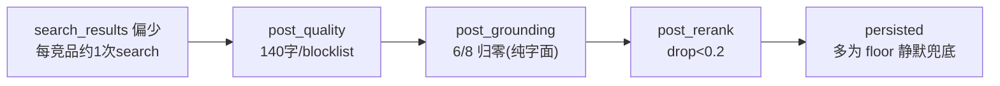
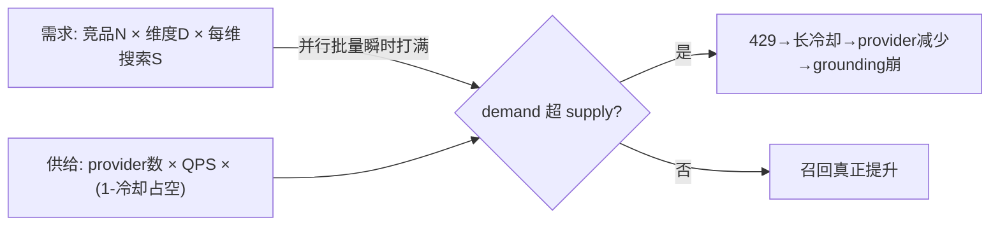

# 召回深度数据质量根治(阶段二:输入层)

## 自含性声明(可空白对话直接 build)
本 plan 已把全部接口事实核对到行级、参数给到定值并锚定业界经验,无需依赖历史对话。下方"开工前置"与"召回预算模型"是 build 的唯一事实源。

## 前提与范围(已与用户确认)
- 阶段一(大纲驱动报告架构)已执行,改动在工作区**未提交**:13 文件改 + 新增 [report_sections.py](backend/app/schemas/report_sections.py)。阶段一自带验证点已验,**本轮不重复测试**。
- 搜索 provider 配额充足:可提量(每竞品多搜)+ 提质并举。
- 本轮只动**输入层(researcher / collector / tier / config)**,不碰阶段一报告层。

## 开工前置(盲 build 必读,均已核实)
- 轮预算:`max_turns = max(request.max_iterations or MAX_REACT_TURNS, len(focus_dimensions))`([nodes/researcher.py](backend/app/agents/nodes/researcher.py) L222);每次 `tool_exec` 耗 1 turn;`turn_count >= max_turns` 强制 finalize([subgraphs/researcher.py](backend/app/agents/subgraphs/researcher.py) L1334-1340)。
- tier 现值([core/tiers.py](backend/app/core/tiers.py) + [core/defaults.py](backend/app/core/defaults.py)):quick `react_turns=3 / max_dimensions=3 / search_max_results=5`;deep `6 / 5 / 8`;两档 `max_competitors=8`(`MAX_RESEARCH_COMPETITORS`);`LLM_GLOBAL_CONCURRENCY=8`。
- 每维搜索门控:fallback 仅 `search_attempt_count == 0` 触发 search([subgraphs/researcher.py](backend/app/agents/subgraphs/researcher.py) L830)。
- 提前收敛点(要改的就是它):L591-597 "search≥1 且 fetch≥`_MAX_SOURCE_FIRST_ATTEMPTS_PER_DIMENSION`(=2,L101)→ covered=True"。**另有**一个质量门 L519 `evidence_count_pass = evidence_count >= _QUALITY_MIN_EVIDENCE_COUNT_PER_DIMENSION`(该常量=1,L103);本轮只动 L591-597,L519 不重复改,二者经 L571 `allow_feedback_exhaustion = not _is_feedback_dimension(...) or evidence_count > 0` 衔接。
- grounding:`_text_mentions_candidate` 纯字面命中 `sanitized_text` / `source_title`([nodes/researcher.py](backend/app/agents/nodes/researcher.py) L69-78、L845-851);**同处已算好** `competitor_official_hosts`(L770)与 `source_authority`(L795,host∈官网→`"official"`)→ 官方域名归属近零成本。
- floor 兜底(**事实更正**):全被拒时每竞品落 1 条 floor([nodes/researcher.py](backend/app/agents/nodes/researcher.py) L875-917),该段**完全无日志**(不是"只 log.info")→ Phase 6 是**新增** `log.warning`。
- metrics:[service/metrics/engine.py](backend/app/service/metrics/engine.py) 对 floor/grounding 零感知,但 `build_run_metrics_snapshot` 已遍历 `evidence_rows` 读 `row.span`(L482 `_extract_source_authority(row.span)`)→ Phase 6 复用此通路:floor 标记落进 `EvidenceRecord.span`,metrics 从 `row.span` 读。
- LLM `search_web` 路径不补 query_variants([agent_outputs_pipeline.py](backend/app/schemas/agent_outputs_pipeline.py) L471-481 仅规整 query/max_results/dimension;subgraph tool_exec prep L1634-1646 仅补 language/scope/hosts);fallback 有 `_fallback_query_variants`(subgraph L914-955,上限 3)。
- 限流:`COLLECTOR_PER_HOST_QPS=1`、`COLLECTOR_PROVIDER_COOLDOWN_SECONDS=600`([core/config.py](backend/app/core/config.py) L118/L126);3 provider(Bocha/Serper/Tavily)语言链;一次 429 → 整 provider 冷却 600s([search_router.py](backend/app/agents/tools/search_router.py) L105-110、L241-242);supervisor 竞品并行批量([supervisor.py](backend/app/agents/nodes/supervisor.py) L797/L1509)。
- **开工先存全量 golden 基线**:提采集量会改迭代次数,golden `16`(`supervisor_iterations_lt: 8`、`analyze_count_lte: 2`)需实测重评,不硬塞。

## 根因(三路只读调查 + 行级坐实)
每竞品约 2 条、多为 floor,是五层叠加:

1. 轮预算紧:quick `max_turns=max(3,3)=3`,每维 fetch+search 即耗尽 → 每竞品约 1 次 search。
2. 每维仅搜 1 次 + "1搜+2取即 covered"提前收敛。
3. LLM search 无 variants,召回面窄。
4. grounding 纯字面:第三方稿不字面提名 / 跨语言别名(NVIDIA↔英伟达)→ 大量归零。
5. floor 静默兜底(无日志、metrics 不计 floor)→ 违反 fail aloud,问题被掩盖。
- 外加 per-host QPS=1 + 600s 冷却,batch 并行触发 429,有效 provider 锐减。

## 召回预算模型(本轮核心:协同设计 + 业界锚定 + 不变量守护)
业界锚点:GPT Researcher(每查 5 结果、`MAX_ITERATIONS=3`、breadth 3-4、depth 2、max_subtopics 3);LangChain Open Deep Research(每 sub-agent 2-3 次搜索,停止=3+ 来源/最近 2 次雷同/触顶);ReAct 实践(全局步预算 6-12、每 subagent 工具调用 2-5、靠充分性反思停)。业界明列坑"sub-agent 只搜一次就停 → 强制 2-3 次、要求多来源"=我们根因。

需求侧与供给侧是同一吞吐方程两端,必须协同(否则 Phase 提搜索量反而加剧限流):

集中常量(放 [core/tiers.py](backend/app/core/tiers.py) `TierProfile`,新增字段 `search_attempts_per_dim`;轮值改 tier/defaults)与定值:
- `max_dimensions`:quick 3 / deep 5(维持,合 breadth/subtopics)。
- `search_attempts_per_dim`(**新字段**):quick 2 / deep 3(锚 "2-3 搜索/sub-agent")。
- `search_max_results`:quick 5 / deep 8(维持,quick 合 GPTR=5)。
- `react_turns`:quick 3→**8** / deep 6→**12**(锚 ReAct 全局步预算 6-12)。
- `max_turns` 公式化:`max(react_turns, dims * per_dim)`,`per_dim = search_attempts_per_dim + 1`(留 1 fetch),保证每维够搜+取。
- 每维 covered:**≥1 grounded 即停该维**,否则搜满 `search_attempts_per_dim`;删 L591-597 的"1搜+2取即停"。
- 供给侧:`COLLECTOR_PER_HOST_QPS` 1→**2**;`COLLECTOR_PROVIDER_COOLDOWN_SECONDS` 600→**120**(定值,简单稳健;退避为可选不做)。
- **不动**:`max_competitors`(8)、`supervisor_max_iterations`(避免连带 `recursion_limit = sup*4+10` 与 golden 16)、batch 并行度、`LLM_GLOBAL_CONCURRENCY`(8)。

可行性不变量(fail aloud 的静态版,单测守护):
- `searches_per_run_estimate(tier) = max_competitors × max_dimensions × search_attempts_per_dim`;quick=8×3×2=48、deep=8×5×3=120(worst case)。
- 测试断言 `≤` 文档化预算(quick ≤ 60 / deep ≤ 130),注释写明:3 provider × QPS2 + 语言链回退 + 120s 冷却下可持续;**谁把常量翻倍会被测试挡住** → 防孤立调参致限流雪崩。

模型分环节路由(搜索/反思用轻模型、综述用强模型)是对的方向,但属细优化,本轮**不动**,仅作后续治理项标注。

## 核心目标(量化验收)
- core 角色竞品(`_CORE_DISCOVERY_ROLES`)每竞品 **≥2 条非 floor 的 grounded 证据**;三件套覆盖率较基线提升。
- 单次 landscape run 的 `post_grounding` 归零竞品占比显著下降;`evidence_floor` 占比可观测且下降。
- floor 落库 **fail aloud**(warning + metrics + step 信号),不再静默。

## Phase 0:提交阶段一作干净基线
- 显式 `git add` 阶段一 13 改动文件 + 新增 [report_sections.py](backend/app/schemas/report_sections.py)(**禁 `git add .`/`-A`**,保留无关 dirty)。`.cursor/plans/*.md` 是否随提交由用户定。
- 提交信息遵循 repo 风格(如 `feat(agent): outline-driven report architecture`)。**不重复测试**。
- 验证:`git status` 确认阶段二从干净工作区起步。

## Phase 1:召回预算模型落地(集中 + 不变量测试)
- [core/tiers.py](backend/app/core/tiers.py):`TierProfile` 加 `search_attempts_per_dim`;quick/deep 填上"召回预算模型"定值(quick `search_attempts_per_dim=2`、`react_turns=8`;deep `3`、`12`);deep `react_turns` 经 [core/defaults.py](backend/app/core/defaults.py) `MAX_REACT_TURNS` 影响面确认(仅 deep 用)。
- 新增可行性不变量测试(`test_tiers.py` 或 `test_researcher_subgraph.py`):断言 `searches_per_run_estimate` ≤ 预算,并校验各 tier 字段非降。
- 验证:tier/不变量单测绿(此时尚未改 researcher 行为,researcher 系列应保持绿)。

## Phase 2:需求侧行为接入(轮次/每维搜索/covered)
- [nodes/researcher.py](backend/app/agents/nodes/researcher.py) L222:`max_turns` 改公式化(读 `tier.search_attempts_per_dim`)。
- [subgraphs/researcher.py](backend/app/agents/subgraphs/researcher.py) L830:`search_attempt_count == 0` → `< search_attempts_per_dim`。
- L591-597:covered 改为"已得 ≥1 grounded 即停,否则搜满 `search_attempts_per_dim`";**只动此处**,与 L519/L571 衔接不重复改。
- 验证:`test_researcher_evidence.py` / `test_researcher_dispatcher.py` / `test_researcher_subgraph.py` 调整并绿;golden 与基线 diff,**重评** `16` 的 `supervisor_iterations_lt` / `analyze_count_lte`(实测后调)。

## Phase 3:供给侧吞吐(与 Phase 2 同批落地、联合验证)
- [core/config.py](backend/app/core/config.py) L118 `COLLECTOR_PER_HOST_QPS` 1→2;L126 `COLLECTOR_PROVIDER_COOLDOWN_SECONDS` 600→120(校验器 L252/L258 已覆盖,新值合法)。
- [.env.example](.env.example) 同步占位(不写真值)。[search_router.py](backend/app/agents/tools/search_router.py) 冷却/QPS 读 config,无需改逻辑。
- 验证:`test_source_quality.py` / router 相关单测绿;E2E 观察 `RateLimited`/冷却触发频率下降、`leg_result_counts` 上升。
- 顺序说明:Phase 2 与 3 同批提交,先供给后需求或同时,避免提搜索量却未扩容量。

## Phase 4:query 召回面拓宽(承接别名的廉价替代)
- [subgraphs/researcher.py](backend/app/agents/subgraphs/researcher.py) tool_exec prep(L1634-1646):对 LLM 发起的 `search_web` 注入 `query_variants`(复用 `_fallback_query_variants` L914-955,含 locale + 维度同义),与 fallback 路径对齐。router 仍 cap 3 变体 × 多语言 leg([search_router.py](backend/app/agents/tools/search_router.py) L70-82)。
- 价值:locale 变体让搜索返回**同语种页面**,本身字面命中竞品名 → 多数跨语言别名问题被间接吃掉,无需别名管线。
- 验证:dispatcher/subgraph 断言 LLM search 携 variants;漏斗 `search_results` 较基线上升。

## Phase 5:grounding 官方域名归属(别名按数据闸延后)
- [nodes/researcher.py](backend/app/agents/nodes/researcher.py) L845-851 grounding 判定增:`source_authority == "official"`(host∈`competitor_official_hosts`,L795 已算)→ 视为 grounded,即便正文未字面提名。复用现有 `source_authority_for`,不新增相似度。
- **别名管线本轮不做**(跨 6+ 文件多分支,半成品风险高,收益已被 Phase 4 + 本步大量吸收);是否做由 Phase 7 数据闸决定。
- 红线:不引入文本相似度/embedding 兜底放水。grounding 仍以"提名或官方域名归属"为据。
- 验证:`test_researcher_evidence.py` 增用例——官方站页面无字面提名仍 grounded;无关内容仍 miss。`post_grounding` 归零竞品数下降。

## Phase 6:floor fail aloud + metrics 通路
- floor 落库(L875-917)**新增** `log.warning`(竞品/维度/floor_reason)——现无任何日志,是新增非升级。
- floor 标记(`evidence_floor` 等已在 metadata)落进 `EvidenceRecord.span`;[service/metrics/engine.py](backend/app/service/metrics/engine.py) `build_run_metrics_snapshot` 复用 `row.span` 通路(参 L482),新增 `floor_count` / `non_floor_grounded_count`,coverage 口径区分 floor 与实证。
- researcher step payload 写 floor 占比信号(供 QA/下游感知"该竞品实证不足")。
- 验证:`test_researcher_evidence.py` / `test_run_metrics.py` 断言 warning 与 metrics 字段;floor 不再静默。

## Phase 7:收口验证(含别名数据闸)
- targeted pytest:`test_researcher_evidence.py`、`test_researcher_dispatcher.py`、`test_researcher_subgraph.py`、`test_run_metrics.py`、`test_source_quality.py`、`test_tiers`(不变量)、golden runner。
- 全量 golden 与基线 diff,重评/更新受影响阈值(尤其 `16`)。
- 一条真实 landscape E2E(需健康环境):用 `step.payload["evidence_funnel"]` 逐竞品核对——`post_grounding` 不再大量归零、`evidence_floor` 占比下降、core 标杆 ≥2 条非 floor 实证。
- **别名数据闸**:统计 core 竞品 `competitor_grounding_miss` 占比;若仍 > 30%,把"别名链路"列为被数据证明值得的后续轮 TODO(带激活清单:discovery schema 加 aliases → prompt 抽取 → 落库 → plan_tree 传递 → `_text_mentions_candidate` 扩展);否则关闭该项。
- 缺环境时以 golden + pytest 兜底并记录未跑项。

## 非目标
- 别名管线本轮不做(仅数据闸触发才进后续轮);不重写 researcher 子图拓扑 / 不做 dimension 级并行;不引入新搜索 provider。
- 不放宽到相似度/embedding 兜底(grounding 红线);不动阶段一 mixed 预留态。
- 不动 `max_competitors` / `supervisor_max_iterations` / batch 并行 / `LLM_GLOBAL_CONCURRENCY`;不引入重度配置引擎(YAGNI);不做模型分环节路由细优化(仅标注)。

## 吸取的教训
- 需求侧(提搜索量)与供给侧(限流/冷却)必须协同设计,孤立调参会触发限流雪崩;用可行性不变量测试守护。
- 参数用业界锚定**定值**,不用"≈/量级"手感值;事实核对到行级(floor 是**无日志**不是 log.info;改 covered 只动 L591-597 不碰 L519)。
- grounding 放宽必须有据(官方域名归属);严禁纯相似度放水换召回数字;别名等高风险多文件改动按数据闸延后,投入跟证据走。
- floor/兜底必须 fail aloud(warning + metrics);提采集量必连带重评 golden 阈值;量化验收(每竞品 ≥2 非 floor grounded、floor 占比下降),不靠手感。
- 先提交阶段一隔离两批改动可独立回滚;阶段二分 phase 顺序做、每 phase 验证。