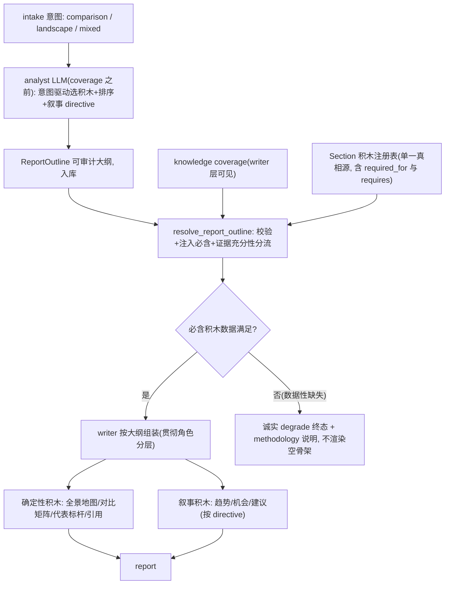

# 大纲驱动报告架构(阶段一:呈现层根治)

## 执行进度(实时更新)

- 基线:plan 相关单测 142 passed;golden `test_golden_runner.py` 14 passed / 1 failed(`13_deep_short_report` 因真实 web search tavily 限额 + 90s 终态超时,环境 flake 非回归;`04`/`16`/`18` 均 PASS)。
- ✅ Phase 0 止血:writer framing/三件套术语/脚手架泄漏全清;142 单测零回归 + 前端 type-check 干净。
- ✅ Phase 1 注册表+outline schema+mixed 预留:新增 `schemas/report_sections.py`(SECTION_REGISTRY + requires 谓词 + 默认 outline)、`AnalystOutput.report_outline`/`OutlineItem`、`AnalysisArchetype` 加 `mixed`(预留不激活);新增 4 项单测,`test_agent_outputs.py` 31 passed。
- ✅ Phase 2 resolve_report_outline + 证据充分性分流引擎:`resolve_writer_target_sections`→`resolve_report_outline`(注册表/outline 驱动、必含注入、exec 恒首);新增 `triage_outline_sections`(renderable/omitted/degraded_required);`WriterExecutionContext.resolve` 接入 outline;改名同步 3 测试 + `__all__` + 删旧 `WRITER_*_SECTIONS` 常量;新增分流单测。149 passed。writer 装配接入 + state 信号 + QA 消费按解耦原则下放到 Phase 4/5。
- ✅ Phase 3 analyst 产意图驱动大纲:`build_report_outline_instruction`(注册表积木库 + 按意图选择规则)接入 analyst prompt;`build_fallback` 按 archetype 默认大纲兜底(加 `analysis_archetype` 形参,analyst 节点传真值);conftest fake analyst 产 registry 默认 outline(parse 路径打通)。单元级 173 passed(含 intake_api/knowledge_extractor)。注:`test_smoke.py` 7 例为真实 web 搜索 API(TAVILY/BOCHA key 缺失 + 30s 终态超时)环境 flake,失败在 researcher 抓取阶段、与 outline 无关,同源于基线 golden `13`。
- ✅ Phase 4 writer 按大纲组装 + 角色分层 + representative_benchmarks:`_apply_structured_writer_sections` 改 archetype 分支——landscape 走趋势主导(market_landscape_map + 新 `_build_representative_benchmarks_section`,移除全员 profiles/matrix/positioning,丢弃 LLM 泄漏的对比段),comparison 确定性段无条件产出(顺序随 outline,核心不削弱);`SectionEvidenceContext`+registry `requires` 决定 representative_benchmarks/trend_summary 是否 degrade,产 `report_degraded_required_sections`(写 content_json + state + risk_callouts 内部信号,markdown 过滤);QA `rule_structured_sections_present` 改注册表驱动(landscape={market_landscape_map, representative_benchmarks})+ 排除数据降级段。新增/重写 writer+qa 单测。**golden 14 passed/1 failed(13 同基线 flake,真实搜索 evidence_balance 变异;16 landscape PASS、全 comparison PASS)**,142 单测全绿。
- ✅ Phase 5 意图/角色路由修复 + QA 收敛:QA 数据性/写作性区分随 Phase 4 落地(注册表必含 + degrade 排除);intake archetype prompt 收紧(禁 mixed、趋势/全景永不判 comparison、少量异质实例不构成对比);discovery 角色 prompt 收紧(comparable core 仅限同 job/apples-to-apples,异质玩家归 trend_reference/upstream 不进 core)。125 passed。
- ✅ Phase 6 叙事质量:writer prompt 增叙事指令——trend_summary 在 target 时成正文核心(2-4 个市场级主题趋势 + 代表标杆 + [ev] 证据,非逐公司罗列)、strategic_recommendations 按 stakeholder(产品/PM、市场/GTM、技术)具体化。注:温度/top_p 全 backend 未暴露(需改 provider 层,超本阶段范围),随机性已由结构化 `WriterReportOutput` schema 约束。25 passed。
- ✅ Phase 7 收口验证:后端 targeted **175 passed**(agent_outputs/writer_llm/qa_rules/plan_reconcile/planner_archetype/supervisor_batch/intake_prompt/intake_api/prompt_evidence_selection/knowledge_extractor);前端 `npm run type-check` 干净;golden **14 passed/1 failed**(13 同基线 flake、16 landscape + 全 comparison PASS),零新增回归;lint 全清;改动范围未触碰无关脏文件。

## 收口结论

阶段一(报告架构根治)全部 7 phase 落地并逐阶段验证。核心:报告结构由"意图驱动大纲(注册表单一真相源)+ 证据充分性分流(诚实 degrade)"驱动,landscape 从"全员塞对比矩阵"改为"趋势主导 + 代表标杆论证",comparison 核心交付不削弱。残留(另起 plan):①真实搜索召回深度(golden 13 flake 根因,evidence_balance 数据质量);②mixed 激活;③writer 温度参数需 provider 层支持。真实 E2E 人工核对建议在具备 LLM/搜索 key 的环境补做。

## 范围决策(已与用户确认)

- 分两阶段、解耦、每阶段独立验证(吸取"盘子太大、一次 build 完才验→垃圾"的教训)。
- 本轮 = 阶段一:报告架构根治(含意图/角色路由修复)。
- 阶段二(另起 plan):召回深度数据质量根治(core 标杆每竞品仅 2 条搜索、grounding 6/8 归零)。本轮用"证据不足→诚实 degrade"兜住,不产垃圾。
- mixed 本轮**架构预留不激活**(用户确认):枚举值与注册表 key 留好,但 intake 不主动判、数据层分支不改、验证只跑 comparison/landscape(详见 Phase 1/5 与非目标)。

## 开工前置(盲 build 必读)

- **先存全量 golden 基线再开工**:改 QA 必含段与 `resolve` 会牵动 golden(`04` 的 `force_degraded`、`16` 的 `report_section_count_gte: 4`、`18` 等),用基线 diff 判回归,勿凭印象。
- 关键接口事实(已核实,据此实现,勿新造 Ghost Layer):
  - `resolve_writer_target_sections` 生产调用方**仅 1 处**:[agent_outputs.py](backend/app/schemas/agent_outputs.py) L706;测试 2 处([test_agent_outputs.py](backend/app/tests/test_agent_outputs.py) L43-61、[test_writer_llm.py](backend/app/tests/test_writer_llm.py) L576)。改名/改签名影响面小。
  - coverage 在 writer 层可见:`knowledge_payload.get("coverage")`([writer.py](backend/app/agents/nodes/writer.py) L701/L1393),结构 `dict[competitor][dim]→{complete|partial|insufficient_data|missing}`(`_coverage_status` L753-765)。
  - degrade 终态 = QA `fallback_action="finalize_degraded"`([schemas/qa.py](backend/app/schemas/qa.py) L11)+ supervisor 消费产终态(`step_supervisor_finalize_degraded`);`reject_to ∈ {researcher, analyst, writer, supervisor}`(engine.py 已校验)。
- 验证以 targeted pytest + 代码审计为主;真实 E2E 为可选(需健康 API 容器 + LLM key,空白环境未必具备)。

## 根因(run_52a53947039a 真实数据 + 代码坐实)

垃圾不是数据质量,是**呈现层三处叠加 + 路由可能判错**:

1. landscape 骨架天生 comparison 主导:`resolve_writer_target_sections`([backend/app/schemas/agent_outputs.py](backend/app/schemas/agent_outputs.py) L44-69)给 landscape 的顺序是 `executive_summary → competitor_profiles → comparison_matrix → positioning_map → strategic_recommendations`,趋势段(`trend_summary`)被追加到第 7 位,全景地图(`market_landscape_map`)第 6 位。**趋势被埋、异质玩家被全员塞进对比矩阵/逐竞品画像**。
2. `build_writer_user_prompt` framing([backend/app/service/llm/prompts.py](backend/app/service/llm/prompts.py) L1475-1517)写死骨架与 "triplet" 术语;L1508 "Do not skip target sections… mark coverage gaps" **强制 LLM 产空段 → 满屏"数据不足"占位**。
3. 确定性 builder 在数据薄时吐脚手架(数据不足 / insufficient_data 英文 / 占位正文 / "若干"误伤序号 / 劣势=维度名 / uncovered_section 泄漏)+ "三件套"术语写死在标题与前端。
4. 路由:intake archetype 仅 `comparison|landscape` 二分([intake.py](backend/app/agents/nodes/intake.py) L276-278),误判即走错骨架;discovery 角色判定([prompts.py](backend/app/service/llm/prompts.py) L1666-1673)若把异质玩家(特斯拉/大疆/Pixel6)误标 `direct_competitor`,会被送进 core/对比。

关键澄清:报告侧**已有**角色分层零件——`_landscape_profile_competitors`([backend/app/agents/nodes/writer.py](backend/app/agents/nodes/writer.py) L709-733)只对 `_CORE_DISCOVERY_ROLES` 做 profile,`market_landscape_map` builder(L1291-1331)按 `candidate_role` 分组。问题是**整体骨架没把它当主角**。所以"可比性"不是回头改 discovery 选品(全景本就跨品类),而是**让报告贯彻已有分层**。

## 成熟方案 = 意图驱动大纲 + 积木化 section + 贯彻角色分层 + 确定性数据/引用 + QA 下限 + 诚实 degrade

意图→结构映射(贯彻两层架构 `竞品两层架构与追踪闭环_42d3d34b.plan.md`):
- 纯对比(同质赛道):`executive_summary → competitor_profiles → comparison_matrix → positioning_map → self_positioning → strategic_recommendations`。
- 纯趋势(异质全景):`executive_summary → market_landscape_map(广,跨品类) → trend_summary(主体) → representative_benchmarks(core 同质子集,深) → opportunity_map → strategic_recommendations`。**移除全员 competitor_profiles + comparison_matrix**;对比维度是路线/阶段/趋势方向,不是功能/定价/口碑全员横评。
- mixed:并集(趋势 + core 对比都在)。**本轮架构预留不激活**,注册表支持 mixed key,但 intake 不主动产 mixed,故本轮不验此路径。

职责分层(驯服随机性):LLM 决定用哪些积木/顺序/各块叙事;确定性层保数据/矩阵/引用/赛题必含字段;outline 显式可审计(schema+低温+入库);resolve 强制补必含 + QA 守下限。

## 核心机制:证据充分性分流 + degrade 收敛(堵"再产垃圾"的命门)

每个 deterministic 积木在注册表声明 `requires`(数据前置谓词)与 `required_for`(哪种意图必含)。

**量化 `requires` 谓词(写死、可复现、可单测,勿凭手感):**
- 基元 `has_substantive(competitor, dim)` := `_coverage_status(...) in {"complete","partial"}`;阈值集中为模块级常量 `_SUBSTANTIVE_STATUSES = {"complete","partial"}`,便于调参与单测。
- `competitor_profiles.requires` := ≥1 竞品满足"≥1 维度 has_substantive"。
- `comparison_matrix.requires` := **≥2** 竞品满足"≥1 维度 has_substantive"。
- `representative_benchmarks.requires` := ≥1 个 core 角色竞品(`_CORE_DISCOVERY_ROLES`)满足"≥1 维度 has_substantive"。
- `trend_summary` 的"≥1 标杆有实质证据" := 同 `representative_benchmarks.requires`。

**分流(组装前按真实 coverage 判定):**
- 非必含积木 `requires` 不满足 → 静默省略(不渲染"数据不足"骨架)。
- 必含积木满足 → 渲染。
- 必含积木不满足(数据性缺失) → 写入信号 `report_degraded_required_sections: list[str]`(state 字段),走诚实 degrade 终态,不渲染空骨架。

**degrade 终态接口(复用现有,勿新造):**
- 数据性缺失 → QA 决策置 `fallback_action="finalize_degraded"`([schemas/qa.py](backend/app/schemas/qa.py) L11),supervisor 消费产终态;methodology 段由确定性 builder 写明"因证据不足未产出 X / 仅覆盖 N 个有效对象"。不让 writer 无限重试。

**数据性 vs 写作性失败区分(收敛死循环的命门):**
- QA 见 `report_degraded_required_sections` 非空 → 一次性 `finalize_degraded`(**不 reject writer**)。
- 无该信号但段落质量差(写作性缺失,有数据没写好) → 按 semantic `reject_to`(writer/researcher/...)重试。reject_to ∈ {researcher,analyst,writer,supervisor}。

趋势报告特例:≥1 标杆 has_substantive → 趋势主导成立(省略无证据竞品);0 标杆 → `finalize_degraded`(不硬写空话趋势)。

## Phase 0:止血(先做,低风险立竿见影,不依赖新架构)

- 改 `build_writer_user_prompt` framing([prompts.py](backend/app/service/llm/prompts.py) L1475-1517):去写死骨架与 "triplet" 术语;L1508 改为"非必含且无证据的段落直接省略,不要编造或标注占位"。
- 去用户可见"三件套":`_section_title`([writer.py](backend/app/agents/nodes/writer.py) L72-96)+ 前端 [KnowledgePanel.tsx](frontend/src/components/knowledge/KnowledgePanel.tsx) L458、[RoleLayerMap.tsx](frontend/src/components/knowledge/RoleLayerMap.tsx) L34、`MetricsPanel.tsx` L84、[NewRunChatPage.tsx](frontend/src/pages/NewRunChatPage.tsx) L548/L552/L1075、planner 任务描述 [planner.py](backend/app/agents/nodes/planner.py) L347。
- 脚手架泄漏:`_numeric_placeholder`/`_apply_numeric_claim_guardrail`(writer L317-319,L411-413)不替换列表序号;`_placeholder_section_content`(L1369-1372)缺段省略不输出占位正文;`_status_label`(L768-776)中文本地化;"劣势=维度名"(L1075-1103)改真实定性或省略;`_render_report_markdown`(L1774-1782)不把 `uncovered_section:*`/`numeric_claims_downgraded:*` 渲染进风险提示;裸证据 ID 规范化。
- 验证:`test_writer_llm.py` + `test_qa_rules.py` 单测;一条真实趋势 E2E(可选,需健康环境)人工确认观感改善。

## Phase 1:积木注册表 + 大纲 schema + mixed 预留

- 新增 section 积木注册表(单一真相源):`section_id → {kind, builder, requires(coverage→bool, 用核心机制量化谓词), required_for(set[archetype]), user_title_zh/en}`。登记现有积木 + 新增 `representative_benchmarks`(干净实现,非复用 buggy profile)。
- [agent_outputs.py](backend/app/schemas/agent_outputs.py) `AnalystOutput` 加 `report_outline: list[OutlineItem]`(`{section_id, directive?}`),保留 `recommended_sections` 兼容。
- mixed **架构预留不激活**:`AnalysisArchetype`([intake schema](backend/app/schemas/intake.py) L13)加 `"mixed"` 枚举值;注册表 `required_for` 可含 `mixed` key。**但本轮不激活**:intake prompt 不主动判 mixed、`intake.py` L276-278 接受集合可留 `{comparison,landscape}`、数据层 15+ 处 `== "landscape"`/`!= "comparison"` 分支**不改**(见非目标"mixed 激活清单")。理由:`supervisor.py` L296 会把非 landscape 吞成 comparison,数据层不改时 mixed 无法正确分层采集,故预留态下不产 mixed。
- 验证点:`test_agent_outputs.py` 新增注册表/schema 单测;此时 writer 尚未消费注册表,旧 `resolve_writer_target_sections` 行为不变,全量 targeted pytest 应保持绿。

## Phase 2:大纲解析 + 证据充分性分流(命门,见"核心机制")

- `resolve_writer_target_sections` → `resolve_report_outline`(agent_outputs.py L44-69):以 outline 排序、注册表校验、按意图注入必含、`executive_summary` 恒首。**调用方仅 agent_outputs.py L706 + 2 测试**(见开工前置),同步改这 3 处。
- writer 层(`knowledge_payload.get("coverage")` 可见处)执行证据充分性分流与 degrade 判定,输出"可渲染积木列表" + `report_degraded_required_sections`(写入 state 供 QA 收敛)。
- 更新 [test_agent_outputs.py](backend/app/tests/test_agent_outputs.py) L43-128(含 landscape 趋势主导顺序、必含注入、分流省略/degrade 信号)。
- 验证点:`test_agent_outputs.py` + `test_writer_llm.py` 全绿;跑 golden 与基线 diff,确认 `04` 仍 `force_degraded`、`16` section≥4。

## Phase 3:analyst 产意图驱动大纲(不依赖 coverage)

- [analyst.py](backend/app/agents/nodes/analyst.py) L165-190:LLM 输出加 `report_outline`(仅基于意图/insights)。
- analyst prompt([prompts.py](backend/app/service/llm/prompts.py) L483-500)给积木库清单 + 选择规则(趋势类趋势主导、代表产品作论据;对比类对比主导;mixed 并集)+ 必含约束。
- `parse_llm_content` 校验 outline;`build_fallback` 按 archetype 默认大纲兜底(landscape=趋势主导、comparison=对比骨架,见"意图→结构映射")。
- `conftest.py` fake analyst **必须**产含 `report_outline` 的输出或稳定走 fallback(否则 parse 失败连锁挂测,重蹈 fake 夹具坑)。outline 入库可审计。
- 验证点:analyst 单测 + `conftest` 夹具自检通过;全量 targeted pytest 绿(此时 outline 已生成但 build_fallback 兜底,行为与 Phase 2 等价)。

## Phase 4:writer 按大纲组装(贯彻角色分层)

- [writer.py](backend/app/agents/nodes/writer.py) `_apply_structured_writer_sections` L1375-1545:移除 archetype 写死骨架(L1402/1450/1521 等分支)与无条件 upsert;遍历 resolved outline 按注册表 kind 分派;coverage-aware 裁剪/degrade 在此层。
- landscape 默认 outline 改为趋势主导,**移除全员 competitor_profiles + comparison_matrix**;新增 `representative_benchmarks` 干净 builder:**复用 `_landscape_profile_competitors`(L709-733)取 core 子集 + `_collect_competitor_evidence_refs` 挂引用**(不重写采集/引用逻辑,避免再引 bug),每个代表产品输出"定位 + 一句能力 + 代表证据"作趋势论据。
- comparison 默认 outline = 现状对比骨架顺序,核心交付物(对比矩阵、画像)不削弱,但同走大纲驱动管线 + 吃 Phase 0 止血(观感改善)。
- 验证点:`test_writer_llm.py` 断言——landscape 输出趋势主导且无 comparison_matrix、异质玩家不入 representative_benchmarks、comparison 骨架顺序不回归;golden `16` section≥4 仍满足(新 landscape outline 为 exec/landscape_map/trend/representative_benchmarks/opportunity/recommendations 共 6 段)。

## Phase 5:意图/角色路由修复 + QA 收敛

- 意图路由:审计/收紧 intake archetype 判定 prompt(全景类不应判 comparison)。**mixed 仍不激活**(预留),不在 intake 主动产出。
- 角色路由:审计 discovery 角色判定 prompt([prompts.py](backend/app/service/llm/prompts.py) L1666-1673),确保异质玩家(芯片/整机跨品类)落 `trend_reference`/`substitute` 而非 `direct_competitor`,不被送进 core/对比。
- 定位本次垃圾主因以**代码审计为主**:查 run 落库的 `analysis_archetype` 值 + `plan_tree.competitor_sources[*].candidate_role` 分布,判定是 archetype 误判还是角色误判;E2E 复现为可选(需健康环境)。
- QA([qa/rules.py](backend/app/service/qa/rules.py) L23-29 + L469):必含段按意图(outline/archetype)校验,不写死 `_STRUCTURED_REQUIRED_SECTIONS`;实现数据性/写作性失败区分与 degrade 收敛(见核心机制:`report_degraded_required_sections` 非空→`finalize_degraded` 不 reject writer);新增"禁止脚手架占位符进正文"校验。
- 验证点:`test_qa_rules.py` + `test_supervisor_batch.py` 全绿;golden 与基线 diff 零回归(尤其 `04` force_degraded 路径)。

## Phase 6:叙事质量

- Writer prompt:趋势章节按"主题趋势 + 代表标杆论证 + 证据"组织为正文核心;`strategic_recommendations` 分 stakeholder 具体化。低温 + schema 约束控随机性。
- 验证点:`test_writer_llm.py` 叙事相关断言绿;一条真实趋势 E2E(可选)人工确认趋势成正文核心而非占位。

## Phase 7:收口验证

- targeted pytest:`test_agent_outputs.py`(outline 解析/必含注入/顺序)、`test_writer_llm.py`(组装/标题/降级/无脚手架)、`test_qa_rules.py`、analyst、`test_plan_reconcile.py`。
- 前端 `npm run type-check`(确认仅文案替换、无逻辑改动)。
- 两条真实 E2E(纯对比 / 纯趋势"AI 硬件主流产品趋势";mixed 预留不验),人工核对:结构贴意图、趋势主导、异质不进对比、无术语/脚手架泄漏、引用真实、赛题必含字段齐、空段省略、**0 标杆证据时诚实 degrade 而非空话**。E2E 需健康环境,缺失时以 golden + targeted pytest 兜底并记录未跑项。

## 非目标(修正版)

- 本轮不做召回深度数据质量根治(并列根因,解耦后排序在阶段二;本轮用"证据不足→诚实 degrade"兜住,不产垃圾)。
- 不重写 Agent 拓扑;不动 run_knowledge 三件套数据采集与评分链路;不把积木注册表做成泛化引擎(YAGNI);不在执行期新增 HITL。
- mixed **架构预留不激活**:本轮只动报告层(注册表/outline/resolve/writer 支持 mixed key),不动数据层分支。
- (已删除原"不改 comparison 默认观感"——comparison 同走大纲驱动管线并吃止血,观感会改善,仅保证对比核心交付物不被削弱。)

### mixed 激活清单(下一轮 TODO,本轮勿动)

激活 mixed 时需把以下数据层二元分支扩为 `in {"landscape","mixed"}`(否则 mixed 被吞成 comparison、不分层采集):
- `supervisor.py` L296(规约,保留 mixed)、`contracts.py` L107(三件套注入)、`planner.py` L131/166/532/545、`discovery.py` L483、`extractor.py` L379/471、`agent_outputs_pipeline.py` L195、`qa/rules.py` L469、`prompts.py` L801/1288/1479、`writer.py` L1402/1410/1431/1450/1521;intake prompt 开启 mixed 判定 + 加第三条 E2E。

## 吸取的教训

- 不在数据薄时硬渲染骨架;不让 writer 因数据缺失无限重试;不靠换标题/换固定模板冒充根治。
- 趋势意图本就跨品类,严禁回头把全景限制到同品类;用两层架构(广分层 + core 子集深挖)而非阉割意图。
- 先止血再上架构,分阶段验证(每 phase 写明"绿什么"),不一次 build 完才验。
- 加枚举值(如 mixed)必须扫全分支,否则被下游二元判断/规约(supervisor L296)吞掉 → 半成品(声称实现)。本轮选择"预留不激活"规避此风险。
- "成熟方案"必须落到代码可复现的阈值/接口(`requires` 谓词、`finalize_degraded`、`report_degraded_required_sections` 信号),不留口号;开工前先存 golden 基线再 diff 判回归。
