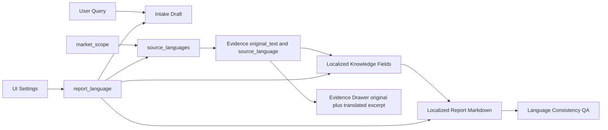

# 报告语言系统优化

## 成熟方案

把语言拆成四个概念，而不是只靠 `response_language`：

- `ui_locale`：前端界面语言，例如 `zh-CN` / `en-US`。控制按钮、Tab、日期、空态，不应影响检索范围。
- `report_language`：用户消费报告的语言，例如 `zh` / `en`。报告正文、章节标题、结构化知识展示、summary、risk、recommendations 都必须统一。
- `source_languages`：检索语言集合。由 `report_language + market_scope + source routing` 决定，允许官网/新闻/报告是日文、英文、中文等。
- `evidence_language`：每条证据原文语言。证据原文保留原语言；报告引用和知识卡片可以展示翻译后的摘要。

核心规则：报告给用户看的内容统一语言；证据用于审计时保留原文；翻译只能生成派生字段，不能覆盖原始 evidence。

## 当前缺口

- 后端已有 `response_language`，但 Planner、Researcher LLM、Knowledge 提取、Semantic QA 使用不完整。
- 前端没有语言选择器，也没有 i18n；创建 run 时 `response_language` 基本交给后端自动推断。
- Evidence API 只暴露 `sanitized_text`，没有 `quote`、`source_language`、`translated_excerpt` 这类字段。
- QA 目前没有“报告输出语言一致性”阻断规则。
- `market_scope` 与输出语言已经部分解耦，这是正确方向，应保留。

## 数据流

## 实施步骤

1. 统一语言命名与策略

- 保留兼容 `response_language`，但内部引入明确语义 `report_language`，两者先映射为同一字段，避免大迁移。
- 在 `backend/app/service/locale/__init__.py` 增加语言策略 helper：默认语言、合法语言、检索语言规划、语言检测、是否需要翻译。
- 明确 `market_scope` 只影响地域/来源，不决定报告语言。

2. Intake 与 API

- 修改 `backend/app/schemas/intake.py`：把 `response_language` 文档化为 report output language，后续可别名到 `report_language`。
- 修改 `backend/app/router/run_rt.py`：允许前端显式传 `response_language`；没有显式值时再从用户 query / UI 默认值推断。
- 前端 `frontend/src/pages/NewRunChatPage.tsx` 增加报告语言选择，默认中文；英文用户可切换英文报告。

3. Prompt 与生成链路

- 修改 `backend/app/service/llm/prompts.py`：Planner、Supervisor、Researcher、Knowledge extraction、Analyst、Writer 都显式接收 `response_language`。
- Writer 继续翻译证据内容到报告语言，但必须保留 evidence id 和 source URL 原样。
- Knowledge extraction 输出用户可见字段时使用 report language；证据 quote 不翻译覆盖。

4. Evidence 模型与 API

- 在 evidence span/metadata 中写入 `source_language` 或 `detected_language`。
- API 增加只读字段：`quote`、`source_language`、`translated_excerpt`（可先为空或按需生成）。
- 前端 Evidence Drawer 展示：默认原文；如果报告语言不同，展示“报告语言摘要/译文”作为派生信息。

5. QA 阻断

- 在 `backend/app/service/qa/rules.py` 增加 `rule_report_language_consistency`：报告 Markdown、section title、knowledge summary 大面积偏离 `response_language` 时 reject writer。
- Semantic QA prompt 增加语言一致性维度：英文专业术语允许保留，但整段混入非目标语言要阻断。
- Evidence 原文不参与该阻断，只检查报告正文和派生展示字段。

6. 前端展示策略

- 短期不引入完整 i18n 框架，只做报告语言选择和 Evidence Drawer 原文/译文分区。
- 中期再引入 UI i18n，把固定中文 UI 文案迁移为 `ui_locale` 管理。
- `index.html lang`、日期格式、Tab 文案等放到后续 UI 国际化阶段，不阻塞报告语言一致性。

## 验证

- 中文报告：中文 query + 英文/日文来源，最终报告正文中文，证据原文保留英文/日文。
- 英文报告：中文 query 但用户选择英文报告，最终报告正文英文，证据原文保留中文。
- 多语言检索：日本/韩国/美国品牌官网可进入 evidence，但不污染报告输出语言。
- QA 负向：报告语言设为中文时，大段英文 section 被 reject；证据 drawer 原文英文不 reject。
- 前端：报告语言选择能持久化到 run；Evidence Drawer 能区分原文和报告语言摘要。