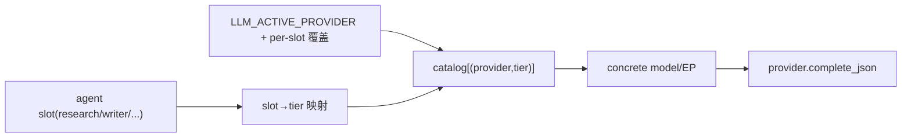

# 模型分档路由:tier + catalog(静态分层,多 provider)

## 背景与现状

- 当前 5 个 slot(research/summarization/compression/qa/writer)已是 per-slot 路由,但 `LLM_MODEL_*` 全空 → 全部回落同一个豆包 EP(`doubao-seed-2.0-lite`),**模型零分档**:报告生成与工具决策用同一个 lite 模型。
- 架构骨架已在 [routing.py](backend/app/service/llm/routing.py):`model_name = _slot_model_override(slot) or provider.default_model`,缺的是"能力档位"语义与多 provider 的档位目录。

## 调研结论(业界范式)

- **静态任务分层(成熟,选用)**:模型声明能力档位 + 任务静态映射档位。LiteLLM `quality_tier`、OpenRouter 均用,绝大多数生产 agent 的实际做法。
- **自适应学习路由(过度,不做)**:LiteLLM adaptive(Thompson bandit)官方标 BETA,需每 cell ~10+ 真实样本、状态存 Postgres、regex 英文 bias、不评分延迟。我们刚清空库、流量小、要稳——上来就上 bandit 是 naive 反面。
- 千问/豆包模型版本半年四代迭代 → **catalog 必须配置驱动,代码不硬编码版本号**(避免 naive)。

## 设计:三个概念,纯静态

1. **Tier(能力档位)**:`strong | balanced | fast` 三档,对齐各家天然三档(豆包 pro/lite/mini、千问 max/plus/flash)。
2. **Model Catalog**:`(provider, tier) → model_id`,全部走 env 配置,代码只定义结构。
3. **Slot 路由**:每个 slot 声明所需 `tier`;provider 由全局 `LLM_ACTIVE_PROVIDER` 决定,per-slot 可覆盖(保留现有灵活性,支持跨 provider 混用)。

解析流程:`slot → tier (+ resolved provider) → catalog[(provider,tier)] → concrete model`

正交关系(slot 为统一锚点):`slot → { tier(选模型), timeout, max_tokens }`。timeout/max_tokens 仍按 slot(任务延迟/输出特性),tier 只管选哪个模型,两者不耦合。

## slot→tier 默认分配(任务质量敏感度 × 频率)

| slot | 任务 | 频率 | 默认 tier | 依据 |
|---|---|---|---|---|
| writer | 最终报告生成 | 低 | strong | 交付物,质量最敏感 |
| summarization | analyst 跨竞品推理 | 低 | strong | 复杂推理 |
| qa | 报告语义审查 | 中 | balanced | 有确定性规则兜底 |
| research | ReAct 工具决策 | 高 | balanced | 高频,strong 成本/延迟不划算 |
| compression | 证据压缩 | 中 | fast | 机械归纳 |

## Stage 1 — config 抽象

- [config.py](backend/app/core/config.py):
  - 新增 `LLM_ACTIVE_PROVIDER: Literal["doubao","openai","qwen"]="doubao"`。
  - slot→tier:`LLM_TIER_RESEARCH/SUMMARIZATION/COMPRESSION/QA/WRITER`(默认按上表)。
  - catalog(per provider 三档):`DOUBAO_MODEL_STRONG/BALANCED/FAST`、`QWEN_MODEL_STRONG/BALANCED/FAST`、`OPENAI_MODEL_STRONG/BALANCED/FAST`(全部 `str | None`,空则回落)。
  - 保留 `LLM_PROVIDER_<SLOT>`(per-slot provider 覆盖,默认空=用 active)与 `LLM_MODEL_<SLOT>`(最高优先级 escape hatch,应急直配)。
  - 校验:tier 取值合法;active provider 对应档位至少 balanced 可解析。

## Stage 2 — routing 解析

- [routing.py](backend/app/service/llm/routing.py):`resolve_slot` 改为
  1. provider = `LLM_PROVIDER_<SLOT>` 覆盖 or `LLM_ACTIVE_PROVIDER`;
  2. model = `LLM_MODEL_<SLOT>`(escape hatch) or `catalog[(provider, tier)]` or provider 兜底;
  3. 解析失败 fail fast(不静默回落到错档)。
- 新增 `_resolve_tier(slot)` + `_resolve_catalog_model(provider, tier)`。

## Stage 3 — providers 适配

- [providers.py](backend/app/service/llm/providers.py) `build_providers`:为 active + 被覆盖用到的 provider 建 client(现有 doubao/openai/qwen 三类已就绪);`default_model` 改取该 provider 的 balanced 档作兜底(替代当前写死单 EP)。
- provider 实例无状态(model 每次调用传入),catalog 解析在 routing 层完成,providers 改动小。

## Stage 4 — 配置同步 + 平滑过渡

- [.env.example](.env.example) + 本地 [.env.dev](backend/.env.dev):补全 tier/catalog/active provider。
- **平滑过渡(零行为变化起步)**:豆包三档默认先全指向现有 lite EP → 行为与当前一致;待用户在火山引擎为 pro/mini 建 EP 后,只改 `DOUBAO_MODEL_STRONG/FAST` 即启用真分档。千问档位填 env(max/plus/flash),配 `QWEN_API_KEY` 后可整体或按 slot 切换。

## Stage 5 — 测试 + 验证

- [test_llm_routing.py](backend/app/tests/test_llm_routing.py):slot→tier→model 解析、per-slot provider 覆盖、escape hatch 优先级、catalog 缺失 fail fast、跨 provider(doubao/qwen)解析。
- docker 定向 pytest + 探针实测:doubao 各 slot 解析正确;临时配 qwen catalog 验证跨 provider 路由(不消耗真实配额可 mock)。

## 现实约束(需用户侧操作,不阻塞代码)

- 豆包真分档需在火山引擎为 pro/mini 各建 EP(控制台操作)。代码先就绪,EP 建好填 env 即生效。
- 跨 provider(千问)需配 `QWEN_API_KEY`。

## 不做(成熟边界)

- 不做 bandit/自适应学习路由(过度,依赖流量,刚清空库)。
- 不做动态 fallback chain / 多 deployment 负载均衡(YAGNI,单实例 demo)。
- 不硬编码模型版本号(全 env 驱动)。
- timeout/max_tokens 维持 per-slot,不并入 tier(正交)。
- 不改 agent 节点调用处(slot 名不变,路由对节点透明)。
