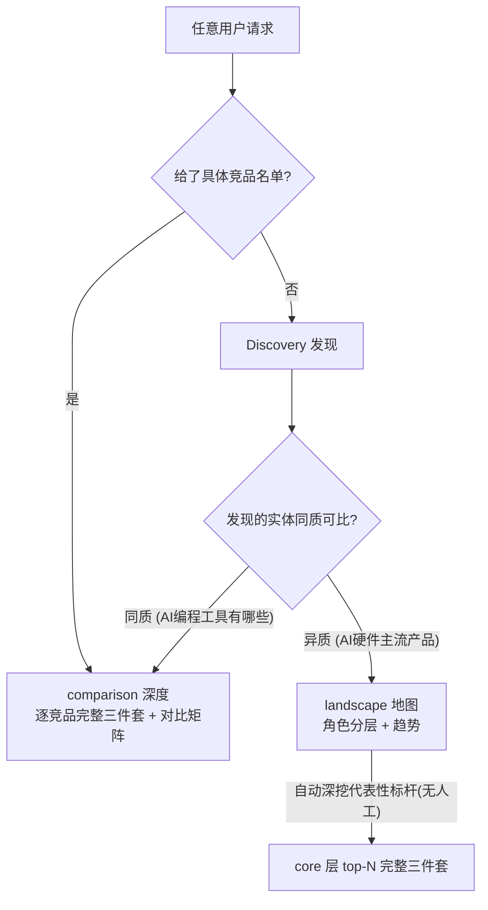

# 竞品两层架构与追踪闭环

## 设计依据（两条硬约束 + 第一性原理）

约束 1（赛题）：`docs/defense/00-defense-background-and-goals.md` 4.1（35% 权重）要求"功能、定价、用户画像、证据引用…字段完整一致"。**三件套是核心交付物，landscape 也必须产出，不能用 `not_applicable` 整体逃避。** 上一轮 P5 的止血是权宜，本 plan 做真根治。

约束 2（架构）：`docs/2.5-agent-architecture.md` 全系统只有三个 HITL 点（Intake clarify / Plan confirm / Skill 审核），**主 run 执行期无 HITL，全自动**。因此"深挖代表性竞品"必须在 run 内自动完成，不靠用户在报告里点选。

泛化逻辑（用户确认）：

核心原则：分层是地图骨架（广，覆盖全部玩家）；深度只施加在核心可比层的 top-N 代表性竞品（它们天然同质，三件套有意义）；外围异质玩家（芯片/机器人/媒体）只做地图简介，`not_applicable` 仅用于这类真不适用的对象。

## Phase 0：共享地基（schema 与类型对齐）

- 前端 `RunIntakeDraft` 补 `analysis_archetype`、`response_language`（[frontend/src/api/types.ts](frontend/src/api/types.ts) L23-37 与后端 `backend/app/schemas/intake.py` L16-44 不同步）。
- Persona 补 `competitor_id`（后端类名是 `Persona`，前端类型才叫 `KnowledgePersona`）：改 [backend/app/schemas/business.py](backend/app/schemas/business.py) L54-60、extractor 落库（[backend/app/service/knowledge/extractor.py](backend/app/service/knowledge/extractor.py) L557-567 当前不写 competitor_id）与 `_persona_matches_competitor`（L306-329 启发式可退化为精确匹配）、`KnowledgePersonaResponse`（[backend/app/router/run_rt.py](backend/app/router/run_rt.py) L453-459）、前端 `types.ts` L354-361、persona LLM prompt。让画像真正能按竞品归组。
- `runs` 加 `parent_run_id` + `seed_competitor_ids`（ORM + alembic migration），供 Phase 3 聚焦新 run 与 Phase 4 追踪复用。

## Phase 1 前置：tier 参数校准与并行预算（参数成熟度）

核查结论：当前 tier 参数有不成熟处，且"深挖数"是隐式 magic number，须先收敛为 `TierProfile` 显式字段，再做 Phase 1 实现。

当前实参（[backend/app/core/tiers.py](backend/app/core/tiers.py) + [backend/app/core/defaults.py](backend/app/core/defaults.py)）：max_competitors quick=8/deep=8（**无差异**）；max_dimensions 3/5；react_turns 3/6；search_max_results 5/8；supervisor_max_iterations 10/12。

不成熟点：
- quick/deep 广度零差异（max_competitors 都是 8），档位差只在深度。
- quick `max_dimensions=3` 恰好被三件套 research 维度 `feature/pricing/user_feedback` 占满（[contracts.py](backend/app/schemas/contracts.py) L31-35），深挖时无余量。
- 深挖数若写裸字面量，重蹈散落覆辙。

校准方案（集中到 `TierProfile`，可调可测）：
- 新增字段 `landscape_core_deepdive_n`：quick=3 / deep=5。深挖 core 竞品数，外围补足，**总数 ≤ max_competitors(8)**（quick=3 深 + 5 浅 / deep=5 深 + 3 浅）。
- 深挖竞品维度保证三件套（≥3 research 维度），不被 max_dimensions 截断——三件套是赛题硬约束，优先级高于维度上限。
- 保守默认 **不动 max_competitors=8**（避免冲击现有 golden）；档位差异由 deepdive_n 的深/浅分层体现。是否进一步拉开 quick/deep 广度差异列为后续评估项，本轮不盲改。

并行预算（回答"能否加并行提速"）：
- 竞品级深挖**已是真并行**：batch research 经 LangGraph `Send` fan-out 到 N≤max_competitors 路 researcher（[backend/app/agents/graph.py](backend/app/agents/graph.py) `_route_after_supervisor`），非串行。→ 深挖 3~5 竞品 wall-clock 不线性增长，Phase 1 时间可控。
- 全局天花板 `LLM_GLOBAL_CONCURRENCY=8`（`asyncio.Semaphore`，[backend/app/service/llm/client.py](backend/app/service/llm/client.py)）：N 路 researcher × 每 turn ≥1 次 LLM 争抢 8 槽，深挖加剧争抢。**提速主杠杆 = 提高此值，但须匹配 provider quota**（429 触发 600s cooldown），并配 DB engine pool size（当前未显式配置，并行 commit 可能耗尽）。
- 单竞品内部仍串行（URL 发现 / source_resolver fetch / `COLLECTOR_PER_HOST_QPS=1`）；dimension 级并行需改 researcher 子图 + 独立 Semaphore，改动大且撞限流，YAGNI 本轮不做。
- 本轮并行动作（最小且安全）：仅确认/按 quota 调 `LLM_GLOBAL_CONCURRENCY` 与 DB pool size 两个旋钮 + landscape core research 强制 batch；不重写 researcher 子图。
- 实现前需确认：provider LLM/搜索配额是否支持 >8 并发；engine pool size 现值。

## Phase 1：landscape 自动深挖代表性竞品三件套（核心，替代 P5 止血）

目标：一次 landscape run 同时产出 全景分层地图（广）+ 核心代表竞品完整三件套（深）+ 趋势，全自动无 HITL。下列为代码核查后收紧的真实改动点（含 2 处现状偏差修复 + 1 个预算阻塞）。

- 选标杆（含 bug 修复）：discovery 已有 5 角色 + 角色优先级排序 + `_reconcile_candidate_role`，core = {direct_competitor, adjacent_competitor, substitute}（[backend/app/agents/nodes/discovery.py](backend/app/agents/nodes/discovery.py) L62-71）。候选**无数值代表性打分**（只有文本 `relevance_reason`），故 top-N 以"角色优先级 + discovery 返回序"作代表性代理，不引入新打分模型。N 随 report_depth 动态（quick=3 / deep=5）。
  - 修 soft cap 溢出：当前 `_select_discovered_competitors_for_research` 对 landscape 是 `[*core, *non_core[:max]]`，core 不限数 → 深挖总数可 > max_competitors(8)（[backend/app/agents/nodes/planner.py](backend/app/agents/nodes/planner.py) L355-375，单测 `backend/app/tests/test_plan_reconcile.py` L104-134）。改为 `core[:N]` + 外围补足，且**深挖总数 ≤ tier max_competitors**。
- 深度分级（按角色给不同 focus）：core 竞品 research task 注入三件套维度 + 深度 react_turns；外围（upstream_supplier/trend_reference）只给轻量 positioning/trend 维度。当前所有选中竞品共享同一 `research_focus`，无分级（[backend/app/agents/nodes/planner.py](backend/app/agents/nodes/planner.py) L435-467）。
- 契约：[backend/app/schemas/contracts.py](backend/app/schemas/contracts.py) L100-115 当前 `if analysis_archetype != "comparison": return`，landscape 不注入三件套。扩展为：landscape 的 core task 也注入 `feature/pricing/user_feedback`（注意这是 research 维度，persona/feedback 实体仍由 analyst 抽取）。
- 抽取（按角色判定，真根治 P5）：extractor 当前止血是"landscape 且 feature/persona/feedback 证据均为 0 → 整组 `not_applicable`"，**按 archetype+空证据判定，不分角色**（[backend/app/service/knowledge/extractor.py](backend/app/service/knowledge/extractor.py) L399-442，单测 `test_knowledge_extractor.py` L181-207）。改为**按 candidate_role**：core 竞品要求三件套，缺证据落为低 coverage / QA warning（暴露问题而非掩盖），`not_applicable` 只保留给外围异质角色。coverage 口径（[backend/app/service/metrics/engine.py](backend/app/service/metrics/engine.py)）同步。
- 预算护栏（关键阻塞风险）：quick max_iter=10 / deep=12（[backend/app/core/tiers.py](backend/app/core/tiers.py)），golden case 16 现断言 `supervisor_iterations_lt: 8`。batch 路径下 3~5 竞品深挖约 5~6 圈安全；但 **sequential research（LLM 不 batch）或 core 超量会打满迭代 → forced degraded finalize**（[backend/app/agents/nodes/supervisor.py](backend/app/agents/nodes/supervisor.py) L1427-1445）。故 landscape core research 强制走 batch（L568-578），并在验证阶段实测后重评 case 16 阈值。
- 验收：landscape Demo run 的 KnowledgePanel 对 top-N 标杆有实打实三件套，外围只剩 not_applicable，且 supervisor 不触发 max_iterations 强制收尾。

## Phase 2：知识按竞品组织（A）+ 角色分层地图（B）

- A：重写 [frontend/src/components/knowledge/KnowledgePanel.tsx](frontend/src/components/knowledge/KnowledgePanel.tsx) 为 competitor-major——每个竞品一张 profile 卡，内部展开功能树/定价/画像/反馈；顶部加"定价 + 关键功能"的 competitor × dimension 对比矩阵。复用 `groupFeatures/groupPricings/groupFeedback`，Persona 按新 `competitor_id` 归组。
- B：角色分层地图。数据已在 `plan_tree.competitor_sources[*].candidate_role`（[backend/app/schemas/plan.py](backend/app/schemas/plan.py) L48）。
  - PlanConfirm 摘要卡（[frontend/src/pages/PlanConfirmPage.tsx](frontend/src/pages/PlanConfirmPage.tsx) L700-715）展示 archetype + 角色分组。
  - landscape 报告/知识面板顶部"赛道角色分层"分组视图：core 层挂三件套 profile，外围层只挂简介 + 趋势。

## Phase 3：聚焦新 run 扩展（D + E）

定位：三件套已由 Phase 1 自动产出；本阶段是"换焦点/更深"的扩展能力，并为 watchlist 重跑提供链路。均为发起独立新 run（走完整 intake/plan/execute），非旧 run 中途插入。

- 修死链：[frontend/src/pages/RunViewPage.tsx](frontend/src/pages/RunViewPage.tsx) L181 跳 `/app/runs/new?from=${runId}`，`NewRunChatPage` 未消费 `?from=`。
- 入口：landscape 结果对某竞品/品类提供"聚焦分析"动作。
- 预填：intake 从 `from_run` + `seed_competitor_ids` 预填 `competitors_explicit`、强制 `analysis_archetype="comparison"`、继承 `domain_hint/self_product/market_scope`、写 `parent_run_id`。
- E：聚焦 comparison run 经 `ensure_comparison_schema_dimensions` 填满三件套（与 Phase 1 共用契约）；补下钻继承 golden case。

## Phase 4：watchlist 闭环（F）

- 一键加入：结果页/知识面板/角色分层卡对竞品"加入追踪"，带 `added_from_run_id`/`source_role` 溯源（扩 [backend/app/models/watchlist.py](backend/app/models/watchlist.py) + migration + `WatchlistCreateRequest`）。
- 名称规范化：digest 现为 `strip+casefold` 精确键匹配（[backend/app/router/run_rt.py](backend/app/router/run_rt.py) L1046-1047, L2976-2988），大小写已覆盖，漏的是别名/中英文/连字符顺序（"Meta Ray-Ban" vs "Ray-Ban Meta"）。补 slug/alias 规范化做 discovery 名称 ↔ watchlist `competitor_id` 对齐——这是 diff 追踪可靠性的根。
- 追踪刷新：消费 `next_refresh_at`，"手动重跑该竞品聚焦分析"复用 Phase 3 链路；可选轻量定时。
- 变化对比：同一竞品两次 run 的 conclusions/knowledge diff，digest 展示"变了什么"，WatchPage 呈现。

## 风险与验证

- DB migration（Persona competitor_id / parent_run_id / watchlist 溯源均为加列，低风险）。
- 主风险在 Phase 1：landscape 深挖标杆会增加 research/分析时延与 token，且与 Supervisor 固定迭代预算存在张力。控制手段：top-N 上限（quick3/deep5）+ 深挖总数 ≤ max_competitors + 强制 batch core research；实测后重评 golden case 16 的 `supervisor_iterations_lt` / `analyze_count_lte` 阈值。复用现有采集，不引入重型管线。
- 回归面：intake/planner/discovery/researcher/knowledge/前端渲染。每 phase 跑 targeted pytest + 前端 `npm run type-check`；Phase 1 改/补 golden case（landscape 标杆三件套覆盖 + 外围 not_applicable）；Phase 3/4 补下钻继承与 watchlist 溯源 case。
- 收尾跑真实 landscape E2E：确认全景分层与 top-N 标杆三件套同时产出，再验聚焦新 run 与 watchlist。

## 非目标

- 不重写 Agent 拓扑、不引入重型采集、不在执行期新增 HITL（深挖全自动）。
- watchlist 告警降级为 Dashboard badge / digest，不做邮件/站内通知。
- 不做生产级定时调度编排（手动重跑优先，定时为可选轻量实现）。
