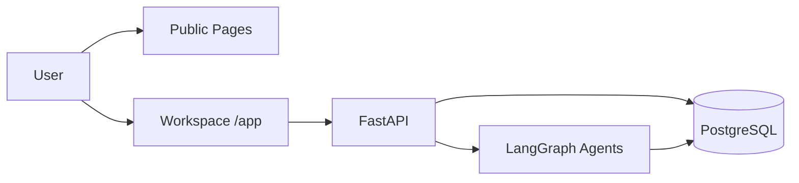

# RivalLens

> 面向产品经理与创业者的 AI 竞品雷达 SaaS：3 分钟生成可分享、可溯源 Battlecard 报告。


## Background

RivalLens 使用多 Agent 协作把公开竞品信息转为结构化结论，输出带证据引用的报告、结论矩阵和对比视图。目标用户是需要快速形成竞品判断的产品经理、创业者和独立开发者。

## Features

- 任务流：新建分析、实时进度、失败重试、阶段重放
- 报告流：Battlecard Markdown 报告、证据抽屉、导出与分享
- 结论流：`/api/runs/:id/conclusions` 矩阵化展示（claim/confidence/risk/evidence）
- 对比流：跨 run 结论对比矩阵（功能/定价/反馈/SWOT）
- 追踪流：Watchlist 最小 CRUD（竞品追踪骨架）
- 评审流：Skill staging 审核台（Curator 候选规则人工通过）

## Architecture



| Layer | Tech |
|---|---|
| Frontend | React 18, Vite, TypeScript, Tailwind, shadcn/ui |
| Backend | FastAPI, SQLAlchemy, Pydantic, LangGraph |
| Storage | PostgreSQL 16 |
| Model | Doubao Seed 系列（通过 provider 路由） |

## Quick Start

### 1) Start Backend

```bash
docker compose -f backend/docker-compose.dev.yml up -d
```

Backend default: `http://localhost:8010`

### 2) Start Frontend

```bash
cd frontend
npm install
npm run dev
```

Frontend default: `http://localhost:5173`

### 3) Run Checks

```bash
cd frontend && npm run type-check
cd ../ && python -m compileall backend/app
```

## Product Routes

- Public: `/`, `/examples`, `/pricing`, `/share/:runId`
- Workspace: `/app`, `/app/runs/new`, `/app/runs/:runId`, `/app/compare`, `/app/watch`, `/app/settings/skill-admin`

## Documentation

- 产品愿景：`./docs/1-product-vision.md`
- 产品功能清单：`./docs/1.1-product-features.md`
- 赛题背景：`./docs/0-problem-background.md`
- QnA 信号：`./docs/0-qna-signals.md`
- 合规声明：`./docs/6-compliance-statement.md`
- 凭据与机密防御：`./docs/8-secret-defense.md`

## Contributing

欢迎提 Issue 或 PR。提交前请至少执行前后端基础检查命令。

## License

MIT
