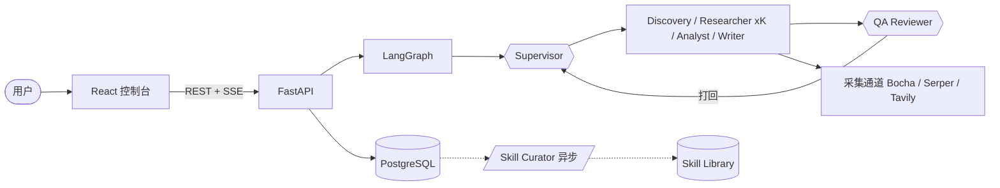

# RivalLens

> AI 驱动的竞品分析 Agent 协作系统：对话式开题 → 计划确认 → 多 Agent 采集分析 → 带证据溯源的竞品报告。


## Demo

在线体验：**<https://rival-lens.vercel.app>**（无需登录）

体验路径：首页输入分析需求 → Agent 多轮澄清 → 确认任务计划 → Live 页实时观察执行 → 查看报告 / 结论矩阵 / 证据溯源 / Trace 回放。

## 目录

- [Background](#background)
- [Features](#features)
- [Architecture](#architecture)
- [Quick Start](#quick-start)
- [Tech Stack](#tech-stack)
- [Documentation](#documentation)
- [Contributing](#contributing)
- [License](#license)

## Background

传统竞品分析（信息搜集 → 功能对比 → 评价整理 → SWOT → 报告）重复性高、信息源分散、依赖个人行业认知。RivalLens 用 8 个职责独立的 Agent 模拟数字调研小组：从一句自然语言需求出发，自动完成竞品发现、公开证据采集、跨竞品分析与报告组装；每条结论强制绑定证据来源，每次 Agent 决策可回放审计。

## Features

- **对话式开题**：Intake Agent 多轮澄清 + 建议答案，补齐角色 / 意图 / 竞品范围，支持竞品自动发现
- **计划树 HITL**：Planner 产出可视化 PlanTree，用户勾选 / 追加任务后执行；执行期 Replanner 动态修订计划
- **多 Agent 并行执行**：Supervisor LLM 工具委派调度，Researcher 按竞品 fan-out 并行采集
- **质检反馈闭环**：QA 规则 DSL + LLM 语义双层审查，按失败源头打回 researcher / analyst / writer 重做
- **全链路溯源**：结论强制 ≥1 条证据引用，报告 citation 一键跳转 Evidence Console
- **实时可观测**：SSE 事件流 Live 页、Trace DAG 回放、token / 覆盖率 / QA 打回率指标面板
- **运行中干预**：follow-up 追加指令、阶段级重放、超限自动降级
- **Skill 自进化**：Curator 从达标 run 沉淀 QA 规则 / prompt 模板候选，人工审核后下轮生效

## Architecture



| Agent | 职责 |
|---|---|
| Intake | 多轮澄清，补齐角色 / 意图 / 竞品范围（HITL） |
| Planner | 生成任务树 PlanTree，等用户确认（HITL） |
| Supervisor | 执行期 LLM 工具委派，唯一调度中枢 |
| Discovery / Replanner | 竞品自动发现 / 执行期计划修订 |
| Researcher ×K | ReAct 子图并行采集 + 初步结构化 |
| Analyst | 跨竞品结论矩阵（每条 ≥1 证据） |
| Writer | 按领域模板组装 Battlecard 报告 |
| QA Reviewer | 双层审查 + 多目标 rejection 路由 |
| Skill Curator | run 后异步沉淀技能候选，人工审核生效 |

## Quick Start

```bash
# 1. 后端（Docker）
cd backend
cp .env.dev.example .env.dev        # 填入 LLM / 搜索 API Key
docker compose -f docker-compose.dev.yml up -d rivallens_db rivallens_api
docker compose -f docker-compose.dev.yml exec -T rivallens_api alembic upgrade head

# 2. 前端
cd ../frontend
npm install
npm run dev                          # http://localhost:5173
```

后端默认 `http://localhost:8010`，健康检查 `GET /health`。

## Tech Stack

| 层 | 技术 |
|---|---|
| 前端 | React 18 · Vite · TypeScript · Tailwind · shadcn/ui · @xyflow/react（Trace DAG） |
| 后端 | FastAPI · SQLAlchemy · Pydantic v2 · LangGraph（checkpoint-postgres） |
| LLM | Qwen / Doubao / OpenAI 多 provider，slot→tier→catalog 分档路由，JSON mode + repair prompt |
| 检索 | Bocha（中文）/ Serper / Tavily 多源地域化路由，robots.txt 合规 + 站点限速 |
| 存储 | PostgreSQL 16（runs / steps / llm_calls / evidence / conclusions / supervisor_decisions） |
| 部署 | Docker Compose + Cloudflare Tunnel（API 公网）+ Vercel（前端） |

## Documentation

- 赛题背景：[`docs/0-problem-background.md`](./docs/0-problem-background.md)
- 架构决策：[`docs/2-architecture-decision.md`](./docs/2-architecture-decision.md)
- 多 Agent 架构：[`docs/2.5-agent-architecture.md`](./docs/2.5-agent-architecture.md)
- Schema 与协议：[`docs/3-schema-and-protocol.md`](./docs/3-schema-and-protocol.md)
- 测试用例：[`docs/7-test-cases.md`](./docs/7-test-cases.md)
- 合规声明：[`docs/6-compliance-statement.md`](./docs/6-compliance-statement.md)

## Contributing

欢迎提 Issue 或 PR。提交前执行 `cd frontend && npm run type-check` 与后端容器内 `pytest`。

## License

MIT
