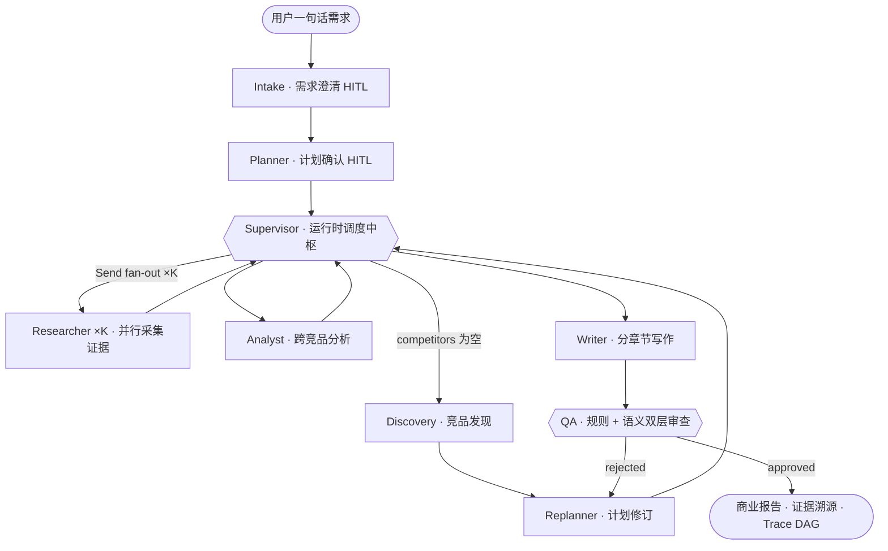

# RivalLens

> AI 驱动的竞品分析与追踪系统：一句话需求 → 多 Agent 调研 → 带证据的商业报告 → 竞品知识库 → 持续追踪。

[](https://rival-lens.vercel.app)


在线体验：**<https://rival-lens.vercel.app>**（无需登录）

## 目录

- [Background](#background)
- [Features](#features)
- [Architecture](#architecture)
- [Quick Start](#quick-start)
- [Tech Stack](#tech-stack)
- [Documentation](#documentation)
- [Contributing](#contributing)
- [License](#license)

## Background

传统竞品分析的成本不在「写报告」，而在资料分散、口径不统一、结论难溯源、结果难持续更新。RivalLens 面向产品经理、市场分析与创业团队，把一句自然语言需求转成可执行的多 Agent 调研链路：自动澄清意图、确认计划、发现竞品、采集公开证据、跨竞品分析、分章节写作并质检。报告中的每条关键结论强制绑定证据来源，Agent 的每步决策可在 Trace 中回放。

体验路径：首页输入分析需求 → Agent 多轮澄清 → 确认任务计划 → Live 页实时观察执行 → 查看报告 / 竞品知识 / 证据溯源 / 追踪面板。

## Features

- **对话式开题**：Intake Agent 多轮澄清并给出建议答案，补齐用户角色、分析意图、赛道范围与竞品发现方式
- **真 Agentic 编排**：Supervisor 用 LLM tool calling 在运行时决定竞品发现、并行度、补调研与终止时机，而非固定流水线；每次决策落库 `reasoning_summary` 可审计
- **强 Schema 通信**：Agent 之间以 Pydantic 强 Schema 传递结构化数据，覆盖产品 profile、功能、定价、人群、反馈与结论矩阵，而非自然语言接力
- **证据优先与全链路溯源**：Bocha / Serper / Tavily 多源检索 + Jina Reader 全文兜底；报告 citation 一键跳转 Evidence Console 查看来源、正文片段与采集时间
- **QA 双层审查闭环**：规则 DSL 校验硬约束（结论必须有证据）+ LLM 语义审查（证据是否支撑 claim），不达标按 `reject_to` 精准打回 Researcher / Analyst / Writer，并设最大打回次数护栏
- **双报告形态**：支持 `comparison` 竞品对比与 `landscape` 赛道全景，Writer 按章节深度写作
- **竞品知识与持续追踪**：报告产出的产品沉淀为竞品 profile，可加入 watchlist 持续刷新近期变化与差异对比
- **实时可观测**：SSE Live 页展示 Agent 步骤、工具调用与合规跳过；Trace DAG 回放每个节点的输入输出与 token 消耗

## Architecture



### Multi-Agent Orchestration

7 个核心闭环 Agent + 1 个异步 Skill Curator。Intake / Planner 是人机协作（HITL）暂停点，Supervisor 是执行期唯一调度中枢，QA 的 rejection 经 Replanner 回到 Supervisor 增量重派。



| Agent | 职责 |
|---|---|
| Intake | 多轮澄清，补齐角色 / 意图 / 竞品范围（HITL） |
| Planner | 生成任务树 PlanTree，等用户确认（HITL） |
| Supervisor | 执行期 LLM 工具委派，唯一调度中枢 |
| Discovery / Replanner | 竞品自动发现 / 执行期计划修订 |
| Researcher ×K | ReAct 子图并行采集、全文抓取、证据结构化 |
| Analyst | 跨竞品结论矩阵（每条 ≥1 证据） |
| Writer | 生成全景报告 / 对比报告，按章节深化正文 |
| QA Reviewer | 规则审查 + 语义审查 + 多目标 rejection 路由 |
| Skill Curator | run 后异步沉淀技能候选，人工审核生效 |

设计推导见 [`docs/2.5-agent-architecture.md`](./docs/2.5-agent-architecture.md)。

## Quick Start

```bash
# 1. 后端（Docker）
cd backend
cp .env.dev.example .env.dev        # 填入 LLM / 搜索 API Key
docker compose -f docker-compose.dev.yml up -d rivallens_db rivallens_api
docker compose -f docker-compose.dev.yml exec -T rivallens_api alembic upgrade head

# 2. 前端
cd ../frontend
npm install
npm run dev                          # http://localhost:5173
```

后端默认 `http://localhost:8010`，健康检查 `GET /health`。

## Tech Stack

| 层 | 技术 |
|---|---|
| 前端 | React 18 · Vite · TypeScript · Tailwind · shadcn/ui · @xyflow/react（Trace DAG） |
| 后端 | FastAPI · SQLAlchemy · Pydantic v2 |
| Agent 编排 | LangGraph StateGraph（Send fan-out 并行 · interrupt HITL · checkpoint-postgres 断点续跑） |
| LLM | Qwen / Doubao / OpenAI 多 provider，slot→tier→catalog 分档路由，JSON mode + repair prompt |
| 检索 | Bocha / Serper / Tavily 搜索路由，Jina Reader 全文兜底，robots.txt 合规 + 站点限速 |
| 存储 | PostgreSQL 16（业务表 + LangGraph checkpoint + LISTEN/NOTIFY 事件总线） |
| 部署 | Docker Compose + Cloudflare Tunnel（API 公网）+ Vercel（前端） |

## Documentation

- 赛题背景：[`docs/0-problem-background.md`](./docs/0-problem-background.md)
- 架构决策：[`docs/2-architecture-decision.md`](./docs/2-architecture-decision.md)
- 多 Agent 架构：[`docs/2.5-agent-architecture.md`](./docs/2.5-agent-architecture.md)
- 采集通道与合规：[`docs/2.6-collector-channels.md`](./docs/2.6-collector-channels.md)
- Schema 与协议：[`docs/3-schema-and-protocol.md`](./docs/3-schema-and-protocol.md)
- 测试用例：[`docs/7-test-cases.md`](./docs/7-test-cases.md)
- 合规声明：[`docs/6-compliance-statement.md`](./docs/6-compliance-statement.md)

## Contributing

欢迎提 Issue 或 PR。提交前执行 `cd frontend && npm run type-check`，后端在容器内执行 `pytest`。

## License

MIT
