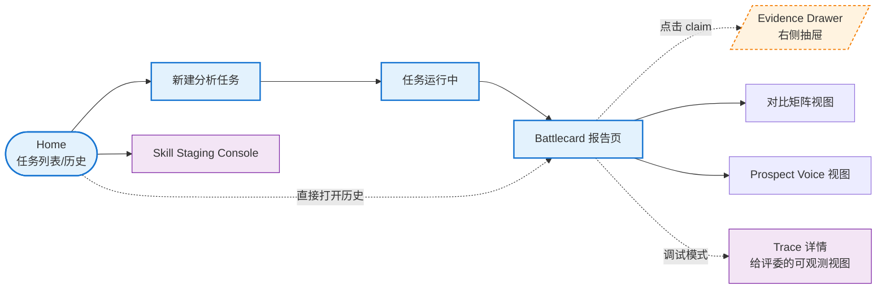
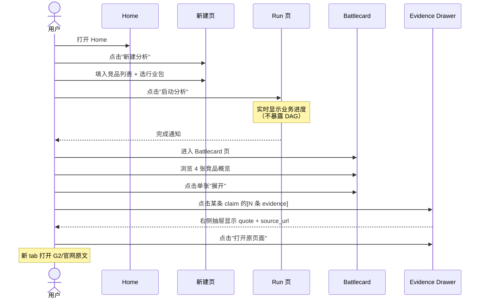
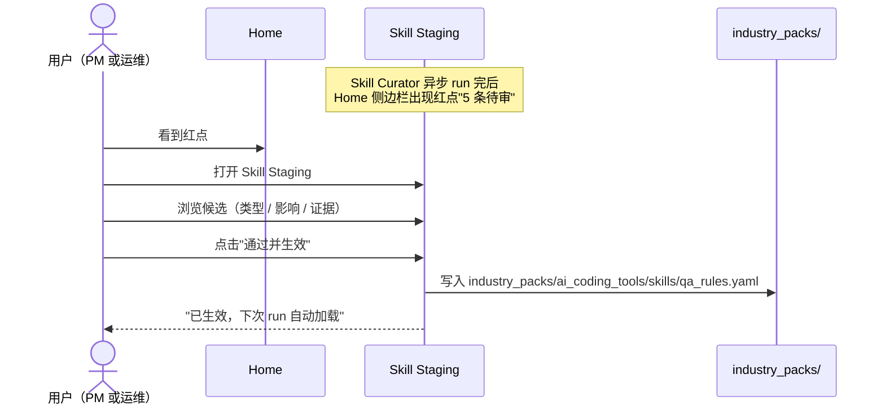

# RivalLens 产品形态与前端业务设计

> 本文回答：**产品有哪些页面、每个页面长什么样、用户怎么操作、业务对象在 UI 上如何呈现**。
>
> 后端架构见 `docs/2` / `docs/2.5`；Schema 字段定义见 `docs/3`；本文不重复字段细节。
>
> **形态参考**（仅借鉴产品形态，自研视觉风格，不抄像素）：
>
> - Klue Compete Agent（`klue.com/compete-agent`、`klue.com/topics/good-sales-battlecard-examples`）：6 类 Battlecard 结构、点击 claim 抽屉式溯源、24h 自动刷新视觉提示、HITL 校验状态。
> - Crayon Sparks（`crayon.co/sparks`）：AI importance scoring 标签、cron-driven 自动更新提示。

## 1. 产品定位

- **赛道**：AI Coding 工具（Cursor / Windsurf / TRAE / Claude Code）
- **用户角色**：
  - **PM / 产品负责人**：关注功能树、差异化、定价、用户反馈、可借鉴点
  - **创业者 / CEO**：关注市场机会、定位、商业模式、SWOT、风险
- **核心交付物**：每竞品一张 Battlecard + 跨竞品分析 + evidence-grounded 溯源

## 2. 信息架构



**路由约定**：

| 路径 | 页面 | 入口 |
|---|---|---|
| `/` | Home（任务列表） | 默认 |
| `/runs/new` | 新建任务 wizard | Home 顶栏按钮 |
| `/runs/:run_id` | 任务运行中 / 已完成报告 | Home 列表点击 |
| `/runs/:run_id/competitors/:competitor_id` | 单竞品 Battlecard 详情 | 报告页竞品卡片点击 |
| `/runs/:run_id/voice` | Prospect Voice 主题视图 | 报告页 tab |
| `/runs/:run_id/compare` | 跨竞品对比矩阵 | 报告页 tab |
| `/runs/:run_id/trace` | Agent Trace 详情 | 报告页右上角"开发者视图"按钮 |
| `/skills/staging` | Skill 审核台 | Home 侧边栏 |

## 3. 关键页面规格

### 3.1 新建分析任务页（`/runs/new`）

**目标**：让用户在 30 秒内启动一次分析。参考 Klue "Explore Insights" 单输入框 + 一键启动。

```text
┌───────────────────────────────────────────────────────────┐
│  ← 返回             新建竞品分析                            │
├───────────────────────────────────────────────────────────┤
│                                                           │
│   分析什么？                                                │
│   ┌───────────────────────────────────────────────────┐   │
│   │ 输入赛道名或粘贴竞品列表（每行一个）                  │   │
│   │  AI Coding 工具                                    │   │
│   │  Cursor                                            │   │
│   │  Windsurf                                          │   │
│   │  TRAE                                              │   │
│   │  Claude Code                                       │   │
│   └───────────────────────────────────────────────────┘   │
│                                                           │
│   行业包                                                    │
│   [ai_coding_tools ▼]   ⓘ 决定 evidence 来源 / 报告模板    │
│                                                           │
│   关注角色（多选）                                          │
│   ☑ 产品经理   ☑ 创业者   ☐ 销售   ☐ 投资人               │
│                                                           │
│   ▷ 高级选项（折叠）                                        │
│       • 关注维度 [功能, 定价, 用户反馈, 差异化, SWOT]       │
│       • 数据集模式 [预置 / 在线刷新]                        │
│                                                           │
│             ┌──────────────────┐                          │
│             │   启动分析 →     │                          │
│             └──────────────────┘                          │
└───────────────────────────────────────────────────────────┘
```

**交互要点**：

- 默认填充上次的行业包和关注角色，降低重复输入成本
- 行业包下拉显示每个 pack 的简介与可分析维度（hover）
- "启动分析"后立即跳转 `/runs/:run_id`，**不**让用户在新建页等待
- 数据集模式默认"预置"，避免演示外网抖动

### 3.2 任务运行中页（`/runs/:run_id` 进行中态）

**目标**：让用户**以业务进度视角**看到 Agent 在做什么，而不是 DAG 技术过程。DAG 视图在"开发者视图"里。

```text
┌───────────────────────────────────────────────────────────┐
│  AI Coding 工具分析  · run_abc123  · 进行中  · 已 02:34   │
│  4 竞品 · 87 evidence · 0 conclusion · 0 battlecard       │
│                                            [开发者视图 →] │
├───────────────────────────────────────────────────────────┤
│  当前进度                                                  │
│                                                           │
│  ●─── 调研竞品 ────●─── 跨竞品分析 ───○─── 撰写报告 ───○  │
│       已完成         进行中           等待              │
│                                                           │
├───────────────────────────────────────────────────────────┤
│  竞品调研状态                                              │
│  ┌─────────────┐ ┌─────────────┐ ┌─────────────┐ ┌──────┐│
│  │ Cursor      │ │ Windsurf    │ │ TRAE        │ │ Claude││
│  │ ✓ 完成      │ │ ⏳ 抓取中   │ │ ✓ 完成      │ │ ⏳    ││
│  │ 23 evidence │ │ 12 evidence │ │ 19 evidence │ │ 8 ev  ││
│  │ 5 来源      │ │ 3/5 来源    │ │ 4 来源      │ │ 2/4   ││
│  └─────────────┘ └─────────────┘ └─────────────┘ └──────┘│
│                                                           │
├───────────────────────────────────────────────────────────┤
│  最新事件（滚动）                                          │
│  • 03:21  Researcher(Cursor) 抓取 pricing page 完成        │
│  • 03:18  Researcher(Windsurf) 抓取 G2 reviews（17 条）   │
│  • 03:15  Researcher(TRAE) 完成，输出 19 evidence         │
│  • ...                                                    │
└───────────────────────────────────────────────────────────┘
```

**交互要点**：

- 顶部业务进度条（3 段：调研 / 分析 / 撰写），不暴露 Supervisor / Researcher 等技术名词
- 中间竞品卡按"业务实体"组织（而非按 Agent），用户看到的是"Cursor 在调研中"而非"researcher_subgraph_007 在跑"
- 右上角"开发者视图"才是 DAG / Trace / Supervisor 决策 JSON（评委专用 tab）
- 实时事件流用人话描述，把 Agent 内部消息翻译成业务事件

### 3.3 Battlecard 报告页（核心交付物）

**目标**：核心产出页。第一版做 **2 类 Battlecard**（参考 Klue 6 类，砍掉 4 类作为 v2 候选）。

#### 3.3.1 页面框架

```text
┌────────────────────────────────────────────────────────────┐
│  AI Coding 工具分析报告  · 24h 前刷新  · 状态: 已通过 QA   │
├─[竞品概览]──[对比矩阵]──[Prospect Voice]──[开发者视图]────┤
│                                                            │
│  竞品概览（4 张 Competitor Battlecard 网格布局）           │
│                                                            │
│   ┌──────────────────┐  ┌──────────────────┐               │
│   │ Cursor      🔴HIGH│  │ Windsurf    🟡MED│              │
│   │ ─────────────────│  │ ─────────────────│              │
│   │ Why We Win:      │  │ Why We Win:      │              │
│   │ • 协作成熟       │  │ • Pricing 灵活   │              │
│   │ • IDE 集成深     │  │ • 团队功能强     │              │
│   │ Recent News:     │  │ Recent News:     │              │
│   │ • 上线 Agent v2  │  │ • 改价 $35/seat  │              │
│   │ Pricing: $20/mo  │  │ Pricing: $35/seat│              │
│   │ [展开 →]         │  │ [展开 →]         │              │
│   └──────────────────┘  └──────────────────┘              │
│   ┌──────────────────┐  ┌──────────────────┐               │
│   │ TRAE        🟢LOW│  │ Claude Code 🟡MED│              │
│   │ ...              │  │ ...              │              │
│   └──────────────────┘  └──────────────────┘              │
└────────────────────────────────────────────────────────────┘
```

#### 3.3.2 Competitor Battlecard 详情（点击单张卡进入）

字段对齐 Klue 真实战卡结构（来自 `klue.com/topics/good-sales-battlecard-examples`）：

| 区块 | 内容 | 数据源 | 第一版 |
|---|---|---|---|
| Header | 竞品 logo / 名称 / **24h 前刷新** 标签 / importance | competitor 表 | ✅ |
| Recent News | 最近 30 天 release / 博客 / pricing change | evidence (source_type=release_note/official_blog) | ✅ |
| Why We Win | 2-5 条 conclusion，每条带 importance 标签 + evidence 角标 | Analyst Conclusion | ✅ |
| Pricing | tier 表 + 模型（freemium / per_seat / usage_based）| evidence (source_type=pricing_page) | ✅ |
| Product Overview | 核心功能 / positioning / 集成 / 安全合规 | Analyst Conclusion + Feature 表 | ✅ |
| Objection Handling | 常见 pushback + 应对 | — | ⏸ v2（需要 sales call 数据） |
| Talk Tracks | "当对方说 X，你说 Y" | — | ⏸ v2 字段占位 |

**核心交互**：

- 每条 claim 右侧有 `[N 条 evidence]` 角标，点击 → 触发 Evidence Drawer
- importance 标签（🔴 HIGH / 🟡 MEDIUM / 🟢 LOW）由 Analyst 输出，可在右上角按 importance 筛选
- "24h 前刷新" 是视觉提示，对齐 Klue "自动刷新"产品感（第一版**手动**点击"重新分析"触发，cron 留 v2）

#### 3.3.3 What Prospects Are Saying（`/runs/:run_id/voice`）

参考 Klue "What Prospects Are Saying" 战卡：按主题分组的真实买家声音。

```text
┌────────────────────────────────────────────────────────────┐
│  Prospect Voice · 来自 G2 / Reddit / HackerNews            │
│                                                            │
│  主题筛选: [全部] [性能] [AI 质量] [定价] [上手成本]        │
│  情感筛选: [全部 ▼]   竞品: [Cursor ▼]                     │
├────────────────────────────────────────────────────────────┤
│                                                            │
│  📂 性能 & 速度（12 条 quote · 9 正向 / 2 中性 / 1 负向）  │
│   ┌──────────────────────────────────────────────────────┐│
│   │ ⭐⭐⭐⭐⭐ "Best autocomplete I've used in 5 years"     ││
│   │ — Senior Engineer @ mid-market SaaS · G2 · 2026-04   ││
│   │ [查看原文 ↗]                                          ││
│   └──────────────────────────────────────────────────────┘│
│   ┌──────────────────────────────────────────────────────┐│
│   │ ⭐⭐⭐ "Sometimes laggy on large repos"                ││
│   │ — Tech Lead @ enterprise · Reddit · 2026-03          ││
│   │ [查看原文 ↗]                                          ││
│   └──────────────────────────────────────────────────────┘│
│                                                            │
│  📂 AI 质量（24 条 quote · 18 正向 / 4 中性 / 2 负向）     │
│   ...                                                      │
└────────────────────────────────────────────────────────────┘
```

**交互要点**：

- 按主题（来自行业包 `prospect_themes`）自动分组
- 每条 quote 必带：评分（如来源是 G2）+ buyer_persona + 来源 + 时间 + 跳转原文
- 顶部 sentiment 概览条形图（正向 / 中性 / 负向 占比）

### 3.4 Evidence Drawer（右侧抽屉，全站复用）

**目标**：让"点击任意 claim → 看到原文"成为一致体验。这是评分项"结论级溯源"的视觉锚点。

```text
                              ┌─────────────────────────────┐
   Battlecard 页              │  Evidence · 3 条引用         │
                              │  关于："Windsurf 团队定价"   │
   • Windsurf 团队定价        │  ─────────────────────────  │
     更适合企业  ←─[3 条]──→  │  ① pricing_page · 2026-05   │
                              │     "Teams plan: $35/seat"   │
                              │     [打开原页面 ↗]           │
                              │  ─────────────────────────  │
                              │  ② g2_review · 2026-04       │
                              │     "Pricing scales nicely   │
                              │      for our 30-person team" │
                              │     — DevOps Lead, SaaS      │
                              │     [打开 G2 ↗]              │
                              │  ─────────────────────────  │
                              │  ③ hn_thread · 2026-05       │
                              │     "...团队版有共享上下文" │
                              │     [打开讨论 ↗]             │
                              │                              │
                              │  [关闭]                      │
                              └─────────────────────────────┘
```

**交互要点**：

- 抽屉从右侧滑入，背景半透明遮罩
- 多条 evidence 按时间倒序，最新优先
- 每条卡片显示 source_type 图标（pricing_page 📄 / g2_review ⭐ / reddit 💬 / hn_thread 🟧）
- 每条 evidence 都有"打开原页面"外链（在新 tab 打开，不离开报告页）

### 3.5 任务列表与历史页（Home `/`）

```text
┌────────────────────────────────────────────────────────────┐
│  RivalLens                                  [+ 新建分析]   │
├────────────────────────────────────────────────────────────┤
│  ┌────────────────────────────────────────────────────┐    │
│  │ ⏳ AI Coding 工具分析 · 进行中 · 02:34             │    │
│  │ 4 竞品 · 87 evidence · 已完成调研阶段              │    │
│  └────────────────────────────────────────────────────┘    │
│  ┌────────────────────────────────────────────────────┐    │
│  │ ✓ Enterprise Agent 平台 · 完成 · 2 小时前         │    │
│  │ 3 竞品 · 142 evidence · 18 conclusion · QA 通过   │    │
│  └────────────────────────────────────────────────────┘    │
│  ┌────────────────────────────────────────────────────┐    │
│  │ ⚠ SaaS CRM 赛道 · 降级完成 · 昨天                  │    │
│  │ 5 竞品 · 213 evidence · 14 conclusion · 3 条降级   │    │
│  └────────────────────────────────────────────────────┘    │
│                                                            │
│  [显示更多 ↓]                                              │
└────────────────────────────────────────────────────────────┘
```

**状态图标语义**：

- ⏳ 进行中
- ✓ 完成（QA 全部通过）
- ⚠ 降级完成（部分 claim 超过 QA 重试上限，标记为 degraded）
- ✗ 失败（致命错误）

### 3.6 Skill Staging Console（`/skills/staging`）

**目标**：Skill Curator 沉淀的候选需要人工 approve 才会写入 industry pack。这是 RivalLens 自进化闭环的人机接口。

```text
┌────────────────────────────────────────────────────────────┐
│  Skill 审核台 · 行业包: ai_coding_tools · 待审 5 条        │
├────────────────────────────────────────────────────────────┤
│  ┌──────────────────────────────────────────────────────┐  │
│  │ 类型: QA 规则候选                                    │  │
│  │ 来源: 最近 3 个 run 中 pricing claim 反复缺 source   │  │
│  │ 建议规则:                                            │  │
│  │   "pricing 类 conclusion 必须引用 90 天内             │  │
│  │    source_type=pricing_page 的 evidence"             │  │
│  │ 预期影响: rejection 率 −12%, false-reject 风险 低    │  │
│  │ 触发证据: [run_001, run_005, run_009 →]              │  │
│  │                          [拒绝]    [通过并生效 →]    │  │
│  └──────────────────────────────────────────────────────┘  │
│  ┌──────────────────────────────────────────────────────┐  │
│  │ 类型: 来源优先级候选                                  │  │
│  │ 建议: AI Coding 行业，G2 reviews 在协作维度证据       │  │
│  │       质量高于 Reddit thread, 建议提升至 source       │  │
│  │       优先级 P1                                       │  │
│  │ ...                                                  │  │
│  └──────────────────────────────────────────────────────┘  │
└────────────────────────────────────────────────────────────┘
```

**交互要点**：

- 每条候选必须显示：类型 / 触发条件 / 建议内容 / 预期影响 / 触发证据链接
- 通过的候选立即写入 `industry_packs/<pack>/skills/<file>.yaml`（带 Git 友好的 diff 提示）
- 拒绝的候选保留 `status=rejected`，避免下次 Curator 重复推荐

### 3.7 Trace 详情（`/runs/:run_id/trace`，开发者视图）

**目标**：评委 / 答辩用。包含 DAG 可视化、Supervisor 决策 JSON、每步 LLM call。**不进 PM / 创业者主用户流**，从报告页右上角"开发者视图"进入。

第一版内容：

- DAG 视图（mermaid 渲染当次 run 的 Supervisor → Researcher × N → Analyst → Writer → QA 实际拓扑）
- Supervisor 决策时间线（每次 tool call 的 selected_tool / args / rationale）
- LLM 调用列表（步骤 / 模型 / token in/out / latency / 错误重试）
- QA rejection 记录（reject_to 路由可视化）

视觉上**克制**：黑底白字 monospace 风格，明确"开发者视角"。

## 4. 关键交互流程

### 4.1 主流程：新建任务 → 看结果 → 看证据



### 4.2 QA Rejection 用户视角（不暴露 JSON）

用户在任务运行中页看到的是**人话**：

```text
┌─────────────────────────────────────────────────────────┐
│  ⚠ 质量校验发现问题，正在补充                            │
│                                                         │
│  Windsurf 的"团队定价更适合企业"结论缺少官方定价证据，  │
│  正在重新调研 pricing page...                           │
│                                                         │
│  预计 30 秒后完成                          [查看详情]   │
└─────────────────────────────────────────────────────────┘
```

点击"查看详情"才进入开发者视图看 Rejection JSON。

### 4.3 Skill 审核流



## 5. 视觉风格基调

**不抄 Klue / Crayon 像素，自研视觉语言**。基调：

- **冷静专业**：Klue 偏蓝绿企业风，Crayon 偏橙黄活力感。RivalLens 用**深灰 + 单色强调色**（如 indigo），更接近工程工具感而非销售工具感（贴合 PM / 创业者用户）。
- **信息密度高**：Battlecard 一屏内尽可能多展示有效字段，但每个 claim 都有"展开 evidence"的减压出口。
- **状态可见**：每个数据点都明示 freshness（"24h 前刷新"）、importance、confidence、source_count。
- **不堆叠装饰**：禁止渐变、玻璃拟态等装饰性 UI，所有像素服务于信息呈现。
- **可达性**：importance 颜色（🔴🟡🟢）必须同时有图标或文字，不依赖纯色觉。

具体组件库：第一版用 `shadcn/ui` + `tailwindcss`，自定义主题色（详见前端 README）。

## 6. 第一版不做的（YAGNI 边界，明确推迟到 v2）

| 功能 | 为什么不做 | v2 触发条件 |
|---|---|---|
| Objection Handling Battlecard | 需要 sales call 数据，第一版无来源 | 接入第一个客户的 call recording |
| Talk Tracks 自动生成 | 同上 | 同上 |
| Slack / Salesforce / Gong 集成 | 工程量大，与核心评分项无关 | 用户增长到需要嵌入工作流 |
| 私域 Win-Loss 访谈采集 | 数据合规复杂 | 客户主动提供 |
| Cron 定时自动刷新 | 第一版手动 trigger 足够覆盖演示 | 单用户出现 ≥3 个长期跟踪赛道 |
| 自然语言问询（Ask Klue 形态） | LLM 接入成本 + 需要稳定的 RAG 层 | 报告库累积到 50+ run |
| 销售排行榜 / 客户管理 | 不是 PM / 创业者用户需要的 | 引入销售用户角色后 |
| 移动端适配 | 答辩用桌面端足够 | 用户主动反馈 |

## 7. 数据需求（前端 mock 用，详细 schema 见 docs/3）

前端开发期间需要的 mock 数据最小集：

- `data/demo/ai_coding/seeds/runs.json`：3 个 run（完成 / 进行中 / 降级各 1 个）
- `data/demo/ai_coding/seeds/competitors.json`：4 个竞品基础信息
- `data/demo/ai_coding/seeds/evidence.json`：≥80 条 evidence，含全部 source_type
- `data/demo/ai_coding/seeds/conclusions.json`：≥16 条 conclusion，含 high/medium/low importance 各 ≥3 条
- `data/demo/ai_coding/seeds/skill_candidates.json`：5 条候选，覆盖三种类型

字段细节统一从 `docs/3-schema-and-protocol.md` 引用，本文不重复。
