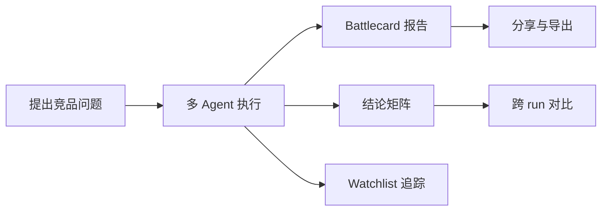

# RivalLens Product Vision

## 现状与目标

当前形态是可用的多 Agent 竞品分析系统。目标形态是面向产品经理与创业者的 AI 竞品雷达 SaaS，赛题 Demo 作为首个公开版本，不作为产品边界。



## 分层职责

| 层 | 负责 | 不负责 |
|---|---|---|
| 营销层（`/`、`/examples`、`/share/:runId`） | 价值表达、案例展示、报告阅读 | 任务执行、管理能力 |
| 工作区层（`/app/*`） | 新建分析、任务管理、结论对比、追踪订阅 | 外部公开访问 |
| Agent 编排层（LangGraph） | 调研、分析、写作、QA、Curator | 页面呈现、前端交互 |
| 数据与证据层（PostgreSQL） | run、evidence、conclusion、watchlist 持久化 | 产品文案、UI 路由 |

## 第一性原理约束

| 维度 | 分析 | 结论 |
|---|---|---|
| 数据规模 | 单 run 需要聚合 steps、evidence、conclusions，多页面复用同一数据 | 前端按 query key 分层缓存，避免重复拉取 |
| 能力归属 | 报告消费和分享属于产品层，证据归因与结论生成属于 Agent 层 | 路由分为公开区与工作区，能力边界清晰 |
| 写入/读取成本 | 证据与结论读取频繁，写入主要来自任务执行和 watchlist 更新 | SSE 只触发必要缓存失效，CRUD 保持最小接口 |
| 故障域 | 外部数据抖动最先影响任务执行，不应扩散到报告阅读与分享 | 分享页复用已落库报告，避免依赖运行态上下文 |
| 可逆性 | 赛题期不引入支付与真鉴权，但后续需要平滑升级 | 先固定 SaaS 路由语义，再补鉴权/计费实现 |

## 用户契约

```text
输入契约:
- 用户可提交 user_query + competitors + target_roles + 可选 domain_hint/reference_urls。
- 用户可将竞品加入 watchlist。

输出契约:
- 每个 run 提供 report、metrics、evidence、conclusions、trace。
- 报告支持 /share/:runId 公开阅读。
- 对比页可聚合多 run conclusions。
```

不变式：

1. 报告中的关键结论必须可追溯到 evidence。
2. 任务状态变化必须通过 run status 与事件流可观测。
3. 工作区入口固定为 `/app`，公开区入口固定为 `/`。
4. watchlist CRUD 失败时返回显式错误，不返回伪成功。

## 留存与变现路径

| 阶段 | 用户动作 | 产品钩子 |
|---|---|---|
| 首次体验 | 启动 1 次分析并查看报告 | 3 分钟内得到可分享结果 |
| 连续使用 | 复用模板并跨 run 对比 | 对比矩阵成为复盘入口 |
| 长期使用 | 订阅 watchlist 并跟踪变化 | 更新提醒驱动回访 |
| 付费转化 | 需要更多导出、分享、协作能力 | Pro/Team 层能力提示 |

## OPC 演进路径

| 阶段 | Objective | Product | Commercial |
|---|---|---|---|
| O1 | 证明可用性 | 路由分层、报告作品化、结论矩阵 | 免费试用 |
| O2 | 提升留存 | watchlist 自动化、模板运营、分享传播 | Pro 功能分层 |
| O3 | 团队化 | 协作审阅、权限、组织空间 | Team 套餐 |

## 重评触发条件

| 触发条件 | 当前阈值 | 重评方向 |
|---|---|---|
| 月活跃用户 > 200 | 公开分享占比提升 | 接入真鉴权与空间隔离 |
| 单日分析任务 > 500 | 后台队列压力升高 | 任务调度与缓存架构重构 |
| watchlist 条目 > 2000 | CRUD 读写热点集中 | 引入独立订阅任务表与调度器 |
| 导出需求占比 > 30% | 浏览器打印不足 | 引入服务端导出服务 |
