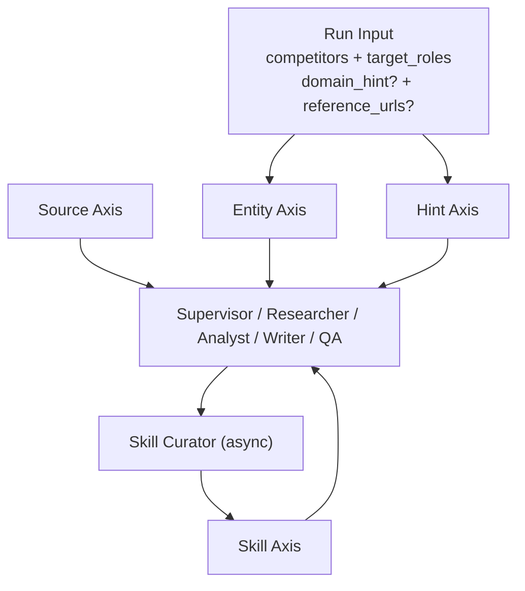

# RivalLens 架构决策（Agent-Native 4 轴）

> 更新时间：2026-05-29  
> 适用范围：RivalLens 当前主干实现与后续迭代边界

## 0. 目标与约束

RivalLens 的目标不是做“某一行业的规则引擎”，而是做**可跨场景复用的竞品分析 Agent 系统**。  
所有架构决策都围绕以下硬约束：

- **通用性优先**：输入可以是任意竞品对象，系统不依赖预置行业目录才能运行。
- **Agent 决策优先**：运行时由 Supervisor/Researcher/Analyst/Writer/QA 协同决策，而不是静态流程分支。
- **扩展性优先**：新增能力通过正交扩展点注入，不改核心闭环协议。
- **可验证优先**：所有关键阶段可通过 trace、指标和 golden cases 验证。

## 1. 核心抽象：4 个正交扩展轴

| 轴 | 作用 | 载体 | 变更方式 |
|---|---|---|---|
| Entity | 定义“分析对象是谁” | `competitors` + demo fixtures | 增加实体 seed，不改编排协议 |
| Source | 定义“证据从哪里来” | collector channels | 注册新 channel，不改 Agent 角色边界 |
| Skill | 定义“领域知识如何按需加载” | `backend/skills/**/SKILL.md` + SkillStore | 新增 SKILL 文件即可生效 |
| Hint | 定义“运行时上下文提示” | `domain_hint` + `reference_urls` | 请求级注入，无持久耦合 |

## 2. 系统分层

### 2.1 Backend

- API 层：FastAPI（Run/Trace/Evidence/Conclusions/Skill review）
- 编排层：LangGraph（主图 + Researcher 子图）
- 工具层：collector registry + channel 调度
- 知识层：SkillStore（scan/load/list/read supporting file）
- 持久层：PostgreSQL（runs/steps/evidence/reports/llm_calls/...）

### 2.2 Frontend

- React + Vite + TypeScript
- NewRun 输入 `domain_hint`、`reference_urls`、自由竞品列表
- RunView/SkillStaging 展示新字段（`applies_to` + `tags`）

## 3. 关键技术选择

- **编排**：LangGraph  
  原因：天然支持多节点状态图、Send fan-out、checkpoint 恢复。
- **API 与 schema**：FastAPI + Pydantic v2  
  原因：边界校验强、协议显式、回归测试稳定。
- **数据库**：PostgreSQL 16 + SQLAlchemy 2 + Alembic  
  原因：事务一致性、JSONB 灵活 schema、迁移可审计。
- **实时事件**：LISTEN/NOTIFY + SSE  
  原因：端到端联调成本低，兼容轮询兜底。
- **前端技术栈**：React + TS + React Query  
  原因：状态边界清晰，适合 trace 与评审台场景。

## 4. 运行时闭环

1. **Supervisor**：根据 run state 动态委派（Research / Analyze / Write / Finalize）。
2. **Researcher**：ReAct 循环调度工具，优先结构化证据产出。
3. **Analyst**：聚合证据，产出结构化洞察与风险标记。
4. **Writer**：生成报告草稿，保留 evidence refs。
5. **QA**：快速规则 + 语义审查双层验收。
6. **Skill Curator（异步）**：run 完成后生成候选技能，进入人工审核流。

## 5. 扩展边界（必须遵守）

### 5.1 Entity 轴

- 允许任意竞品字符串输入；只做格式标准化（trim/去重）。
- demo fixtures 只用于自动补全体验，不是运行依赖。

### 5.2 Source 轴

- 内置通道：`search_web` / `fetch_url` / `parse_page` / `extract_structured` / `load_skill` / `read_skill_file`。
- 新增通道必须提供：输入 schema、错误语义、幂等说明、trace 字段。

### 5.3 Skill 轴

- 技能文件标准：`backend/skills/<applies_to>/<skill_id>/SKILL.md`
- 通过 frontmatter 声明 `name/description/version/tags/applies_to`。
- 由 Agent 在运行时按需 `load_skill`，避免把全部知识塞进系统提示词。

### 5.4 Hint 轴

- `domain_hint`：一句话场景提示（可空）。
- `reference_urls`：高价值入口 URL 列表（可空）。
- 两者都是 run 级上下文，不引入静态绑定。

## 6. 可靠性与安全护栏

- 边界 fail-fast：结构化失败不静默吞错。
- 采集链路可降级：单通道失败不导致整 run 中断。
- QA 与 Curator 解耦：Curator 失败不影响主 run 完成态。
- 敏感信息治理：日志与提交流程不输出密钥/凭据。

## 7. 验收口径

- `pytest backend/app/tests -q` 通过
- `python backend/app/scripts/run_golden.py` 通过（12/12）
- `npm run type-check` 通过
- 关键设计文档与代码字段一致（`domain_hint` / `reference_urls` / `applies_to` / `tags`）
