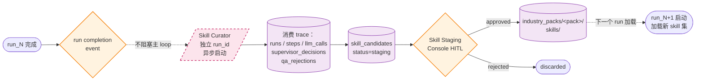

# RivalLens 多 Agent 架构设计

> 本文是 RivalLens 多 Agent 系统的设计源头。`docs/2-architecture-decision.md` 描述系统级工程边界，`docs/3-schema-and-protocol.md` 描述结构化协议字段，本文负责回答这些问题：**为什么是这些 Agent？为什么是这个数量？为什么是这种拓扑？为什么不是另一种？**
>
> **系统定位（不可妥协的红线，与 `docs/2-architecture-decision.md` 同步）**：
>
> - **Agent-driven**：LLM 动态决策流程、Agent 选择与工具使用，而非 if-else 预定义路径。参考 Anthropic 《Building Effective Agents》对 workflow 与 agent 的区分。
> - **Extensible**：Agent 角色、工具集、行业包、Schema 字段、QA 规则全部开放扩展。
> - **Self-improving**：系统从每次 run 的反思中沉淀新 skill，形成长期能力进化闭环。
>
> 本文每一项设计都必须能独立回答"为什么不选另一种方案"。任何"为了演示 / 为了赛题 / 为了简单"的理由都不允许写入；这类理由属于 `docs/private/`。

## 1. 第一性原理：Agentic vs Workflow

### 1.1 概念边界

Anthropic 在 [Building Effective Agents](https://www.anthropic.com/research/building-effective-agents) 给出了清晰区分：

- **Workflow**：LLM 与工具按**预定义路径**编排，路径结构由代码写死，LLM 只填充各节点的内容。
- **Agent**：LLM **动态决定**自己的执行路径、工具使用、Agent 选择。代码只提供**护栏**（max_iterations、tool schema、safety filter），不规定**做什么**。

二者的本质差异：Agent 可以应对"未曾预设的输入分布"。Workflow 一旦遇到不在预设路径中的场景，要么硬塞进现有路径产生错位结果，要么拒绝处理。

### 1.2 RivalLens 必须是 Agent 而不是 Workflow

竞品分析的真实工作负载特性：

- **输入未知**：用户可能输入"分析 SaaS CRM 赛道"也可能"对比 Cursor 与 GitHub Copilot 的企业版差异"。前者需要先列出竞品再调研，后者只需深度对比 2 个产品。
- **采集策略动态**：某些竞品官网信息充分（如 Linear），某些需要补充社区讨论（如 Repl.it）。这种判断不能写死。
- **分析维度动态**：某些行业 pricing 差异最显著（如 SaaS），某些行业 feature 差异最显著（如 AI Coding 工具）。Writer 不应固定按"功能 → 定价 → SWOT"模板组装。
- **质量问题动态**：QA 不可能预先列出所有可能的失败模式。需要 LLM 在审查时识别"这条结论虽然引用了证据但证据其实不支持该 claim"这种语义级问题。

如果做成 workflow，上面四项都需要把"动态判断"硬编码——每加一个 case 都要改代码。Agent 模式下，这些判断在运行时由 LLM 做出，代码只管护栏。

### 1.3 决策落地

| 决策 | Agent 模式（选） | Workflow 模式（弃） |
|---|---|---|
| 流程编排 | Supervisor LLM 工具委派 | 固定 DAG 边 |
| 并行 fan-out 度 | Supervisor 运行时决定 K | 代码硬编码 `for each competitor` |
| 采集策略 | Researcher ReAct 自主决定工具序列 | 代码硬编码 `fetch_homepage → fetch_pricing → fetch_reviews` |
| 分析维度 | Analyst LLM 根据数据决定重点维度 | 代码套用固定 SWOT 模板 |
| QA 失败检测 | LLM 语义审查 + 规则 DSL 兜底 | 仅规则 DSL |
| 能力进化 | Skill Curator 沉淀 + HITL 审核 | 无 |

## 2. Agent 边界推导：为什么是 6 个角色

### 2.1 推导原则

不预设"多少个 Agent"，从**真实工作流的认知任务**反推：

1. **决策**：理解用户意图，制定整体计划，决定何时开始/停止某阶段。
2. **数据**：搜集与单个竞品有关的全部原始资料并初步结构化。
3. **洞察**：跨竞品做对比、SWOT、差异化分析。
4. **表达**：将洞察按领域模板组装成报告。
5. **监督**：审查产出是否符合 Schema、是否有据可查、是否自相矛盾，并打回上游。
6. **学习**：从历次 run 的成败模式中沉淀复用资产。

这是 6 类**互不重叠的认知功能**。每一类对应一个 Agent；少一类系统能力不完整，多一类会与既有角色重叠。

### 2.2 与"导师举例的 4 个 Agent"的关系

赛题原文（`docs/0-problem-background.md`）举例了"采集 / 分析 / 撰写 / 质检"4 个 Agent。导师答疑明确表示这只是举例、数量不限制（见 `docs/0-qna-signals.md`）。

我们的 6 个角色与举例的关系：

| 举例角色 | RivalLens 对应 |
|---|---|
| 采集 Agent | **Researcher**（采集 + 初步结构化合并，理由见 §2.4） |
| 分析 Agent | **Analyst** |
| 撰写 Agent | **Writer** |
| 质检 Agent | **QA Reviewer**（强化为多目标路由 + LLM 语义混合） |
| —（举例未提） | **Supervisor**（agentic 系统的灵魂，无 Supervisor 退化为 workflow） |
| —（举例未提） | **Skill Curator**（self-improving 闭环的执行者） |

新增 Supervisor 与 Skill Curator 直接对应赛题加分项"自适应任务拆分、Agent 自评估、动态 Schema 演化"。

### 2.3 与 GPT Researcher 8 Agent 的对比

GPT Researcher `multi_agents/` 有 8 个 Agent。逐个对比为什么我们不照搬：

| GR Agent | RivalLens 对应 | 决策理由 |
|---|---|---|
| Chief Editor | Supervisor | GR 的 Chief Editor 是**代码编排**，不是 LLM。我们升级为 LLM Supervisor 走 tool calling，才算真 agentic |
| Researcher | Researcher | 借鉴，但我们的 Researcher 是 ReAct subgraph 而不是单次 LLM call |
| Editor | 合并到 Supervisor | Editor 负责"plan + 派 review 子图"，本质是规划+派工。Supervisor 已经做这两件事 |
| Reviewer + Revisor | QA Reviewer | GR 用两个独立 Agent + 自然语言反馈，无 max_retry，理论可死循环。我们合并为单 QA Reviewer，用结构化 rejection + max_retry 兜底 |
| Writer | Writer | 借鉴 |
| Publisher | 合并到 Writer | GR 的 Publisher 只做格式化导出（pdf / docx / md）。我们认为这是 Writer 的最后一步，独立成 Agent 是过度拆分 |
| Human | 移到 Skill Curator 的 HITL 环节 | 主 run loop 不引入 HITL（YAGNI），但 Skill 审核走外置 HITL |
| —（GR 没有） | Skill Curator | GR 没有 self-improving 机制，这是我们的原创层 |

结论：6 = 5（核心闭环：Supervisor / Researcher / Analyst / Writer / QA）+ 1（异步进化：Skill Curator）。

### 2.4 Researcher 不拆分为 Collector + Extractor 的第一性原理

这是文档中**唯一一个值得显式记录思考过程**的合并决策。

#### 拆分方案（Collector → Extractor）的论点

1. 单一职责原则——经典软件工程教条
2. QA 可分层打回（采集层失败 vs 抽取层失败）
3. 演示时可分两步展示

#### 合并方案（Researcher 一体化）的论点

1. **赛题原文要求"职责边界明确无重叠"**——但 Collector 抓到原始网页后，"哪些是 pricing tier、哪些是 feature description"的轻度结构化判断算采集还是抽取？两个 Agent 的边界**天然模糊**，违反赛题硬要求。
2. **Prompt 上下文断裂**——抽取时需要原文的上下文（句子前后、source 类型、采集时的 reasoning）。分两个 Agent 中转，Extractor 只能拿到"清洗后的 evidence 列表"，丢失 Collector 当时的判断依据。这正是 Open Deep Research 与 GPT Researcher 都不分开的原因。
3. **不利于"自适应任务拆分"加分项**——只有同一个 Agent **自己掌握**"已经抓够 pricing 数据可以停"才能真自适应。分开后 Collector 不知道下游 schema 需要什么字段，会过度采集或欠采集。
4. **冗余 LLM 调用与 prompt 维护**——分开多一次 LLM call、多一份 prompt 文件、多一次序列化反序列化。边际成本无边际收益。
5. **Evidence 独立溯源不依赖 Agent 拆分**——这是**数据模型层**的事而非 Agent 角色层。Researcher 单节点同时产出 `evidence[]` + `CompetitorKnowledgeFragment`，evidence 一样落表，QA 一样能审。

#### 结论

合并为 Researcher。把"单一职责"从**按处理阶段拆**切换到**按数据类型 / 认知功能拆**：

- Researcher 负责"竞品数据"（含获取与初步结构化）
- Analyst 负责"跨竞品洞察"
- Writer 负责"成稿表达"
- QA 负责"质量审查"
- Supervisor 负责"流程决策"
- Skill Curator 负责"系统学习"

这才是干净的职责边界。

## 2.5 总体拓扑

下图展示 6 个 Agent 在一次 run 内的协作关系。**Supervisor 是唯一的决策中枢**，所有其它 Agent 都被 Supervisor 通过 LangGraph tool calling 动态委派；QA Reviewer 的 rejection 始终回到 Supervisor，由 Supervisor 决定是否重新委派对应上游。

```mermaid
flowchart TB
    User([用户 query<br/>industry_pack + roles])
    Report([最终 Report<br/>+ Trace])

    subgraph MainLoop["主 run loop（LangGraph StateGraph）"]
        Supervisor{{Supervisor Agent<br/>LLM tool calling<br/>max_iter=10}}

        subgraph Researchers["Researcher × K （Supervisor 运行时决定 K）"]
            direction LR
            R1[Researcher 1<br/>ReAct subgraph]
            R2[Researcher 2<br/>ReAct subgraph]
            RK[Researcher K<br/>ReAct subgraph]
        end

        Analyst[Analyst Agent<br/>跨竞品分析]
        Writer[Writer Agent<br/>模板化组装]
        QA{{QA Reviewer<br/>规则 DSL + LLM 语义}}
    end

    Curator[/Skill Curator<br/>异步，run 完成后启动/]
    Candidates[(skill_candidates<br/>status=staging)]
    Skills[(industry_packs/&lt;pack&gt;/<br/>skills/)]

    User --> Supervisor
    Supervisor -->|ConductResearch × K<br/>LangGraph Send fan-out| R1
    Supervisor --> R2
    Supervisor --> RK
    R1 -->|evidence + fragment| Supervisor
    R2 --> Supervisor
    RK --> Supervisor
    Supervisor -->|Analyze| Analyst
    Analyst -->|Conclusion[]| Supervisor
    Supervisor -->|Write| Writer
    Writer -->|Report draft| QA
    QA -->|Approval| Supervisor
    QA -.->|Rejection reject_to ∈<br/>{researcher, analyst, writer, supervisor}| Supervisor
    Supervisor -->|Finalize| Report

    Report -.->|run completion event| Curator
    Curator -->|消费 trace| Candidates
    Candidates -->|HITL 审核| Skills
    Skills -.->|下一轮 run 启动加载| Supervisor

    classDef agentLLM fill:#e3f2fd,stroke:#1976d2,stroke-width:2px
    classDef agentSemi fill:#fff3e0,stroke:#f57c00,stroke-width:1.5px
    classDef store fill:#f3e5f5,stroke:#7b1fa2,stroke-width:1px
    classDef async fill:#fce4ec,stroke:#c2185b,stroke-width:1.5px,stroke-dasharray: 5 5
    class Supervisor,QA agentLLM
    class R1,R2,RK,Analyst,Writer agentSemi
    class Candidates,Skills store
    class Curator async
```

图例：
- **实线箭头** = 主 loop 内的同步消息流（Pydantic 强 schema）
- **虚线箭头** = 反馈路径（QA Rejection 回 Supervisor、运行结束触发 Curator、Skill 加载到下一 run）
- **蓝色六边形** = LLM 驱动的决策型 Agent（Supervisor / QA）
- **橙色矩形** = 半确定性 Agent（Researcher / Analyst / Writer）
- **粉色虚线框** = 异步 Agent（Skill Curator，run 完成后启动，不阻塞主 loop）
- **紫色圆柱** = 持久化存储

## 3. 6 个 Agent 规格

下表给出每个 Agent 的职责边界、工具集、输入输出、决策权限。Pydantic 模型骨架见 `docs/3-schema-and-protocol.md`。

### 3.1 Supervisor Agent

| 维度 | 规格 |
|---|---|
| 角色 | 流程决策者，agentic 系统的灵魂 |
| 实现形态 | LangGraph StateGraph 中的 LLM tool calling 节点 |
| 工具集 | `ConductResearch(research_topic)` / `Analyze(focus_dimensions)` / `Write(template_id)` / `Finalize()` |
| 输入 | 用户 query、industry_pack、target_roles、已有 Researcher fragments、QA rejection |
| 输出 | tool_calls（含动态 K 个 Researcher 委派）或 Finalize 指令 |
| 决策权限 | 何时 fan-out、fan-out 度 K、各 Researcher 的 topic、何时切换到 Analyst/Writer、何时结束 run |
| 护栏 | `max_supervisor_iterations`（默认 10）、`max_concurrent_researchers`（默认 8）、tool schema 强约束、QA rejection 强制路由回本节点 |
| 可观测 | 每次工具委派写 `supervisor_decisions` 表，含 `reasoning_summary` |
| 扩展点 | 工具集开放，未来可加 `Survey`（问卷生成）/ `Interview`（访谈分析）等 |

### 3.2 Researcher Agent

| 维度 | 规格 |
|---|---|
| 角色 | 单竞品深度调研者（采集 + 初步结构化合一） |
| 实现形态 | LangGraph subgraph，内部是 ReAct loop（researcher_llm ↔ researcher_tools），最后接 `compress` 节点；tool dispatch 走 `ChannelRegistry` |
| 工具集 | `fetch_url(url)` / `search_web(query)` / `parse_page(html)` / `extract_structured(schema)` / `lookup_offline_snapshot(competitor_id)` / `compress_context()` |
| 输入 | 来自 Supervisor 的 `research_topic`（通常是单个竞品名 + 关注维度） |
| 输出 | `evidence[]`（落 evidence 表）+ `CompetitorKnowledgeFragment`（单竞品结构化） |
| 决策权限 | 调用哪些工具、调用顺序、何时压缩长上下文、何时认为信息足够停止 |
| 护栏 | `max_researcher_iterations`（默认 6）、单站点 QPS ≤ 1、robots.txt 强制检查、tool 输出强制脱敏 |
| 可观测 | 每个 ReAct 步落 `steps` + `llm_calls`，每次工具调用落 artifact |
| 扩展点 | 工具集开放，未来可加领域专用工具（如 `fetch_github_releases` for AI Coding 行业） |
| 并发 | 多个 Researcher 实例由 Supervisor 通过 LangGraph `Send` fan-out 并行启动 |

Channel 分层与采集数据流图以 `docs/2.6-collector-channels.md` 为唯一来源，不在本节重复维护。

**Researcher 子图内部结构**：

```mermaid
flowchart LR
    In([来自 Supervisor 的<br/>ConductResearch<br/>research_topic + scope])
    LLM{{researcher_llm<br/>ReAct 决策}}
    ToolNode[/researcher_tools<br/>工具执行节点/]
    Compress[compress_context<br/>压缩 + 结构化]
    Out([evidence[] + Fragment])

    In --> LLM
    LLM -->|tool_calls 非空| ToolNode
    ToolNode -->|tool_messages| LLM
    LLM -->|信息足够，无 tool_calls| Compress
    LLM -.->|超过 max_iter=6<br/>强制终止| Compress
    Compress --> Out

    subgraph Tools["可用工具集（脱敏后落 evidence）"]
        direction TB
        T1[fetch_url]
        T2[search_web]
        T3[parse_page]
        T4[extract_structured]
        T5[lookup_offline_snapshot]
    end

    ToolNode -.-> T1 & T2 & T3 & T4 & T5

    classDef agentLLM fill:#e3f2fd,stroke:#1976d2,stroke-width:2px
    classDef tool fill:#f5f5f5,stroke:#616161,stroke-width:1px
    class LLM agentLLM
    class T1,T2,T3,T4,T5,ToolNode tool
```

ReAct 循环的"停止条件"有两个：LLM 主动判定信息足够（返回不带 tool_calls 的消息），或达到 `max_researcher_iterations=6` 强制终止。两者最终都进入 `compress_context` 节点压缩长上下文并产出结构化 `CompetitorKnowledgeFragment`。这一节点是抗"长上下文质量退化"的关键护栏。

**compress_context 触发条件与失败处理**（避免节点行为模糊，工程经验值参考主流 ReAct agent 实现的 50–60% token 阈值区间，如 Hermes ContextCompressor 默认 50%、Claude Code 默认接近 60%）：

- **正向触发**：在每次 ReAct 步结束后检查 `prompt_tokens >= context_window × 0.6`，触发 compress；单 Researcher 子图内 compress 最多调用 2 次，第三次直接走降级。
- **强制触发**：达到 `max_researcher_iterations=6` 即使未超 token 阈值也走 compress，保证产出统一格式。
- **失败降级**（fallback_action=finalize_degraded）：compress 调用本身报 context overflow 或 LLM 返回结构化解析失败时，**不重试**，直接输出 `CompetitorKnowledgeFragment(status="partial", missing_dimensions=[...])`；已落表的 evidence 不丢失，Supervisor 在后续决策时可见 `partial` 标记并选择是否补调研。
- **产物去向**：压缩后的 summary 替换 ReAct 中间 turn，原始工具调用结果和 evidence 已写入 `evidence` 表与 `artifacts` 表，压缩**不会**导致溯源链路断裂。

### 3.3 Analyst Agent

| 维度 | 规格 |
|---|---|
| 角色 | 跨竞品洞察者 |
| 实现形态 | LangGraph 节点，可由 Supervisor 进一步用 Send 分维度并行（feature / pricing / SWOT 等） |
| 工具集 | `compare_dimension(dim)` / `compute_swot(scope)` / `cluster_features(competitors)` / `score_confidence(claim, evidence_ids)` |
| 输入 | 所有 Researcher 产出的 fragments 聚合视图 |
| 输出 | `Conclusion[]`（每条带 `evidence_ids` + `confidence` + `competitor_ids`） |
| 决策权限 | 动态选择分析维度，不固定 SWOT 模板；可标记某些维度"数据不足建议补调研"由 Supervisor 决定是否补 Researcher |
| 护栏 | 每条 Conclusion 必须 ≥1 evidence_id；输出强 Pydantic 校验 |
| 可观测 | 每个 LLM 调用落 `llm_calls`，输出结论落 artifact |
| 扩展点 | 工具集开放，行业包可注册领域专用分析工具（如 `compute_ai_coding_capability_matrix`） |

实现上，Conclusion 在 Analyst 节点会同时落 `step.payload.analysis_payload`（JSON）与 `conclusions`/`conclusion_evidence`（结构化表）；Writer 默认读表并在 `WRITER_READ_CONCLUSIONS_FROM_TABLE=false` 时回退 JSON，确保可回滚。

### 3.4 Writer Agent

| 维度 | 规格 |
|---|---|
| 角色 | 报告组装者 |
| 实现形态 | 半确定性 LLM 调用，按 `industry_pack` 的 `report_template.yaml` 组装 |
| 工具集 | `render_battlecard(competitor)` / `render_comparison_table(dimension)` / `render_swot(scope)` / `inline_evidence_links()` / `export_markdown()` |
| 输入 | Analyst 产出的 `Conclusion[]` + Researcher 的原始 evidence |
| 输出 | `Report`（含 `content_json` 结构化版本 + `content_markdown` 渲染版本） |
| 决策权限 | 章节顺序、卡片排版、强调维度（但不允许新增无 evidence 的内容） |
| 护栏 | 无 evidence 的 conclusion 不允许进 report；output Pydantic 强校验；模板由行业包定义不可自由发挥 |
| 可观测 | 每个 LLM 调用落 `llm_calls`，最终 report 落 artifact + `reports` 表 |
| 扩展点 | 行业包可注册章节模板与渲染函数 |

### 3.5 QA Reviewer Agent

| 维度 | 规格 |
|---|---|
| 角色 | 质量审查者 + 多目标 rejection 路由 |
| 实现形态 | 双层混合：① 规则 DSL fast path（结构化硬约束）② LLM 语义 slow path（动态新问题发现） |
| 工具集 | `validate_schema(artifact)` / `check_rule(rule_id, artifact)` / `semantic_audit(claim, evidence)` / `classify_failure(report)` |
| 输入 | 任一 Agent 的 artifact + 全量 evidence + 当前规则集 |
| 输出 | `Approval` 或 `Rejection`（含 `reject_to ∈ {supervisor, researcher, analyst, writer}` + `failed_rule_ids` + `required_fields` + `retry_policy`） |
| 决策权限 | 失败类型分类、路由目标选择、规则触发判断、语义审查内容 |
| 护栏 | 单 step 被打回超过 `max_qa_rejections`（默认 3）后强制 finalize 为 `degraded`；rejection 必须带 `reject_to` 字段 |
| 可观测 | 每次 rejection 落 `steps` 表的 `rejection_reason`（JSON）+ `llm_calls` |
| 扩展点 | 规则集开放（YAML / Pydantic），行业包可注册领域规则；LLM 语义 prompt 可按行业定制 |

### 3.6 Skill Curator Agent

| 维度 | 规格 |
|---|---|
| 角色 | 系统学习者，run 后异步沉淀进化候选 |
| 实现形态 | 独立 LangGraph 图（或独立服务），由主 run 完成事件触发；不参与主 run 编排 |
| 工具集 | `extract_rejection_patterns()` / `evaluate_prompt_effectiveness()` / `rank_source_routing()` / `generate_candidate()` |
| 输入 | 完整 run trace（runs + steps + llm_calls + supervisor_decisions + evidence + rejection 记录） |
| 输出 | `skill_candidates`（含三类：`qa_rule_candidate` / `prompt_template_candidate` / `source_routing_candidate`），全部 `status=staging` |
| 决策权限 | 候选生成、初步排序、附 LLM reasoning 说明 |
| 护栏 | 候选默认 staging，必须人工审核才进生效池；失败不影响主 run 结果 |
| 可观测 | Curator 任务本身有独立 run_id 与 trace |
| 扩展点 | 第一版只产生上述三类候选；未来可扩"新 Agent 角色候选"、"新工具候选" |
| HITL | 外置审核：通过前端 Skill Staging Console 操作；不阻塞 main run |

## 4. Supervisor 委派协议

### 4.0 一次 run 的时间维度展开

下图按时间顺序展开 Supervisor 的 ReAct 委派循环。注意 QA Rejection 路径会触发 Supervisor 重新进入决策状态，根据 `reject_to` 决定是补调研、重分析、改写还是更高层规划调整。

```mermaid
sequenceDiagram
    autonumber
    participant U as User
    participant S as Supervisor
    participant R as Researcher × K
    participant A as Analyst
    participant W as Writer
    participant Q as QA Reviewer

    U->>S: query + industry_pack + roles
    activate S

    loop max_supervisor_iterations = 10
        S->>S: LLM 决策（选 tool）

        alt ConductResearch（K 个 topic）
            S->>R: LangGraph Send fan-out
            activate R
            R-->>S: fragments[] + evidence[]
            deactivate R
        else Analyze（focus_dimensions）
            S->>A: Conclusion[]
            activate A
            A-->>S: 跨竞品结论 + confidence
            deactivate A
        else Write（template_id + sections）
            S->>W: Report draft
            activate W
            W-->>S: content_json + markdown
            deactivate W

            S->>Q: 提交 Report 审查
            activate Q
            alt Approval
                Q-->>S: 通过
                deactivate Q
            else Rejection
                Q-->>S: reject_to + failed_rule_ids<br/>+ retry_policy
                deactivate Q
                Note over S: 根据 reject_to 重新派工：<br/>researcher / analyst / writer / supervisor
            end
        else Finalize
            S-->>U: 最终 Report
            deactivate S
        end
    end
```

关键观察点：
1. Supervisor 在每个状态都重新做 LLM 决策，**不是**预定义的"采集 → 抽取 → 分析 → 撰写"线性管道。
2. QA Rejection 不直接返回上游 Agent，而是回到 Supervisor 让其重新决策，避免循环卡死且可在 Supervisor 层统一控制 `qa_rejection_count`。
3. `Finalize` 是唯一退出条件，被 `max_supervisor_iterations` 兜底防止无限委派。

### 4.1 委派工具集 schema 骨架

Supervisor 在每个决策点调用以下工具之一（详细字段见 `docs/3-schema-and-protocol.md`）：

```python
class ConductResearch(BaseModel):
    """Delegate one Researcher subgraph to study a single research topic."""
    research_topic: str           # 单个竞品名 + 关注维度
    competitor_id: str
    focus_dimensions: list[str]   # ["feature", "pricing", "user_feedback"] 等
    max_iterations: int = 6       # Researcher subgraph 内部上限
    fallback_to_offline: bool = True

class Analyze(BaseModel):
    """Trigger Analyst over collected fragments."""
    focus_dimensions: list[str] | None = None
    parallel_by_dimension: bool = False   # 是否对每个维度 Send fan-out

class Write(BaseModel):
    """Trigger Writer to assemble final report."""
    template_id: str              # 来自 industry_pack 的 report_template
    sections: list[str] | None = None

class Finalize(BaseModel):
    """Signal that the run is complete."""
    completion_reason: str        # "all_dimensions_covered" / "max_iterations_hit" / "fallback_path"
```

### 4.2 决策可观测

每次工具委派写一行 `supervisor_decisions`：

```python
class SupervisorDecision(BaseModel):
    id: str
    run_id: str
    iteration: int
    chosen_tool: str              # "ConductResearch" 等
    tool_args: dict               # 工具调用的全部参数
    reasoning_summary: str        # LLM 自陈"为什么做这个决定"
    triggered_by: str | None      # "user_query" / "qa_rejection" / "researcher_completion"
    created_at: str
```

`reasoning_summary` 是 Supervisor agentic 可观测性的核心。每次决策必须有，便于事后审查"为什么 LLM 在第 5 轮决定补调研一个新竞品"。

运行时业务闭环指标（coverage_rate / qa_rejection_rate / manual_review_rate 代理值等）通过 `GET /api/runs/{run_id}/metrics` 提供给前端控制台，作为演示与回归的统一口径出口。

Trace 可视化入口在 `/runs/:runId/trace`，默认展示 DAG Tab（`@xyflow/react` + `dagre` LR 自动布局）；节点状态色对齐 `step.status`，点击节点可查看决策/payload 并一键跳转 Evidence Console。

### 4.3 退出条件

Supervisor 通过下列任一退出主 loop：

- 调用 `Finalize()`
- iteration 超过 `max_supervisor_iterations`（默认 10）→ 自动 finalize 为 `degraded`
- 主 LLM 连续 3 次返回无 tool_calls 的回复 → 自动 finalize（防止 LLM 死循环）

## 5. 多目标 QA 路由协议

### 5.1 路由目标矩阵

QA Reviewer 必须能将 rejection 精准路由到失败源头。`reject_to` 取值含义：

| reject_to | 触发场景 | 上游 Agent 应做的修正 |
|---|---|---|
| `researcher` | evidence 不足 / source 不可信 / 字段缺失 | 重新调研该竞品某些维度 |
| `analyst` | 结论无据 / 自相矛盾 / 维度不全 | 重新分析 |
| `writer` | 报告结构错误 / 引用断裂 / 模板不符 | 重新组装 |
| `supervisor` | QA 判断单点修复无效，需要 Supervisor 重新规划（如行业包选错、整体 fan-out 度不够） | Supervisor 重新决策路径 |

### 5.2 Rejection schema 骨架

```python
class Rejection(BaseModel):
    rejection_id: str
    step_id: str                  # 被打回的 step
    reject_to: Literal["supervisor", "researcher", "analyst", "writer"]
    failed_rule_ids: list[str]    # 规则 DSL 触发的规则 ID
    semantic_findings: list[str]  # LLM 语义审查发现的问题（自然语言）
    required_fields: list[str]    # 需要补充的字段
    retry_policy: RetryPolicy
    severity: Literal["blocking", "warning"]
    created_at: str

class RetryPolicy(BaseModel):
    max_retry: int                # 该 rejection 在此 step 上的最大重试次数
    current_retry: int            # 已重试次数
    fallback_action: Literal["finalize_degraded", "skip"]  # 重试用尽后的处理
```

### 5.3 双层审查

- **Fast path（规则 DSL）**：对所有产出强制运行，毫秒级。覆盖结构化硬约束（如 conclusion 必须有 evidence_id）。
- **Slow path（LLM 语义）**：在 fast path 通过后运行，秒级。覆盖语义级问题（如"这条 conclusion 引用的 evidence 实际不支持该 claim"）。

两层结果合并为单个 `Rejection` 或 `Approval`。

### 5.4 死循环兜底

每个 step 维护 `qa_rejection_count`。超过 `max_qa_rejections`（默认 3）后：

- 标记该 step 为 `degraded`
- 在最终 report 中显式标注"该部分内容质量不足"
- 不再继续打回，避免与 Supervisor 形成死锁

## 6. Skill 自进化机制

### 6.0 与外部 agent memory 框架的差异化定位

agent memory 领域的事实标准框架（Hermes / Mem0 / Zep / Letta）沉淀的对象是 **user-level facts**：用户偏好、对话事实、跨会话个人化信息。其设计目标是让 agent "**记住用户**"。

RivalLens 的 Skill Curator 沉淀的对象**根本不同**——是 **system-level capabilities**：

| 维度 | user-level memory（Hermes 等） | system-level skill（RivalLens Skill Curator） |
|---|---|---|
| 沉淀对象 | 用户偏好、个人事实 | QA 规则、prompt template、source routing |
| 改变的是 | 下一次对当前用户的回答 | 下一次对**所有用户**的处理流程 |
| 写入触发 | 单 turn 末 / 后台 review | 完整 run 结束后异步消费 trace |
| 写入门槛 | LLM 自主决定写 MEMORY.md / 调 provider | 必须经 HITL 审核 |
| 失效粒度 | 用户级 / session 级 | 行业包级 / 系统级 |
| 目标 | agent "记住你" | agent "做得更好" |

这一区分决定了 RivalLens **不**直接套用 Hermes-style `MemoryProvider` 抽象（personal assistant 模型），而是自建 `SkillCandidate` 协议 + HITL 审核闭环（见 §6.3 / §6.4）。对**单 run 内的工作记忆**（Researcher ReAct 中间消息、Supervisor 决策上下文）由 LangGraph state + checkpoint 托管，与 Hermes Working Context 同层但实现方式不同；对**跨 run 的业务知识**（竞品 entity、evidence 累积）由 `evidence` / `conclusions` / `competitors` 表持久化（见 docs/3），结构与 Hermes 的 `holographic` provider 风格的 fact_store 同构但绑定到行业包而非用户。

### 6.1 进化闭环



闭环的工程意义：
- **不阻塞主 loop**：Curator 与主 run 解耦，单 run 内即使 Curator 挂掉也不影响报告产出。
- **HITL 拦截**：所有候选必须经人工审核才能落到 `industry_packs/`，避免自动写回导致的不可控漂移（参考 GPT Researcher 直接持久化模型生成偏好造成的"自污染"风险）。
- **可回滚**：`industry_packs/` 在 Git 版本管理下，任何 approved 候选都可通过 revert 退回。

### 6.2 三类候选

| 候选类型 | 触发条件 | 候选内容 |
|---|---|---|
| `qa_rule_candidate` | 同一类 LLM 语义审查发现在多次 run 中反复出现 | 新 QA 规则 YAML 草稿（可被 fast path 直接消费） |
| `prompt_template_candidate` | 某 prompt 变体在 N 次 run 中显著提升 evidence quality / 减少 rejection | 该 prompt template 替换提案 |
| `source_routing_candidate` | 某 `source_type` 对某 `industry_pack` 反复产出高质量 evidence | source 优先级表更新 |

### 6.3 候选 schema 骨架

```python
class SkillCandidate(BaseModel):
    id: str
    candidate_type: Literal["qa_rule", "prompt_template", "source_routing"]
    industry_pack: str
    payload: dict                 # 按 candidate_type 不同的具体内容
    rationale: str                # Curator LLM 解释为什么提议这个候选
    supporting_run_ids: list[str] # 支持该候选的历史 run 证据
    confidence: Literal["low", "medium", "high"]
    status: Literal["staging", "approved", "rejected"] = "staging"
    reviewed_by: str | None = None
    reviewed_at: str | None = None
    created_at: str
```

### 6.4 第一版 v1 范围

第一版**结构完整 + 最小实现**：

- ✅ Curator 自动产出三类候选到 `skill_candidates` 表
- ✅ 后端 API 暴露候选列表
- ✅ 前端 Skill Staging Console 静态展示候选清单
- ⏳ P1：候选审核 / approve / reject 流程
- ⏳ P1：approved 候选自动写回 `industry_packs/`
- ⏳ P1：跨多 run 的趋势分析

理由：第一版必须证明 Curator 真的能从 trace 中提取出有意义的候选；自动化生效路径属于第二阶段。

## 7. 与 ODR / GPT Researcher 的对比

下表来自实际阅读两个项目源码后的结论（见 `reference_projects/open_deep_research/` 与 `reference_projects/gpt-researcher/`）。

| 维度 | Open Deep Research | GPT Researcher multi_agents | RivalLens |
|---|---|---|---|
| 编排范式 | LLM Supervisor + ReAct + 三层图 | 代码 Chief Editor + 双层图 + asyncio | LLM Supervisor + ReAct + 多目标 QA + Skill Curator |
| Supervisor 实现 | LLM tool calling 委派（`ConductResearch`） | 代码硬编排 conditional edges | 借鉴 ODR 模式 |
| 并行机制 | `asyncio.gather` + subgraph ainvoke | `asyncio.gather` + chain ainvoke | **LangGraph `Send` 原生 fan-out**（DAG 视图能可视化） |
| Schema 强度 | 弱（brief / report 都是 str） | 弱（TypedDict + JSON prompt 约定） | **强 Pydantic 全量校验** |
| 反馈闭环 | 无 QA / review | Reviewer↔Revisor 自然语言无限 loop | **Pydantic 多目标 rejection + max_retry 上限** |
| 决策可观测 | Supervisor messages 在 state 里 | 无独立决策表 | **`supervisor_decisions` 独立表 + `reasoning_summary`** |
| Self-improving | 无 | 无 | **Skill Curator 三类候选 + HITL** |
| Human-in-loop | clarify 阶段 goto END 等回复 | Human 只审 plan | 主 run 无 HITL，Skill 审核外置 HITL |

## 8. 失败模式与护栏总表

| 失败模式 | 护栏 | 默认值 |
|---|---|---|
| Supervisor 决策死循环 | `max_supervisor_iterations` | 10 |
| Researcher ReAct 死循环 | `max_researcher_iterations` | 6 |
| 单 step 反复被打回 | `max_qa_rejections` | 3 |
| LLM 调用失败 | 指数退避 + `max_retry` | 2 |
| Supervisor fan-out 度过大 | `max_concurrent_researchers` | 8 |
| Supervisor 连续空回复 | 计数到 3 → 强制 finalize | 3 |
| Skill Curator 任务失败 | 错误写入 `skill_candidates.error`，不影响主 run | — |
| 在线采集失败 | 自动切 `offline_snapshot` | — |
| 单数据源失败 | 不阻塞 fan-out，记录 failed evidence 继续其他源 | — |

所有阈值通过 `pydantic-settings` 注入，可在 `industry_packs/<pack>/agent_limits.yaml` 中按行业覆盖。

## 9. 扩展点清单

为兑现"Extensible"红线，下列扩展点必须保持开放。任何 PR 收紧扩展点为闭集都视为破坏架构。

| 扩展点 | 位置 | 怎么扩 |
|---|---|---|
| 新 Agent 角色 | `backend/core/agents/` | 实现 `BaseAgent` 协议，注册到 LangGraph orchestrator |
| 新 Researcher 工具 | `backend/core/tools/researcher/` | 实现 `BaseTool` 协议，注册到工具集；行业包可注册领域专用工具 |
| 新 Supervisor 委派工具 | `backend/core/tools/supervisor/` | 实现 Pydantic schema，在 Supervisor 初始化时 `bind_tools` |
| 新 QA 规则 | `industry_packs/<pack>/qa_rules.yaml` 或 `core/qa_rules.yaml` | 按规则 DSL 添加，自动被 fast path 加载 |
| 新行业包 | `industry_packs/<pack_name>/` | 提供 `competitors.yaml` / `report_template.yaml` / 可选扩展 Schema |
| 新 Schema 字段 | `backend/core/schemas/` 与 pack 的扩展 Schema | 升级 `schema_version`，遵循 `docs/3-schema-and-protocol.md` 字段演变机制 |
| 新 Skill 候选类型 | `backend/core/skill_curator/candidates/` | 实现 `BaseCandidateGenerator` 协议，注册到 Curator |

## 10. 与其他文档的同步纪律

- 本文新增任何 Agent / 工具 / 协议字段，必须同步更新 `docs/3-schema-and-protocol.md` 对应 Pydantic 模型
- 本文新增任何护栏阈值，必须同步更新 `docs/2-architecture-decision.md` §10 可靠性章节
- 本文修改任何 Agent 边界，必须同步更新 `docs/2-architecture-decision.md` §2 系统总图
- "为演示 / 为答辩 / 为评分"的取舍只能写进 `docs/private/`，不允许污染本文
