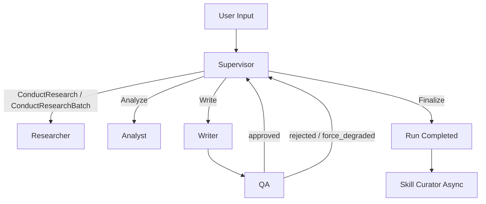

# RivalLens 多 Agent 架构（Agent-Native）

> 更新时间：2026-05-29

## 1. 设计基线

RivalLens 采用“主图编排 + 子图执行”的多 Agent 架构，核心原则：

- **决策分层**：Supervisor 只做路由决策，不做证据生产。
- **证据闭环**：Researcher 负责证据采集与结构化，Analyst/Writer/QA 只消费证据。
- **协议优先**：所有跨节点通信使用结构化 payload，不依赖自由文本约定。
- **技能按需加载**：领域知识在 Skill Library 中存储，运行时再按需调取。

## 2. 总体拓扑



## 3. 角色边界

| Agent | 职责 | 输入 | 输出 |
|---|---|---|---|
| Supervisor | 决定下一步工具与编排分支 | run state、历史 step 摘要 | `supervisor_decisions` |
| Researcher | 采集与结构化证据 | `research_topic`、`focus_dimensions`、hint | `evidence` + researcher step payload |
| Analyst | 证据聚合、洞察抽象 | evidence 列表 | 结构化 insights/risk flags |
| Writer | 生成可读报告 | analyst 输出 + evidence refs | `reports` |
| QA | 规则审查 + 语义审查 | 最新 report + evidence | qa outcome/rejection |
| Skill Curator | 异步生成技能候选 | run trace + qa 结果 | `skill_candidates` |

## 4. Supervisor 委派协议

Supervisor 在每轮只输出一个结构化 decision：

```json
{
  "chosen_tool": "ConductResearchBatch | ConductResearch | Analyze | Write | Finalize",
  "tool_args": {},
  "reasoning_summary": "..."
}
```

约束：

- `ConductResearchBatch` 用于多竞品并行采集。
- `Analyze` 仅在关键竞品证据足够后触发。
- `Write` 仅在 Analyst 已产出有效 insights 后触发。
- `Finalize` 只能在 QA 通过或达到降级退出条件后触发。

## 5. Researcher 子图协议

Researcher 子图是 ReAct 循环，动作集合：

- `search_web`
- `fetch_url`
- `parse_page`
- `extract_structured`
- `load_skill`
- `read_skill_file`
- `finalize`

默认策略：

1. 优先用 `extract_structured` 产出可落库 evidence；
2. 遇到领域术语或规则空白时调用 `load_skill`；
3. `load_skill` 返回 supporting files 后，可用 `read_skill_file` 深读；
4. 达到证据阈值或最大轮次后 `finalize`。

## 6. QA 双层审查

QA = fast rule path + semantic path：

- **fast path**：确定性规则检查（格式、引用、覆盖等）
- **semantic path**：LLM 语义审查（可拒绝并指定重试目标）

输出字段至少包含：

- `qa_outcome`（`approved` / `rejected` / `force_degraded`）
- `reject_to`（若拒绝）
- `failed_rule_ids`
- `promoted_qa_rule_ids`
- `promoted_qa_blocked_rule_ids`

## 7. Skill Curator 异步闭环

run 完成后异步启动 Curator：

1. 汇总 run 级失败模式、证据质量分布、重试轨迹；
2. 生成候选（`qa_rule` / `prompt_template` / `source_routing`）；
3. 写入 `skill_candidates`（`status=staging`）；
4. 人工审核通过后写入 Skill Library。

## 8. Skill Library 与 `load_skill`

Skill 文件结构：

`backend/skills/<applies_to>/<skill_id>/SKILL.md`

`SKILL.md` 必须包含 YAML frontmatter 与 markdown body：

- frontmatter：`name` / `description` / `version` / `tags` / `applies_to`
- body：可执行规则、模板文本或路由提示

运行时能力：

- `load_skill(skill_id)`：返回技能摘要与可读文件列表
- `read_skill_file(skill_id, filename)`：读取 supporting file 内容

该机制实现 progressive disclosure：  
**默认提示词保持短上下文，只有任务需要时才加载额外领域知识。**

## 9. 失败模式与护栏

- **无证据 finalize**：Researcher 节点直接 fail-fast（防止空报告通过）。
- **单通道故障**：Researcher 允许切换通道，不中断整 run。
- **QA 循环重试**：超阈值后 `force_degraded`，防止死循环。
- **Curator 写入失败**：不影响主 run 完成，错误记录在候选表。

## 10. 与其他文档关系

- 系统级边界：`docs/2-architecture-decision.md`
- 采集通道协议：`docs/2.6-collector-channels.md`
- API/Schema 契约：`docs/3-schema-and-protocol.md`
