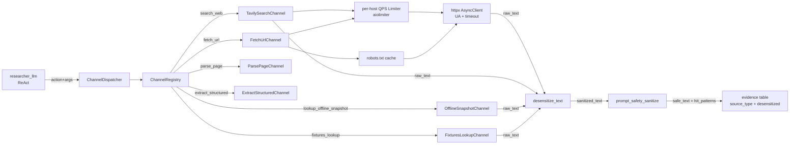
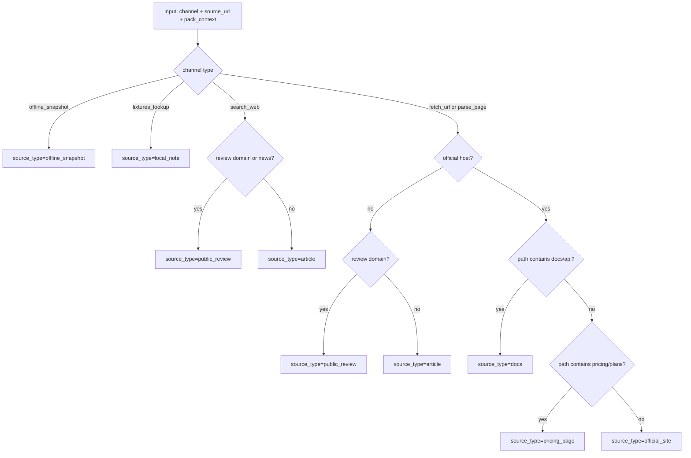
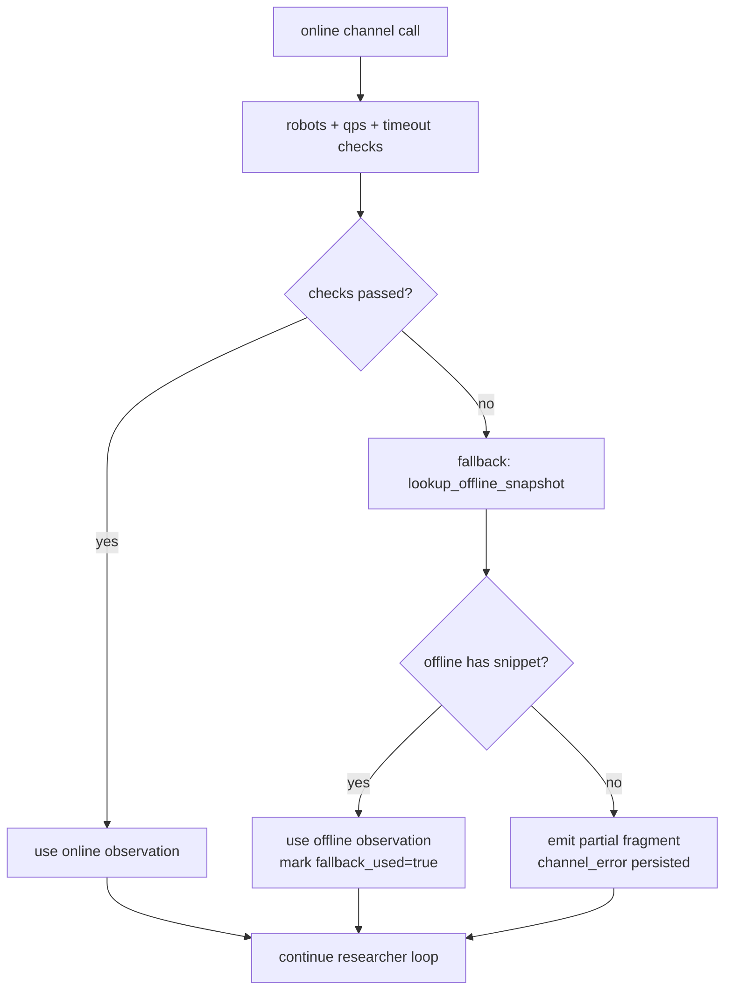

# RivalLens Collector Channel 架构

## 1. 当前形态

Researcher 采集链采用 `ChannelDispatcher -> ChannelRegistry -> Channel` 结构，在线与离线通道共享同一套脱敏、提示注入清洗、限流与合规边界。

## 2. 数据流总图



不变式：

1. `raw_text` 不跨 Agent 边界传递；
2. `raw_text -> desensitize_text -> prompt_safety_sanitize -> evidence`；
3. `desensitized=false` 的文本不进入 report 引用链路。

## 3. source_type 映射决策树



## 4. 错误降级路径



## 5. 分层职责

| 层 | 负责 | 不负责 |
|---|---|---|
| `service.collector.registry` | channel 注册、按 action 分发 | 业务字段抽取 |
| `service.collector.robots` | robots.txt 读取与允许性判定 | 页面正文解析 |
| `service.collector.rate_limiter` | per-host QPS 令牌控制 | HTTP 请求实现 |
| `service.collector.http_client` | 统一 UA、timeout、重试策略 | source_type 业务映射 |
| `agents.tools.*` | 单通道实现、ToolObservation 组装 | DB 写入 |
| `service.desensitize` | PII 掩码 | 越狱检测 |
| `service.prompt_safety` | 注入模式识别与清洗 | PII 掩码 |
| `agents.subgraphs.researcher` | ReAct 决策、通道容错、evidence_draft 聚合 | 具体抓取细节 |

## 6. 工具契约

```text
search_web(query: str, max_results: int = 5) -> ToolObservation
fetch_url(url: str, industry_pack_id: str | None = None, competitor_id: str | None = None) -> ToolObservation
parse_page(html: str, source_url: str | None = None, source_title: str | None = None) -> ToolObservation
extract_structured(text: str, source_url: str | None = None, source_title: str | None = None) -> ToolObservation
lookup_offline_snapshot(industry_pack_id: str, competitor_id: str, dimension: FocusDimension) -> ToolObservation
fixtures_lookup(industry_pack_id: str, competitor_id: str, dimension: FocusDimension) -> ToolObservation
```

返回对象统一包含：

- `tool`: 工具名
- `args`: 入参快照
- `result.snippets[*]`: `quote`, `sanitized_text`, `source_url`, `source_title`, `source_type`, `desensitized`, `metadata`

## 7. 关键约束

| 约束 | 值 | 执行位置 |
|---|---|---|
| 单站点 QPS | `<= 1` | `service.collector.rate_limiter` |
| robots 校验 | 必做 | `service.collector.robots` |
| User-Agent | `RivalLens-Researcher/0.1 (+research; bytedance-ai-fullstack-challenge)` | `service.collector.http_client` |
| PII 脱敏 | 强制 | `service.desensitize.engine` |
| Prompt 注入清洗 | 强制 | `service.prompt_safety.sanitizer` |
| 失败不阻塞主 run | 强制 | `agents.subgraphs.researcher.tool_exec` |

## 8. 第一性原理分析

| 维度 | 分析 | 结论 |
|---|---|---|
| 数据规模 | 采集链主瓶颈是外站 IO，不是本地 CPU | 保持异步通道 + 轻解析，不引入重浏览器 |
| 能力归属 | 合规与安全不能交给 LLM 自觉执行 | robots/QPS/脱敏/注入清洗放代码边界强制执行 |
| 故障域 | 外部站点与 API 抖动是常态 | 单通道失败降级到离线快照，主 run 继续 |
| 可逆性 | 后续可能替换 search provider 或解析器 | 通过 ChannelRegistry 解耦通道，实现替换不动 Researcher 主图 |

## 9. 重评触发条件

| 触发条件 | 动作 |
|---|---|
| 外网 channel 失败率连续 3 天 > 30% | 增加 provider 兜底或重配 timeout/重试 |
| `public_review` 噪声过高导致 QA rejection_rate > 40% | 调整 source_type 映射和 prompt_safety 模式 |
| 单 run 平均采集耗时 > 120s | 检查 per-host QPS 与并发分配策略 |
| 出现敏感信息泄露案例 | 立即升级 `desensitize` 规则并补回归样本 |
