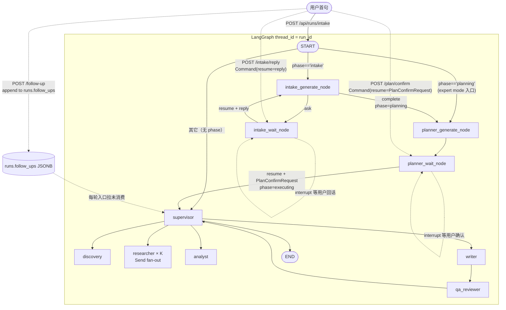

# RivalLens Agent-native Intake + Live Run Page

> 本文是 Phase 1–β（agent-native intake + plan 编制 + live 运行页 + 运行中追加指令）落地后的现状文档。Agent 角色边界推导见 `docs/2.5-agent-architecture.md`，数据 schema 见 `docs/3-schema-and-protocol.md`。本文不重复推导，只描述：**这套子系统现在长什么样、为什么这些技术约束不能违反、怎么从前端一句话走到完整报告。**
>
> **系统定位（与 `docs/2.5-agent-architecture.md` 同步）**：Intake / Planner 是 Agent-driven 红线的关键落点——把"用户根本不知道自己想要什么"的输入分布交给 LLM 在运行时处理，而不是塞进固定表单。

## 1. 子系统定位

RivalLens 在 Phase 1–β 之前是一套"按下启动就黑盒等几分钟"的同步执行系统。Phase 1–β 完成后变成：

```text
chat intake  →  plan 编制 + 用户确认  →  Live 运行页（双栏）+ 运行中追加指令  →  最终 report
   (HITL)            (HITL)                   (实时 SSE)
```

四类用户可见行为变化：

1. **首句即启动**：用户提交一句话，后台立刻拿到 `run_id` + 第一个 `IntakeClarifyRequest`，Agent 主动追问、给 2–4 个 suggested options。
2. **计划可改**：Agent 产 `PlanTree` 后用户可勾掉不想做的 task、追加最多 5 条 user-pinned task（仅 research / analyze / write 三 stage，discover 是 Agent 专属）。
3. **执行透明**：`/app/runs/:runId/live` 双栏渲染——左栏 PlanTree 实时呈现 supervisor 调度进度（queued / running / completed 三态），右栏工具调用面板 + 证据流。
4. **过程可干预**：执行中输入 `text`（1..1000 字符）即可向 Supervisor 追加指令；下一轮 supervisor 决策时消费，前端 chip 自动消失。

旧的"三步表单"路径并未删除——`/app/runs/new/expert` 仍然直送 Supervisor，适合"已经清楚要分析谁、要看什么维度"的专业用户。

## 2. LangGraph HITL 关键约束（实现前必读）

这一节是工程不可妥协的部分。Phase 0a spike (`backend/app/tests/test_hitl_spike.py`) 实测覆盖了下面 6 个 Invariant，每一条违反都会让 graph 行为不正确。

### Invariant A：`interrupt()` 之前的代码在 resume 时会重新执行一次

spike 实测：单节点内 `generate(); interrupt()` 模式 resume 后 generate 调用计数 = **2**。每次用户回答都会重复一次 LLM 调用 + 重复 emit。

**唯一可行修复 = 两节点拆分**（spike `test_invariant_a_two_node_split_single_call` 计数 = 1）：

- `*_generate_node`：LLM + emit + 写 state，**完整 return 并 commit**；resume 不再重跑。
- `*_wait_node`：节点内**只有** `interrupt(pending)`，前面零副作用；resume 后才 merge + emit user_reply。

代码骨架：

```python
def intake_generate_node(state):
    result = await llm_intake(state["intake_draft"])           # LLM + emit 都在会 return 的节点
    if result["action"] == "complete":
        await emit_run_event(INTAKE_COMPLETE, ...)
        return {"phase": "planning", "pending_clarify": None}
    await emit_run_event(INTAKE_CLARIFY_REQUEST, ...)
    return {"pending_clarify": result["clarify_request"]}

def intake_wait_node(state):
    reply = interrupt(state["pending_clarify"])                 # 前面零副作用
    await emit_run_event(INTAKE_USER_REPLY, payload=reply)
    return {"intake_draft": merge(state["intake_draft"], reply), "pending_clarify": None}
```

`planner_generate_node + planner_wait_node` 同构（缓存字段是 `pending_plan_tree`）。

### Invariant B：动态入口路由用 `add_conditional_edges(START, ...)`

`set_entry_point("supervisor")` 是静态的，不能按 `state.phase` 分流。

```python
from langgraph.graph import START

graph.add_conditional_edges(START, _route_entry, {
    "intake_generate_node": "intake_generate_node",
    "planner_generate_node": "planner_generate_node",
    "supervisor": "supervisor",
})
```

旧 run（state 无 `phase` 字段）默认走 `supervisor`，向后兼容。

### Invariant C：所有 resume 端点必须"立返 + create_task background 跑"

`interrupt()` 让上一轮 `ainvoke` 直接 return（不是真的"task 暂停"）。`POST /intake/reply` / `/plan/confirm` / `/follow-up` 都必须：

1. 立即 return `{accepted: true, status: "thinking"}`（≤ 50ms）。
2. `asyncio.create_task(_resume_graph_background(run_id, command))` 跑新一轮 `ainvoke(Command(resume=...))`。
3. 注册到 `app.state.background_tasks`。

完全对称于 `POST /api/runs` 的 accepted + background 模式。前端立刻插入"Agent 正在思考…"占位，等 SSE 推送替换。

### Invariant D：首次 intake 端点必须同步等到第一个 clarify_request 生成才返回

否则前端拿到 `run_id` 后 `useRunEvents` 订阅 SSE 时，graph 可能已经 emit 完毕，造成"用户发首句后页面静默"。

具体做法：`POST /api/runs/intake` 内部 `ainvoke` 跑到第一次 `interrupt`，把 interrupt payload 作为 `first_clarify_request` 字段塞进 response body。**只有 `POST /api/runs/intake` 是 sync-until-first-interrupt，其他 resume 端点都是纯 background**。

**取值方式（spike 实测）**：langgraph 0.2.50 的 interrupt payload **不在** `ainvoke` 返回值的 `__interrupt__` 字段里（返回 `None`）。必须从 state 快照读取：

```python
snapshot = await graph.aget_state(config)
first_clarify = snapshot.tasks[0].interrupts[0].value if snapshot.tasks and snapshot.tasks[0].interrupts else None
# snapshot.next == ("intake_wait_node",) 验证确实停在等待点
```

spike 已封装 `_extract_first_interrupt_value(snapshot)`，实现时直接复用同一形态。

### Invariant E：AsyncPostgresSaver 跨实例 resume

spike 实测：用 checkpointer 实例 #1 跑到 interrupt 后**关闭其连接**（模拟 worker 死亡 / idle 断连），再用**全新** checkpointer 实例 #2（新连接）对同一 `thread_id` 成功 resume，且 generate 节点全程只跑 1 次。

**结论**：只要"全新连接能从 PG resume"成立，stale idle 连接就永远不在关键路径上——**30 分钟空闲的连接超时风险被结构性解除**，本期不强制改连接池。仅当后续真观测到长 idle 后 resume 报连接错，再引入 `psycopg_pool.AsyncConnectionPool`。

### Invariant F：所有 resume 调用必须用同一个 thread_id = run_id

`config={"configurable": {"thread_id": run_id}}`——checkpoint 关联的唯一键，全链路一致。禁止任何变体（带前缀、加时间戳）。建议封装 `_graph_config(run_id) -> dict` 工具函数。

## 3. LangGraph 拓扑



5 个新 graph node：`intake_generate_node` / `intake_wait_node` / `planner_generate_node` / `planner_wait_node` 是 Phase 1–β 新增；`supervisor` 沿用既有节点（消费 follow-up + user_pinned task 是新增逻辑）。

## 4. REST 端点契约

| Method | Path | 模式 | body | 响应 | 关键守卫 |
|---|---|---|---|---|---|
| POST | `/api/runs/intake?mode=chat` | sync-until-first-interrupt | `{user_query, target_roles?}` | `{run_id, status: "intake_pending", first_clarify_request}` | — |
| POST | `/api/runs/intake?mode=expert` | accepted + background | — | **422 EXPERT_MODE_NOT_AVAILABLE**（YAGNI：用 `POST /api/runs` legacy 路径） | — |
| POST | `/api/runs/{run_id}/intake/reply` | accepted + background | `IntakeUserReply` | `{accepted, status: "thinking"}` | 409 INTAKE_NOT_AWAITING_REPLY（graph 不在 `intake_wait` 上） |
| POST | `/api/runs/{run_id}/plan/confirm` | accepted + background | `PlanConfirmRequest` | `{accepted, status: "thinking"}` | 409 PLAN_NOT_AWAITING_CONFIRM（graph 不在 `planner_wait` 上） |
| POST | `/api/runs/{run_id}/follow-up` | append-only inbox | `FollowUpRequest` | `FollowUpAcceptedResponse` | 404 RUN_NOT_FOUND / 409 FOLLOWUP_RUN_NOT_RUNNING（终态）/ 409 FOLLOWUP_NOT_EXECUTING（`plan_tree.confirmed_at` 缺失）/ 409 FOLLOWUP_GRAPH_PAUSED（graph 在 intake_wait / planner_wait） |
| GET | `/api/runs/{run_id}` | — | — | 响应增 `phase` / `intake_draft` / `plan_tree` 字段 | — |

`phase` 是**派生字段**，不存独立列——`_derive_run_phase(run)` 用 `status + intake_draft + plan_tree.confirmed_at` 推断。这避免了与 graph state 漂移的双源真相问题。

## 5. SSE 事件流

完整 RunEventType 清单见 `docs/3-schema-and-protocol.md` §4.2bis。本节只列 Phase 1–β 新增的 11 类：

```text
intake.clarify_request      # Agent 抛澄清问题
intake.user_reply           # 用户回话
intake.complete             # RunIntakeDraft.is_complete = True
plan.published              # Planner 产 PlanTree
plan.confirmed              # 用户确认 PlanTree
tool.start                  # Researcher / Discovery 调外部工具
tool.finish                 # 工具返回（含 latency_ms / success / snippet_count / error）
evidence.collected          # evidence 落库后 emit（含真 evidence_id）
followup.received           # follow-up 落 inbox 后 emit
supervisor.decision (扩展)  # 加 plan_task_ids + consumed_follow_up_ids
heartbeat                   # SSE 注释行（无 enum，避免空 consumer）
```

事件 schema 是 **additive**：所有 payload 字段新增对老订阅者透明，老前端遇到未知字段自动忽略（EventSource 默认行为）。

## 6. 前端页面与路由

| Path | 组件 | 职责 |
|---|---|---|
| `/app/runs/new` | `NewRunChatPage` | 默认 chat intake：左聊天流 + 右 Intake Checklist 侧栏 |
| `/app/runs/new/expert` | `NewRunPage`（重命名后挂载） | 专家三步表单，走 legacy `POST /api/runs` 直送 Supervisor |
| `/app/runs/:runId/plan` | `PlanConfirmPage` | 渲染 PlanTree（按 stage 分组）+ 勾选 + `AdditionalTasksCard` 内联表单添加 user-pinned task |
| `/app/runs/:runId/live` | `LiveRunPage` | 双栏：左 PlanTree 进度 + 右上 Tool Activity + 右下 Evidence Feed + 底部 FollowUpComposer |
| `/app/runs/:runId` | `RunViewPage` | 终态后的完整报告视图（不变） |

**自动跳转**：

- `intake.complete` → navigate `/plan`
- `plan.confirmed` → navigate `/live`
- run 终态（`run.finish`）→ LiveRunPage 延迟 2.5s navigate `/app/runs/:runId`，让用户看到最后一帧

**SSE 订阅**：所有页面都通过 `useRunEvents(runId, callbacks)` 订阅；callbacks 只在所属页面用得到的事件上挂载（chat 页只订 intake.*；live 页订 tool / evidence / supervisor / step / followup）。

## 7. follow-up DB inbox 模式

### 为什么不用 `graph.aupdate_state`

Supervisor 不在 interrupt 上。对 running thread 调 `aupdate_state` 是 LangGraph 官方明确警示的 race 路径——会和 supervisor 当前正在跑的节点产生并发写入冲突。

### DB inbox 模式

```text
HTTP POST /follow-up
    │
    ▼
runs.follow_ups (JSONB) ─── append FollowUpEntry{id, text, applies_to_stage, received_at, consumed_at=NULL}
    │
    ▲ supervisor 每轮入口拉 consumed_at=NULL 的记录
    │ 注入 build_supervisor_user_prompt 的 pending_follow_ups 段
    │ LLM 决策后：mark consumed_at + consumed_in_iteration
    │ emit supervisor.decision 携带 consumed_follow_up_ids
    ▼
LiveRunPage：从 pendingFollowUps 中按 ID 擦除已被吃掉的 chip
```

**关键性质**：

- **lock-free**：HTTP 写、Supervisor 读，全靠 PG 行级原子操作，零并发风险。
- **append-only**：FollowUpEntry 一旦写入不再修改 text / received_at，仅 supervisor 写一次 consumed_at。
- **重启安全**：进程死了重启后 supervisor 仍能看到所有未消费的 follow-up。
- **只在 LLM 分支消费**：qa-driven / max-iter 分支不召唤 LLM，强行 consume 会丢失用户意图；保留 pending，下一轮真实 supervisor turn 再吃。

## 8. user-injected task 模式

### `_normalize_user_tasks` 服务端硬化

`PlanConfirmRequest.additional_tasks` 是用户在 PlanConfirmPage 添加的任务，进 `planner_wait_node` 后由 `_normalize_user_tasks` 强制：

- `source = "user"`（覆盖任何 FE 值）
- `priority = "user_pinned"`（覆盖任何 FE 值）
- `enabled = True`
- 新发 `ptask_<uuid>` id（覆盖 FE 的 `client_<uuid>` 占位）
- 拒 `discover` stage（Agent 专属）
- research stage 必须有 `competitor_id`
- title 非空、长度 ≤ 60、超出截断
- description ≤ 500、超出截断

任何字段不合规 → `ValueError` → `planner_wait_node` 包成 `RuntimeError` → bg task 失败 → `Run.status="failed"`。FE 看到的是真实错误而非沉默丢弃。

### `competitors_diff` 与 `operator.add` reducer

user-pinned research task 的 `competitor_id` 中**不在** `state.competitors` 的部分作为 diff 返回（return dict 时**删去** `competitors` key 避免和 `operator.add` reducer 形成自加）。Supervisor 下游 hard-constraint 直接放行新竞品，不必再跑一轮 Discovery。

### Supervisor 优先级注入

`_extract_user_pinned_research(plan_tree)` 过滤 `source=user ∧ priority=user_pinned ∧ stage=research ∧ enabled ∧ 未 researched`，注入到 `build_supervisor_user_prompt` 的 `_format_user_pinned_research` 段，prompt 显式要求"user-pinned 必须先于未触过的 Agent 候选"。fallback 路径（无 LLM）的并行规则同步收紧——`ConductResearchBatch.topics` 优先放 pinned 目标。

**注意**：user task 的优先级**仅在 prompt 层**生效，不在 graph 层硬编排。`analyze` / `write` user task 在 prompt 中告诉 LLM"有人提了一条 X 写法/分析"，不强行重排执行流。

## 9. 回滚策略

- **每个 Phase 独立 PR**：Phase 0a/0b/1/2/3/4/β 都可以单独 revert 而不破坏其它 Phase。
- **DB 迁移分两步**：alembic 0012（intake_draft + plan_tree）/ 0013（follow_ups）。每步可单独 downgrade 而不破坏既有数据。
- **legacy 路径保留**：`POST /api/runs`（无 `phase`）走 `add_conditional_edges` 默认分支 → `supervisor`。前端 expert mode 直接复用 legacy 路径。
- **AsyncPostgresSaver checkpoint 表幂等**：若某次实验失败可直接 truncate `checkpoints` 对应 `thread_id`，不影响 `runs` 主表。
- **新增事件枚举值是加法**：旧前端遇到未知 event 自动忽略，无破坏性。
- **Run.plan_tree / runs.follow_ups JSONB**：列结构不变，内部 schema 演化由 `schema_version` 约束。

## 10. 已知限制（继承自 Plan §8）

| 风险 | 当前对策 | 是否长期可接受 |
|---|---|---|
| background task 在 reload / restart 时丢失 | lifespan 收尾时遍历 `app.state.background_tasks` 把仍 running 的 run 标 `failed` + emit `run.failed` | 否 —— 生产化需 worker 队列（YAGNI 推迟） |
| LangGraph `interrupt` 长时间空闲（用户晚一天回答）占用 checkpoint | 进 `docs/KNOWN_ISSUES_AND_BACKLOG.md`：加 `intake_timeout_seconds=1800` 后台清理任务（未实现） | 可接受短期 |
| Intake clarify 无限循环 | prompt 强制最多 3 轮；第 3 轮强制 `action="complete"` + 缺失字段填默认值 | 是 |
| PlanTree 节点过多撑爆 UI | 单 plan ≤ 30 task，超过时 planner 合并同 competitor 同 stage | 是 |
| `evidence.collected` 高频 emit 拖慢 SSE | evidence 落库时只 emit `evidence_id + meta`（不含 sanitized_text 全文），前端按需懒加载 text | 是 |
| Phase α 的 supervisor 零侵入限制 | disabled task 不在执行层强制（research 任务对应的 competitor 仍可能被 supervisor 处理）—— `AgentState.competitors` 是 `operator.add` 累加器，shrink 不动 | 否 —— 后续若强约束，需引入 `excluded_competitors` 字段或换累加器 |

## 11. 测试覆盖

| 文件 | 覆盖范围 |
|---|---|
| `backend/app/tests/test_hitl_spike.py` | Invariant A 陷阱 + 修复 / B / C+E / D 全部 4 + 1 个测试 |
| `backend/app/tests/test_intake_flow.py` | Intake 两节点 Invariant A 在真 graph + AsyncPostgresSaver 上不重跑 / phase ≠ intake 时绕过 intake |
| `backend/app/tests/test_intake_api.py` | 5 个 chat-intake e2e（chat 模式 happy / 422 验证 / 409 守卫 / expert 模式 422） |
| `backend/app/tests/test_plan_flow.py` | Planner 两节点 + disabled 过滤 + confirmed_at 写入 + 镜像 Run.plan_tree |
| `backend/app/tests/test_plan_api.py` | 完整 intake → planner → confirm → terminal 链路 + 409/404 守卫 |
| `backend/app/tests/test_phase3_events.py` | tool.start/finish 配对 emit（ChannelError 路径也覆盖）+ supervisor.decision plan_task_ids 映射 |
| `backend/app/tests/test_followup_api.py` | `_format_pending_follow_ups` + 4 个 endpoint guard 分支 + happy persist + e2e（supervisor 消费 + consumed_at 盖戳） |
| `backend/app/tests/test_phase_beta_user_tasks.py` | `_normalize_user_tasks` 全分支 + `_extract_user_pinned_research` + e2e（user task merge + Run.competitors 更新）+ 两条 negative e2e |

容器内全量 `pytest tests/ --ignore=tests/test_smoke.py` **151 passed**（截至最后一次 Phase β 提交）；`npm run type-check` 0 错。

## 12. 与其他文档的同步纪律

- 本文是 Phase 1–β 的"现状文档"。任何对 intake / planner / live 子系统的修改必须同步更新本文与 `docs/2.5-agent-architecture.md` §2.6 拓扑图。
- 新增 RunEventType 必须同步更新 `docs/3-schema-and-protocol.md` §4.2bis 表。
- 新增 HITL 节点（未来可能的 Reviewer HITL 等）必须同步更新本文 §3 拓扑图与 §4 端点契约。
- Invariant A–F 是技术不可妥协部分。任何违反都属于破坏性变更，必须有 spike 测试证明新方案安全才可推进。
