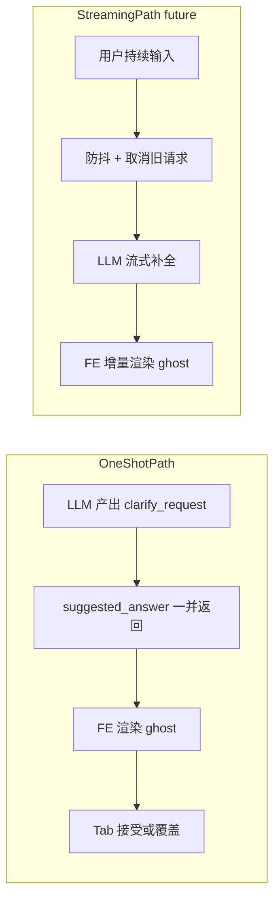

# RivalLens Intake Suggested Answer + Smart Compose 升级设计

> 本文是 `docs/2.7-agent-native-intake-and-live-run.md` 的补充设计，聚焦 Intake 澄清阶段的输入引导体验。目标不是把用户锁进固定表单，而是降低「不会回答 / 懒得打字」的启动门槛，让 Agent 更像专业咨询顾问。

## 1. 问题定义

当前 Intake 的核心能力已经成立：Agent 会围绕 `user_role`、`analysis_intent`、`competitors` 三个必填信息进行多轮澄清，并通过 `suggested_options`（chips）降低选择成本。

但仍有两个体验断点：

1. 开放问答字段（尤其 `analysis_intent`）没有结构化「示范回答」出口，用户常见状态是「看得懂问题，但不会组织一句好回答」。
2. 目前偶尔在 question 文案里内嵌「例如……」，这属于 LLM 生成文本的临场发挥，不是 schema 字段，不稳定、不可观测、不可评估。

## 2. 设计目标

1. 保持 Agent-native 自由表达，不强制用户走固定轨道。
2. 在开放问答时给出一条可编辑的专业示范回答（ghost text），把「从 0 到 1」改成「从 0.7 到 1」。
3. 与既有 `suggested_options` 不冲突：closed-set 继续用 chips，open-text 走 ghost。
4. 为后续 Smart Compose（逐键流式补全）预留清晰升级路径和量化触发条件。

## 3. 业界参考与可迁移经验

| 产品形态 | 可借鉴点 | 对 RivalLens 的映射 |
|---|---|---|
| ChatGPT / Deep Research 澄清轮 | 澄清问题 + 建议回答并存 | `question` + `suggested_options` + `suggested_answer` |
| Cursor Tab | 灰字预测 + Tab 接受 + 任意键覆盖 | Intake 输入框 ghost-text 行为 |
| Gmail Smart Compose | 流式实时续写、低打断 | 作为 B 方案升级方向 |
| Perplexity Discover / Pro | 启动提示 + 后续建议并行 | 维持 `EXAMPLE_PROMPTS` + 澄清期示范回答 |
| Intercom Fin / Zendesk AI Reply | 先给可用草稿，再让用户编辑 | 开放问答默认给一句可改写建议 |

## 4. 方案分层

### 4.1 方案 A（本期落地）：One-shot Suggested Answer

- 每次 Intake `action="ask"` 时，LLM 在 `clarify_request` 内额外返回 `suggested_answer`（可空）。
- 前端在输入框渲染灰字 suggestion，并提供三种等价的接受手段（对照 Gmail Smart Compose / Cursor Tab / Intercom Fin 的共性）：
  1. 键盘 `Tab`：经典 inline ghost 接受。
  2. 鼠标点击灰字（ghost overlay 是一个 `<button>`，`onMouseDown.preventDefault()` 保持 textarea 焦点）。
  3. 输入框下方的「采纳建议」显式按钮（含 `Sparkles` 图标，最强烈的可达性提示）。
- 输入框下方常驻一行 hint：`Tab 或点击灰字采纳建议 · Enter 发送`，消除用户「不知道怎么用」的盲区。
- 接受后自动 `focus` 回 textarea 并把光标置于文本末尾（`requestAnimationFrame + setSelectionRange`），用户可继续编辑或直接发送。
- 仅在 `composerText === ""` 时显示；任意键入立刻覆盖。
- 当 `suggested_options` 非空时，ghost 不显示（避免双重引导冲突）。

### 4.2 方案 B（后续升级）：Streaming Smart Compose

- 用户输入过程中，增量流式预测后续回答。
- 需要新增防抖、取消、流式协议和成本治理，不纳入本期。

## 5. 数据契约与行为约束

新增字段（Intake clarify payload）：

- `suggested_answer: string | null`

生成约束（Prompt contract）：

1. 当 `field_targets` 命中开放问答（如 `analysis_intent`、`domain_hint`）时，优先生成 `suggested_answer`。
2. `suggested_answer` 必须与用户语言一致，且可直接粘贴发送。
3. 长度上限建议 60 字以内，不得反问，不得复读 question。
4. closed-set 场景以 `suggested_options` 为主，`suggested_answer` 可为 `null`。

前端渲染约束：

1. 有 chips 时不显示 ghost（互斥）。
2. 只在输入框为空时显示 ghost。
3. `Tab`、点击灰字、「采纳建议」按钮三种方式均写入 composer 并触发 `intake.ghost.accepted` 埋点，附 `source = "keyboard" | "click" | "button"` 以观测使用习惯。
4. 接受后焦点必须回到 textarea，且光标位于文本末尾，避免「采纳后还要再点一次输入框」的多余操作。

## 6. 观测指标

为验证「引导是否真正有效」，本期定义并埋点：

- `ghost_accept_rate = intake.ghost.accepted / intake.ghost.shown`
- `ghost_accept_source_share`：`source` 维度的分布（keyboard / click / button），用于判定是否要继续保留键盘以外的接受入口
- `avg_clarify_rounds`（平均澄清轮数）
- `time_to_intake_complete`（从首句到 intake.complete 的耗时）

判定原则：

- 若 `ghost_accept_rate` 持续较高且用户反馈希望「边打字边补全」，再推进 B 方案。

## 7. 风险与缓解

1. **建议偏题**：通过 prompt 约束 + 用户可自由覆盖（非强制）。
2. **视觉冲突**：chips 与 ghost 互斥，避免同时给两类建议。
3. **浏览器 autocomplete 抢位**：composer 关闭原生 autocomplete。
4. **成本失控（B 方案）**：先不上流式，保留升级门槛与指标触发。

## 8. 非目标（本期不做）

1. 逐键流式 Smart Compose。
2. 多候选 ghost 排序。
3. EXAMPLE_PROMPTS 的动态个性化生成。
