# RivalLens 信息采集合规声明

## 1. 合规链路总图

```mermaid
flowchart LR
    sourceInput["public sources<br/>official sites / docs / public articles / public reviews / demo_fixtures seed"]
    channelLayer["collector channels<br/>search_web / fetch_url / parse_page / extract_structured"]
    robotsGate["robots + qps + user-agent gate"]
    privacyGate["desensitize_text"]
    safetyGate["prompt_safety_sanitize"]
    evidenceOutput["evidence rows<br/>source_type + source_url + collected_at + desensitized"]
    reportOutput["report / trace / api output"]

    sourceInput --> channelLayer
    channelLayer --> robotsGate
    robotsGate --> privacyGate
    privacyGate --> safetyGate
    safetyGate --> evidenceOutput
    evidenceOutput --> reportOutput
```

## 2. 数据来源范围

| source_type | 典型来源 | 采集方式 | 说明 |
|---|---|---|---|
| `official_site` | 竞品官网 | `fetch_url` | 主站公开页面 |
| `docs` | 官方文档/API 文档 | `fetch_url`/`parse_page` | 用于能力与参数核验 |
| `pricing_page` | 官方定价页 | `fetch_url` | 用于价格结论溯源 |
| `article` | 新闻/博客/媒体公开文章 | `search_web`/`fetch_url` | 非官方来源，confidence 降级处理 |
| `public_review` | 公开社区/论坛/评测站 | `search_web`/`fetch_url` | 强制过 prompt-safety |
| `local_note` | `backend/demo_fixtures/` 内置演示种子 | 启动时作为 Run 初始 evidence seed 注入 | 仅供演示基线，不再作为 Researcher 运行时 channel 调用 |

## 3. 抓取约束

| 约束项 | 规则 | 实施位置 |
|---|---|---|
| robots.txt | 每次 `fetch_url` 前校验，禁止路径直接跳过 | `service.collector.robots` |
| 单站点 QPS | `<= 1` | `service.collector.rate_limiter` |
| User-Agent | `RivalLens-Researcher/0.1 (+research; bytedance-ai-fullstack-challenge)` | `service.collector.http_client` |
| timeout | 默认 10 秒，可配置 | `COLLECTOR_FETCH_TIMEOUT_S` |
| 失败降级 | 在线失败自动从 `observations_log` 已抓 snippet 中 salvage；无法 salvage 时落 partial fragment | `agents.subgraphs.researcher` + `agents.nodes.researcher._build_evidence_rows` |

## 4. 隐私与安全策略

| 维度 | 规则 | 输出要求 |
|---|---|---|
| PII 脱敏 | 邮箱、手机号、身份证、@mention、头像 URL、Bearer token 强制替换 | `desensitized=true` 才允许进入 report |
| Prompt 注入防护 | 识别并清洗越狱指令、角色劫持、base64 指令块、system override 模式 | 命中模式写入 `evidence.span.prompt_safety.hit_patterns` |
| 原文暴露控制 | raw_text 不跨 Agent 边界，不进入 report API | 对外仅暴露 `sanitized_text` |

## 5. 溯源与审计字段

每条 evidence 至少包含：

- `source_type`
- `source_url`
- `source_title`
- `collected_at`
- `collected_by`（step_id）
- `desensitized`

这些字段用于赛题要求的可追溯性与审计回放。

## 6. 不采集与不执行范围

| 项 | 声明 |
|---|---|
| 登录后私有内容 | 不采集 |
| 需要授权但未获授权的数据 | 不采集 |
| 抓取页面内脚本执行 | 不执行 |
| 任意 shell / eval | 不执行 |
| 绕过 robots 或提升爬虫隐蔽性 | 不做 |

## 7. 文档联动

- 架构边界：`docs/2-architecture-decision.md` §11
- Channel 设计：`docs/2.6-collector-channels.md`
- 协议字段：`docs/3-schema-and-protocol.md` §2.6 Evidence
